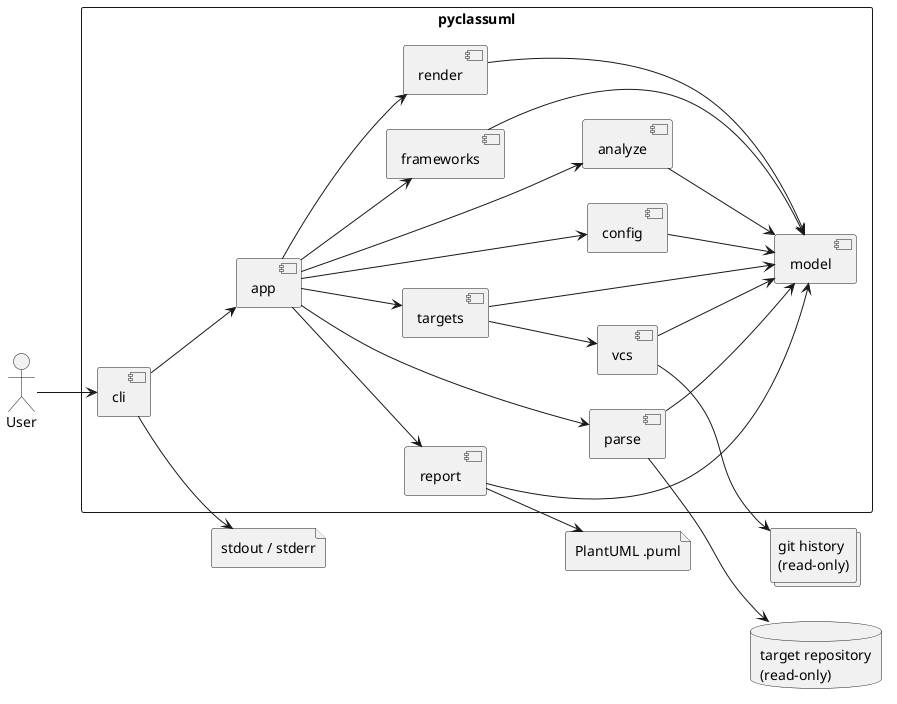
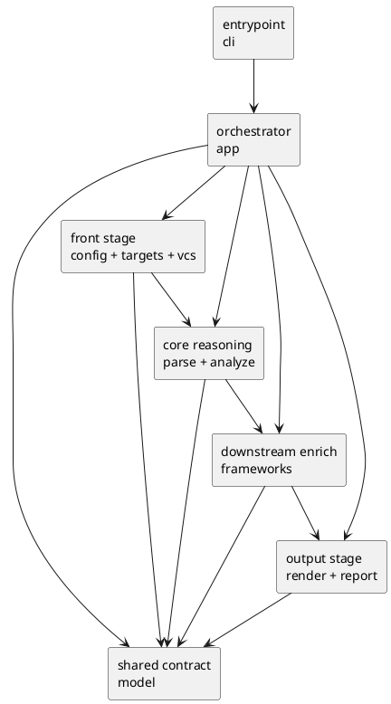
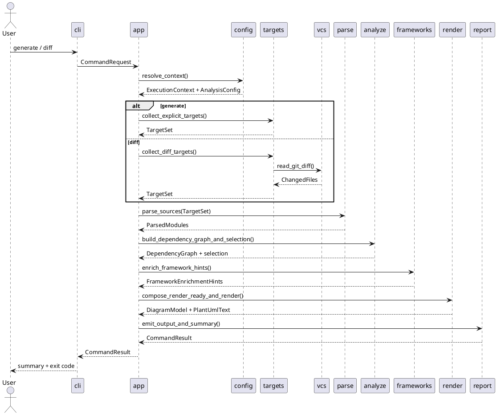
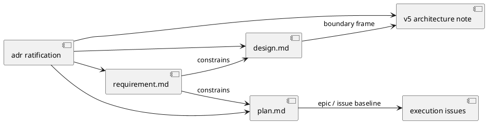

# init-00001 PyClassUML Prototype — 設計（Whole-system Design / Guardrails）

## この文書の責務
- この `design.md` は、initiative における **whole-system design / guardrail / top-level structure** の正本とする。
- WHAT / acceptance は `requirement.md` を優先し、epic grouping / milestone / issue baseline / execution order は `plan.md` を優先する。
- seam-level HOW、DTO 詳細、stage handoff の細部、completion contract の詳細は `20260416t113919z-note-pyclassuml-architecture-v5.md` を優先する。
- `20260416t121500z-adr-v5-ratification.md` は、上記の役割分担と supersession rule を ratify する governance 正本である。

## アーキテクチャ要約
- 採用アーキテクチャは **pipeline-oriented modular monolith** とする。
- `generate` と `diff` の差分は前段の `targets` / `vcs` に閉じ、後段の `parse` / `analyze` / `frameworks` / `render` / `report` は共通 pipeline として扱う。
- whole-system の主要複雑性は、業務ロジックではなく `execution_cwd` / `project_root` / `package_root` / `scope_root` の意味論と、AST-only / read-only / deterministic な解析 pipeline にある。
- top-level boundary は次の 11 モジュールで固定する。
  - `cli`
  - `app`
  - `model`
  - `config`
  - `targets`
  - `parse`
  - `analyze`
  - `frameworks`
  - `render`
  - `report`
  - `vcs`
- `app` は thin orchestrator、`model` は shared contract、`frameworks` は best-effort enrich、`render` は text generation、`report` は artifact / summary / exit policy の集約に限定する。

## Whole-system Context


読み方:
- 外部境界は `target repository` と `git history` であり、どちらも read-only で扱う。
- `.puml` の filesystem write は `report` に閉じ、console 出力は `cli` に閉じる。
- `generate` / `diff` の入口差分は前段で吸収し、製品価値の中心は共通 pipeline に集約する。

## Target-state Structure

### top-level package structure
```text
src/pyclassuml/
  cli/
  app/
  model/
  config/
  targets/
  parse/
  analyze/
  frameworks/
  render/
  report/
  vcs/
tests/
docs/architecture/
examples/
```

- ここで固定するのは top-level boundary であり、配下の file split や class split の最終形ではない。
- `docs/architecture` と `examples` は利用者と実装者の補助資料置き場として想定するが、initiative 時点では repo 構成の target-state を示すに留める。
- この target-state は実装済み事実ではなく、whole-system の責務分離を崩さないための目標構造である。

### module responsibility
| module | whole-system responsibility | allowed dependency / interaction | forbidden move |
| --- | --- | --- | --- |
| `cli` | command 入口、argv bind、`report` が決めた stream target に従う console write、exit code 反映 | `app` の `CommandResult` を受けて user-facing 振る舞いへ変換する | 解析、artifact write、stream target 決定、path semantics 解決を持ち込まない |
| `app` | stage 順序制御、command ごとの差分を orchestration に閉じる | `config` から `report` までの stage を順序どおりに接続する | parse/analyze/render/report の本体ロジックを抱え込まない |
| `model` | stage 間の shared contract、value object、diagnostic handoff | 各 stage が最小 DTO / invariant を共有する | dumping ground 化、orchestration policy の格納 |
| `config` | 4 roots と config merge の解決、containment validation | `execution_cwd` / `project_root` / `package_root` / `scope_root` と config semantics を確定する | target selection や graph 解析を実施しない |
| `targets` | explicit seed / diff seed の正規化、command 差分吸収 | `vcs` を利用して `TargetSet` を構成する | parse/analyze 相当の解析を持ち込まない |
| `parse` | import 非実行 AST parse、module index 構築 | `TargetSet` を `ParsedModule` 群へ変換する | import 実行、filesystem write |
| `analyze` | reachability、relation extraction、class selection、changed class counting | `parse` 結果を使って dependency / selection を確定する | `vcs` を直接読む、framework 固有拡張を前提にする |
| `frameworks` | SQLAlchemy / Pydantic の best-effort enrich | `parse` / `analyze` の結果を補強して `render` へ渡す | reachability frontier を広げる、core traversal を肩代わりする |
| `render` | diagram model と PlantUML text の構築 | `RenderReadyModel` から deterministic に図を組み立てる | filesystem write、console 出力、再解析 |
| `report` | `.puml` write、summary payload、stream target、strict/warn exit policy | diagnostics と counters をまとめて `CommandResult` を返し、`cli` が実際に stdout/stderr へ書くべき stream 種別を決める | 解析ロジック、target 収集、diagram 構築、console write |
| `vcs` | Git diff 読み取り、`diff` seed の raw source 提供 | `targets` に changed files を供給する | target normalization や command policy を持つ |

### stream ownership
- `report` は summary payload と stream target を決める owner であり、success path は stdout、failure path は stderr という external contract を固定する。
- `cli` は `CommandResult` の invariant に従って実際の stdout/stderr write を行う entrypoint owner であり、stream target 自体を独自判断しない。

## Dependency Rules


### allowed dependency direction
- `cli` は `app` の結果を user-facing な console / exit code に変換するだけに留める。
- `app` は順序制御だけを持ち、各 stage の詳細判断を再実装しない。
- `targets` が `vcs` を使うことは許可するが、`analyze` や `render` が `vcs` を使うことは許可しない。
- `frameworks` は `parse` / `analyze` の確定済み結果を enrich してよいが、探索境界や class selection の主決定権を持たない。
- `render` は `RenderReadyModel` から `DiagramModel` と text を作るが、write や summary policy を持たない。
- `report` は artifact / summary / diagnostics / exit policy を集約するが、diagram 構築や graph 解析を行わない。

### forbidden moves
- `app` に stage 実装の本体を積み増さない。
- `model` を shared dumping ground にしない。
- `report` に解析ロジックを持ち込まない。
- `render` に filesystem write を持ち込まない。
- `parse` に import 実行を持ち込まない。
- `frameworks` で core traversal の成功条件を肩代わりしない。
- `generate` / `diff` 固有分岐を `TargetSet` 生成以降へ漏らさない。

## Whole-system Flow


### flow guardrail
- `generate` と `diff` の差分は `TargetSet` を作るまでに閉じる。
- `parse` 以降の pipeline は command 共通とし、後段で `generate` / `diff` 分岐を増やさない。
- `current_state=working-tree` と `current_state=head`、`include_untracked` の差異は `config` / `targets` / `vcs` の責務境界内で扱う。
- `report` は success / degraded success / failure の artifact emission と summary emission を一元化する。

## Boundary Semantics And Guardrails

### path / scope semantics
- `execution_cwd` は CLI 相対 path の基準とし、`config` が resolve し、`targets` / `parse` / `report` が消費する。
- `project_root` は ignore 評価、config discovery、artifact / fixture 文脈の基準とし、`config` が authoritative owner である。
- `package_root` は import graph の内部境界、`scope_root` は探索対象境界とし、`parse` / `analyze` がその差を混同しない。
- `generate` は scope 外の明示起点を error とし、`diff` は scope 外差分起点を除外後 0 件なら error とする。
- `ignore` glob は `project_root` 相対で評価し、seed 候補と依存探索候補の両方に反映する。

### non-negotiable product guardrail
- 対象プロジェクトへ依存追加しない。
- 対象ソースコードを書き換えない。
- 対象コードを import 実行しない。
- 読み取り専用で動作する。
- AST ベース静的解析のみで扱う。
- 同一入力、同一設定、同一 Git 基準では同一内容の PlantUML text を返す。

### out of scope guardrail
- plugin architecture / multi-renderer / cache / parallelism / event bus / DI container は initiative では導入しない。
- 複数 `package_root`、複数 `scope_root`、diff hunk 粒度 changed class 判定、namespace package 完全対応は initiative の外に置く。
- `frameworks` の一般化や registry 化は行わず、SQLAlchemy / Pydantic の MVP best-effort support に留める。

## Observability And NFR

### observability
- summary では少なくとも `起点ファイル数`、`到達ファイル数`、`抽出クラス数`、`抽出関係数`、`changed class 数`、`ignore されたファイル数`、`警告数`、scope 起因の除外 / 打ち切り件数を観測できるようにする。
- diagnostics は stage 起点を追える構造とし、どの seam で degraded / failure になったかを判別可能にする。
- success path では summary を stdout、failure path では diagnostics / summary を stderr に流し、artifact は filesystem に分離する。

### quality attributes
- determinism:
  - stable order / grouping / labels を保ち、同一条件では再現可能な `.puml` を返す。
- non-invasiveness:
  - import 非実行、read-only、対象 repository 非侵襲を守る。
- bounded failure:
  - traversal 爆発時は上限で停止し、empty diagram を成功 artifact として扱わない。
- graceful degradation:
  - recoverable diagnostics は best-effort で継続するが、最終的に `RenderReadyModel` / `DiagramModel` を構成できない場合は non-zero failure に昇格させる。

## Documentation Hierarchy
| document | canonical role | priority when conflict exists |
| --- | --- | --- |
| `requirement.md` | WHAT / scope / constraints / acceptance | scope、constraints、外部観測可能な振る舞いはこれを優先する |
| `design.md` | whole-system design / guardrails / top-level structure | whole-system boundary と forbidden move はこれを優先する |
| `plan.md` | epic grouping / milestone / issue baseline / execution order | epic / issue / sequencing はこれを優先する |
| `20260416t113919z-note-pyclassuml-architecture-v5.md` | seam-level HOW / module contract / flow detail | seam 詳細、DTO handoff、stage contract はこれを優先する |
| `20260416t121500z-adr-v5-ratification.md` | governance / supersession rule | 役割分担と例外の ratification はこれを優先する |



読み方:
- `design.md` は `v5` より薄いメモではなく、whole-system の骨格と guardrail を固定する主文書である。
- ただし seam-level DTO 詳細や issue baseline をここへ持ち込まず、canonical role split を維持する。

## 関連文書
- requirement:
  - `spec-dock/initiatives/init-00001-pyclassuml-prototype/requirement.md`
- plan:
  - `spec-dock/initiatives/init-00001-pyclassuml-prototype/plan.md`
- seam-level detailed design:
  - `spec-dock/initiatives/init-00001-pyclassuml-prototype/discussions/20260416t113919z-note-pyclassuml-architecture-v5.md`
- roadmap bridge:
  - `spec-dock/initiatives/init-00001-pyclassuml-prototype/discussions/20260417t152718z-note-pyclassuml-prototype-roadmap-bridge-v1.md`
- governance:
  - `spec-dock/initiatives/init-00001-pyclassuml-prototype/adr/20260416t121500z-adr-v5-ratification.md`

## 未確定事項
- renderer の見た目や label 表現の細部
- top-level boundary 配下の file split と class split の最終形
- fixture の具体配置と epic / issue execution 時の test asset 運用細部
