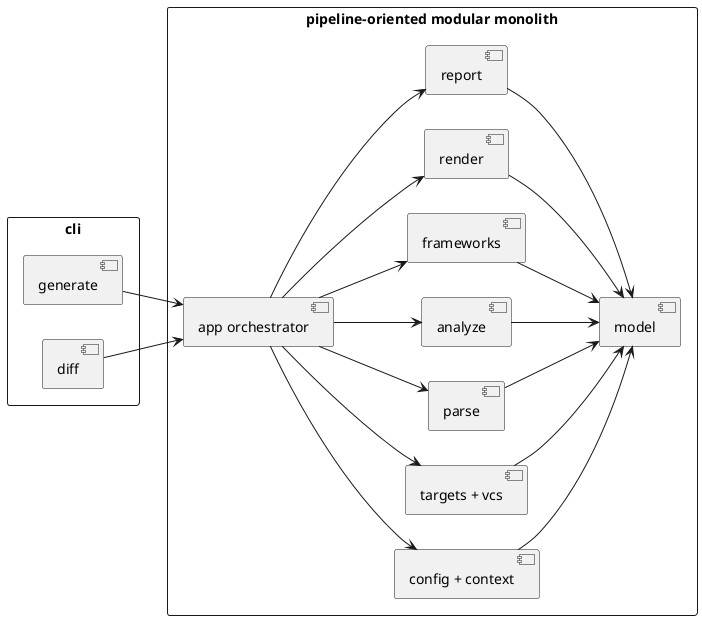

# init-00001 PyClassUML Prototype — 設計（HOW / Guardrails）

## アーキテクチャ上の狙い
- 採用アーキテクチャは **pipeline-oriented modular monolith** とする。
- `generate` と `diff` の差異は前段の起点収集と差分解釈に閉じ込め、後段の parse / analyze / framework enrichment / render / report は共通パイプラインとして扱う。
- `execution_cwd` / `project_root` / `package_root` / `scope_root` の分離を最上位制約として扱い、command ごとの局所実装に散らさない。
- shallow OOP を維持し、immutable value object、少数の service、thin orchestrator で whole-system を構成する。

## 採用済みの whole-system 方向
- initiative で固定する top-level boundary は `src/pyclassuml` 直下の次の 11 個とする。
  - `cli`
  - `app`
  - `model`
  - `config`
  - `targets`
  - `parse`
  - `analyze`
  - `frameworks`
  - `render`
  - `report`
  - `vcs`
- `cli` は入口、`app` は orchestration、`model` は共有 value object、その他は pipeline seam ごとの責務 module として使い分ける。
- `frameworks` は SQLAlchemy / Pydantic の best-effort enrichment に限定し、core parse / analyze の成立条件を肩代わりしない。
- `render` は PlantUML 単一 renderer を前提とし、plugin architecture や複数 renderer の抽象化は initiative では導入しない。
- 具体的な directory / file tree、sequence、class 図、module responsibility の詳細は discussion を正本とする。
  - `spec-dock/initiatives/init-00001-pyclassuml-prototype/discussions/20260416t084338z-disc-pyclassuml-architecture-proposal.md`

### UML（任意: high-level context / target-state）

## module seam と filesystem guardrail
- seam は次の順で積み上げる。
  - `config`
  - `targets` / `vcs`
  - `parse`
  - `analyze`
  - `frameworks`
  - `render`
  - `report`
- `app` には orchestration だけを置き、parse/analyze/render/report の本体ロジックを押し込まない。
- `model` は cross-module 契約の置き場として共有し、module 間で生 dict や ad-hoc tuple を渡し回さない。
- file split は早期に細かくし過ぎない。まず boundary を守り、責務が固まってから分割する。
- target-state の repo-root tree は discussion に記載した内容を採用し、実装済み事実としては扱わない。

## 対象境界 / 依存
- in scope:
  - path semantics と設定解決の一元化
  - 明示起点と Git 差分起点を共通 pipeline に載せる module seam
  - AST parse、dependency traversal、framework enrichment、PlantUML render、diagnostics/report の責務分離
- external dependency:
  - 解析対象プロジェクトの Python source
  - Git 履歴
  - filesystem
  - `.pyclassuml.toml`
- boundary policy:
  - 対象プロジェクトには依存追加しない。
  - 対象ソースを書き換えない。
  - 実行時 import を行わない。
  - plugin、複数 renderer、cache、DI container、event bus、deep inheritance は initiative で採用しない。

## ガードレール
- 互換性:
  - 同一入力、同一設定、同一 Git 基準では同一内容の出力を返す。
  - `generate` と `diff` で共有できる path semantics、ignore 規則、diagnostics 規則は共通化する。
- データ境界:
  - CLI 相対パスは `execution_cwd` 基準、`ignore` glob は `project_root` 基準という要件を崩さない。
  - `generate` は scope 外明示起点を error、`diff` は scope 外差分起点を除外後 0 件なら error とする。
- 品質条件:
  - `strict` / `warn` の挙動差は `report` に集約し、command ごとに分岐実装しない。
  - framework support は best-effort であり、core traversal の成功条件を壊さない。
  - renderer は PlantUML 専用で進め、拡張前提の抽象化を先回りしない。

## 観測性 / NFR 原則
- 実行サマリで対象数、探索数、警告数、strict failure 要因を把握できるようにする。
- どの seam で失敗したかを追える diagnostics を持つ。
- 差分起点でも明示起点でも、同じ boundary 条件なら安定した結果を返す。

## 関連 ADR / 詳細設計
- 採用判断と detailed whole-system design:
  - `spec-dock/initiatives/init-00001-pyclassuml-prototype/discussions/20260416t084338z-disc-pyclassuml-architecture-proposal.md`
- 基礎要件:
  - `spec-dock/initiatives/init-00001-pyclassuml-prototype/discussions/20260416t080346z-research-pyclassuml-requirements-baseline-v2.md`

## 未確定事項
- `strict` で failure に昇格させる diagnostics の最小集合
- renderer の見た目に関する細部
- top-level boundary 配下の細かな file split の最終形
