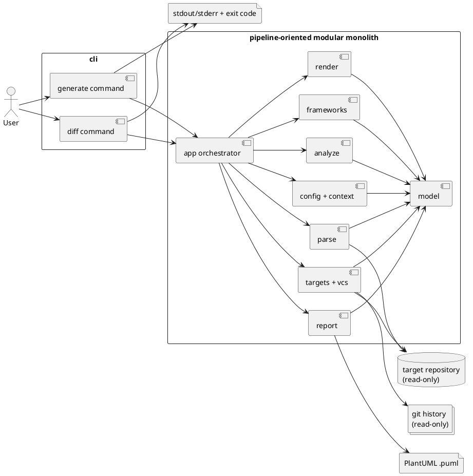
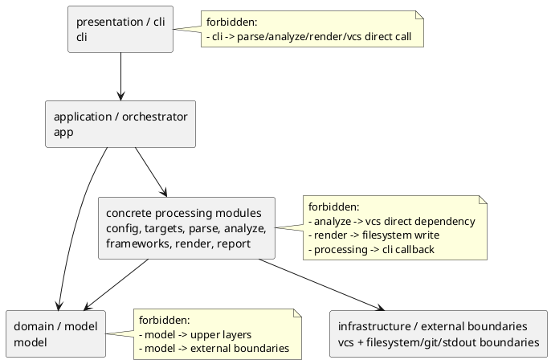
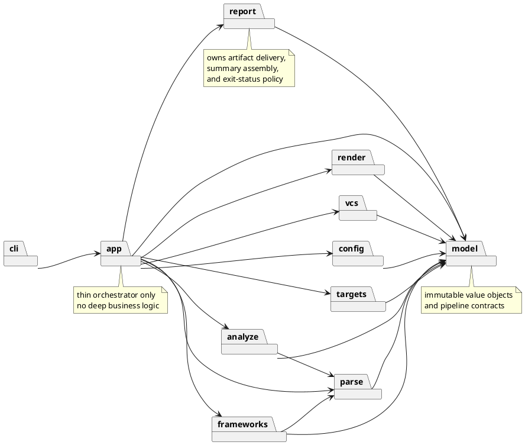
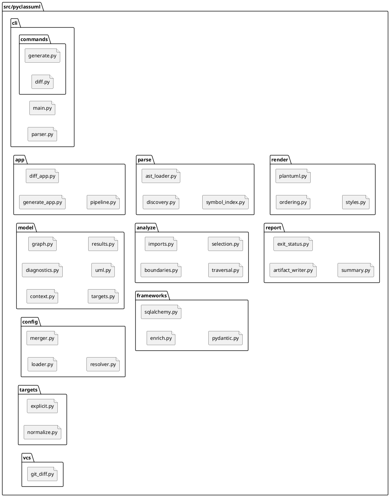
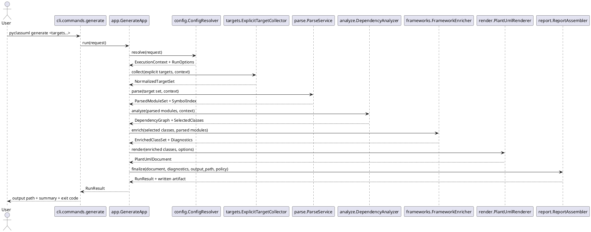
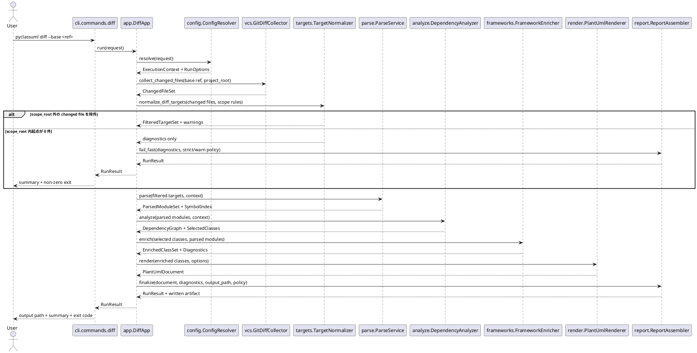
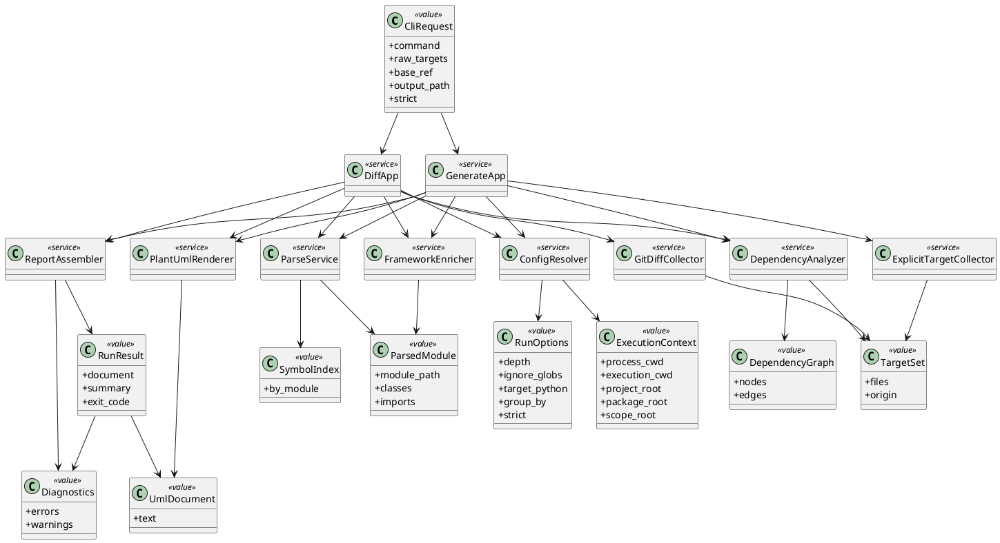

# 20260416t084338z-disc PyClassUML Architecture Proposal

## 議題 (必須)
- `pyclassuml` prototype initiative で採用する内部アーキテクチャを、whole-system 設計として実装着手可能な粒度まで具体化する。
- `generate` と `diff` を同一製品として育てるための共通パイプライン、固定する module seam、固定しない詳細を分離する。
- 後続の epic / issue 分解で、そのまま implementation contract に転写できる `src/pyclassuml` の top-level boundary を確定する。

## 背景 (必須)
- `pyclassuml` は解析対象プロジェクトの外側から実行する外部 CLI であり、対象コードに依存追加や書き換えを行わない。
- 解析方式は AST ベース静的解析のみで、import 実行を禁止する。したがって、実行時の動的振る舞いよりも、入力ファイル集合と path semantics の決定性が重要になる。
- 実行コンテキストとして `execution_cwd` / `project_root` / `package_root` / `scope_root` を分離して扱う要件があり、これを局所実装に散らすと command 間で解釈差が出やすい。
- `generate` は明示起点、`diff` は Git 差分起点という違いを持つが、その後段では依存探索、抽出、PlantUML 出力、diagnostics を共有したい。
- MVP は PlantUML 出力を確実に成立させる段階であり、plugin architecture、複数 renderer、cache、DI container、event bus を先に固定する局面ではない。
- OOP は shallow に保ち、immutable value object と少数の service と thin orchestrator で閉じるべきである。

## iteration history
### v1 baseline
- 共通パイプライン型の採用、top-level module seam、sequence / class / filesystem 図を含む whole-system 設計の初版。
- `generate` と `diff` の差分は前段で閉じ込め、`parse` 以降を共有する方針を確立。

### v2 consultant refinement
- top-level module boundary と別軸で layer model を明示し、5 layer の依存方向と forbidden crossing を追加する。
- `model` を conceptual に `core domain model` と `shared/application contracts` へ分けて説明し、physical package split はまだ固定しないと明記する。
- side-effect ownership を追加し、`render` は PlantUML text 生成まで、`.puml` 書き込みは `report` 側の delivery/persistence 責務とする。

### v3 consultant refinement
- stage contract table、path semantics responsibility matrix、`generate` / `diff` divergence table を追加し、implementation contract を issue 分解へ直接落とせる粒度にする。
- filesystem tree は top-level boundary を示す参考 appendix と位置付け、file split 自体は non-binding であることを明記する。
- SpecDock-friendly decomposition guidance を追加し、issue 分解の最小単位を seam contract ベースで固定する。

## 選択肢 (必須)
### A. 共通パイプライン型
- 概要:
  - 単一プロセスの modular monolith を前提に、`context/config/path` → `targeting/diff` → `parse/index` → `analyze/traversal` → `framework enrichment` → `render/report` の共通パイプラインを持つ。
  - `generate` と `diff` の差分は起点収集と前段入力整形に閉じ込め、後段の探索・抽出・出力は同じ流れを通す。
- Pros:
  - AST-only、read-only、deterministic という本製品の制約を、段階ごとの入力/出力契約として扱いやすい。
  - `execution_cwd` / `project_root` / `package_root` / `scope_root` の解決を前段で正規化できるため、後段モジュールへ一貫した context を渡せる。
  - `strict` / `warn`、実行サマリ、出力順制御を横断的に差し込めるため、品質条件を一貫させやすい。
  - epic / issue を seam ごとに切りやすい。
- Cons:
  - seam を曖昧にすると巨大オーケストレータに退化する。
  - `diff` 固有の前処理を app 層へ押し込み過ぎると境界が崩れる。

### B. 厳格レイヤ分離型
- 概要:
  - 典型的な application / domain / infrastructure の層を強く分け、ユースケースごとに層を横断して処理を組み立てる。
- Pros:
  - 依存方向を厳密に管理しやすく、長期的な保守規律は作りやすい。
  - Git や filesystem などの外部要素を抽象化しやすい。
- Cons:
  - 本製品の本質は業務ルールではなく「入力集合を段階的に変換する処理」であるため、層のための抽象化が増えやすい。
  - `generate` / `diff` の差異よりも抽象層の都合が前に出やすく、prototype での実装速度を落としやすい。

### C. 機能別直結型
- 概要:
  - `generate` / `diff` / framework support / render などを機能単位で直接つなぎ、その都度必要な処理を呼び出す。
- Pros:
  - 初期実装は最短で着手しやすい。
  - サブコマンドごとの最適化を局所的に入れやすい。
- Cons:
  - `generate` と `diff` で path semantics、scope rule、diagnostics が簡単に乖離する。
  - framework support や render の都合が traversal に漏れやすく、変更波及が大きい。

## 推奨案 (必須)
- 推奨は `A. 共通パイプライン型`、具体的には **pipeline-oriented modular monolith** とする。
- この案は initiative で採用済みの高位アーキテクチャであり、本書ではそれを whole-system 設計として具体化する。
- 理由:
  - `generate` と `diff` の本質差分は起点の作り方に集中しており、後段は共通パイプラインとして扱うのが最も自然である。
  - path semantics と boundary 解決は全体の土台であり、最初に 1 度だけ確定させて後段へ流すべきである。
  - read-only、AST-only、deterministic という品質条件を module seam ごとの契約として維持しやすい。
  - shallow OOP との相性が良く、immutable model と service 群と orchestrator だけで設計を閉じられる。

### 高位アーキテクチャ図


## whole-system 設計契約

### v2: layered model と top-level module boundary の区別
- top-level module boundary は `src/pyclassuml` 配下の責務配置を固定する設計判断であり、layer model はそれらを依存方向の規律として束ねる別軸である。
- したがって、`config` / `targets` / `parse` / `analyze` / `frameworks` / `render` / `report` は個別 module として固定しつつ、layer 上では同じ processing layer に属しうる。
- 採用する layer は次の 5 つとする。
  - presentation / cli
  - application / orchestrator
  - domain / model
  - concrete processing modules
  - infrastructure / external boundaries



- allowed dependency direction:
  - `cli` は `app` のみを直接呼ぶ。
  - `app` は pipeline の順序制御のために `model` と各 processing module を呼ぶ。
  - processing module は `model` を参照してよい。
  - external boundary との read/write は、その境界を所有する processing module か `vcs` を経由してよい。
- key forbidden crossing:
  - `cli` から `parse` / `analyze` / `render` / `report` / `vcs` への直結は禁止する。
  - `render` から `.puml` 直接書き込みは禁止する。`render` は `UmlDocument` 生成までに留める。
  - `analyze` / `frameworks` から Git 読み取りへ直接降りることは禁止する。
  - `model` から filesystem / git / stdout/stderr へ依存を持ち込まない。

### 固定する設計判断
- `src/pyclassuml` 直下の top-level boundary は次で固定する。
  - `cli`
  - `app`
  - `model`
  - `config`
  - `targets`
  - `parse`
  - `analyze`
  - `frameworks`
  - `render`
  - `report`
  - `vcs`
- `model` は immutable value object と small contract の置き場とし、他 module から共有される。
- `model` の内部は conceptual には次の 2 区分として扱う。
  - `core domain model`
    - `ExecutionContext`、`TargetSet`、`ParsedModule`、`DependencyGraph`、`UmlDocument`、`Diagnostics`、`RunResult` など、pipeline の中心となる値。
  - `shared/application contracts`
    - `CliRequest`、`RunOptions`、stage 間 DTO、summary / artifact metadata など、application layer と processing layer の受け渡し契約。
- ただしこの分離は **現時点では conceptual split** であり、`src/pyclassuml/model` を直ちに physical に 2 package へ割ることは要求しない。
- `app` は orchestration のみを担い、解析ロジックや renderer 固有ロジックを抱え込まない。
- `vcs` は Git 差分取得の read-only adapter に留め、Git 判断を `analyze` や `render` に漏らさない。
- `frameworks` は core parse / analyze の後段で best-effort enrichment を行う補助層とし、core traversal の成功条件を肩代わりしない。
- renderer は PlantUML 単一で設計する。複数 renderer を前提にした抽象化は導入しない。

### module 図


### v2: side-effect ownership
| concern | owner module | contract |
| --- | --- | --- |
| target repository file read | `parse` | `targets` / `config` で正規化済みの file set を受け、AST-only で読み取る。 |
| Git history / changed file read | `vcs` | `diff` 前段専用の read-only adapter として `base_ref` と `project_root` を受ける。 |
| PlantUML text rendering | `render` | `UmlDocument.text` を決定的に組み立てる。filesystem write は持たない。 |
| `.puml` write | `report` | `UmlDocument` と output policy を受けて artifact を永続化し、written path を `RunResult` に反映する。 |
| stdout / stderr summary emission | `cli` | `report` が組み立てた summary / diagnostics text を process boundary へ流す。 |
| exit code determination | `report` | diagnostics policy と stage outcome から exit status を決定し、`cli` はその値を返すだけに留める。 |

- これにより `render` は pure text generation に寄せ、書き込み side effect は `report` 側へ閉じ込める。
- `cli` は process boundary のみを所有し、summary の文面組み立てや exit policy 自体は `report` に持たせる。

### v3: implementation-stage contract
| stage | owner module | input | output | invariant | diagnostics / fail policy |
| --- | --- | --- | --- | --- | --- |
| request bind | `cli` | argv | `CliRequest` | command ごとの差分は request object へ閉じ込める | parse error は即 fail、usage を stderr へ出す |
| context resolve | `config` | `CliRequest`, `process_cwd` | `ExecutionContext`, `RunOptions` | `project_root` / `package_root` / `scope_root` を 1 度だけ正規化する | invalid path semantics は fail-fast |
| explicit target collect | `targets` | `CliRequest.raw_targets`, `ExecutionContext` | `TargetSet` | `generate` の起点は scope rule 済み | scope 外明示起点は error |
| diff file collect | `vcs` | `base_ref`, `project_root` | changed file set | Git 生出力を他層へ漏らさない | ref 不正や Git 取得失敗は fail |
| diff target normalize | `targets` | changed file set, `ExecutionContext` | filtered `TargetSet` | `diff` の scope 外はここで除外 | 除外後 0 件は diagnostics 化して fail |
| parse | `parse` | `TargetSet`, `ExecutionContext` | `ParsedModuleSet`, `SymbolIndex` | import 実行禁止、AST-only | parse 不能は diagnostics 化、policy で fail 判定 |
| analyze | `analyze` | parsed modules, symbol index, context | `DependencyGraph`, selected classes | core reasoning は command 非依存 | internal resolution 不能は diagnostics 化 |
| enrich | `frameworks` | selected classes, parsed modules | enriched classes, diagnostics | best-effort のみ、core success を肩代わりしない | enrichment failure は warning 優先 |
| render | `render` | enriched classes, options | `UmlDocument` | output は決定的順序、PlantUML 単一 | render failure は fail |
| artifact finalize | `report` | `UmlDocument`, diagnostics, output policy | persisted artifact metadata, summary, exit code | `.puml` write と exit policy を 1 箇所で決める | write failure は fail、warn/strict 昇格もここで判定 |
| process return | `cli` | `RunResult` | stdout/stderr emission, process exit | process boundary は `cli` のみ | return code の再解釈をしない |

### v3: path semantics responsibility matrix
| subject | primary owner | consumed by | contract |
| --- | --- | --- | --- |
| `process_cwd` | `cli` -> `config` | `config` | process 開始位置として受け取り、他層へ生値を散らさない |
| `execution_cwd` | `config` | `targets`, `parse`, `report` | config 探索と相対 path 解決の基底。`project_root` と混同しない |
| `project_root` | `config` | `vcs`, `targets`, `parse`, `report` | Git と config の基準 root。repository boundary を表す |
| `package_root` | `config` | `parse`, `analyze` | import/module 解決の package 基底。`scope_root` の上位または同一である |
| `scope_root` | `config` | `targets`, `parse`, `analyze` | 解析対象の許可境界。command ごとの差はここを前提に前段で吸収する |
| `ignore` | `config` | `targets`, `parse` | ignore pattern は discovery / target normalization にだけ効かせる |
| `output` | `cli` -> `config` -> `report` | `report` | output path 解決は `config`、write 実行は `report` |
| config path resolution | `config` | 全 downstream | `.pyclassuml.toml` と CLI override を merge した単一の正規化結果だけを下流へ渡す |

### v3: `generate` vs `diff` implementation-contract divergence
| contract surface | `generate` | `diff` | shared guarantee |
| --- | --- | --- | --- |
| initial source | explicit targets | Git changed files | `parse` 以降へは `TargetSet` で統一して渡す |
| pre-stage owner | `targets` | `vcs` + `targets` | command 差分は前段に閉じ込める |
| scope handling | scope 外明示起点は error | scope 外 changed file は除外 | downstream は scope 済み target だけを見る |
| zero-target behavior | invalid request として fail | 除外後 0 件なら diagnostics 付き fail | core pipeline は空 target を前提にしない |
| diagnostics emphasis | user 指定ミスを強く出す | Git / scope filter の理由を明示する | strict/warn の exit policy は `report` で共通化 |
| repository dependency | Git 不要 | Git 必須 | `analyze` / `render` は Git 非依存のまま保つ |

### `src/pyclassuml` filesystem / module structure の固定方針
- 以下は **top-level boundary を説明する参考 appendix** であり、現時点で存在する実装を主張するものではない。
- 固定対象は `src/pyclassuml` 直下の boundary と anchor になる責務配置である。
- 各 directory 配下の file tree や class 名は illustrative / non-binding とし、後続 issue での file split 調整を許容する。
- ただし top-level boundary を跨ぐ責務移動は initiative の合意なしに行わない。

#### appendix: repo-root target-state tree
```text
.
├── AGENTS.md
├── README.md
├── pyproject.toml
├── src/
│   └── pyclassuml/
│       ├── __init__.py
│       ├── cli/
│       │   ├── __init__.py
│       │   ├── main.py
│       │   ├── parser.py
│       │   └── commands/
│       │       ├── __init__.py
│       │       ├── generate.py
│       │       └── diff.py
│       ├── app/
│       │   ├── __init__.py
│       │   ├── generate_app.py
│       │   ├── diff_app.py
│       │   └── pipeline.py
│       ├── model/
│       │   ├── __init__.py
│       │   ├── context.py
│       │   ├── diagnostics.py
│       │   ├── graph.py
│       │   ├── targets.py
│       │   ├── uml.py
│       │   └── results.py
│       ├── config/
│       │   ├── __init__.py
│       │   ├── loader.py
│       │   ├── merger.py
│       │   └── resolver.py
│       ├── targets/
│       │   ├── __init__.py
│       │   ├── explicit.py
│       │   └── normalize.py
│       ├── parse/
│       │   ├── __init__.py
│       │   ├── discovery.py
│       │   ├── ast_loader.py
│       │   └── symbol_index.py
│       ├── analyze/
│       │   ├── __init__.py
│       │   ├── boundaries.py
│       │   ├── imports.py
│       │   ├── traversal.py
│       │   └── selection.py
│       ├── frameworks/
│       │   ├── __init__.py
│       │   ├── enrich.py
│       │   ├── sqlalchemy.py
│       │   └── pydantic.py
│       ├── render/
│       │   ├── __init__.py
│       │   ├── ordering.py
│       │   ├── plantuml.py
│       │   └── styles.py
│       ├── report/
│       │   ├── __init__.py
│       │   ├── artifact_writer.py
│       │   ├── diagnostics.py
│       │   ├── exit_status.py
│       │   └── summary.py
│       └── vcs/
│           ├── __init__.py
│           └── git_diff.py
└── tests/
    ├── integration/
    └── unit/
```

#### directory / file structure diagram


### module responsibilities
- `cli`
  - `argparse` 相当の受け口、help、標準出力/標準エラーの process boundary を持つ。
  - command ごとの違いは request object 生成までに留める。
- `app`
  - `generate` / `diff` の orchestration を持つ。
  - module 間の呼び出し順、共通 pipeline の実行、失敗時の短絡を制御する。
- `model`
  - 実行 context、正規化済み option、target 集合、module/symbol 情報、dependency graph、UML document、diagnostics、run result を持つ。
  - mutable entity や継承階層の中心にはしない。
- `config`
  - `.pyclassuml.toml` の探索、読込、CLI との merge、relative path base の解決、path/boundary の正規化を持つ。
  - `project_root` / `package_root` / `scope_root` の包含検証もここで確定させる。
- `targets`
  - `generate` の明示 target を解決し、file/glob/directory を正規化した起点集合へ変換する。
  - scope 外起点の扱いを command rule に沿って前段で確定させる。
- `parse`
  - file discovery、AST load、class/import/member 抽出、module 単位の symbol index 生成を持つ。
  - ここでは graph traversal まで持ち込まない。
- `analyze`
  - internal import 解決、dependency graph 構築、到達可能クラスの選別、scope 境界での除外を持つ。
  - `generate` / `diff` 共通の core reasoning を閉じ込める。
- `frameworks`
  - SQLAlchemy / Pydantic の best-effort enrichment を行う。
  - core parse/analyze の結果に注釈を足す層であり、基礎抽出の失敗を隠蔽しない。
- `render`
  - 決定的 ordering、PlantUML text 生成、表示グループや style 反映を持つ。
  - renderer abstraction を増やさず、PlantUML を直接扱う。
- `report`
  - warn/strict policy、summary、diagnostics text、`.puml` artifact write、exit status 決定を持つ。
  - `render` された図と分離し、図生成成功と artifact delivery / 終了コード政策を別責務に保つ。
- `vcs`
  - Git 差分取得、変更ファイル集合の正規化、`diff` 用の base ref 解釈を持つ。
  - Git の詳細はここに閉じ込め、他 module へ生の CLI 出力を渡さない。

### file split に関する guardrail
- 早い段階で file を細かく割り過ぎない。初期実装では 1 module あたり数ファイルで十分であり、責務の安定前に micro-file 化すると読み筋より移動コストが勝つ。
- まずは `module boundary を守ること` を優先し、`1 クラス 1 ファイル` や `1 service 1 package` のような形式主義は採らない。
- 分割条件は次のどちらかが成立した時だけでよい。
  - その file が 2 つ以上の独立した変更理由を持ち始めた時
  - テスト観点または依存方向の維持のために分離した方が明確な時

## whole-system flow

### `generate` sequence


### `diff` sequence と `generate` との差分


### sequence 上の差分ルール
- `generate` は明示起点が `scope_root` 外であれば error とする。
- `diff` は差分起点のうち `scope_root` 外を事前除外し、除外後 0 件なら error とする。
- この差分は `targets` と `vcs` を含む前段に閉じ込め、`parse` 以降の core pipeline には持ち込まない。

## v3: SpecDock-friendly decomposition guidance
- issue decomposition は top-level package 名ではなく **seam contract** を切り口にする。
- 原則として 1 issue は 1 seam を主担当とする。
  - 例: `config` の path normalization contract、`targets` の scope filtering contract、`render` の deterministic ordering contract。
- cross-layer work を 1 issue に含めてよいのは次の場合だけとする。
  - orchestrator wiring を通すために `app` から既存 seam を接続する場合
  - 明示的な contract stitching として、上流/下流の DTO や invariant を整合させる場合
- `model` / `config` / `targets` / `vcs` のような前段 contract を固めてから `parse` / `analyze` / `frameworks` / `render` / `report` へ進む。
- plugin architecture、multi-renderer abstraction、cache、event bus、DI container、deep inheritance を issue 分解の前提にしない。

## shallow object model

### class diagram


### object model の設計意図
- `value` は原則 immutable な dataclass 相当を想定する。
- `service` は状態を溜め込まず、入力から出力を返す処理単位に留める。
- orchestrator は `GenerateApp` / `DiffApp` の 2 つで十分であり、その下に use case 階層を増やし過ぎない。
- deep inheritance は導入しない。variation は composition と small function で扱う。

## 意図的にまだ固定しないこと
- top-level boundary 配下の細かな file split の最終形
- diagnostics code の命名規約とカテゴリ一覧
- PlantUML の見た目に関する細部
  - 色名
  - grouping 規則の完全版
  - member visibility の既定値
- SQLAlchemy / Pydantic 以外の framework support
- 並列化、cache、増分解析、plugin、複数 renderer
- internal API 名称の最終確定
  - `GenerateApp` / `DiffApp` / `ParseService` などの class 名は説明用 anchor であり、責務境界ほどの固定度は持たない

## 未決事項 (任意)
- `strict` で failure に昇格させる diagnostics の最小集合は、issue で実例を見ながら確定する。
- `diff` の起点拡張を dependency traversal の既定値とどう噛み合わせるかは、prototype 実装で検証する。
- `group_by` や relation option を renderer 直下に置くか model 側 option に閉じるかの細部は、render 実装時に詰める。

## 次アクション (必須)
- initiative `design.md` には、この文書の要点だけを採用済み summary / guardrail として反映する。
- 後続の epic / issue 分解では、本書の top-level boundary と seam をそのまま切り口に使う。
- implementation 着手時は、まず `config`、`targets`、`vcs`、`parse` の前段を固め、その後に `analyze`、`frameworks`、`render`、`report` を積み上げる。
