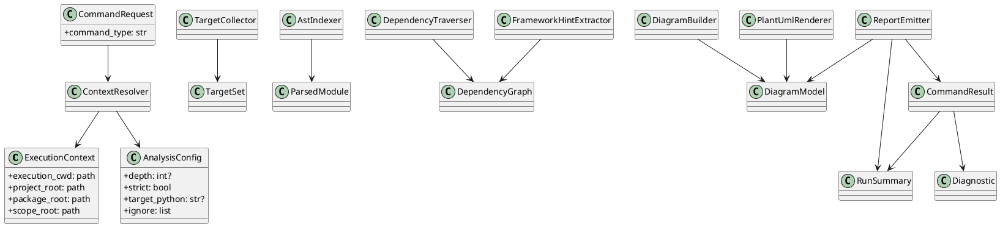

# 20260416t093206z-01-note PyClassUML Architecture V3

## 目的
- `v2` を実装着手直前の全体設計まで引き上げる。
- 図だけでなく、stage 契約、path semantics の ownership、クラス間の最小協調、SpecDock で分割しやすい seam を明文化する。
- これを現時点の最有力設計案として扱い、以後は `v4` 以降で必要な改善だけを追加する。

## v2 からの主な更新
- stage contract table を追加した。
- path semantics responsibility matrix を追加した。
- `generate` / `diff` divergence table を追加した。
- class diagram を追加し、深い継承を避けた shallow OOP の最小核を固定した。
- issue 分解の方針を追加し、 patchwork 化しにくい seam を明記した。

## 推奨する最小オブジェクトモデル
- immutable value object
  - `ExecutionContext`
  - `AnalysisConfig`
  - `CommandRequest`
  - `TargetSet`
  - `ParsedModule`
  - `DependencyGraph`
  - `DiagramModel`
  - `Diagnostic`
  - `RunSummary`
  - `CommandResult`
- stage service
  - `ContextResolver`
  - `TargetCollector`
  - `AstIndexer`
  - `DependencyTraverser`
  - `FrameworkHintExtractor`
  - `DiagramBuilder`
  - `PlantUmlRenderer`
  - `ReportEmitter`

## クラス図

## stage contract table
| stage | input | output | invariant | owner |
| --- | --- | --- | --- | --- |
| `cli` | raw argv, process cwd | `CommandRequest` | raw argv を後段へ渡さない | `cli` |
| `config` | `CommandRequest` | `ExecutionContext`, `AnalysisConfig` | 4 root を正規化し包含関係を検証する | `config` |
| `targets` | context, config | `TargetSet` | seed を canonical path で一意化する | `targets` |
| `vcs` | diff request | changed files | Git 読み取り専用 | `vcs` |
| `parse` | `TargetSet`, context | `ParsedModule[]` | import 実行しない | `parse` |
| `analyze` | parsed modules | `DependencyGraph` | scope と depth を守る | `analyze` |
| `frameworks` | graph, parsed modules | enriched graph | core traversal を上書きしない | `frameworks` |
| `render` | graph, display config | PlantUML text | filesystem write をしない | `render` |
| `report` | PlantUML text, diagnostics | `CommandResult` | output 決定と summary を一元化 | `report` |

## path semantics responsibility matrix
| semantic | resolve owner | validate owner | consume owner |
| --- | --- | --- | --- |
| `process_cwd` | `cli` | - | `config` |
| `execution_cwd` | `config` | `config` | 全 stage |
| `project_root` | `config` | `config` | `targets`, `parse`, `report` |
| `package_root` | `config` | `config` | `targets`, `parse`, `analyze` |
| `scope_root` | `config` | `config` | `targets`, `analyze` |
| `ignore` | `config` | `targets` | `targets`, `analyze` |
| `output` | `config` / `report` | `report` | `report` |

## generate / diff divergence table
| topic | generate | diff | shared downstream |
| --- | --- | --- | --- |
| seed source | explicit file/glob/dir | git diff against base ref | yes |
| scope outside seed | error | pre-filter + warn | yes |
| untracked | n/a | option | yes |
| changed class marking | n/a | changed file classes | yes |
| traversal | same rules | same rules | yes |
| render | same | same | yes |
| summary | same shape | same shape + diff counters | yes |

## 実装上の guardrail
- `cli` は AST や graph を知らない。
- `app` は business logic の置き場ではなく workflow の置き場である。
- `model` を汎用 `utils` 的な物置にしない。
- `render` は文字列生成で止め、書き込みを持たない。
- `frameworks` は core analysis の成功条件を肩代わりしない。
- `vcs` は diff source 取得だけを持ち、graph 構築へ踏み込まない。

## SpecDock での分解指針
- 1 issue は原則 1 seam を主担当にする。
- cross-layer 実装は `app` の wiring と明示的な contract stitching のときだけ例外とする。
- まず切りやすい seam:
  - context/config/path
  - target collection / diff seed
  - parse / ast indexing
  - analyze / traversal
  - framework enrichment
  - render / report
- 1 issue の中で `targets` と `render` を同時に主担当させない。
- 1 issue の中で `parse` と `vcs` を同時に深掘りしない。

## まだ固定しないこと
- `model` の physical split
- diagnostics taxonomy の細部
- strict 昇格対象の最終集合
- file tree の細かな file name
- cache / parallelism / plugin system

## 現時点の結論
- いまの最善案は、`pipeline-oriented modular monolith` を土台にしつつ、layer と seam を別軸で明示した shallow OOP 構成である。
- この構成なら、要件の骨格を壊さず、SpecDock で段階的に issue を刻みやすい。
- 次の `v4` 以降で磨くべきは、構造の大きな見直しではなく、`parse -> analyze` の canonical contract や diagnostics policy のような局所契約である。

## 参考
- [architecture v1](</Users/iwasawayuuta/workspace/tools/pyclassuml/spec-dock/initiatives/init-00001-pyclassuml-prototype/discussions/20260416t093206z-note-pyclassuml-architecture-v1.md>)
- [architecture v2](</Users/iwasawayuuta/workspace/tools/pyclassuml/spec-dock/initiatives/init-00001-pyclassuml-prototype/discussions/20260416t093206z-02-note-pyclassuml-architecture-v2.md>)
- [requirements baseline v2](</Users/iwasawayuuta/workspace/tools/pyclassuml/spec-dock/initiatives/init-00001-pyclassuml-prototype/discussions/20260416t080346z-research-pyclassuml-requirements-baseline-v2.md>)
- [architecture proposal seed](</Users/iwasawayuuta/workspace/tools/pyclassuml/spec-dock/initiatives/init-00001-pyclassuml-prototype/discussions/20260416t084338z-disc-pyclassuml-architecture-proposal.md>)
