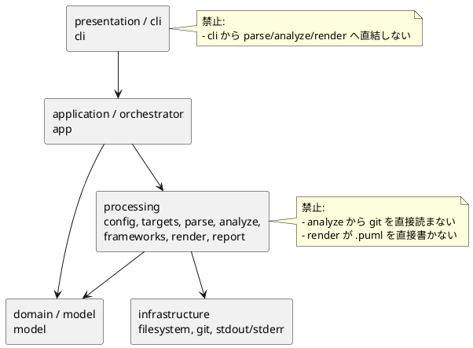
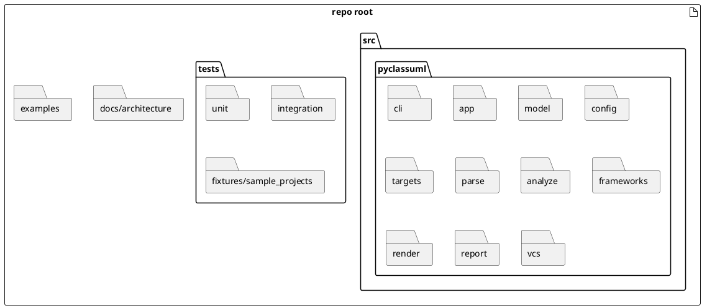
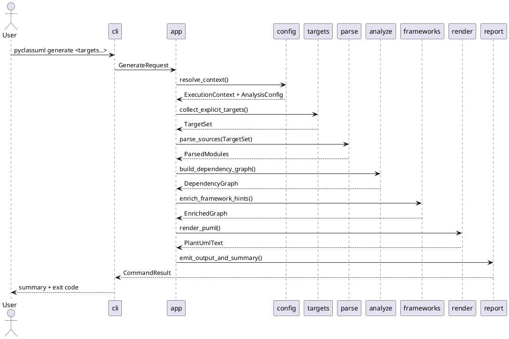
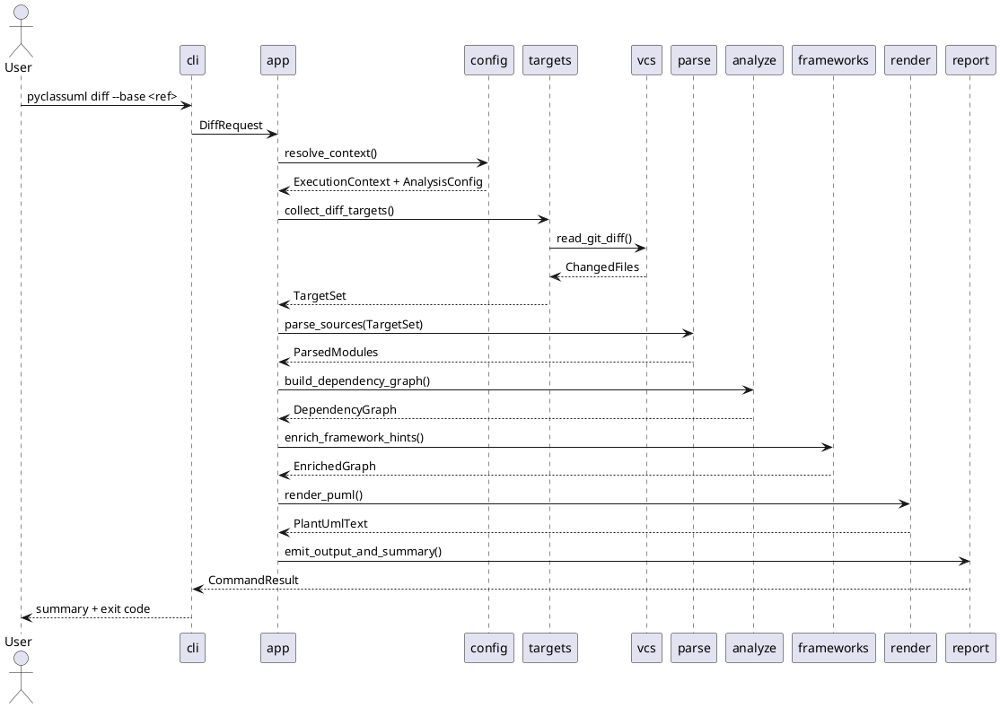

# 20260416t093206z-02-note PyClassUML Architecture V2

## 目的
- `v1` の骨格を保ちながら、レイヤ構造、責務分離、ディレクトリ構成、処理フローを具体化する。
- 「モジュールがある」だけでなく、「どの層に属し、何を知ってよくて、何を知ってはいけないか」を明文化する。

## v1 からの主な更新
- top-level boundary と layer model を別軸で整理した。
- `render` / `report` / `cli` / `vcs` の side-effect ownership を追加した。
- `src/pyclassuml/` を前提にしたディレクトリ構成案を fixed seam と illustrative tree に分けて整理した。
- `generate` と `diff` のシーケンスを追加し、差分が前段に閉じることを可視化した。

## 採用する layered model
- presentation / cli
- application / orchestrator
- domain / model
- concrete processing modules
- infrastructure / external boundaries

## layer ごとの責務
### presentation / cli
- 引数解釈
- subcommand 分岐
- stdout/stderr への最終表示
- exit code の最終返却

### application / orchestrator
- `generate` / `diff` の workflow 選択
- stage 実行順序の制御
- early fail 条件の集約

### domain / model
- `ExecutionContext`
- `AnalysisConfig`
- `TargetSet`
- `ParsedModule`
- `DependencyGraph`
- `DiagramModel`
- `Diagnostic`
- `RunSummary`
- `CommandResult`

### concrete processing modules
- `config`: config discovery / load / merge / root validation
- `targets`: explicit target 展開と diff target 正規化
- `parse`: source load / AST parse / import と class の一次抽出
- `analyze`: import graph traversal / relation assembly / reachability
- `frameworks`: SQLAlchemy / Pydantic 補強
- `render`: PlantUML テキスト生成
- `report`: output path 決定、summary 整形、最終 artifact 出力

### infrastructure / external boundaries
- Git 読み取り
- filesystem 読み取り
- filesystem 書き込み
- console 出力

## side-effect ownership
- target repository 読み取り: `parse`
- git history 読み取り: `vcs`
- PlantUML テキスト生成: `render`
- `.puml` 書き込み: `report`
- summary の構造化: `report`
- stdout/stderr への emission: `cli`

## ディレクトリ構成案
- fixed seam:
  - `src/pyclassuml/cli`
  - `src/pyclassuml/app`
  - `src/pyclassuml/model`
  - `src/pyclassuml/config`
  - `src/pyclassuml/targets`
  - `src/pyclassuml/parse`
  - `src/pyclassuml/analyze`
  - `src/pyclassuml/frameworks`
  - `src/pyclassuml/render`
  - `src/pyclassuml/report`
  - `src/pyclassuml/vcs`
- illustrative tree:

## generate sequence

## diff sequence

## この版での推奨
- `generate` と `diff` の違いは `targets` と `vcs` に寄せる。
- `parse` 以降でコマンド差分を持ち込まない。
- `model` は物置化を避けるため、conceptual には `core domain` と `shared/application contract` を意識して扱う。

## v3 へ持ち越す論点
- stage ごとの入出力契約を表に落とす。
- path semantics の ownership を明文化する。
- `SpecDock` で切りやすい seam 単位の分解指針を設計文書に入れる。
- class diagram を追加し、value object と service の最小核を固定する。

## 参考
- [architecture v1](</Users/iwasawayuuta/workspace/tools/pyclassuml/spec-dock/initiatives/init-00001-pyclassuml-prototype/discussions/20260416t093206z-note-pyclassuml-architecture-v1.md>)
- [requirements baseline v2](</Users/iwasawayuuta/workspace/tools/pyclassuml/spec-dock/initiatives/init-00001-pyclassuml-prototype/discussions/20260416t080346z-research-pyclassuml-requirements-baseline-v2.md>)
- [architecture proposal seed](</Users/iwasawayuuta/workspace/tools/pyclassuml/spec-dock/initiatives/init-00001-pyclassuml-prototype/discussions/20260416t084338z-disc-pyclassuml-architecture-proposal.md>)
