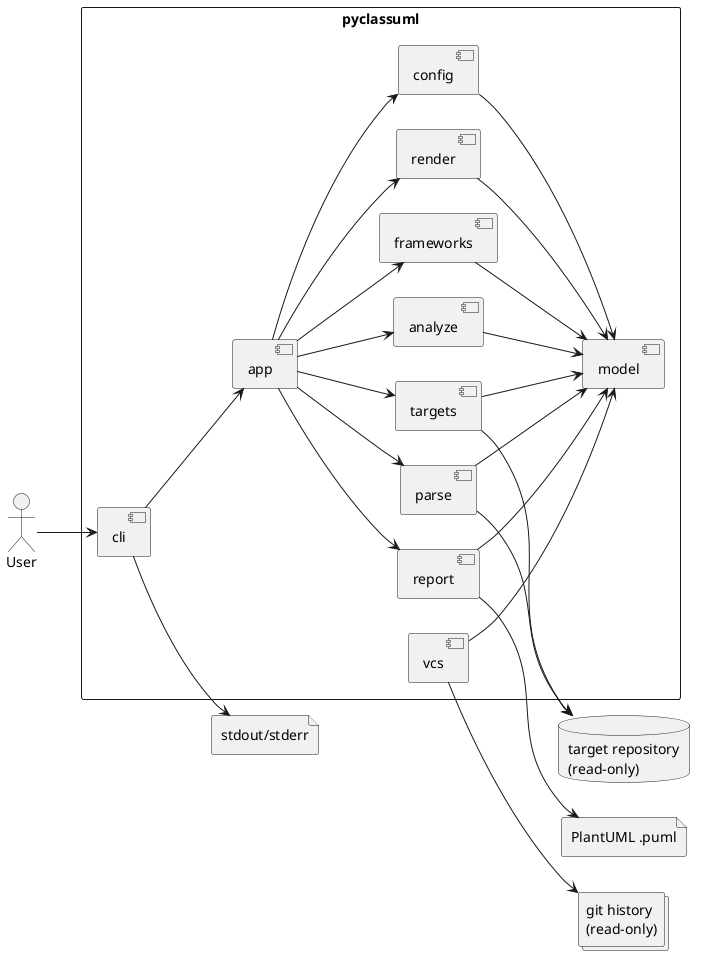
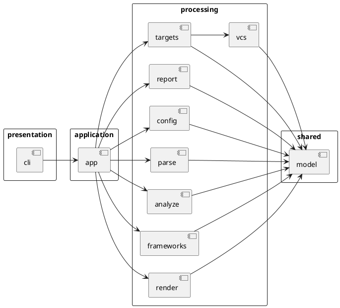

# 20260416t093206z-note PyClassUML Architecture V1

## 目的
- `pyclassuml` の最初の全体設計案として、製品の骨格を固定する。
- 単一ファイルを更新し続けるのではなく、版を積み上げる前提で、まずは最小限の判断を `v1` として残す。
- `generate` と `diff` を別物として育てず、同一製品の 2 つの入口として扱うための基本構造を定義する。

## この版で固定すること
- 採用アーキテクチャは `pipeline-oriented modular monolith` とする。
- `generate` と `diff` の差分は起点の作り方に閉じ込め、後段の解析・図生成・出力は共通化する。
- `execution_cwd` / `project_root` / `package_root` / `scope_root` は入口で解決し、後段へ正規化済みコンテキストとして渡す。
- AST-only、read-only、deterministic を横断制約として扱う。

## 設計の芯
- この製品の複雑さの中心は「業務ドメイン」よりも「path semantics と解析パイプライン」にある。
- したがって、最初から plugin 構造や多態的な拡張機構を先回りせず、段階的な変換パイプラインを中心に置く。
- OOP は浅く使い、immutable value object と少数の service、そして薄い orchestrator を基本とする。

## top-level boundary
- `cli`
- `app`
- `model`
- `config`
- `targets`
- `parse`
- `analyze`
- `frameworks`
- `render`
- `report`
- `vcs`

## 全体アーキテクチャ図

## モジュール図

## パイプラインの考え方
1. `cli` がコマンド入力を受ける。
2. `app` がユースケースを選び、処理順序を制御する。
3. `config` が path semantics と設定を確定する。
4. `targets` と `vcs` が `generate` / `diff` ごとの起点を作る。
5. `parse` が Python ソースを AST と抽出向け表現へ変換する。
6. `analyze` が依存探索と関係抽出を行う。
7. `frameworks` が SQLAlchemy / Pydantic の best-effort 補強を行う。
8. `render` が PlantUML 文字列を組み立てる。
9. `report` が `.puml` と summary を出力する。

## この版では固定しないこと
- 複数 `package_root`
- 複数 `scope_root`
- diff hunk 単位 changed class
- namespace package 完全対応
- 複数 renderer backend
- plugin architecture
- cache / parallelism / DI container / event bus

## v2 へ持ち越す論点
- top-level boundary と architectural layer の区別を明示する。
- `render` / `report` / `cli` の side-effect ownership を明文化する。
- ディレクトリ構成とシーケンス図を追加して、実装の見通しを上げる。

## 参考
- [requirements baseline v2](</Users/iwasawayuuta/workspace/tools/pyclassuml/spec-dock/initiatives/init-00001-pyclassuml-prototype/discussions/20260416t080346z-research-pyclassuml-requirements-baseline-v2.md>)
- [architecture proposal seed](</Users/iwasawayuuta/workspace/tools/pyclassuml/spec-dock/initiatives/init-00001-pyclassuml-prototype/discussions/20260416t084338z-disc-pyclassuml-architecture-proposal.md>)
