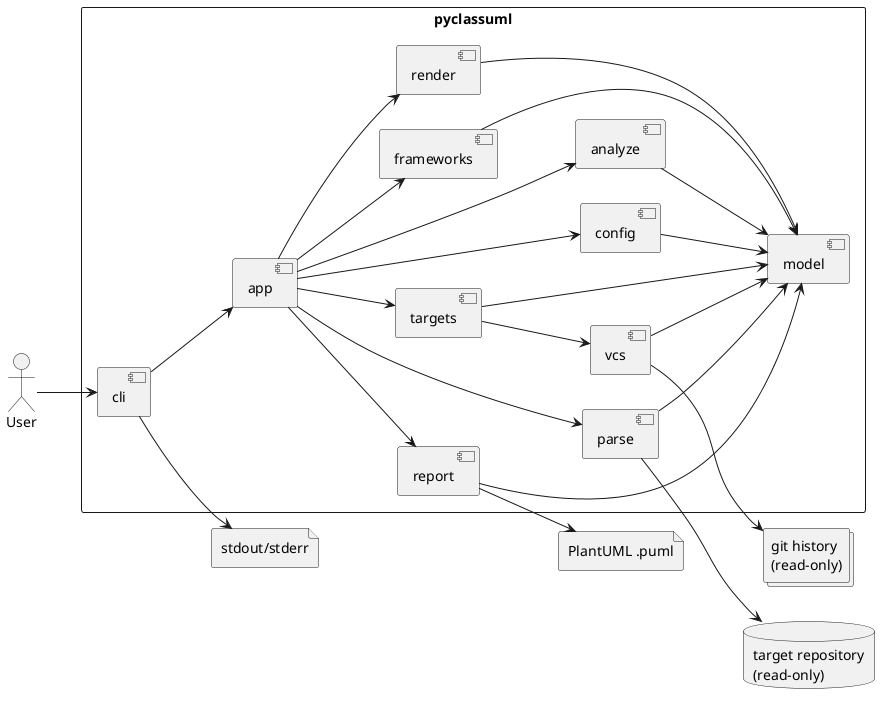
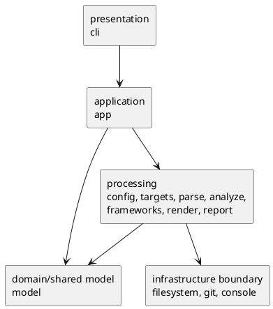
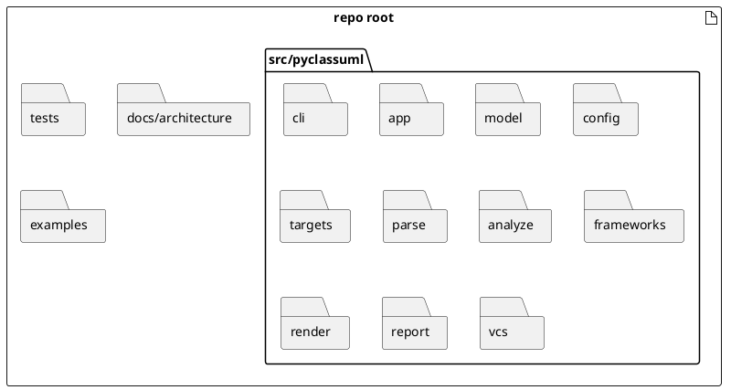
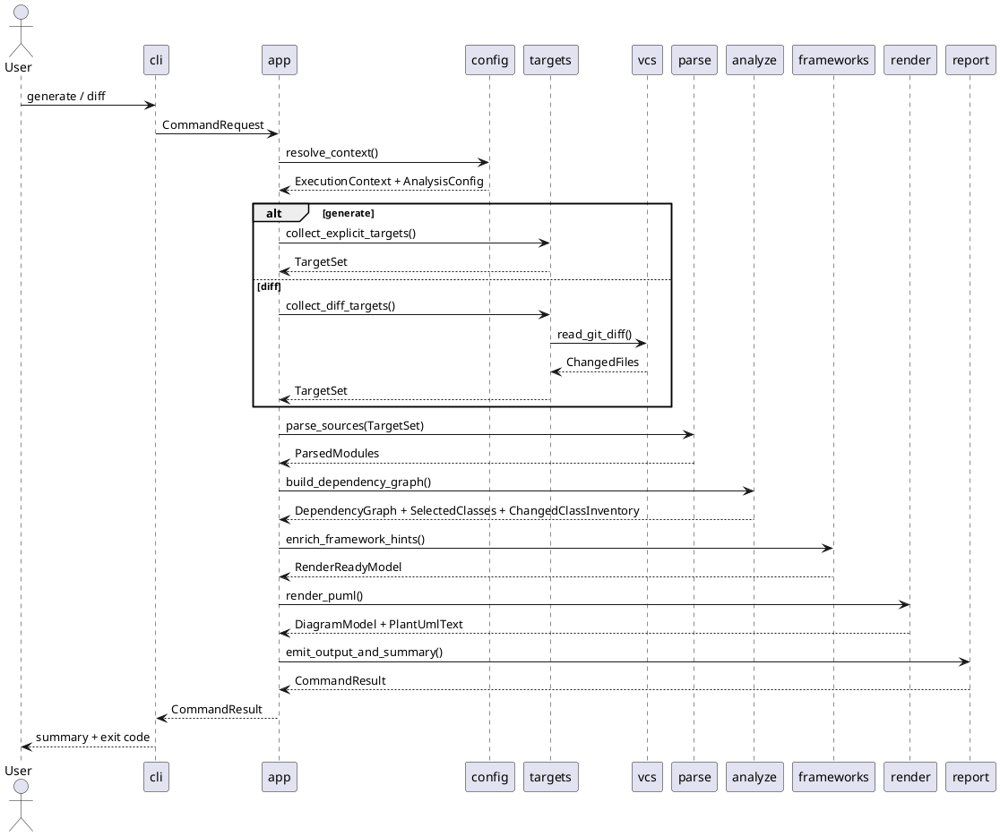
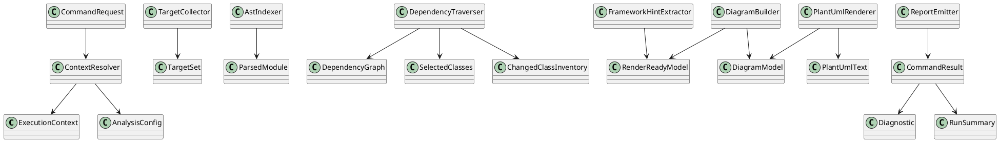

# 20260416t113919z-note PyClassUML Architecture V5

## この資料の位置づけ
- これは `pyclassuml` prototype の **ratified seam contract** を 1 枚に統合した資料である。
- `v1` から `v4` の議論と consultant review を統合し、現時点で最も実装判断に使いやすい形へ圧縮している。
- 読み手は実装担当者とレビュー担当者を想定する。背景説明と seam-level HOW の理解に使う。
- この文書を、init-00001 における **seam 契約と detailed whole-system design の正本** として扱う。
- 文書間の単一優先ルールは次とする。
  - `requirement.md`: WHAT / scope / constraints / acceptance の正本
  - `design.md`: 採用アーキテクチャと全体 guardrail の正本
  - `plan.md`: 実装順序と epic / milestone 分解の正本
  - この `v5`: seam-level HOW と module / contract / flow 詳細の正本
  - `adr/20260416t121500z-adr-v5-ratification.md`: 上記の役割分担と supersession rule を ratify する governance 正本
- したがって、**seam 詳細で `design.md` と差分が出た場合はこの `v5` を優先**し、scope / constraints / 外部観測可能な acceptance で差分が出た場合は `requirement.md` を優先する。
- ただし、epic grouping / milestone gate / readiness 判定に関する差分は常に `plan.md` を優先し、この `v5` では上書きしない。
- issue baseline の dependency / owner / completion / verification に関する差分も `plan.md` を優先し、この `v5` の同等節は informational とする。
- 旧 [architecture proposal seed](</Users/iwasawayuuta/workspace/tools/pyclassuml/spec-dock/initiatives/init-00001-pyclassuml-prototype/discussions/20260416t084338z-disc-pyclassuml-architecture-proposal.md>) は履歴・検討経緯の参照用であり、実装判断の正本にはしない。
- この扱いは [20260416t121500z-adr-v5-ratification.md](</Users/iwasawayuuta/workspace/tools/pyclassuml/spec-dock/initiatives/init-00001-pyclassuml-prototype/adr/20260416t121500z-adr-v5-ratification.md>) で ratify する。

## 結論サマリー
- 採用アーキテクチャは **`pipeline-oriented modular monolith`** とする。
- `generate` と `diff` の差分は前段の `targets` + `vcs` で吸収し、後段の解析・図生成・出力は共通 pipeline とする。
- top-level boundary は次で固定する。
  - `cli`
  - `app`
  - `model`
  - `config`
  - `targets`
  - `parse`
  - `analyze`
  - `frameworks`
  - `render`
  - `report`
  - `vcs`
- layer は physical package ではなく **dependency rule** として扱う。
- 最大の設計リスクは `model` と `report` の dumping ground 化である。したがって package を増やすより、contract と ownership を先に固定する。

## なぜこの構造か
- この製品の複雑さの中心は、業務ルールではなく `execution_cwd` / `project_root` / `package_root` / `scope_root` と静的解析 pipeline にある。
- AST-only、read-only、deterministic という強い制約があるため、入口差分よりも downstream の一貫性を重視する方が製品全体は安定する。
- SpecDock で段階実装する以上、1 issue = 1 seam で切れる構造が必要であり、機能別直結より stage 契約型の方が向いている。

## 全体像

### アーキテクチャ図

読み方:
- `cli` は入口、`app` は順序制御、`config` から `report` までが共通 pipeline。
- Git 差分は `vcs` に閉じ、`.puml` の write は `report` に閉じる。

### モジュール図

読み方:
- `cli/app/model` は役割軸、`config` から `report` は処理段階軸。
- layer は「どこへ依存してよいか」を示すもので、directory tree と同義ではない。
- processing package 間の allowed dependency は次で固定する。
  - `targets` は `vcs` を使ってよい。
  - `analyze` は `parse` と `model` を使ってよいが、`vcs` は使わない。
  - `frameworks` は `parse` / `analyze` の結果を enrich してよいが、reachability frontier を広げない。
  - `render` は `model` と render option だけを見る。
  - `report` は `render` の結果と diagnostics を集約するが、解析自体は行わない。

### ディレクトリ構成図

読み方:
- この図は fixed seam を示す。配下の細かな file split までは今は固定しない。

## 処理フロー

### `generate` / `diff` 共通フロー

読み方:
- `generate` と `diff` の差は seed 生成まで。
- `parse` 以降に command 固有分岐を持ち込まない。
- `analyze` は `DependencyGraph` だけでなく、class selection と changed class inventory まで確定した状態で後段へ渡す。
- `frameworks` の downstream handoff は `RenderReadyModel`、`render` の downstream handoff は `DiagramModel + PlantUmlText` とする。
- `diff` の前段契約には、`--base <ref>` との比較、現在状態の切替 `working-tree | head`、untracked 含有切替を含める。
- 既定値は `current_state=working-tree`、`include_untracked=true` とする。
- `current_state=head` を選んだ場合、untracked は比較対象に存在しないため `include_untracked` は no-op として扱い、warning を 1 件残して継続する。

## 中核設計契約

### shallow object model

読み方:
- 深い継承は採らず、immutable value object と stage service の最小核だけを固定する。
- `RenderReadyModel` は `analyze` + `frameworks` の downstream handoff 用 DTO とし、`render` はこれを `DiagramModel` に変換してから PlantUML text を組み立てる。
- `ChangedClassInventory` は changed file 内クラス定義の authoritative inventory とし、表示選別とは切り分けて `analyze` が保持する。

### render-ready handoff contract
- `RenderReadyModel` が必ず持つ最小項目:
  - 表示対象クラス集合
  - 表示対象メンバー集合
  - 描画対象関係集合
  - stereotype / changed / dependency-only などの class-level decoration
  - grouping に必要な key
  - upstream stage から持ち越す diagnostics
- `RenderReadyModel` の invariant:
  - `frameworks` による best-effort 補強を適用済み
  - `render` が解析ロジックを再実行しなくても図生成に必要な情報が揃っている
  - class 選別は確定済みで、`render` は対象クラスを追加・削除しない
  - warning / degradation 伝播に必要な diagnostics は `RenderReadyModel` に含めて downstream へ渡す
- `DiagramModel` 側だけで導出してよい項目:
  - PlantUML 固有の alias
  - package / file grouping の最終 container 構造
  - 出力順序に従った並べ替え結果
  - 文字列表現用の escape 済みラベル

### stage contract 要約
| stage | output | invariant |
| --- | --- | --- |
| `cli` | `CommandRequest` | raw argv を後段へ漏らさない |
| `config` | `ExecutionContext`, `AnalysisConfig` | 4 root を正規化し、包含関係を検証し、`diff` の `current_state` / `include_untracked` を default/validate する |
| `targets` | `TargetSet` | seed を一意化し、command 差分をここまでで吸収する |
| `parse` | `ParsedModule[]` | import 実行をしない |
| `analyze` | `DependencyGraph`, `SelectedClasses`, `ChangedClassInventory` | scope/depth/package 境界を守り、起点ファイル内クラスは原則すべて、依存先ファイルは関係検出クラス中心に選別する |
| `frameworks` | `RenderReadyModel` | SQLAlchemy / Pydantic の MVP best-effort 補強に限定し、core traversal を肩代わりしない |
| `render` | `DiagramModel`, PlantUML text | `RenderReadyModel` から diagram を構築し、write は行わない |
| `report` | `CommandResult` | write、summary、strict/warn、exit policy を一元化する |

### path semantics ownership 要約
| semantic | resolve owner | consume owner |
| --- | --- | --- |
| `process_cwd` | `cli` | `config` |
| `execution_cwd` | `config` | `targets`, `parse`, `report` |
| `project_root` | `config` | `vcs`, `targets`, `parse`, `report` |
| `package_root` | `config` | `parse`, `analyze` |
| `scope_root` | `config` | `targets`, `parse`, `analyze` |
| `ignore` | `config` | `targets`, `parse` |
| `output` | `config` / `report` | `report` |
| `diff.current_state` | `cli` -> `config` | `vcs`, `app.diff-wiring` |
| `diff.include_untracked` | `cli` -> `config` | `vcs`, `app.diff-wiring` |

### diagnostics ownership 要約
- strict/failure の **外部観測契約の正本は `requirement.md`** とする。
- ここで示す表は、どの stage がどの diagnostics topic を生成・集約するかの **seam-internal ownership map** である。
| topic | owner | rule |
| --- | --- | --- |
| import / re-export / forward reference 解決失敗 | `parse` / `analyze` / `frameworks` | normal では diagnostics を収集し、strict では failure にする |
| wildcard import 解決不能 | `analyze` | `warn` では warning、`strict` では failure |
| 構文エラー | `parse` | normal では diagnostics、strict では failure |
| パス不正 / 包含違反 | `config` | normal / strict とも fail-fast |
| scope 外起点 | `targets` | `generate` は error、`diff` は除外 + warning。strict では failure 条件に含める |
| `diff` 除外後起点 0 件 | `targets` | diagnostics を残して fail する |
| 出力失敗 | `report` | 常に error |
| 探索上限到達 | `analyze` | 常に error |

### `warn` mode exit / output policy
- 外部観測契約の正本は `requirement.md` であり、この表は `report` / `cli` seam の内部 handoff を説明する補助表とする。
| situation | artifact emission | exit status |
| --- | --- | --- |
| clean success | `.puml` を出力する | `0` |
| warning-only | `.puml` を出力する | `0` |
| `warn` mode の recoverable diagnostics | best-effort で `DiagramModel` まで成立した場合は `.puml` を出力する | `0` |
| `warn` mode の recoverable diagnostics だが `DiagramModel` / `RenderReadyModel` を構成できない | `.puml` は出力しない | non-zero |
| hard failure | `.puml` は保証しない | non-zero |

- recoverable diagnostics の代表例:
  - import / re-export / forward reference 解決失敗
  - wildcard import 解決不能
  - syntax error
  - `current_state=head` での untracked no-op warning
- hard failure の代表例:
  - パス不正 / 包含違反
  - `generate` の scope 外起点
  - `diff` 除外後起点 0 件
  - 出力失敗
  - 探索上限到達
  - recoverable diagnostics の結果、render 可能な class / relation / file 集合が空になり `DiagramModel` を組めない場合

### recoverable diagnostics degradation contract
| recoverable case | discard | keep | summary impact |
| --- | --- | --- | --- |
| syntax error in module | 該当 module 全体を解析対象から外す | 他 module の graph / class / relation | warning を 1 件以上加算し、ignore とは別に diagnostics へ記録する |
| import / re-export 解決失敗 | 当該 import に依存する unresolved edge | 解決済み edge と既知 class | warning を加算し、未解決 import 件数を diagnostics へ残す |
| forward reference / wildcard 解決不能 | unresolved type 由来の relation edge | class 本体、解決済み relation | warning を加算し、図は既知 relation だけで継続する |
| `current_state=head` で `include_untracked=true` | untracked file の diff seed への取り込み | `head` 基準で得られる changed file | warning を加算し、untracked no-op を summary text に残す |

- degradation の共通原則:
  - recoverable diagnostics では `RenderReadyModel` を構成できる既知情報だけを下流へ渡す
  - `render` は欠損補完のために再解析しない
  - `report` は捨てた対象を warning と summary に反映する
  - recoverable diagnostics に分類される事象であっても、最終的に `DiagramModel` / `RenderReadyModel` を構成できない場合は `report.artifact-summary-exit-policy` が **failure へ昇格** させ、`diff` の zero-target failure と同じく non-zero で終了する
  - 上記の failure 昇格時は empty diagram を成功 artifact として扱わない
  - failure へ昇格した場合でも `report` は summary を必須出力とし、保持できている diagnostics / counters / failure reason を組み立てて `cli.request-bind-and-exit-contract` へ渡す
  - `cli` は failure path の summary と diagnostics を stderr に出力し、stdout を failure path の正本出力経路として使わない

## 実装分解ガイド

- epic grouping と milestone gate の正本は `plan.md` とする。
- issue baseline の canonical source も `plan.md` とする。
- ここでは seam-to-issue 分解の補助理解に必要な dependency と completion contract だけを保持する。

### seam decomposition note
- issue baseline の canonical source は `plan.md` の `Issue baseline table` とする。
- この `v5` では issue 分解表を再掲せず、seam-level design と stage contract の理解補助だけを担う。
- `ChangedClassInventory` のような独立 issue cut も、canonical には `plan.md` の識別子を採用する。

### 実行サマリの供給責務
| counter | producer | consumer |
| --- | --- | --- |
| 起点ファイル数 | `targets` | `report` |
| 到達ファイル数 | `analyze` | `report` |
| 抽出クラス数 / 関係数 | `analyze` | `report` |
| changed class 数 | `analyze` | `report` |
| ignore 件数 | `targets` / `parse` | `report` |
| warning 数 | 各 stage | `report` |
| scope 外探索打ち切り件数 | `analyze` | `report` |
| `diff` scope 外起点除外件数 | `targets` | `report` |

- changed class 数の counting rule:
  - authoritative owner は `analyze` とする。
  - `targets` が保持する changed file 集合と、`analyze` が抽出した changed file 内クラス定義を突き合わせて算出する。
  - user-visible summary では、到達可否ではなく「変更ファイル内に存在するクラス数」を採用する。

### guardrail
- 1 issue = 1 seam を原則にする。
- cross-layer change は `app` の wiring か explicit contract stitching のときだけ許可する。
- `model` を shared dumping ground にしない。
- `report` に解析ロジックを持ち込まない。
- `render` は text 生成まで、write は `report`、console は `cli` に閉じる。

## Deferred
- `model` の physical split
- 各 package 配下の file split
- framework registry の一般化
- renderer 複数化
- cache / parallelism

## 現行結論
- 現在の最良案は、`pipeline-oriented modular monolith` を土台に、layer と seam を別軸で整理した shallow OOP 構成である。
- この構成は、要件の骨格を壊さずに実装可能であり、SpecDock による段階的な epic / issue 分解にも耐える。
- 次に進むべきは大きな再設計ではなく、この `v5` を **authoritative seam contract** として参照しつつ、epic / issue baseline は `plan.md` を canonical source として実装分解へ進むことである。

## 参考
- [architecture v1](</Users/iwasawayuuta/workspace/tools/pyclassuml/spec-dock/initiatives/init-00001-pyclassuml-prototype/discussions/20260416t093206z-note-pyclassuml-architecture-v1.md>)
- [architecture v2](</Users/iwasawayuuta/workspace/tools/pyclassuml/spec-dock/initiatives/init-00001-pyclassuml-prototype/discussions/20260416t093206z-02-note-pyclassuml-architecture-v2.md>)
- [architecture v3](</Users/iwasawayuuta/workspace/tools/pyclassuml/spec-dock/initiatives/init-00001-pyclassuml-prototype/discussions/20260416t093206z-01-note-pyclassuml-architecture-v3.md>)
- [architecture v4](</Users/iwasawayuuta/workspace/tools/pyclassuml/spec-dock/initiatives/init-00001-pyclassuml-prototype/discussions/20260416t093750z-note-pyclassuml-architecture-v4.md>)
- [requirements baseline v2](</Users/iwasawayuuta/workspace/tools/pyclassuml/spec-dock/initiatives/init-00001-pyclassuml-prototype/discussions/20260416t080346z-research-pyclassuml-requirements-baseline-v2.md>)
