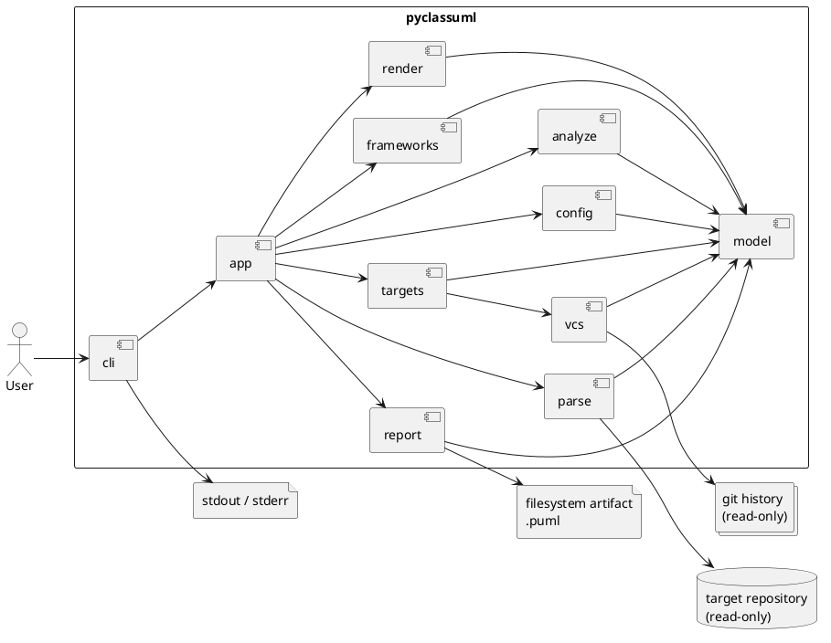
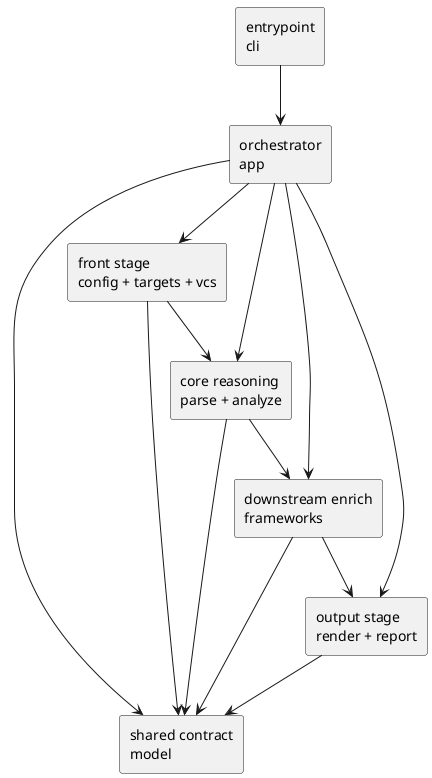
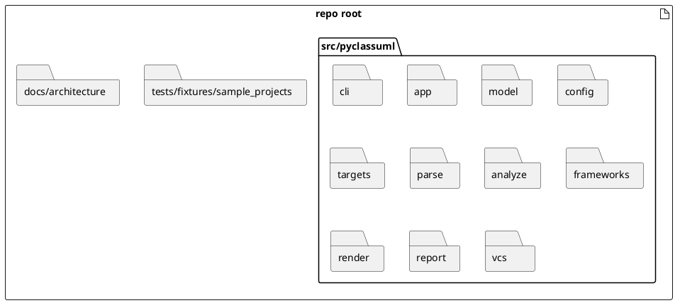
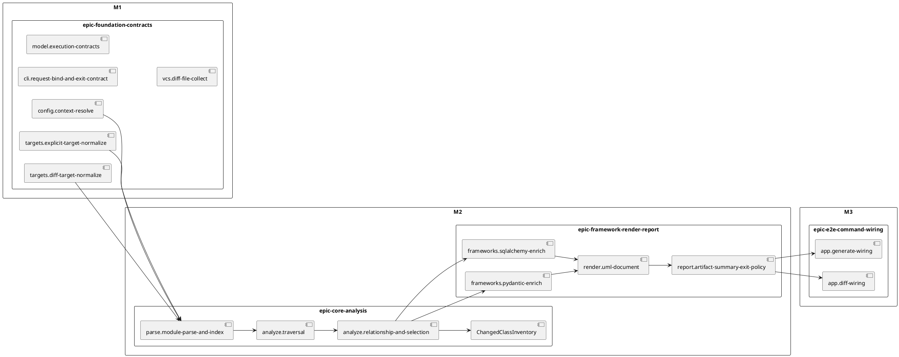
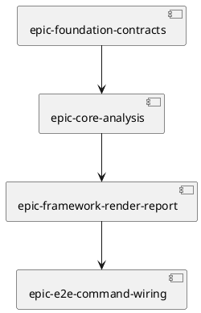

# 20260417t152718z-note PyClassUML Prototype Roadmap Bridge V1

## この資料の位置づけ
- これは `pyclassuml` prototype の **全体設計 + epic / issue 配置 + 実装順序** を 1 枚で説明する bridge 資料である。
- 新しい正本を増やすための資料ではなく、将来 [design.md](/Users/iwasawayuuta/workspace/tools/pyclassuml/spec-dock/initiatives/init-00001-pyclassuml-prototype/design.md) と [plan.md](/Users/iwasawayuuta/workspace/tools/pyclassuml/spec-dock/initiatives/init-00001-pyclassuml-prototype/plan.md) を richer にするための前段 discussion として扱う。
- 役割分担と優先順位は既存ルールを維持する。
  - WHAT / scope / acceptance: [requirement.md](/Users/iwasawayuuta/workspace/tools/pyclassuml/spec-dock/initiatives/init-00001-pyclassuml-prototype/requirement.md)
  - whole-system guardrail: [design.md](/Users/iwasawayuuta/workspace/tools/pyclassuml/spec-dock/initiatives/init-00001-pyclassuml-prototype/design.md)
  - seam-level HOW: [20260416t113919z-note-pyclassuml-architecture-v5.md](/Users/iwasawayuuta/workspace/tools/pyclassuml/spec-dock/initiatives/init-00001-pyclassuml-prototype/discussions/20260416t113919z-note-pyclassuml-architecture-v5.md)
  - epic grouping / milestone / issue baseline: [plan.md](/Users/iwasawayuuta/workspace/tools/pyclassuml/spec-dock/initiatives/init-00001-pyclassuml-prototype/plan.md)
  - governance / supersession rule: [20260416t121500z-adr-v5-ratification.md](/Users/iwasawayuuta/workspace/tools/pyclassuml/spec-dock/initiatives/init-00001-pyclassuml-prototype/adr/20260416t121500z-adr-v5-ratification.md)
- したがって、この資料は上記の正本を上書きせず、「どの節をどこへ昇格させるべきか」と「prototype をどの順で作るべきか」を整理することだけを目的にする。

## 結論サマリー
- 採用アーキテクチャは **`pipeline-oriented modular monolith`** のまま維持する。
- `generate` / `diff` の差分は `targets` + `vcs` の前段に閉じ、後段の parse / analyze / frameworks / render / report は共通 pipeline に載せる。
- prototype の実装計画は **4 epics / 16 issues** が最もバランスがよい。
  - `epic-foundation-contracts`: 6 issues
  - `epic-core-analysis`: 4 issues
  - `epic-framework-render-report`: 4 issues
  - `epic-e2e-command-wiring`: 2 issues
- この分け方が最適な理由は次の 3 点である。
  - path semantics と config / diff seed semantics を 1 つの前段 epic に束ねられる
  - AST-only の中核推論を framework / render / report から切り離せる
  - `app` を最後の stitcher に限定し、patchwork 的な責務流入を防げる
- この bridge は、`design.md` の whole-system design 化と `plan.md` の可読性強化に使った昇格前 discussion の履歴資料として残す。

## 全体像

### アーキテクチャ図

読み方:
- 入口は `cli`、順序制御は `app`、実質的な製品価値は共通 pipeline に集約する。
- 外部境界は `target repository` と `git history` であり、どちらも read-only で扱う。
- `.puml` 書き出しは `report` に閉じ、console との責務を分離する。

### モジュール / 責務図

読み方:
- `model` は shared contract であり、ad-hoc dict や tuple の受け渡しを防ぐための最小面積として使う。
- `frameworks` は core reasoning を拡張せず、既知の graph / relation を best-effort で補強するだけに留める。
- `report` は解析しない。artifact path、summary、exit policy の集約だけを持つ。

### ディレクトリ target-state 図

読み方:
- これは実装済み fact ではなく、prototype で目指す physical boundary の target-state である。
- 固定したいのは top-level boundary であり、配下の file split まではまだ固定しない。

## 計画の背骨

### seam -> epic -> milestone 対応図

読み方:
- M1 は前段契約の固定、M2 は推論核と出力政策の固定、M3 は end-to-end の stitching で閉じる。
- `generate` / `diff` の差分は M1 までに閉じ、M2 以降へ command-specific branching を漏らさない。
- この図が、prototype を patchwork にしないための中心図である。

### epic dependency sequence

読み方:
- foundation を分けずに先に固めることで、path semantics と config / diff semantics の再解釈を防ぐ。
- `app` は最後まで遅らせ、stitching layer としてだけ成立させる。

## Epic 設計

### 1. `epic-foundation-contracts`
- issue 数: 6
- upstream dependency: none
- 目的:
  - `execution_cwd / project_root / package_root / scope_root`
  - config merge
  - explicit target normalization
  - diff seed generation
  - usage / exit propagation
  を同じ前段契約として固定する。
- なぜこの切り方か:
  - ここを `target-resolution` と `diff-entry` に分けると path semantics が裂ける。
  - `config.context-resolve` を foundation に置かないと、後段で config-relative path の解釈差が生まれる。
- 完了時に固定されるもの:
  - root 境界
  - config 読込と fallback
  - `generate` / `diff` の seed 契約
  - non-zero / failure taxonomy の前段部分

### 2. `epic-core-analysis`
- issue 数: 4
- upstream dependency: `epic-foundation-contracts`
- 目的:
  - AST parse
  - traversal
  - relation extraction
  - class selection
  - changed class counting
  の核を成立させる。
- なぜこの切り方か:
  - ここが製品価値の中心であり、framework / render / report と混ぜると AST-only の核が曖昧になる。
  - `ChangedClassInventory` を独立 seam にすることで、到達可否と changed file semantics を分離できる。
- 完了時に固定されるもの:
  - syntax degradation の範囲
  - depth / scope traversal semantics
  - relation-based selection
  - changed class summary semantics

### 3. `epic-framework-render-report`
- issue 数: 4
- upstream dependency: `epic-core-analysis`
- 目的:
  - SQLAlchemy / Pydantic の best-effort enrich
  - deterministic PlantUML render
  - artifact / summary / strict-warn policy
  を downstream 出力責務として成立させる。
- なぜこの切り方か:
  - `frameworks` は core を広げず enrich に閉じるべきで、render/report と密に連携する。
  - `report` をここに置くことで、exit policy と output policy を `app` から追い出せる。
- 完了時に固定されるもの:
  - framework support の下限
  - stable order / grouping / labels
  - failure reason taxonomy の後段部分
  - stdout/stderr / filesystem artifact policy

### 4. `epic-e2e-command-wiring`
- issue 数: 2
- upstream dependency: `epic-framework-render-report`
- 目的:
  - `app.generate-wiring`
  - `app.diff-wiring`
  を通じて、prototype 全体を command として成立させる。
- なぜこの切り方か:
  - `app` は最後の stitcher であり、render/report と同じ epic に入れると責務の逃げ場になる。
  - `generate` / `diff` を end-to-end で分けることで、入口差分の最終確認ができる。
- 完了時に固定されるもの:
  - e2e generate
  - e2e diff
  - current-state / untracked の user-visible 差

## Issue 配置サマリー

### `epic-foundation-contracts` — 6 issues
| issue | 1 行要約 |
| --- | --- |
| `cli.request-bind-and-exit-contract` | argv parse、usage error、exit code propagation を固定する |
| `model.execution-contracts` | stage 間 DTO と invariant を固定する |
| `config.context-resolve` | 4 roots、config merge、relative path semantics、config failure を固定する |
| `targets.explicit-target-normalize` | file / glob / dir 起点と ignore 適用を固定する |
| `vcs.diff-file-collect` | `--base`、`working-tree|head`、untracked、VCS failure を固定する |
| `targets.diff-target-normalize` | diff seed の scope filtering と zero-target fail を固定する |

### `epic-core-analysis` — 4 issues
| issue | 1 行要約 |
| --- | --- |
| `parse.module-parse-and-index` | import 非実行 AST parse と dependency candidate ignore を固定する |
| `analyze.traversal` | depth / package / scope 境界つき reachability を固定する |
| `analyze.relationship-and-selection` | relation extraction と UML class selection を固定する |
| `ChangedClassInventory` | changed class 数の集計 semantics を固定する |

### `epic-framework-render-report` — 4 issues
| issue | 1 行要約 |
| --- | --- |
| `frameworks.sqlalchemy-enrich` | `Mapped[T]` と `relationship(\"T\")` の best-effort を固定する |
| `frameworks.pydantic-enrich` | forward reference の best-effort enrich を固定する |
| `render.uml-document` | deterministic PlantUML text を固定する |
| `report.artifact-summary-exit-policy` | `.puml` artifact、summary、stream routing、failure taxonomy を固定する |

### `epic-e2e-command-wiring` — 2 issues
| issue | 1 行要約 |
| --- | --- |
| `app.generate-wiring` | `generate` の end-to-end 実行を成立させる |
| `app.diff-wiring` | `diff` の end-to-end 実行を成立させる |

### 配置の要点
- issue 数は `6 / 4 / 4 / 2` とし、prototype に対して過不足のない分解にする。
- issue の owner / verification / upstream dependency の canonical source は [plan.md](/Users/iwasawayuuta/workspace/tools/pyclassuml/spec-dock/initiatives/init-00001-pyclassuml-prototype/plan.md) に残し、この資料では再掲しない。
- この資料では「なぜこの issue 配置なのか」の説明に集中する。

## なぜこの構成がベストプラクティスか
- `foundation` を前段 1 epic に束ねることで、path semantics と config / diff semantics を二重管理しない。
- `core-analysis` を独立させることで、AST-only の中核価値を最小責務で保てる。
- `framework-render-report` を 1 epic に束ねることで、出力面の責務を `app` から追い出せる。
- `e2e-command-wiring` を最後に分けることで、`app` が orchestration 以上の責務を持たない構造を守れる。
- 3 epic だと粗すぎ、5 epic 以上だと prototype 規模に対して governance コストが高い。

## Future Home Map
| 節 | 将来の主な移管先 | 理由 |
| --- | --- | --- |
| 結論サマリー | `design.md` | whole-system design の冒頭要約として適切 |
| アーキテクチャ図 / モジュール図 | `design.md` | リッチ化した design の中心になる |
| ディレクトリ target-state 図 | `design.md` | top-level boundary の説明として必要 |
| `seam -> epic -> milestone` 対応図 | `plan.md` | 実装順と milestone を表すため |
| epic 設計 | `plan.md` | epic grouping の説明強化に直結するため |
| issue 配置サマリー | `plan.md` | issue baseline の可読性強化に使えるため |
| なぜこの構成か | discussion に残す | alternatives と採用理由は説明資料の役割が強い |
| non-goals / defer | `design.md` と discussion に分配 | design の guardrail と discussion の判断経緯に分かれるため |

## リスク / Non-goals / Defer

### 主要リスク
- 新しい discussion が第 2 の `v5` になること
  - 回避策: 先頭で bridge 資料と明記し、canonical source を `design.md` / `plan.md` / `v5` に固定する
- `foundation` と `target/diff` を分けて前段契約が裂けること
  - 回避策: config、explicit target、diff target、VCS failure を 1 epic に束ね続ける
- `render/report/e2e` を一緒にして `app` が調整レイヤ化すること
  - 回避策: `app` は最後の stitching のみと図と文章の両方で固定する
- `model` と `report` が dumping ground になること
  - 回避策: `model` は shared contract に限定し、`report` は解析しないという forbidden move を守る

### prototype でやらないこと
- plugin architecture
- 複数 renderer backend
- cache / parallelism / event bus / DI container
- namespace package 完全対応
- multiple `package_root`
- multiple `scope_root`
- diff hunk 粒度 changed class

### 後続に送るもの
- `design.md` / `plan.md` へ反映済み内容の運用と維持
- 実際の epic / issue 作成と実装着手

## レビュー観点
- この資料だけで、なぜ 4 epics が最適か説明できること
- 図と本文が同じ責務境界を示していること
- `design.md` に持ち上げるものと `plan.md` に持ち上げるものが曖昧でないこと
- issue baseline の canonical source が [plan.md](/Users/iwasawayuuta/workspace/tools/pyclassuml/spec-dock/initiatives/init-00001-pyclassuml-prototype/plan.md) のままであること
- `v5` の複製ではなく、「全体設計と実装計画を人間に説明する bridge」になっていること
