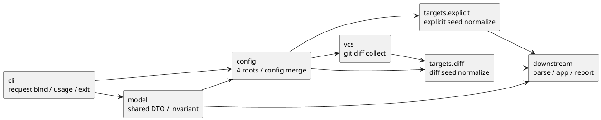

# epic-00002 Foundation Contracts — 設計（HOW）

## 全体像
- target boundary:
  - `cli`, `model`, `config`, `targets`, `vcs` の front-stage contract を対象にする。
- impacted area:
  - `app.generate-wiring` / `app.diff-wiring`
  - `parse.module-parse-and-index`
  - `report.artifact-summary-exit-policy`
- existing relation:
  - initiative `design.md` の whole-system boundary と `plan.md` の M1 issue baseline を、epic 粒度で束ね直す。

### UML（module / dependency）

## この 6 seams を 1 epic に束ねる理由
- `execution_cwd` / `project_root` / `package_root` / `scope_root` の意味論と config merge は、explicit target と diff target の両方で共通に使うため、別 epic に裂くと後段で再解釈が発生する。
- `generate` / `diff` の command 差分は `targets` / `vcs` までに閉じるという initiative guardrail を守るには、CLI bind、context resolve、seed normalize を 1 つの milestone で固める必要がある。
- `model.execution-contracts` を同じ epic に置くことで、`config` と `targets` が ad-hoc dict ではなく shared contract に乗る。
- `report` が後段で summary / exit policy を決めるためには、front-stage が diagnostics origin / recoverability / failure_reason 候補を揃えて渡す必要がある。

## 契約

### seam contract table
| seam | owner | input | output | invariant | downstream |
| --- | --- | --- | --- | --- | --- |
| `cli.request-bind-and-exit-contract` | `cli` | raw argv, `process_cwd` | `CommandRequest` | raw argv を後段へ漏らさず、canonical `cli_options` schema、`cli_usage_error`、exit propagation のみを担う | `config`, `targets`, `vcs`, `app.*-wiring` |
| `model.execution-contracts` | `model` | initiative canonical docs | shared DTO set | DTO は最小 field と invariant に限り、algorithm や policy を持ち込まない | all stages |
| `config.context-resolve` | `config` | `CommandRequest` | `ExecutionContext`, `AnalysisConfig` | 4 roots、config discovery / merge、containment、`mode=warn|strict`、diff defaults を authoritative に確定する | `targets`, `vcs`, `parse`, `report`, `app` |
| `targets.explicit-target-normalize` | `targets` | explicit inputs, `ExecutionContext`, `AnalysisConfig` | `TargetSet(seed_files, observations)` | file / glob / dir 起点を dedupe し、Python source file のみを `seed_files` に載せ、ignore count、scope outside fail、zero-seed fail をここで確定する | `parse`, `app.generate-wiring`, `report` |
| `vcs.diff-file-collect` | `vcs` | `project_root`, `--base`, `current_state`, `include_untracked` | `ChangedFileCollection` | Git 読み取りだけを担い、`project_root` relative / unique / current-side-only changed files を返し、scope filtering を持ち込まない | `targets.diff-target-normalize` |
| `targets.diff-target-normalize` | `targets` | `ChangedFileCollection`, `ExecutionContext`, `AnalysisConfig` | `TargetSet(seed_files, observations)` | scope outside exclusion count と zero-target fail をここで確定し、Python source file のみを後段へ command-neutral seed として渡す | `parse`, `app.diff-wiring`, `report` |

### Data boundary
- SoR:
  - `CommandRequest` の SoR は `cli`。
  - `ExecutionContext` / `AnalysisConfig` の SoR は `config`。
  - `TargetSet` と `TargetObservations` の SoR は `targets`。
  - Git diff raw source の SoR は `vcs`。
- consistency model:
  - `model.execution-contracts` は immutable / reviewable な最小 contract を固定し、各 seam は自分が owner の DTO だけを authoritative に生成する。
  - `vcs` から `targets.diff-target-normalize` への `ChangedFileCollection` は seam-local handoff とし、initiative 全体の shared DTO には昇格させない。

## 主要フロー
- Flow-A: `generate`
  1. `cli` が raw argv を usage error 付きで `CommandRequest` に束縛する。
  2. `config` が `process_cwd` と CLI option から 4 roots と `AnalysisConfig` を確定する。
  3. `targets.explicit-target-normalize` が explicit inputs を `TargetSet` に正規化して後段へ渡す。
- Flow-B: `diff`
  1. `cli` と `config` は `generate` と同じく request/context を確定する。
  2. `vcs.diff-file-collect` が `--base <ref>`、`current_state`、`include_untracked` に従って changed files を収集する。
  3. `targets.diff-target-normalize` が scope filtering と zero-target 判定を行い、`TargetSet` を後段へ渡す。

## dependency order
- completion order:
  1. `iss-00007 model.execution-contracts`
  2. `iss-00008 config.context-resolve`
  3. `iss-00006 cli.request-bind-and-exit-contract`
  4. `iss-00009 targets.explicit-target-normalize`
  5. `iss-00010 vcs.diff-file-collect`
  6. `iss-00011 targets.diff-target-normalize`
- rationale:
  - `model` がないと DTO invariant が固定できない。
  - `config` がないと `targets` / `vcs` が前提とする path semantics が確定しない。
  - `cli` は `model` に依存するが、4 roots の resolve を持たないため `config` より後に contract を閉じてもよい。
  - `targets.diff-target-normalize` は `config` と `vcs` の両方に依存するため最後に置く。

## 観測性 / セキュリティ
- observability:
  - `Diagnostic.origin_seam` により、usage error、config failure、scope outside exclusion、Git diff read failure の発生地点が判別できるようにする。
  - `RunSummary` の素材として、ignore 件数、diff scope outside exclusion 件数、warning 件数、failure reason 候補を front-stage で carry する。
  - `current_state=head` かつ `include_untracked=true` の no-op warning は `vcs` 起点で観測できるようにする。
- security:
  - `config` / `targets` / `vcs` は read-only で動作し、解析対象コード import や Git write を行わない。

## 失敗設計
- fail-fast owner:
  - `cli`: usage error
  - `config`: config read failure、invalid config value、unresolved config path、containment violation
  - `vcs`: invalid `--base <ref>`、Git diff read failure
  - `targets`: explicit target の scope outside fail、`generate_zero_target_after_normalize`、`diff_zero_target_after_scope_filter`
- recoverable handoff:
  - `targets.diff-target-normalize` における scope outside exclusion は、warn path で継続できる diagnostics / counter として carry し、strict での failure 昇格は後続 `report` が行う。
- forbidden move:
  - `parse` 以降が front-stage failure を補正しない。

## リスク
- `model` に convenience field を積み増すと downstream 依存が濁る。
- `cli` が `execution_cwd` を resolve し始めると `config` owner が崩れる。
- `vcs` が scope / ignore を知り始めると `diff` と `generate` の command-neutral handoff が壊れる。
- `targets.diff-target-normalize` が strict/warn の exit code まで決めると、`report` の exit policy と重複する。

## テスト戦略
- Unit:
  - DTO invariant review
  - config discovery / merge scenario
  - explicit / diff target normalization scenario
  - VCS option matrix
- Integration:
  - `cli -> config -> targets` の `generate` front-stage
  - `cli -> config -> vcs -> targets` の `diff` front-stage
- E2E:
  - この epic 単体では command transcript と docs review を canonical evidence とし、full pipeline E2E は `app.*-wiring` に委ねる。

## 関連 ADR
- `20260416t121500z-adr-v5-ratification.md`:
  - seam-level HOW は v5、epic grouping / issue baseline は initiative `plan.md`、whole-system guardrail は initiative `design.md` を優先する。

## 未確定事項
- なし:
  - dependency order、ownership、failure taxonomy の境界は initiative canonical docs から十分に導出できる。
