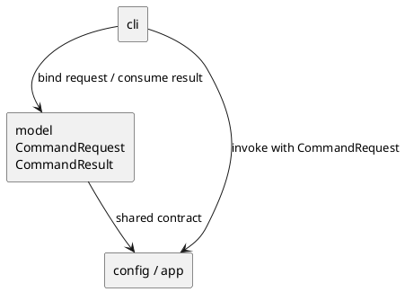

# iss-00006 CLI Request Bind And Exit Contract — 設計（HOW）

## seam position
- upstream / prerequisite:
  - `iss-00007-model-execution-contracts`
- downstream / dependent:
  - `iss-00008-config-context-resolve`
  - `app.generate-wiring`
  - `app.diff-wiring`
- seam responsibility:
  - argv parse と validation
  - `CommandRequest` への bind
  - usage error の seam-local failure result 生成
  - `CommandResult.exit_code` の `CliRunResult.exit_code` 反映

### UML（module / dependency）

## インターフェース契約
- request bind:
  - input:
    - raw argv
    - current process cwd
  - output:
    - `CommandRequest(process_cwd, cli_options)`
  - invariant:
    - `process_cwd` は CLI 実行時の cwd をそのまま保持する。
    - `cli_options` は validation 済み option 群を保持し、次の canonical shape を使う。
      - `command: generate | diff`
      - common option: `cwd`, `config`, `project_root`, `package_root`, `scope_root`, `output`, `ignore[]`, `depth`, `strict`, `target_python`
      - `generate.targets[]`
      - `diff.base_ref`, `diff.current_state`, `diff.include_untracked`
    - `--cwd` は raw option 値として保持し、resolve しない。
- exit propagation:
  - input:
    - `CommandResult(artifact_path, summary, diagnostics, exit_code)`
  - output:
    - this issue: seam-local `CliRunResult(command_result, exit_code, stderr_text)`
    - downstream console script issue: process exit status
  - invariant:
    - `exit_code` を CLI で再分類しない。
    - summary / diagnostics の内容は再構成しない。
    - usage error だけは `cli` 自身が `cli_usage_error` を持つ failure summary を生成して stderr に出す。
    - `CliRunResult.exit_code` は `CommandResult.exit_code` と一致する。
    - `CliRunResult.stderr_text` は usage error transcript evidence のために使い、raw argv を downstream handoff しない。

## data / DTO handoff
- producer:
  - `cli` は `CommandRequest` を生成する。
- consumer:
  - `config.context-resolve` が `process_cwd` と `cli_options.cwd/config/project_root/package_root/scope_root/output/ignore/depth/strict/target_python` を消費する。
  - `targets.explicit-target-normalize` が `cli_options.generate.targets[]` を消費する。
  - `vcs.diff-file-collect` が `cli_options.diff.base_ref/current_state/include_untracked` を消費する。
  - `app.*-wiring` と `report` の downstream 合流結果として返る `CommandResult` を `cli` が消費する。
- non-goal:
  - `ExecutionContext` や `AnalysisConfig` を `cli` が組み立てない。
  - console script registration と process termination。

## テスト戦略
- Unit:
  - 有効な `generate` / `diff` invocation が `CommandRequest` に束縛されること。
  - usage error が seam-local `CliRunResult.exit_code` に non-zero を返すこと。
  - `CommandResult.exit_code` が `CliRunResult.exit_code` へそのまま反映されること。
- Integration:
  - `cli -> config` handoff で `process_cwd` と raw `--cwd` が保持されること。
- Verification:
  - initiative `plan.md` の canonical verification に沿って、usage error transcript と `--cwd` bind review を evidence にする。

## non-goals
- `execution_cwd` の resolve。
- `strict` / `warn` の最終 exit policy 決定。
- summary counter の生成。

## リスク / 注意点
- CLI で path 解決や config merge を始めると `config` owner を侵食する。
- exit code を CLI 側で言い換えると `report` / `app` が返した failure taxonomy が downstream へそのまま渡らなくなる。
