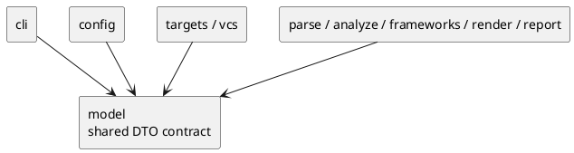

# iss-00007 Model Execution Contracts — 設計（HOW）

## seam position
- upstream / prerequisite:
  - なし
- downstream / dependent:
  - `config.context-resolve`
  - `targets.*`
  - `parse`, `analyze`, `frameworks`, `render`, `report`, `app.*-wiring`
- seam responsibility:
  - shared DTO 名、最小 field、nullability、producer / consumer、carry rule を固定する。

### UML（module / dependency）

## インターフェース契約
| DTO | producer | consumer | required contract |
| --- | --- | --- | --- |
| `CommandRequest` | `cli` | `config`, `targets`, `vcs`, `app.*-wiring` | `process_cwd` と canonical shape の `cli_options` を持つ。`cli_options.command` は `generate | diff`、common option は `cwd/config/project_root/package_root/scope_root/output/ignore[]/depth/strict/target_python`、subcommand option は `generate.targets[]` または `diff.base_ref/current_state/include_untracked` に固定する |
| `ExecutionContext` | `config` | `targets`, `parse`, `analyze`, `report` | `execution_cwd`, `project_root`, `package_root`, `scope_root` は正規化済み |
| `AnalysisConfig` | `config` | `targets`, `vcs`, `report`, `app.*-wiring`, `parse`, `analyze` | `ignore`, `output`, `depth`, `mode`, `target_python`, `diff.current_state`, `diff.include_untracked` を持つ。`depth` は `null | int >= 0`、`mode` は `warn | strict`、`target_python` は `null | 3.<minor>` のみを許可する |
| `TargetObservations` | `targets` | `app.*-wiring`, `report` | `ignored_seed_candidate_count`, `diff_scope_excluded_count` を必須 `int >= 0` として持ち、未使用側は `0` を入れる |
| `TargetSet` | `targets` | `parse`, `app.*-wiring`, `report` | `seed_files` は Python source file のみからなる command-neutral 集合であり、`observations: TargetObservations` を必ず同伴する |
| `ParsedModule` | `parse` | `analyze`, `frameworks`, `report` | module path、imports、classes、diagnostics を保持する |
| `DependencyGraph` | `analyze` | `frameworks`, `report` | 到達ファイルと edge を保持する |
| `SelectedClasses` | `analyze` | `frameworks`, `render`, `report` | UML 掲載対象 class の確定結果を保持する |
| `ChangedClassInventory` | `analyze` | `report`, `app.diff-wiring` | changed files と class count を別 DTO で保持する |
| `RenderReadyModel` | `frameworks` | `render`, `report` | classes / members / relations / decorations / grouping_keys / diagnostics を持つ |
| `DiagramModel` | `render` | `report` | containers / rendered classes / relations / aliases を持つ |
| `PlantUmlText` | `render` | `report` | 完成した text を持つ |
| `Diagnostic` | each seam | `report`, `cli` | `severity`, `code`, `message`, `origin_seam`, `recoverability`, optional `failure_reason`。failure diagnostic では `failure_reason` 必須、warning-only diagnostic では `null` |
| `RunSummary` | `report` (usage error のみ `cli`) | `cli` | counters と `failure_reason` を持つ |
| `CommandResult` | `report` (usage error のみ `cli`) | `cli`, `app.*-wiring` | optional `artifact_path`, mandatory `summary`, `diagnostics`, `exit_code` |

## data / DTO handoff
- path handoff:
  - `CommandRequest.process_cwd` は `config` が `execution_cwd` を導出する唯一の起点。
  - `ExecutionContext` は 4 roots の唯一の authoritative source。
- target observation handoff:
  - `targets.explicit-target-normalize` は `TargetObservations.ignored_seed_candidate_count` を更新し、`diff_scope_excluded_count` には `0` を入れる。
  - `targets.diff-target-normalize` は changed-file seed 候補に対する ignore 除外を `TargetObservations.ignored_seed_candidate_count` に、scope 外 changed file を `diff_scope_excluded_count` に積む。
  - `parse` は `TargetSet` 全体を受け取っても `observations` を解釈しない。authoritative transport path は `app.*-wiring` が original `TargetSet.observations` を保持したまま `report` へ handoff する形に固定する。
  - `report` は `TargetSet.observations` から `RunSummary.counters` を構築する。
- diagnostics handoff:
  - すべての seam は `Diagnostic.origin_seam` と `recoverability` を carry し、`report` が最終 policy を決める。
- output handoff:
  - `RenderReadyModel` と `DiagramModel` を分け、analysis result と PlantUML-specific shaping を混同しない。

## テスト戦略
- Unit:
  - DTO field / nullability / invariant review。
  - `CommandResult.artifact_path` の optional contract review。
  - `Diagnostic.failure_reason` carry review。
- Integration:
  - `CommandRequest -> ExecutionContext`
  - `TargetSet -> ParsedModule`
  - `RenderReadyModel -> DiagramModel -> PlantUmlText`
- Verification:
  - initiative `plan.md` の canonical verification に従い、DTO 一覧と producer / consumer 表を evidence にする。

## non-goals
- changed-file collection のような seam-local handoff を initiative 全体の shared DTO に昇格させること。
- 各 package 配下の class split / file split を決めること。
- JSON schema や external serialization format を決めること。

## リスク / 注意点
- `model` に policy field を積み増すと owner 境界が崩れる。
- `RenderReadyModel` と `DiagramModel` を混ぜると `render` が再解析レイヤ化する。
