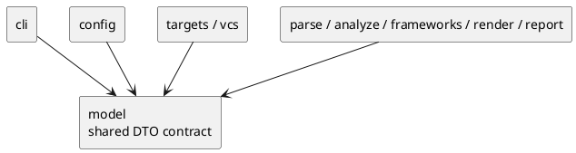

# iss-00007 Model Execution Contracts — 設計（HOW）

## seam position
- upstream / prerequisite:
  - なし
- downstream / dependent:
  - `config.context-resolve`
  - `targets.*`
  - `parse`, `analyze`, `frameworks`, `render`, `report`, `app.*-wiring`
- seam responsibility:
  - shared DTO 名、最小 field、nullability、producer / consumer、carry rule を固定する。

### UML（module / dependency）


## インターフェース契約
| DTO | producer | consumer | required contract |
| --- | --- | --- | --- |
| `CommandRequest` | `cli` | `config`, `targets`, `vcs`, `app.*-wiring` | `process_cwd` と canonical shape の `cli_options` を持つ。`cli_options.command` は `generate | diff`、common option は `cwd/config/project_root/package_root/scope_root/output/ignore[]/depth/strict/target_python`、subcommand option は `generate.targets[]` または `diff.base_ref/current_state/include_untracked` に固定する |
| `ExecutionContext` | `config` | `targets`, `parse`, `analyze`, `report` | `execution_cwd`, `project_root`, `package_root`, `scope_root` は正規化済み |
| `AnalysisConfig` | `config` | `targets`, `vcs`, `report`, `app.*-wiring`, `parse`, `analyze` | `ignore`, `output`, `depth`, `mode`, `target_python`, `diff.current_state`, `diff.include_untracked` を持つ。`depth` は `null | int >= 0`、`mode` は `warn | strict`、`target_python` は `null | 3.<minor>` のみを許可する |
| `TargetObservations` | `targets` | `app.*-wiring`, `report` | `ignored_seed_candidate_count`, `diff_scope_excluded_count` を必須 `int >= 0` として持ち、未使用側は `0` を入れる |
| `TargetSet` | `targets` | `parse`, `app.*-wiring`, `report` | `seed_files` は Python source file のみからなる command-neutral 集合であり、`observations: TargetObservations` を必ず同伴する |
| `ParsedModule` | `parse` | `analyze`, `frameworks`, `report` | module path、imports、classes、diagnostics を保持する |
| `DependencyGraph` | `analyze` | `frameworks`, `report` | 到達ファイルと edge を保持する |
| `SelectedClasses` | `analyze` | `frameworks`, `render`, `report` | UML 掲載対象 class の確定結果を保持する |
| `ChangedClassInventory` | `analyze` | `report`, `app.diff-wiring` | changed files と class count を別 DTO で保持する |
| `RenderReadyModel` | `frameworks` | `render`, `report` | classes / members / relations / decorations / grouping_keys / diagnostics を持つ |
| `DiagramModel` | `render` | `report` | containers / rendered classes / relations / aliases を持つ |
| `PlantUmlText` | `render` | `report` | 完成した text を持つ |
| `Diagnostic` | each seam | `report`, `cli` | `severity`, `code`, `message`, `origin_seam`, `recoverability`, optional `failure_reason`。failure diagnostic では `failure_reason` 必須、warning-only diagnostic では `null` |
| `RunSummary` | `report` (usage error のみ `cli`) | `cli` | counters と `failure_reason` を持つ |
| `CommandResult` | `report` (usage error のみ `cli`) | `cli`, `app.*-wiring` | optional `artifact_path`, mandatory `summary`, `diagnostics`, `exit_code` |

### DTO value shapes / invariants
- primitive aliases:
  - `ClassId`: non-empty `str`。prototype MVP では `<module_path>:<qualname>` 形式を推奨し、厳密な parse は後続 `parse` / `analyze` issue の owner とする。
  - `ModulePath`: `Path`。
  - `DiagnosticCode`: non-empty snake_case `str`。
  - `RelationType`, `EvidenceKind`, `GroupingKey`, `Alias`: non-empty `str`。各値域の意味付けは producer seam の後続 issue が所有する。
- finite enums / value domains:
  - `CommandName`: `generate | diff`
  - `AnalysisMode`: `warn | strict`
  - `DiffCurrentState`: `working-tree | head`
  - `DiagnosticSeverity`: `warning | error`
  - `Recoverability`: `recoverable | degraded_output | fatal`
  - `OriginSeam`: `cli | config | targets | vcs | parse | analyze | frameworks | render | report | app`
  - `FailureReason`: initiative `requirement.md` の `failure reason taxonomy` に列挙された有限集合。
- nested option shapes:
  - `CommandOptions(command, cwd, config, project_root, package_root, scope_root, output, ignore, depth, strict, target_python, generate, diff)` を `CommandRequest.cli_options` の canonical shape とする。
  - `CommandOptions.command: CommandName`
  - `CommandOptions.cwd: None | Path`
  - `CommandOptions.config: None | Path`
  - `CommandOptions.project_root: None | Path`
  - `CommandOptions.package_root: None | Path`
  - `CommandOptions.scope_root: None | Path`
  - `CommandOptions.output: None | Path`
  - `CommandOptions.ignore: tuple[str, ...]`。未指定時は empty tuple。
  - `CommandOptions.depth: None | int >= 0`
  - `CommandOptions.strict: bool`。`config` が `AnalysisConfig.mode` へ正規化する前の CLI carry として保持する。
  - `CommandOptions.target_python: None | "3.<minor>"`
  - `CommandOptions.generate: None | GenerateOptions`
  - `CommandOptions.diff: None | DiffOptions`
  - `GenerateOptions(targets)` は tuple of `Path | str`。未指定時は empty tuple。path/glob/dir の意味解釈は `targets.explicit-target-normalize` が所有する。
  - `DiffOptions(base_ref, current_state, include_untracked)` は diff seed collection の option carry に限定する。
  - `DiffOptions.base_ref: str`。空文字列は許可しない。
  - `DiffOptions.current_state: DiffCurrentState`
  - `DiffOptions.include_untracked: bool`
  - command-specific absence rule:
    - `CommandOptions.command=generate` の場合、`generate` は必須、`diff` は `None`。
    - `CommandOptions.command=diff` の場合、`diff` は必須、`generate` は `None`。
    - command と nested option の組み合わせが不一致なら `ValueError` とする。
  - `AnalysisConfig.mode` は `strict: bool` ではなく `AnalysisMode` に正規化済みとする。
  - `AnalysisConfig.ignore: tuple[str, ...]`
  - `AnalysisConfig.output: None | Path`
  - `AnalysisConfig.depth: None | int >= 0`
  - `AnalysisConfig.target_python: None | "3.<minor>"`
  - `AnalysisConfig.diff_current_state: DiffCurrentState`
  - `AnalysisConfig.diff_include_untracked: bool`
  - `diff.current_state` / `diff.include_untracked` は upstream logical provenance の表記であり、実装上の public dataclass field は `diff_current_state` / `diff_include_untracked` とする。
- collection and counter invariants:
  - collection fields は construction 時に tuple 化し、呼び出し側 mutable collection を共有しない。
  - counter fields は `int >= 0`。
  - `TargetSet.seed_files` は `.py` suffix の `Path` のみ許可する。
  - `AnalysisConfig.depth` は `None | int >= 0`。
  - `AnalysisConfig.target_python` は `None | "3.<minor>"` 形式の `str`。
- DTO minimal field shapes:
  - `ParsedModule(module_path: Path, imports: tuple[str, ...], classes: tuple[ClassId, ...], diagnostics: tuple[Diagnostic, ...])`
  - `DependencyGraph(reachable_files: tuple[Path, ...], edges: tuple[tuple[Path, Path], ...])`
  - `SelectedClasses(class_ids: tuple[ClassId, ...])`
  - `ChangedClassInventory(class_count: int >= 0, changed_files: tuple[Path, ...])`
  - `RenderReadyModel(classes: tuple[ClassId, ...], members: tuple[str, ...], relations: tuple[tuple[ClassId, ClassId, RelationType], ...], class_decorations: tuple[tuple[ClassId, str], ...], grouping_keys: tuple[GroupingKey, ...], diagnostics: tuple[Diagnostic, ...])`
  - `DiagramModel(containers: tuple[str, ...], rendered_classes: tuple[ClassId, ...], rendered_relations: tuple[tuple[ClassId, ClassId, RelationType], ...], aliases: tuple[tuple[ClassId, Alias], ...])`
  - `RunSummary(counters: Mapping[str, int >= 0], failure_reason: None | FailureReason)`
  - `CommandResult(artifact_path: None | Path, summary: RunSummary, diagnostics: tuple[Diagnostic, ...], exit_code: int >= 0)`
- opaque placeholders:
  - `imports`, `members`, `class_decorations`, `containers`, `aliases` の semantic meaning は後続 seam が所有する。この issue は type shape、immutability、non-negative counters、failure/nullability rule までを固定する。

## data / DTO handoff
- path handoff:
  - `CommandRequest.process_cwd` は `config` が `execution_cwd` を導出する唯一の起点。
  - `ExecutionContext` は 4 roots の唯一の authoritative source。
- target observation handoff:
  - `targets.explicit-target-normalize` は `TargetObservations.ignored_seed_candidate_count` を更新し、`diff_scope_excluded_count` には `0` を入れる。
  - `targets.diff-target-normalize` は changed-file seed 候補に対する ignore 除外を `TargetObservations.ignored_seed_candidate_count` に、scope 外 changed file を `diff_scope_excluded_count` に積む。
  - `parse` は `TargetSet` 全体を受け取っても `observations` を解釈しない。authoritative transport path は `app.*-wiring` が original `TargetSet.observations` を保持したまま `report` へ handoff する形に固定する。
  - `report` は `TargetSet.observations` から `RunSummary.counters` を構築する。
- diagnostics handoff:
  - すべての seam は `Diagnostic.origin_seam` と `recoverability` を carry し、`report` が最終 policy を決める。
  - `Diagnostic.severity=error` のとき `failure_reason` は必須、`severity=warning` のとき `failure_reason` は `null` とする。
  - `FailureReason` は initiative `requirement.md` の taxonomy と一致させ、任意文字列を許可しない。
- stream-routing ownership:
  - initiative `plan.md` の `CommandResult.exit_code=0` / non-zero による stdout / stderr invariant は、`cli` / `report` の consumer-side contract として扱う。
  - この issue の `model` 実装は `CommandResult.exit_code` の carry と non-negative invariant までを固定し、stdout / stderr の選択処理や stream target policy は実装しない。
  - したがって、この issue が親 baseline の stream-routing verification に対して提供する evidence は「`CommandResult.exit_code` が必須かつ `int >= 0` で consumer へ渡ること」に限定する。stdout / stderr への実出力 evidence は後続 `cli.request-bind-and-exit-contract` と `report.artifact-summary-exit-policy` で観測する。
- output handoff:
  - `RenderReadyModel` と `DiagramModel` を分け、analysis result と PlantUML-specific shaping を混同しない。

## テスト戦略
- Unit:
  - DTO field / nullability / invariant review。
  - `CommandResult.artifact_path` の optional contract review。
  - `Diagnostic.failure_reason` carry review。
- Integration:
  - `CommandRequest -> ExecutionContext`
  - `TargetSet -> ParsedModule`
  - `RenderReadyModel -> DiagramModel -> PlantUmlText`
- Verification:
  - initiative `plan.md` の canonical verification に従い、DTO 一覧と producer / consumer 表を evidence にする。

## ディレクトリ / ファイル変更計画
```text
pyproject.toml
src/
  pyclassuml/
    __init__.py
    model/
      __init__.py
      contracts.py
tests/
  model/
    test_contracts.py
```

- `pyproject.toml`:
  - prototype package と test runner の最小設定を置く。
  - この issue では console script / CLI entrypoint は追加しない。
- `src/pyclassuml/model/contracts.py`:
  - issue baseline table にある DTO と enum / value invariant を定義する。
  - immutable value object として `dataclass(frozen=True)` を使い、field validation は DTO 内の local invariant に限定する。
  - path は `pathlib.Path`、collection は tuple 化して保持し、呼び出し側の mutable list を共有しない。
  - `Mapping` 入力は immutable copy へ正規化し、counter 値が後から変わらないようにする。
- `src/pyclassuml/model/__init__.py`:
  - downstream issue が import する public contract surface を re-export する。
- `tests/model/test_contracts.py`:
  - DTO の必須 field、nullability、diagnostic failure rule、summary / exit carry、collection immutability を観測する。

## 依存関係分析
- upstream:
  - なし。repo に runtime package が存在しないため、この issue が `src/pyclassuml` の最初の product code slice を作る。
- internal order:
  - package scaffold と `pyproject.toml` が先。
  - enum / primitive validation が次。
  - CLI/front-stage DTO、analysis/render/report DTO、diagnostic/result DTO の順に積む。
- downstream impact:
  - `iss-00006`, `iss-00008` 以降は `pyclassuml.model` の public re-export を通じて DTO を利用する。
  - この issue では downstream algorithm、filesystem I/O、Git I/O、stream routing は実装しない。

## non-goals
- changed-file collection のような seam-local handoff を initiative 全体の shared DTO に昇格させること。
- 各 package 配下の class split / file split を決めること。
- JSON schema や external serialization format を決めること。

## リスク / 注意点
- `model` に policy field を積み増すと owner 境界が崩れる。
- `RenderReadyModel` と `DiagramModel` を混ぜると `render` が再解析レイヤ化する。
