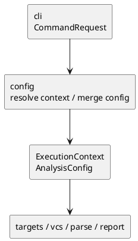

# iss-00008 Config Context Resolve — 設計（HOW）

## seam position
- upstream / prerequisite:
  - `iss-00007-model-execution-contracts`
- downstream / dependent:
  - `targets.explicit-target-normalize`
  - `vcs.diff-file-collect`
  - `targets.diff-target-normalize`
  - `parse.module-parse-and-index`
  - `report.artifact-summary-exit-policy`
- seam responsibility:
  - `CommandRequest` を `ExecutionContext` / `AnalysisConfig` に変換する唯一の owner。

### UML（module / dependency）


## インターフェース契約
- input:
  - `CommandRequest(process_cwd, cli_options)` where `config` consumes `cli_options.command`, `cli_options.cwd`, `cli_options.config`, `cli_options.project_root`, `cli_options.package_root`, `cli_options.scope_root`, `cli_options.output`, `cli_options.ignore`, `cli_options.depth`, `cli_options.strict`, `cli_options.target_python`, `cli_options.diff.current_state`, `cli_options.diff.include_untracked`
- output:
  - `ConfigResolution(context, analysis_config, diagnostics)`
  - success:
    - `context: ExecutionContext`
    - `analysis_config: AnalysisConfig`
    - `diagnostics: tuple[Diagnostic, ...]`
  - failure:
    - `context: None`
    - `analysis_config: None`
    - `diagnostics: tuple[Diagnostic, ...]` with at least one `DiagnosticSeverity.ERROR`
  - `ConfigResolution` は `config` seam-local result であり、shared model DTO には追加しない。
- invariant:
  - `execution_cwd` は `process_cwd` 基準で解決済み。
  - `project_root` は `CLI > config > config-file-dir > execution_cwd` で確定する。
  - `package_root` 未指定時は `project_root`、`scope_root` 未指定時は `package_root` を使い、その後に containment 済みとなる。
  - `AnalysisConfig.depth` は `null | int >= 0` に正規化される。
  - `AnalysisConfig.mode` は `warn | strict` のみを取り、`cli_options.strict=true` なら `strict`、それ以外は config `mode` があればそれを採用し、未指定時は `warn` に写像する。
  - `AnalysisConfig.target_python` は `null | 3.<minor>` で CLI / config / default から確定する。CLI 起点の scalar shape は `CommandOptions` DTO の構築時 validation が守り、config 起点の値は `config` seam が semantic validation する。未指定時は `null`、config 起点の不正値は `invalid_config_or_config_path` とする。
  - 後段 `parse` / `analyze` は `target_python` が非 `null` の場合だけ version-sensitive な syntax / typing interpretation に参照する。
  - `diff.current_state` と `diff.include_untracked` は `cli_options.command=diff` のときだけ意味を持つ。CLI 由来の値は validation 済みで、CLI 未指定時は config value > default で解決する。
  - config file 不在は default 継続、config invalidity は `invalid_config_or_config_path`、containment violation は `invalid_path_or_containment` を使う。

### config file schema
- file name:
  - `.pyclassuml.toml`
- supported top-level keys:
  - `project_root: str`
  - `package_root: str`
  - `scope_root: str`
  - `output: str`
  - `ignore: list[str]`
  - `depth: int >= 0`
  - `mode: "warn" | "strict"`
  - `target_python: "3.<minor>"`
  - `relative_path_base: "config" | "cwd"`
  - `diff: table`
- supported `diff` table keys:
  - `current_state: "working-tree" | "head"`
  - `include_untracked: bool`
- accepted TOML shape:
  - MVP は `[diff]` table を正規形として受け付ける。
  - dotted keys (`diff.current_state = "head"`) は `tomllib` 上は同じ nested table になるため受け付ける。
  - `diff` が table でない、または `diff` table に unknown key がある場合は `invalid_config_or_config_path` hard failure とする。
- unknown keys:
  - MVP では `invalid_config_or_config_path` hard failure とする。
- default values:
  - `relative_path_base = "config"` when config file exists.
  - `ignore = ()`
  - `depth = None`
  - `mode = "warn"`
  - `target_python = None`
  - `diff.current_state = "working-tree"`
  - `diff.include_untracked = true`

### path resolution rules
- `execution_cwd`:
  - `cli_options.cwd is None`: `process_cwd.resolve()`
  - `cli_options.cwd is Path`: relative path は `process_cwd` 基準、absolute path はそのまま resolve。
  - resolved path が存在しない、または directory でない場合は `invalid_path_or_containment`。
- CLI path options:
  - `config`, `project_root`, `package_root`, `scope_root`, `output` の relative path は `execution_cwd` 基準。
- config path values:
  - `relative_path_base = "config"`: config file directory 基準。
  - `relative_path_base = "cwd"`: `execution_cwd` 基準。
  - `output` は存在しない path を許容するが、parent existence / writability は `report` owner とする。
- root containment:
  - `project_root`, `package_root`, `scope_root` は directory として存在する必要がある。
  - config 起点でも CLI 起点でも、root path が存在しない、または directory でない場合は unresolved root path として `invalid_config_or_config_path`。
  - `package_root` は `project_root` 配下または同一。
  - `scope_root` は `package_root` 配下または同一。
  - containment violation は `invalid_path_or_containment`。

### merge rules
- `project_root`, `package_root`, `scope_root`, `output`, `depth`, `target_python`:
  - CLI value if not `None` > config value if present > default.
  - CLI 起点の `depth` / `target_python` は `CommandOptions` DTO validation 済みの値として扱う。
  - config 起点の `depth` / `target_python` は schema validation で検証する。
- `ignore`:
  - CLI `ignore` が non-empty なら CLI を採用。
  - CLI `ignore` が empty で config `ignore` が present なら config を採用。
  - どちらもなければ empty tuple。
- `mode`:
  - `cli_options.strict is True` なら `AnalysisMode.STRICT`。
  - それ以外は config `mode` if present > `AnalysisMode.WARN`。
  - `CommandOptions.strict` は bool のため、明示的な `--no-strict` と未指定は MVP では区別しない。したがって `strict=False` は config `mode` を override しない。
- `diff_current_state` / `diff_include_untracked`:
  - `cli_options.command=diff` かつ nested `diff` があり、CLI で `--current-state` が明示されている場合は CLI current state を採用。
  - CLI で `--current-state` が未指定の場合は config value if present > default `working-tree`。
  - CLI で `--include-untracked` / `--no-include-untracked` が明示されている場合は CLI include-untracked value を採用。
  - CLI で include-untracked option が未指定の場合は config value if present > default `true`。
  - `cli_options.command=diff` 以外では config value if present > defaults。

## 主要フロー
1. `CommandRequest` から raw `--cwd` を読み、`process_cwd` 基準で `execution_cwd` を解決する。
2. `--config` の有無と `--project-root` の有無に従い、canonical order で `.pyclassuml.toml` を探索する。
3. CLI option、config value、default value を `CLI > config > default` で merge する。
4. `relative_path_base=config|cwd` に従い、config 内の相対 path を解決する。
5. `project_root` を `CLI > config > config-file-dir > execution_cwd` で確定し、`package_root` / `scope_root` の default derivation と containment validation を行う。
6. 成功時は `ExecutionContext` / `AnalysisConfig` を返し、失敗時は `invalid_config_or_config_path` または `invalid_path_or_containment` を持つ hard failure diagnostic を返す。

## data / DTO handoff
- to `targets`:
  - `execution_cwd` は CLI 相対 explicit input の解決基準。
  - `project_root` は ignore 評価と diff 文脈の基準。
  - `scope_root` は seed filtering の境界。
- to `vcs`:
  - `project_root` と diff option が Git 読み取りの前提。
- to `parse` / `report`:
  - `package_root`, `scope_root`, `output`, `mode` が downstream contract の前提。

## テスト戦略
- Unit:
  - `process_cwd` 基準の `--cwd` resolve。
  - config discovery order。
  - `CLI > config > default` merge。
  - `relative_path_base=config|cwd`。
  - config file directory fallback `project_root`。
- Integration:
  - `CommandRequest -> ExecutionContext / AnalysisConfig` の handoff。
  - invalid containment / invalid config / unresolved path の hard failure。
- Verification:
  - initiative `plan.md` の canonical verification に従い、config discovery scenario と failure scenario を evidence にする。

## ディレクトリ / ファイル変更計画
```text
src/
  pyclassuml/
    config/
      __init__.py
      resolver.py
tests/
  config/
    test_context_resolve.py
```

- `src/pyclassuml/config/resolver.py`:
  - `ConfigResolution` seam-local result。
  - `resolve_context(request: CommandRequest) -> ConfigResolution`。
  - TOML read / schema validation / discovery / merge / containment validation。
- `src/pyclassuml/config/__init__.py`:
  - `ConfigResolution` と `resolve_context` を re-export。
- `tests/config/test_context_resolve.py`:
  - tmp project fixture を使い、real filesystem 上の config discovery / merge / failure を観測する。

## 依存関係分析
- upstream:
  - `pyclassuml.model` の `CommandRequest`, `CommandOptions`, `ExecutionContext`, `AnalysisConfig`, `Diagnostic`, `FailureReason`。
- internal order:
  - package scaffold and success result first。
  - path resolution and root default derivation。
  - config file discovery/read/schema validation。
  - merge rules and failure diagnostics。
- downstream impact:
  - `targets`, `vcs`, `parse`, `report` が 4 roots / `AnalysisConfig` を再解釈しない。
  - this issue does not perform target selection, Git reads, parsing, artifact writing, or exit routing.

## non-goals
- explicit target / diff target の seed normalization。
- Git diff 実行。
- strict / warn の最終 exit code 決定。

## リスク / 注意点
- `project_root` fallback を曖昧にすると ignore / VCS / output path 基準がずれる。
- `relative_path_base` を `config` seam 以外で解釈すると path semantics の正本が崩れる。
