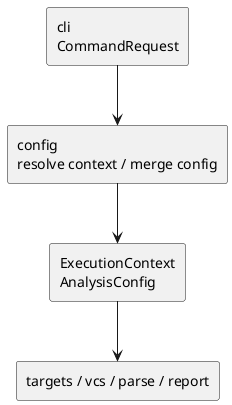

# iss-00008 Config Context Resolve — 設計（HOW）

## seam position
- upstream / prerequisite:
  - `iss-00007-model-execution-contracts`
- downstream / dependent:
  - `targets.explicit-target-normalize`
  - `vcs.diff-file-collect`
  - `targets.diff-target-normalize`
  - `parse.module-parse-and-index`
  - `report.artifact-summary-exit-policy`
- seam responsibility:
  - `CommandRequest` を `ExecutionContext` / `AnalysisConfig` に変換する唯一の owner。

### UML（module / dependency）

## インターフェース契約
- input:
  - `CommandRequest(process_cwd, cli_options)` where `config` consumes `cli_options.command`, `cli_options.cwd`, `cli_options.config`, `cli_options.project_root`, `cli_options.package_root`, `cli_options.scope_root`, `cli_options.output`, `cli_options.ignore`, `cli_options.depth`, `cli_options.strict`, `cli_options.target_python`, `cli_options.diff.current_state`, `cli_options.diff.include_untracked`
- output:
  - `ExecutionContext(execution_cwd, project_root, package_root, scope_root)`
  - `AnalysisConfig(ignore, output, depth, mode, target_python, diff.current_state, diff.include_untracked)`
  - 必要に応じた failure diagnostic
- invariant:
  - `execution_cwd` は `process_cwd` 基準で解決済み。
  - `project_root` は `CLI > config > config-file-dir > execution_cwd` で確定する。
  - `package_root` 未指定時は `project_root`、`scope_root` 未指定時は `package_root` を使い、その後に containment 済みとなる。
  - `AnalysisConfig.depth` は `null | int >= 0` に正規化される。
  - `AnalysisConfig.mode` は `warn | strict` のみを取り、`cli_options.strict=true` なら `strict`、それ以外は `warn` に写像する。
  - `AnalysisConfig.target_python` は `null | 3.<minor>` で CLI / config / default から確定し、semantic validation の owner は `config` とする。未指定時は `null`、不正値は `invalid_config_or_config_path` とする。
  - 後段 `parse` / `analyze` は `target_python` が非 `null` の場合だけ version-sensitive な syntax / typing interpretation に参照する。
  - `diff.current_state` と `diff.include_untracked` は `cli_options.command=diff` のときだけ意味を持ち、default / validation 済み。
  - config file 不在は default 継続、config invalidity は `invalid_config_or_config_path`、containment violation は `invalid_path_or_containment` を使う。

## 主要フロー
1. `CommandRequest` から raw `--cwd` を読み、`process_cwd` 基準で `execution_cwd` を解決する。
2. `--config` の有無と `--project-root` の有無に従い、canonical order で `.pyclassuml.toml` を探索する。
3. CLI option、config value、default value を `CLI > config > default` で merge する。
4. `relative_path_base=config|cwd` に従い、config 内の相対 path を解決する。
5. `project_root` を `CLI > config > config-file-dir > execution_cwd` で確定し、`package_root` / `scope_root` の default derivation と containment validation を行う。
6. 成功時は `ExecutionContext` / `AnalysisConfig` を返し、失敗時は `invalid_config_or_config_path` または `invalid_path_or_containment` を持つ hard failure diagnostic を返す。

## data / DTO handoff
- to `targets`:
  - `execution_cwd` は CLI 相対 explicit input の解決基準。
  - `project_root` は ignore 評価と diff 文脈の基準。
  - `scope_root` は seed filtering の境界。
- to `vcs`:
  - `project_root` と diff option が Git 読み取りの前提。
- to `parse` / `report`:
  - `package_root`, `scope_root`, `output`, `mode` が downstream contract の前提。

## テスト戦略
- Unit:
  - `process_cwd` 基準の `--cwd` resolve。
  - config discovery order。
  - `CLI > config > default` merge。
  - `relative_path_base=config|cwd`。
  - config file directory fallback `project_root`。
- Integration:
  - `CommandRequest -> ExecutionContext / AnalysisConfig` の handoff。
  - invalid containment / invalid config / unresolved path の hard failure。
- Verification:
  - initiative `plan.md` の canonical verification に従い、config discovery scenario と failure scenario を evidence にする。

## non-goals
- explicit target / diff target の seed normalization。
- Git diff 実行。
- strict / warn の最終 exit code 決定。

## リスク / 注意点
- `project_root` fallback を曖昧にすると ignore / VCS / output path 基準がずれる。
- `relative_path_base` を `config` seam 以外で解釈すると path semantics の正本が崩れる。
