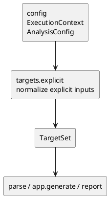

# iss-00009 Targets Explicit Target Normalize — 設計（HOW）

## seam position
- upstream / prerequisite:
  - `iss-00008-config-context-resolve`
- downstream / dependent:
  - `parse.module-parse-and-index`
  - `app.generate-wiring`
  - `report.artifact-summary-exit-policy`
- seam responsibility:
  - explicit input を `TargetSet(seed_files, observations)` に収束させる。

### UML（module / dependency）

## インターフェース契約
- input:
  - explicit inputs from `CommandRequest.cli_options.generate.targets[]`
  - `ExecutionContext` のうち `execution_cwd`, `project_root`, `scope_root`
  - `AnalysisConfig` のうち `ignore`
- output:
  - `TargetSet(seed_files, observations)`
  - ignore 件数と zero-seed / scope outside failure diagnostic
- invariant:
  - relative explicit input は `execution_cwd` 基準で解決される。
  - ignore 評価は `project_root` 相対で行う。
  - `seed_files` は unique で scope 内の Python source file に限る。
  - `TargetSet.observations.ignored_seed_candidate_count` は seed 候補から ignore で除外された件数を carry し、`diff_scope_excluded_count` は `0` を入れる。

## 主要フロー
1. explicit input を `execution_cwd` 基準で file / glob / dir として解釈する。
2. dir / glob を file 集合へ展開し、Python source file 以外は seed candidate から除外する。
3. `project_root` 相対で default ignore と user ignore を適用する。
4. 残った file 集合を dedupe して `TargetSet.seed_files` に格納し、ignore 件数を `TargetSet.observations` に記録する。
5. scope 外 input が検出された場合は `generate_scope_violation` を持つ hard failure とする。
6. seed_files が 0 件なら `generate_zero_target_after_normalize` を持つ zero-seed hard failure とし、empty `TargetSet` を success path に流さない。

## data / DTO handoff
- from `config`:
  - `execution_cwd` は path 解釈の基準。
  - `project_root` は ignore 判定の基準。
  - `scope_root` は inclusion boundary。
- to `parse`:
  - `TargetSet.seed_files` は command-neutral な seed list。
  - `parse` は `TargetSet.observations` を解釈しない。
- to `app.generate-wiring`:
  - `app.generate-wiring` が original `TargetSet.observations` を保持したまま `report` へ handoff する。
- to `report`:
  - `TargetSet.observations.ignored_seed_candidate_count` と failure diagnostic 素材を carry する。

## テスト戦略
- Unit:
  - file / glob / dir input の normalize。
  - dedupe。
  - default ignore / user ignore。
  - scope outside fail。
- Integration:
  - `ExecutionContext` の `execution_cwd` / `project_root` / `scope_root` を消費した normalize flow。
- Verification:
  - initiative `plan.md` の canonical verification に従い、file + glob + dir、dedupe、ignore、scope outside fail を evidence にする。

## non-goals
- diff 起点の normalize。
- dependency traversal 中の ignore 適用。
- syntax error や import 解決 failure の扱い。

## リスク / 注意点
- ignore を `execution_cwd` 基準で評価すると initiative requirement とずれる。
- scope outside を warning 継続にすると `generate` contract が壊れる。
