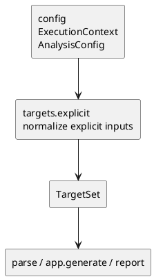

# iss-00009 Targets Explicit Target Normalize — 設計（HOW）

## seam position
- upstream / prerequisite:
  - `iss-00008-config-context-resolve`
- downstream / dependent:
  - `parse.module-parse-and-index`
  - `app.generate-wiring`
  - `report.artifact-summary-exit-policy`
- seam responsibility:
  - explicit input を `TargetSet(seed_files, observations)` に収束させる。

### UML（module / dependency）


## インターフェース契約
- input:
  - explicit inputs from `CommandRequest.cli_options.generate.targets[]`
  - `ExecutionContext` のうち `execution_cwd`, `project_root`, `scope_root`
  - `AnalysisConfig` のうち `ignore`
- output:
  - `TargetNormalization(target_set, diagnostics)`
  - success:
    - `target_set: TargetSet(seed_files, observations)`
    - `diagnostics: tuple[Diagnostic, ...]`
  - failure:
    - `target_set: None`
    - `diagnostics: tuple[Diagnostic, ...]` with at least one `DiagnosticSeverity.ERROR`
  - `TargetNormalization` は `targets` seam-local result であり、shared model DTO には追加しない。
- invariant:
  - relative explicit input は `execution_cwd` 基準で解決される。
  - ignore 評価は `project_root` 相対で行う。
  - `seed_files` は unique で scope 内の Python source file に限る。
  - `seed_files` は resolved absolute `Path` の昇順で deterministic に返す。
  - `TargetSet.observations.ignored_seed_candidate_count` は seed 候補から ignore で除外された件数を carry し、`diff_scope_excluded_count` は `0` を入れる。

### explicit input rules
- file:
  - existing file の場合、suffix が `.py` のものだけ seed candidate とする。
  - non-Python file は failure ではなく seed candidate から除外する。
- dir:
  - existing directory の場合、`**/*.py` を再帰的に展開する。
  - `__init__.py` も通常の Python source file として含める。
- glob:
  - input string に glob metacharacter `*`, `?`, `[` が含まれる場合は glob として扱う。
  - relative glob は `execution_cwd` 基準で解釈する。
  - glob 展開結果が 0 件でも即 failure にはせず、全 input を normalize した後に zero-seed 判定する。
- invalid / missing path:
  - glob でない input が existing file / directory のどちらでもない場合は seed candidate 0 件として扱い、最終的に zero-seed 判定に委ねる。
  - path resolution failure は missing path とは分け、`generate_scope_violation` の hard failure diagnostic として扱う。

### ignore rules
- default ignore canonical set:
  - `.venv/**`
  - `venv/**`
  - `**/__pycache__/**`
  - `site-packages/**`
- user ignore:
  - `AnalysisConfig.ignore` を default ignore に追加する。
  - user ignore は `project_root` relative glob として評価する。
  - `*` は path segment 内だけに一致し、`**` は directory をまたいで一致する。
- ignore target:
  - ignore は seed candidates に適用する。
  - dependency traversal candidates はこの issue では扱わない。

### scope / failure rules
- scope outside:
  - file input が existing file の場合、suffix に関係なく resolved file path が `scope_root` 配下または同一であることを先に検証する。
  - dir input が existing directory の場合、resolved directory path が `scope_root` 配下または同一であることを展開前に検証する。
  - glob input の展開結果は、Python filtering 前に各 resolved path が `scope_root` 配下または同一であることを検証する。
  - scope validation は Python filtering / ignore filtering / zero-seed 判定より前に行う。scope 外 path は non-Python や ignore 対象でも `generate_scope_violation` が勝つ。
  - failure diagnostic は `origin_seam=targets`, `severity=error`, `recoverability=fatal`, `failure_reason=generate_scope_violation`。
- zero seed:
  - all explicit inputs の展開、Python file filtering、ignore 適用後に seed が 0 件なら `generate_zero_target_after_normalize` hard failure とする。
  - failure diagnostic は `origin_seam=targets`, `severity=error`, `recoverability=fatal`, `failure_reason=generate_zero_target_after_normalize`。
  - empty `TargetSet` は success path に返さない。

## 主要フロー
1. explicit input を `execution_cwd` 基準で file / glob / dir として解釈する。
2. existing file / directory と glob 展開結果に scope validation を適用する。scope 外 path が 1 件でもあれば `generate_scope_violation` を持つ hard failure とする。
3. dir / glob を file 集合へ展開し、Python source file 以外は seed candidate から除外する。
4. `project_root` 相対で default ignore と user ignore を適用する。
5. 残った Python seed candidate 集合を dedupe して `TargetSet.seed_files` に格納し、ignore 件数を `TargetSet.observations` に記録する。
6. seed_files が 0 件なら `generate_zero_target_after_normalize` を持つ zero-seed hard failure とし、empty `TargetSet` を success path に流さない。

## ディレクトリ / ファイル変更計画
```text
src/
  pyclassuml/
    targets/
      __init__.py
      explicit.py
tests/
  targets/
    test_explicit_target_normalize.py
```

- `src/pyclassuml/targets/explicit.py`:
  - `TargetNormalization` seam-local result。
  - `normalize_explicit_targets(request: CommandRequest, context: ExecutionContext, config: AnalysisConfig) -> TargetNormalization`。
  - explicit input expansion、ignore evaluation、scope validation、dedupe / ordering。
- `src/pyclassuml/targets/__init__.py`:
  - `TargetNormalization` と `normalize_explicit_targets` を re-export。
- `tests/targets/test_explicit_target_normalize.py`:
  - tmp project fixture で file / glob / dir / ignore / scope / zero-seed を観測する。

## data / DTO handoff
- from `config`:
  - `execution_cwd` は path 解釈の基準。
  - `project_root` は ignore 判定の基準。
  - `scope_root` は inclusion boundary。
- to `parse`:
  - `TargetSet.seed_files` は command-neutral な seed list。
  - `parse` は `TargetSet.observations` を解釈しない。
- to `app.generate-wiring`:
  - `app.generate-wiring` が original `TargetSet.observations` を保持したまま `report` へ handoff する。
- to `report`:
  - `TargetSet.observations.ignored_seed_candidate_count` と failure diagnostic 素材を carry する。

## テスト戦略
- Unit:
  - file / glob / dir input の normalize。
  - dedupe。
  - default ignore / user ignore。
  - scope outside fail。
- Integration:
  - `ExecutionContext` の `execution_cwd` / `project_root` / `scope_root` を消費した normalize flow。
- Verification:
  - initiative `plan.md` の canonical verification に従い、file + glob + dir、dedupe、ignore、scope outside fail を evidence にする。

## non-goals
- diff 起点の normalize。
- dependency traversal 中の ignore 適用。
- syntax error や import 解決 failure の扱い。

## リスク / 注意点
- ignore を `execution_cwd` 基準で評価すると initiative requirement とずれる。
- scope outside を warning 継続にすると `generate` contract が壊れる。
