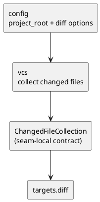

# iss-00010 VCS Diff File Collect — 設計（HOW）

## seam position
- upstream / prerequisite:
  - `iss-00007-model-execution-contracts`
  - `iss-00008-config-context-resolve`
- downstream / dependent:
  - `targets.diff-target-normalize`
  - `app.diff-wiring`
- seam responsibility:
  - Git diff から changed files を収集する。

### UML（module / dependency）


## インターフェース契約
- input:
  - `ExecutionContext` のうち `project_root`
  - `AnalysisConfig` のうち `diff.current_state`, `diff.include_untracked`
  - `CommandRequest.cli_options.diff.base_ref`
- output:
  - `VcsDiffCollection(collection, diagnostics)`
  - success:
    - `collection: ChangedFileCollection`
    - `diagnostics: tuple[Diagnostic, ...]`
  - failure:
    - `collection: None`
    - `diagnostics: tuple[Diagnostic, ...]` with at least one `DiagnosticSeverity.ERROR`
  - invalid base / Git read failure / no-op warning の diagnostics
  - `VcsDiffCollection`, `ChangedFileCollection`, `ChangedFileEntry` は `vcs` seam-local result であり、shared model DTO には追加しない。
- invariant:
  - `ChangedFileCollection.entries[*].current_project_relative_path` はすべて `project_root` relative の正規化済み path とする。
  - `ChangedFileCollection.entries` は `current_project_relative_path` 基準で unique かつ stable order とする。
  - `ChangedFileCollection.entries[*].change_kind` は `added | modified | renamed` のみを許可し、working-tree + `include_untracked=true` で含めた untracked file は `added` として表現する。delete-only file は含めない。
  - rename は移動後の current-existing side のみを 1 entry として表現し、必要な場合だけ `previous_project_relative_path` を optional で持つ。
  - `current_state=head` + `include_untracked=true` では changed-file collection に untracked を入れず、warning を返す。

### git command contract
- base validation:
  - `git -C <project_root> rev-parse --verify <base_ref>` が成功することを確認する。
  - 失敗時は `vcs_read_failure` hard failure とする。
- `current_state=working-tree`:
  - tracked changes は `git -C <project_root> diff --name-status -z --find-renames --relative <base_ref> -- .` で取得する。
  - `include_untracked=true` の場合は `git -C <project_root> ls-files -z --others --exclude-standard -- .` を追加で取得し、`added` として扱う。
  - `include_untracked=false` の場合は untracked を含めない。
- `current_state=head`:
  - tracked changes は `git -C <project_root> diff --name-status -z --find-renames --relative <base_ref> HEAD -- .` で取得する。
  - `include_untracked=true` でも untracked は含めず、`DiagnosticSeverity.WARNING`, `OriginSeam.VCS`, `Recoverability.RECOVERABLE` の no-op warning を 1 件返す。
- command failure:
  - 上記 Git command が失敗した場合は `vcs_read_failure` hard failure とする。

### name-status parsing rules
- Git path encoding:
  - `git diff` / `git ls-files` は NUL-delimited (`-z`) output を使う。
  - path は UTF-8 decode し、decode failure は `vcs_read_failure` hard failure とする。
  - `project_root` が Git worktree root より下位でも、Git output は `project_root` relative に制約し、`project_root` 外の changed files は収集しない。scope filtering はしないが、project boundary filtering は `vcs` の path basis contract として行う。
- `A` / `M` / `T` は `added` / `modified` / `modified` として扱う。
- NUL-delimited `Rxxx, old, new` は `renamed` として current path に `new`、previous path に `old` を入れる。
- `D` は delete-only file として collection から除外する。
- other status は Git read failure ではなく unsupported changed-file status として `vcs_read_failure` hard failure にする。
- path は Git output の `/` 区切り `project_root` relative string として保持する。
- duplicate path は current path 기준で dedupe し、stable order は `current_project_relative_path` 昇順とする。

### diagnostic code contract
- invalid base:
  - code: `invalid_base_ref`
  - severity/origin/recoverability/failure_reason: `error` / `vcs` / `fatal` / `vcs_read_failure`
- git command failure:
  - code: `git_diff_read_failure`
  - severity/origin/recoverability/failure_reason: `error` / `vcs` / `fatal` / `vcs_read_failure`
- unsupported name-status or path decode failure:
  - code: `git_diff_parse_failure`
  - severity/origin/recoverability/failure_reason: `error` / `vcs` / `fatal` / `vcs_read_failure`
- head + include_untracked no-op:
  - code: `head_untracked_noop`
  - severity/origin/recoverability/failure_reason: `warning` / `vcs` / `recoverable` / `None`

### seam-local collection contract
| field | type | required | meaning |
| --- | --- | --- | --- |
| `ChangedFileCollection.entries` | `ChangedFileEntry[]` | yes | scope filtering 前の raw changed files |
| `ChangedFileEntry.current_project_relative_path` | `string` | yes | `project_root` relative / normalized path |
| `ChangedFileEntry.change_kind` | `added \| modified \| renamed` | yes | current side に残る changed-file kind。included untracked は `added` として表現する |
| `ChangedFileEntry.previous_project_relative_path` | `string \| null` | no | rename 時だけ旧 path を保持する |

## 主要フロー
1. `project_root` と base ref を使って比較対象を決める。
2. `current_state` に応じて `working-tree` か `head` を比較対象の current side に選ぶ。
3. `include_untracked` に応じて untracked を収集対象に含める。
4. `current_state=head` のときは untracked を無視し、warning を追加する。
5. delete-only file は収集結果から除外し、rename は current-existing side の entry に正規化する。
6. 成功時は `ChangedFileCollection` を返し、失敗時は `vcs_read_failure` を持つ failure diagnostic を返す。

## ディレクトリ / ファイル変更計画
```text
src/
  pyclassuml/
    vcs/
      __init__.py
      diff_collect.py
tests/
  vcs/
    test_diff_file_collect.py
```

- `src/pyclassuml/vcs/diff_collect.py`:
  - `VcsDiffCollection`, `ChangedFileCollection`, `ChangedFileEntry` seam-local result。
  - `collect_diff_files(request: CommandRequest, context: ExecutionContext, config: AnalysisConfig) -> VcsDiffCollection`。
  - Git command execution, name-status parsing, untracked handling, warning / failure diagnostics。
- `src/pyclassuml/vcs/__init__.py`:
  - public surface を re-export。
- `tests/vcs/test_diff_file_collect.py`:
  - temporary Git repository で working-tree / head / untracked / rename / failure scenarios を観測する。

## data / DTO handoff
- from `config`:
  - `project_root` は Git 読み取りの anchor。
  - diff option は収集 matrix の入力。
- to `targets.diff-target-normalize`:
  - `ChangedFileCollection` は scope filtering 未適用の raw changed paths であり、path basis は常に `project_root` relative。
  - warning / failure diagnostic をそのまま carry する。
- note:
  - changed-file collection は seam-local handoff とし、initiative shared DTO には昇格させない。

## テスト戦略
- Unit:
  - `working-tree` / `head` matrix。
  - untracked on/off。
  - head + untracked no-op warning。
  - invalid `--base <ref>`。
- Integration:
  - `config` が確定した `project_root` と diff option を消費して changed-file collection を返すこと。
- Verification:
  - initiative `plan.md` の canonical verification に従い、matrix scenario と invalid base / Git read failure scenario を evidence にする。

## non-goals
- scope filtering。
- `TargetSet` 生成。
- strict / warn の failure 昇格判定。

## リスク / 注意点
- `vcs` が scope を知り始めると `targets.diff-target-normalize` owner を侵食する。
- changed-file collection を shared DTO に早まって昇格させると M1 の contract 面積が広がりすぎる。
