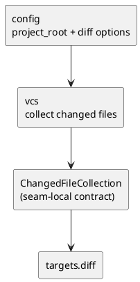

# iss-00010 VCS Diff File Collect — 設計（HOW）

## seam position
- upstream / prerequisite:
  - `iss-00007-model-execution-contracts`
  - `iss-00008-config-context-resolve`
- downstream / dependent:
  - `targets.diff-target-normalize`
  - `app.diff-wiring`
- seam responsibility:
  - Git diff から changed files を収集する。

### UML（module / dependency）

## インターフェース契約
- input:
  - `ExecutionContext` のうち `project_root`
  - `AnalysisConfig` のうち `diff.current_state`, `diff.include_untracked`
  - `CommandRequest.cli_options.diff.base_ref`
- output:
  - `targets.diff-target-normalize` が消費する seam-local `ChangedFileCollection`
  - invalid base / Git read failure / no-op warning の diagnostics
- invariant:
  - `ChangedFileCollection.entries[*].current_project_relative_path` はすべて `project_root` relative の正規化済み path とする。
  - `ChangedFileCollection.entries` は `current_project_relative_path` 基準で unique かつ stable order とする。
  - `ChangedFileCollection.entries[*].change_kind` は `added | modified | renamed` のみを許可し、working-tree + `include_untracked=true` で含めた untracked file は `added` として表現する。delete-only file は含めない。
  - rename は移動後の current-existing side のみを 1 entry として表現し、必要な場合だけ `previous_project_relative_path` を optional で持つ。
  - `current_state=head` + `include_untracked=true` では changed-file collection に untracked を入れず、warning を返す。

### seam-local collection contract
| field | type | required | meaning |
| --- | --- | --- | --- |
| `ChangedFileCollection.entries` | `ChangedFileEntry[]` | yes | scope filtering 前の raw changed files |
| `ChangedFileEntry.current_project_relative_path` | `string` | yes | `project_root` relative / normalized path |
| `ChangedFileEntry.change_kind` | `added \| modified \| renamed` | yes | current side に残る changed-file kind。included untracked は `added` として表現する |
| `ChangedFileEntry.previous_project_relative_path` | `string \| null` | no | rename 時だけ旧 path を保持する |

## 主要フロー
1. `project_root` と base ref を使って比較対象を決める。
2. `current_state` に応じて `working-tree` か `head` を比較対象の current side に選ぶ。
3. `include_untracked` に応じて untracked を収集対象に含める。
4. `current_state=head` のときは untracked を無視し、warning を追加する。
5. delete-only file は収集結果から除外し、rename は current-existing side の entry に正規化する。
6. 成功時は `ChangedFileCollection` を返し、失敗時は `vcs_read_failure` を持つ failure diagnostic を返す。

## data / DTO handoff
- from `config`:
  - `project_root` は Git 読み取りの anchor。
  - diff option は収集 matrix の入力。
- to `targets.diff-target-normalize`:
  - `ChangedFileCollection` は scope filtering 未適用の raw changed paths であり、path basis は常に `project_root` relative。
  - warning / failure diagnostic をそのまま carry する。
- note:
  - changed-file collection は seam-local handoff とし、initiative shared DTO には昇格させない。

## テスト戦略
- Unit:
  - `working-tree` / `head` matrix。
  - untracked on/off。
  - head + untracked no-op warning。
  - invalid `--base <ref>`。
- Integration:
  - `config` が確定した `project_root` と diff option を消費して changed-file collection を返すこと。
- Verification:
  - initiative `plan.md` の canonical verification に従い、matrix scenario と invalid base / Git read failure scenario を evidence にする。

## non-goals
- scope filtering。
- `TargetSet` 生成。
- strict / warn の failure 昇格判定。

## リスク / 注意点
- `vcs` が scope を知り始めると `targets.diff-target-normalize` owner を侵食する。
- changed-file collection を shared DTO に早まって昇格させると M1 の contract 面積が広がりすぎる。
