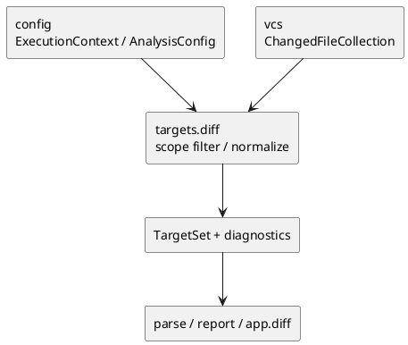

# iss-00011 Targets Diff Target Normalize — 設計（HOW）

## seam position
- upstream / prerequisite:
  - `iss-00008-config-context-resolve`
  - `iss-00010-vcs-diff-file-collect`
- downstream / dependent:
  - `parse.module-parse-and-index`
  - `report.artifact-summary-exit-policy`
  - `app.diff-wiring`
- seam responsibility:
  - `ChangedFileCollection` を `TargetSet(seed_files, observations)` と exclusion / failure handoff に変換する。

### UML（module / dependency）

## インターフェース契約
- input:
  - `ChangedFileCollection` from `vcs`
  - `ExecutionContext` のうち `scope_root`, `project_root`
  - `AnalysisConfig` のうち `ignore`, `mode`
- output:
  - `TargetSet(seed_files, observations)`
  - scope outside exclusion diagnostics / counters
  - `diff_zero_target_after_scope_filter` を持つ zero-target failure diagnostic
- invariant:
  - `TargetSet.seed_files` は scope 内の Python source file のみ。
  - `TargetSet.observations.ignored_seed_candidate_count` は changed-file seed 候補から ignore で除外された件数を carry する。
  - `TargetSet.observations.diff_scope_excluded_count` は scope 外 changed file の件数を carry する。
  - diff changed file が ignore で落ちた場合も、可観測性は generic `ignored_seed_candidate_count` に統合し、diff 専用 counter へは分けない。
  - exclusion は drop ではなく downstream が観測できる形で carry する。
  - zero-target fail では empty `TargetSet` を success として返さない。
  - `ChangedFileCollection.entries[*].current_project_relative_path` は `project_root` relative として解釈する。

## 主要フロー
1. `vcs` から受け取った `ChangedFileCollection.entries` を scope 判定に掛ける。
2. `project_root` 相対で default ignore と user ignore を changed-file seed 候補へ適用し、ignore 除外件数を `TargetSet.observations.ignored_seed_candidate_count` に記録する。
3. scope 内 file のうち Python source file だけを `current_project_relative_path` 基準で unique 化して `TargetSet.seed_files` に積む。
4. scope 外 file は exclusion diagnostics と `TargetSet.observations.diff_scope_excluded_count` として記録する。
5. seed_files が空なら `diff_zero_target_after_scope_filter` を持つ zero-target failure を返す。
6. success path では `TargetSet` と exclusion diagnostics を downstream へ渡す。

## data / DTO handoff
- from `vcs`:
  - `ChangedFileCollection` と no-op warning / failure diagnostics。
- from `config`:
  - `scope_root` が filtering の authoritative boundary。
  - `ignore` が changed-file seed 候補の `project_root` 相対 filter の authoritative source。
  - `mode` は downstream `report` が strict / warn を決めるために carry される。
- to downstream:
  - `parse` は command-neutral な `TargetSet` だけを見ればよい。
  - `parse` は `TargetSet.observations` を解釈しない。
  - `app.diff-wiring` が original `TargetSet.observations` を保持したまま `report` へ handoff する。
  - `report` は `TargetSet.observations.diff_scope_excluded_count` と zero-target failure reason を summary / exit policy の素材として使い、strict 昇格時には `strict_diff_scope_exclusion` を選べる。

## テスト戦略
- Unit:
  - scope outside exclusion。
  - zero-target fail。
  - duplicate changed file の unique 化。
  - upstream diagnostics carry。
- Integration:
  - `vcs -> targets.diff -> TargetSet` flow。
  - exclusion diagnostics が `report` で利用できる形で残ること。
- Verification:
  - initiative `plan.md` の canonical verification に従い、scope outside exclusion と zero-target fail を evidence にする。

## non-goals
- Git diff 再収集。
- explicit target normalization。
- `strict` / `warn` の最終 failure 昇格。

## リスク / 注意点
- exclusion を単に破棄すると strict mode で failure に昇格する素材が失われる。
- zero-target fail を `parse` 側へ送ると diff 前段契約が曖昧になる。
