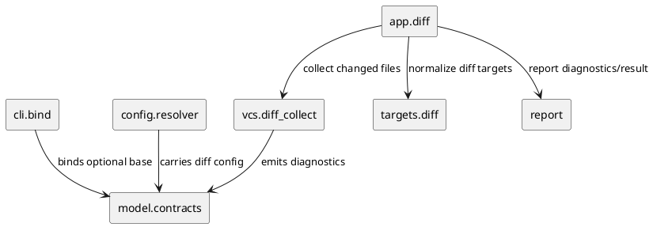

# iss-00036 Diff Default Branch Base — 設計（HOW）

## 親 Diagram 参照
- Epic:
  - `epic-00002-foundation-contracts`
- 再利用する決定:
  - `generate` / `diff` の差分は front-stage の `TargetSet` / changed-file collection までに閉じる。
  - `vcs` は Git 読み取り、`targets` は target normalize、`app` は orchestration transport を担う。

## 目的・制約
- 目的:
  - `pyclassuml diff` の省略時 UX を改善し、`--base` なしでも branch-start base から diff UML を生成する。
- 必須:
  - `--base` 指定時の後方互換性を維持する。
  - `--base` 未指定時に resolved base を決定し、既存 diff collection pipeline へ渡す。
- 禁止:
  - `--base <ref>` の意味を merge-base 比較へ変更しない。
  - Git metadata の書き換えや branch checkout を行わない。
- 前提:
  - branch-start は Git から完全には復元できないため、解決戦略は deterministic best effort とする。

## 既存実装 / 規約の理解
- 参照した実装 / docs:
  - `src/pyclassuml/cli/bind.py`: `diff_parser.add_argument("--base", required=True)`。
  - `src/pyclassuml/model/contracts.py`: `DiffOptions.base_ref` が non-empty string invariant。
  - `src/pyclassuml/vcs/diff_collect.py`: `collect_diff_files` が `base_ref` を取得し、`git diff <base>` / `git diff <base> HEAD` を実行する。
  - `README.md`: `diff --base <ref>` と `--current-state working-tree|head` のユーザー契約。
- 現状理解:
  - 既存 pipeline は「base ref を受け取った後」の処理が十分に分離されている。
  - 今回は base ref を任意入力から resolved base へ変換する front-stage の追加で閉じられる。
- 採用するパターン:
  - CLI bind では `base_ref` を optional にする。
  - model / vcs 層に explicit / resolved の区別を持たせ、Git diff 実行時には resolved base を使う。
  - base resolution diagnostics を downstream report に渡す。
- 採用しないもの:
  - `--branch-base` / `--merge-base` 追加。
  - upstream 必須化。
  - config 必須化。
  - GitHub PR base branch 参照。

## 採用方針 / トレードオフ
- 論点:
  - `pyclassuml diff` を失敗させず、かつ基準が曖昧なまま silently 動かさない。
- 選択肢:
  - A: `--base` 未指定時は upstream 必須。
  - B: `--base` 未指定時は config default base 必須。
  - C: `--base` 未指定時は best effort 解決し、最後は initial commit fallback。
- 決定:
  - C を採用する。
- 理由:
  - 外部 CLI として設定強制を避けられる。
  - upstream が feature branch tracking 先を指す問題を避けられる。
  - fallback の根拠を diagnostics / report に出せば、便利さと検証可能性を両立できる。

## 依存関係分析
- module 依存:
  - `cli.bind` -> `model.contracts` -> `config.resolver` -> `vcs.diff_collect` -> `targets.diff`.
- file 依存:
  - `src/pyclassuml/cli/bind.py`
  - `src/pyclassuml/model/contracts.py`
  - `src/pyclassuml/config/resolver.py`
  - `src/pyclassuml/vcs/diff_collect.py`
  - `src/pyclassuml/app/diff.py`
  - `src/pyclassuml/report/*`
  - `README.md`
  - relevant tests under `tests/cli`, `tests/model`, `tests/config`, `tests/vcs`, `tests/app`, `tests/report`
- 実装起点:
  - DTO / CLI bind の optional base contract を先に固定し、その後 `vcs` の base resolver を追加する。
- 順序への影響:
  - model / CLI tests を先に red 化し、vcs resolver tests、app/report integration、README の順に閉じる。

## Module Dependency Diagram


## Local Diagram Delta
- 変更する境界 / 責務 / 相互作用:
  - `vcs.diff_collect` に base resolution を追加し、Git 差分収集前に resolved base を決定する。
  - `cli.bind` は base 省略を usage error にしない。
  - `model.contracts` は `DiffOptions.base_ref` の optional 化、または explicit base と resolved base を分ける設計にする。

## インターフェース契約
- CLI:
  - `pyclassuml diff [options] [--base <ref>]`
  - `--base` 未指定は valid invocation。
- DiffOptions:
  - `base_ref` は `str | None` または空ではない optional value として扱う。
  - `--base` が CLI で指定されたかどうかを判定できること。
- VCS:
  - explicit base がある場合は `_verify_base_ref` 後、その ref を resolved base とする。
  - explicit base がない場合は deterministic resolver で base commit を返す。
  - resolved base は `git diff` と base blob read の双方に使う。
- Diagnostics:
  - resolution kind の候補:
    - `explicit_base`
    - `default_branch_merge_base`
    - `initial_commit_fallback`
  - initial fallback は warning、explicit / default branch merge-base は info 相当または report metadata とする。

## ディレクトリ / ファイル変更計画
```text
.
|-- src/
|   `-- pyclassuml/
|       |-- cli/bind.py             # 変更: diff --base optional
|       |-- model/contracts.py      # 変更: DiffOptions base contract
|       |-- config/resolver.py      # 変更: optional base と config merge の整合
|       |-- vcs/diff_collect.py     # 変更: branch-start base resolver
|       |-- app/diff.py             # 変更: resolved base diagnostics の transport
|       `-- report/                 # 必要時: summary/report metadata 表示
|-- tests/
|   |-- cli/test_bind.py
|   |-- model/test_contracts.py
|   |-- config/test_context_resolve.py
|   |-- vcs/test_diff_file_collect.py
|   |-- app/test_diff.py
|   `-- report/test_policy.py
`-- README.md                      # 変更: diff --base optional と省略時動作を文書化
```

## 要件 → 設計マッピング
- AC-001 -> `vcs.diff_collect` の default branch candidate merge-base resolver。
- AC-002 -> `cli.bind` / `model.contracts` の explicit base 後方互換と既存 vcs path。
- AC-003 -> initial commit fallback と warning diagnostic。
- AC-004 -> `DiffCurrentState.HEAD` path で resolved base を使う既存 `HEAD` diff。
- EC-001 -> no commit repository の fail-fast。
- EC-002 -> candidate iteration と fallback。
- EC-003 -> default branch 自身での fallback behavior。

## テスト戦略
- 単体:
  - CLI bind: `diff` が `--base` なしで bind できる。
  - model: optional base invariant と explicit base invariant。
  - vcs: default branch candidate, explicit base, initial commit fallback, no commit repository。
- 統合:
  - app diff: `pyclassuml diff` 相当の request が resolved base を使い、TargetSet 以降の pipeline に入る。
  - report: base resolution diagnostic / metadata が観測できる。
- E2E / manual:
  - 一時 Git repository で `main` から feature branch を作り、`pyclassuml diff` が branch diff 図を生成することを確認する。

## リスク / 移行 / ロールバック
- リスク:
  - default branch candidate の推定が利用者の意図と異なる可能性がある。
  - initial commit fallback は大きな diff になり得る。
- 緩和:
  - resolved base と resolution kind を出す。
  - 明示したい利用者には `--base <ref>` を従来どおり使えるようにする。
- ロールバック:
  - `--base` optional 化と resolver を戻せば、既存 `--base` 必須仕様へ戻せる。

## 未確定事項
- Q-001:
  - 質問: default branch candidate の固定順序。
  - 推奨案: `origin/HEAD`, `origin/main`, `origin/develop`, `main`, `develop`, `master`。
  - 影響範囲: resolver tests、README 文面。
