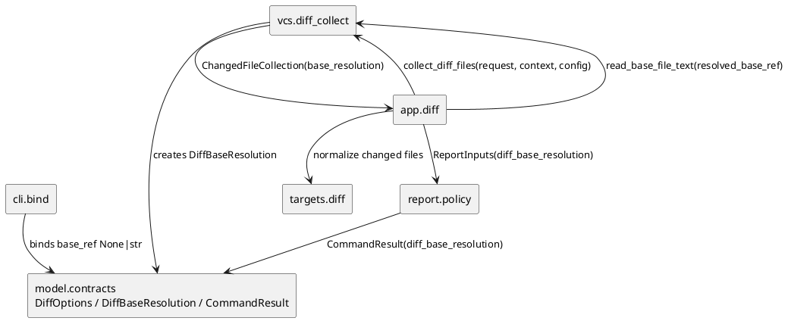
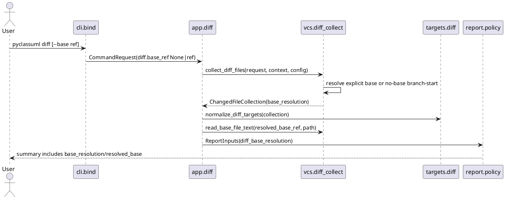
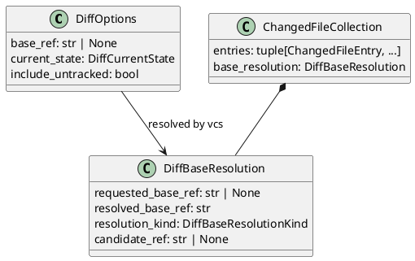

# iss-00036 Diff Default Branch Base — 設計（HOW）

## 親 Diagram 参照
- Epic:
  - `epic-00002-foundation-contracts`
- 関連 Issue:
  - `iss-00006-cli-request-bind-and-exit-contract`
  - `iss-00007-model-execution-contracts`
  - `iss-00008-config-context-resolve`
  - `iss-00010-vcs-diff-file-collect`
  - `iss-00011-targets-diff-target-normalize`
  - `iss-00021-app-diff-wiring`
- 再利用する決定:
  - CLI は raw option bind に留まり、project / Git state に基づく判断は後段 seam に残す。
  - `vcs` は Git 読み取りと changed-file collection を担い、scope filtering は `targets.diff-target-normalize` に残す。
  - `app.diff` は stage orchestration と transport に限定し、Git resolution policy や target semantics を再実装しない。
  - `report` は summary / stream / exit policy の owner であり、user-visible transcript はここで整える。

## 目的・制約
- 目的:
  - `pyclassuml diff` の no-base invocation を valid にし、VCS seam で resolved base を決めて既存 diff pipeline に接続する。
  - 明示 `--base <ref>` は従来互換で扱い、no-base 用の推定や fallback を混ぜない。
  - resolved base と resolution kind を、正常系でも warning 扱いにせず user-visible summary で確認できるようにする。
- 必須:
  - no-base と explicit base を CLI / DTO で区別できる。
  - app の base blob read と changed-file collection が同じ resolved base を使う。
  - no-base fallback は empty tree ではなく initial commit object を使う。
- 禁止:
  - `--base <ref>` の意味を merge-base / three-dot に変えない。
  - upstream / config default を必須にしない。
  - Git checkout、branch mutation、upstream mutation、target file mutation を行わない。
- 前提:
  - `DiagnosticSeverity` は `warning | error` だけなので、正常な resolved-base metadata を diagnostic に載せると clean success が warning-only success になる。
  - そのため正常な base resolution は diagnostic ではなく structured metadata として transport し、fallback / failure だけ diagnostics を使う。

## 既存実装 / 規約の理解
- 参照した実装 / docs:
  - `src/pyclassuml/cli/bind.py`: `--base` は現在 `required=True`。
  - `src/pyclassuml/model/contracts.py`: `DiffOptions.base_ref` は non-empty `str`。
  - `src/pyclassuml/vcs/diff_collect.py`: `collect_diff_files` が `request.cli_options.diff.base_ref` を読み、`git diff <base>` / `git diff <base> HEAD` を実行する。
  - `src/pyclassuml/app/diff.py`: base class inventory で `request.cli_options.diff.base_ref` を再利用して base blob を読む。
  - `src/pyclassuml/report/policy.py`: `ReportInputs` から summary text を生成し、diagnostics は summary に表示される。
- 現状理解:
  - `collect_diff_files` だけで resolved base を使っても、`app.diff` の base blob read が request の元 `base_ref` を読むため不整合になる。
  - `ChangedFileCollection` または `VcsDiffCollection` に resolved base metadata を載せ、app / report に transport する必要がある。
  - no-base が valid になると、既存 `DiffOptions.base_ref` の invariant と tests を更新する必要がある。
- 採用するパターン:
  - `DiffOptions.base_ref` を `str | None` に変更し、`None` を no-base invocation とする。
  - `vcs.diff_collect` に `DiffBaseResolution` を追加し、resolved base と resolution kind を持たせる。
  - `ChangedFileCollection` に `base_resolution` を持たせ、後段が同じ resolved base を参照できるようにする。
  - `ReportInputs` と `CommandResult` に diff base resolution metadata を任意で持たせ、machine-readable result と diff command summary の両方で観測できるようにする。
- 採用しないもの:
  - `--branch-base` / `--merge-base` / `--guess-upstream` 追加。
  - `origin/<current-branch>` upstream から base branch を推定すること。
  - normal no-base resolution を warning diagnostic にすること。
  - empty tree を fallback base にすること。

## 採用方針 / トレードオフ
- 論点 1: no-base の DTO 表現
  - 選択肢:
    - A: `base_ref=""` を no-base として扱う。
    - B: `base_ref: str | None` にし、`None` を no-base として扱う。
    - C: `DiffOptions` に mode enum を追加する。
  - 決定:
    - B を採用する。
  - 理由:
    - 空文字列は invalid explicit ref と混同しやすい。`None` なら no-base absence を明確に表せる。
- 論点 2: resolved base の表示
  - 選択肢:
    - A: すべて warning diagnostic にする。
    - B: fallback だけ warning diagnostic にし、正常解決は `CommandResult.diff_base_resolution` と report summary metadata にする。
    - C: report には出さず tests だけで検証する。
  - 決定:
    - B を採用する。
  - 理由:
    - 正常な no-base diff を warning-only success にせず、テストとプログラム利用者は structured result、CLI 利用者は summary で基点を確認できる。
- 論点 3: fallback base
  - 選択肢:
    - A: initial commit object。
    - B: empty tree。
  - 決定:
    - A を採用する。
  - 理由:
    - requirement は「最初の commit から現在までの差分」を求めており、既存 `git diff <base>` contract と整合する。

## 依存関係分析
- module 依存:
  - `cli.bind` は `DiffOptions(base_ref=None|str)` を構築するだけで、Git state を見ない。
  - `model.contracts` は optional base と base resolution metadata の immutable DTO を定義する。
  - `vcs.diff_collect` は explicit base validation / no-base resolution / changed-file collection を担う。
  - `app.diff` は `VcsDiffCollection.collection.base_resolution.resolved_base_ref` を base classification に渡す。
  - `report.policy` は `ReportInputs.diff_base_resolution` を `CommandResult.diff_base_resolution` に載せ、summary text にも表示する。
- function 依存:
  - `run_diff` -> `collect_diff_files` -> `normalize_diff_targets` -> `parse_target_set` -> analyze/render/report。
  - `run_diff` -> base classification helper -> `read_base_file_text`。ここも resolved base を使う。
- file 依存:
  - `src/pyclassuml/cli/bind.py`
  - `src/pyclassuml/model/contracts.py`
  - `src/pyclassuml/vcs/diff_collect.py`
  - `src/pyclassuml/app/diff.py`
  - `src/pyclassuml/report/policy.py`
  - `README.md`
  - `tests/cli/test_bind.py`
  - `tests/model/test_contracts.py`
  - `tests/vcs/test_diff_file_collect.py`
  - `tests/app/test_diff.py`
  - `tests/report/test_policy.py`
  - `tests/cli/test_main.py`
- 上流 / 前提:
  - `resolve_context` が `context.vcs_root` / `context.project_root` を確定する。
  - `DiffCurrentState` / `include_untracked` は既存 config merge 結果を使う。
- 下流 / 依存先:
  - `targets.diff-target-normalize` は changed files と upstream diagnostics をそのまま受け取る。
  - `report` は diagnostics / metadata を summary に整える。
- 実装起点:
  - DTO / CLI bind の optional base contractを先に固定し、VCS resolver、app/report integration の順で進める。

## Module Dependency Diagram
- タイトル:
  - no-base diff resolved-base transport
- 答える問い:
  - resolved base をどこで決め、どの stage が同じ base を使い続けるか。
- 範囲:
  - CLI bind、model DTO、VCS collect、app diff classification、report summary。
- 含めない詳細:
  - parse/analyze/render の内部処理、全 call graph、Git diff parser の詳細。
- 更新条件:
  - resolved base owner、transport DTO、report表示 owner が変わるとき。



## Local Diagram Delta
- 変更する境界 / 責務 / 相互作用:
  - `vcs.diff_collect` が resolved base の owner になる。
  - `app.diff` は request の raw `base_ref` を base blob read に使わず、VCS collection から受け取った resolved base を使う。
  - `report.policy` は diff base resolution metadata を user-visible summary に表示する。

## インターフェース契約
- CLI:
  - `pyclassuml diff [options] [--base <ref>]`
  - `--base` が指定された場合は non-empty string として bind する。
  - `--base` が指定されない場合は `DiffOptions.base_ref=None` として bind する。
- Model:
  - `DiffOptions.base_ref: str | None`
    - `None`: no-base invocation。
    - non-empty `str`: explicit base。
    - empty string は invalid DTO。
  - `DiffBaseResolution` を追加する。
    - `requested_base_ref: str | None`
    - `resolved_base_ref: str`
    - `resolution_kind: explicit_base | default_branch_merge_base | initial_commit_fallback`
    - `candidate_ref: str | None`
  - `CommandResult` に `diff_base_resolution: DiffBaseResolution | None = None` を追加する。
    - `diff` command では collection が成功した場合に値を持つ。
    - config / VCS failure など collection 前または collection failure では `None` を許容する。
    - `generate` command では常に `None`。
  - `src/pyclassuml/model/__init__.py` は `DiffBaseResolution` と必要なら `DiffBaseResolutionKind` を export する。
- VCS:
  - explicit base:
    - `_verify_base_ref(vcs_root, base_ref)` を通し、`resolution_kind=explicit_base` とする。
    - invalid explicit base は既存 `invalid_base_ref` / `vcs_read_failure` の failure path とし、fallback しない。
  - no-base:
    - current branch 名を `git symbolic-ref --quiet --short HEAD` で読める場合は読む。detached HEAD では current branch 名なしとして扱う。
    - default branch self 判定は次の優先順位で行う。
      - `refs/remotes/origin/HEAD` が解決できる場合は、その target から `refs/remotes/origin/` または `origin/` prefix だけを取り除いた full branch name を canonical default branch name とする。`release/main` のような slashful branch name は `main` に丸めない。current branch 名がこの full branch name と一致する場合だけ default branch 自身として扱い、candidate probing を行わず initial commit fallback へ直行する。
      - `origin/HEAD` が解決できない場合だけ、`main`、`develop`、`master` を conventional default branch names として扱う。current branch 名がこのいずれかに一致する場合は default branch 自身として扱い、candidate probing を行わず initial commit fallback へ直行する。
      - 例: `origin/HEAD -> origin/main` の repository で current branch が `develop` の場合、`develop` という名前だけでは default branch 自身と判定しない。
      - 例: current branch が `trunk` で、`origin/HEAD -> origin/trunk` を検出できる場合は default branch 自身として扱う。
    - default branch candidate を決定的順序で試し、`git merge-base <candidate> HEAD` が成功した最初の commit を resolved base にする。
    - feature branch が default branch candidate と同じ commit を指すだけの場合は default branch 自身とは判定しない。branch name が default branch candidate を表す場合だけ initial commit fallback に直行する。
    - candidate が全て使えない場合は `git rev-list --max-parents=0 HEAD` の最初の commit を resolved base にする。
    - commit が存在しない repository は `git_diff_read_failure` 相当で fail-fast する。
  - default branch candidate の順序:
    - `refs/remotes/origin/HEAD` が指す remote branch。
    - `origin/main`
    - `origin/develop`
    - `origin/master`
    - `main`
    - `develop`
    - `master`
    - 存在しない candidate は skip する。
    - duplicate candidate は最初の出現だけ扱う。
- App:
  - changed file collection、line range collection、base class inventory の全てで `DiffBaseResolution.resolved_base_ref` を使う。
  - request の `base_ref` は explicit/no-base 判定以外の downstream base read に使わない。
  - Report:
  - `ReportInputs.diff_base_resolution: DiffBaseResolution | None` を追加する。
  - `write_report` は `CommandResult.diff_base_resolution` に `ReportInputs.diff_base_resolution` をそのまま載せる。
  - diff summary に少なくとも次を表示する。
    - `base_resolution: <resolution_kind>`
    - `resolved_base: <resolved_base_ref>`
    - `requested_base: <requested_base_ref|none>`
    - `base_candidate: <candidate_ref|none>`
  - `initial_commit_fallback` は `DiagnosticSeverity.WARNING` かつ `Recoverability.DEGRADED_OUTPUT` の warning diagnostic も追加し、summary outcome は既存 report policy に従って `degraded_success` になる。
    - diagnostic code は `diff_base_initial_commit_fallback`。
    - message は、no-base diff の branch-start base を default branch candidates から解決できなかったこと、initial commit object を resolved base に使ったこと、必要なら `--base <ref>` で明示できることを含む。
  - `default_branch_merge_base` は normal metadata として表示し、warning_count を増やさない。

## Sequence Delta
- 変更する相互作用:
  - `collect_diff_files` の先頭で base resolution を行う。
  - resolved base を collection と report に transport する。
- UML:



## Domain Model Delta
- 親 model 参照:
  - `iss-00007-model-execution-contracts`
- value object 変更:
  - `DiffOptions.base_ref` を optional にする。
  - `DiffBaseResolution` を追加する。
- 不変条件の変更:
  - no-base は `None` で表現し、空文字列を許容しない。
  - `DiffBaseResolution.resolved_base_ref` は non-empty string。
  - `resolution_kind` は固定 enum 相当の string set に限定する。
- UML:



## ディレクトリ / ファイル変更計画
```text
.
|-- src/
|   `-- pyclassuml/
|       |-- cli/
|       |   `-- bind.py              # 変更: diff --base を optional bind
|       |-- model/
|       |   |-- contracts.py         # 変更: optional base、DiffBaseResolution DTO、CommandResult field
|       |   `-- __init__.py          # 変更: 新 DTO を pyclassuml.model から export
|       |-- vcs/
|       |   `-- diff_collect.py      # 変更: explicit/no-base resolver と resolved-base transport
|       |-- app/
|       |   `-- diff.py              # 変更: base blob read / report input に resolved base を使用
|       `-- report/
|           `-- policy.py            # 変更: diff base resolution summary
|-- tests/
|   |-- cli/
|   |   |-- test_bind.py             # 変更: no-base bind / explicit compatibility
|   |   `-- test_main.py             # 変更: console script level transcript
|   |-- model/
|   |   `-- test_contracts.py        # 変更: DTO invariant
|   |-- vcs/
|   |   `-- test_diff_file_collect.py # 変更: resolver / fallback / failure
|   |-- app/
|   |   `-- test_diff.py             # 変更: resolved base transport and head semantics
|   `-- report/
|       `-- test_policy.py           # 変更: summary fields
`-- README.md                        # 変更: diff --base optional と no-base behavior
```

## 要件 → 設計マッピング
- AC-001 -> VCS no-base default branch merge-base resolver、CommandResult metadata、report summary metadata。
- AC-002 -> `DiffOptions.base_ref` optional contract、explicit base validation、no fallback on invalid explicit base。
- AC-003 -> initial commit fallback、fallback warning diagnostic、CommandResult metadata、summary metadata。
- AC-004 -> `current_state=head` path で resolved base を使う tracked diff。
- AC-005 -> explicit invalid base path keeps `invalid_base_ref` / `vcs_read_failure`。
- EC-001 -> no commit repository returns VCS fatal diagnostic before parse/analyze。
- EC-002 -> candidate iteration and fallback。
- EC-003 -> current default branch no-base fallback to initial commit object。
- EC-004 -> existing untracked collection remains after base resolution。
- EC-005 -> scope filtering remains in `targets.diff-target-normalize`。

## テスト戦略
- 単体:
  - CLI bind:
    - `diff` without `--base` binds `DiffOptions.base_ref is None`。
    - `diff --base origin/main` still binds explicit string。
  - model:
    - `DiffOptions(base_ref=None, ...)` is valid。
    - `DiffOptions(base_ref="", ...)` is invalid。
    - `DiffBaseResolution` rejects empty resolved base / invalid resolution kind。
    - `CommandResult.diff_base_resolution` accepts `DiffBaseResolution | None` and rejects invalid values。
    - `pyclassuml.model` exports the new DTOs.
  - VCS:
    - explicit base preserves current behavior。
    - no-base resolves merge-base against `origin/HEAD` or fixed candidate。
    - no-base on current default branch skips self candidate and falls back to initial commit object。
    - duplicate/missing candidates are deterministic and skipped。
    - no usable candidate falls back to initial commit object。
    - no commit repository returns fatal VCS diagnostic。
    - invalid explicit base does not fallback。
- 統合:
  - app diff:
    - `pyclassuml diff` request uses resolved base for changed files and base class inventory.
    - `--current-state head` with no-base ignores working-tree-only changes.
  - report:
    - `CommandResult.diff_base_resolution` contains normal no-base resolution metadata.
    - diff summary contains `base_resolution`, `resolved_base`, `requested_base`, and `base_candidate`.
    - normal default branch merge-base does not increment `warning_count`.
    - initial commit fallback increments `warning_count` with a fallback diagnostic.
- E2E / manual:
  - temp Git repository with `main` + feature branch can run `pyclassuml diff` without `--base` and produce a diagram plus base summary.

## 要件 / 例外 -> verification mapping
- AC-001:
  - VCS resolver unit test + app integration test + `CommandResult.diff_base_resolution` assertion + report summary assertion。
- AC-002 / AC-005:
  - CLI/model tests + VCS invalid explicit base test。
- AC-003 / EC-003:
  - VCS fallback unit test + current-default-branch self-skip test + CommandResult metadata assertion + report fallback warning assertion。
- AC-004:
  - app integration test using no-base + `current_state=head`。
- EC-001:
  - VCS no-commit repo test。
- EC-002:
  - VCS candidate failure/skip test。
- EC-004:
  - existing untracked tests extended to no-base or separate no-base untracked case。
- EC-005:
  - existing scope exclusion tests extended to no-base or covered by unchanged target normalize contract with resolved-base input。

## リスク / 移行 / ロールバック
- 互換性:
  - 既存 `pyclassuml diff --base <ref>` は同じ意味で維持する。
  - `DiffOptions.base_ref` の type change は internal API / tests へ影響するが、CLI user-facing breaking change ではなく required-ness の緩和である。
- リスク:
  - default branch candidate が利用者の意図と違う branch を選ぶ可能性がある。
  - fallback to initial commit は diff が大きくなる可能性がある。
  - report summary field 追加で transcript assertion tests の更新が必要になる可能性がある。
- 緩和:
  - resolved base / resolution kind / candidate を summary に表示する。
  - explicit `--base <ref>` を従来どおり提供し、推定を避けたい利用者が明示できる。
  - fallback は warning diagnostic とする。
- ロールバック:
  - `--base` optional parser change、optional DTO、VCS resolver、report fields を戻せば、既存必須 `--base` behavior に戻せる。

## 未確定事項
- なし:
  - requirement の Q-001 は default branch candidate 順序としてこの design で確定した。
  - requirement の Q-002 は `DiffBaseResolution` metadata + report summary fields + fallback diagnostic としてこの design で確定した。
