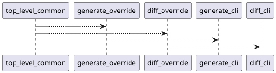
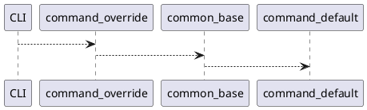
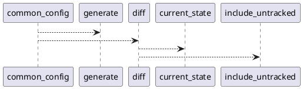
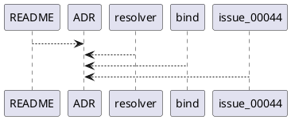

# 20260804t232417z-adr 共通設定基盤とコマンド別上書きの採用判断

## 位置づけ
- 用途: 長期的に参照される architecture / contract / migration decision を固定する。
- この template は future `artifacts/` 配下に置く ADR original 用です。ADR mirror collection は original を移動せず、`artifacts/` と legacy `discussions/` の両方から accepted ADR を収集できます。
- authority default: `draft`。作成直後は non-authoritative / non-mirror とし、accepted 後だけ front matter の accepted authority fields と mirror eligibility を埋める。
- `disc` / `research` / `interview` / `blank` の文脈をもとに作成してよいが、元文書を昇格させず、この ADR と必要な `requirement.md` / `design.md` / `plan.md` へ反映する。
- 汎用議事録、質問票、調査ログ、raw capture の代替にしない。
- ADR は sparingly に作る。後から戻しにくい、文脈なしでは意外性がある、実質的な tradeoff がある、の三条件を満たさない判断は `interview`、`disc`、または canonical docs への通常反映に留める。

## ADR 化基準 (必須)
- hard to reverse:
  - yes
- surprising without context:
  - yes
- real tradeoff:
  - yes
- ADR 化しない場合の反映先:
  - `design.md` と `plan.md`（ただし本artifactは決定の背景と選択肢を保持する）
- ADR として残す理由:
  - 共通設定を正式な設計基盤にするか、コマンド別設定だけに限定するかは、設定ファイルの構造、CLI解決順序、将来の互換性に影響する。いったん実装・文書化すると戻しにくく、Issue 00044のdepth既定値検討だけでは読み取れない設計上のトレードオフがあるため、判断の文脈を記録する。

## 結論（Decision） (必須)
- ユーザーが 2026-08-05 に明示した決定内容を、このdraft artifact上の決定記録として記載する。これは現時点での実装・文書化の判断内容を示すものであり、frontmatterの `status: draft`、`authority: draft`、空の `accepted_authority`、`mirror_eligible: false` は変更しない。
- 採用候補は Option A（共通ベース + command override）とする。
- 同一設定ファイルのトップレベル共通設定を正式なベースとし、`[generate]` と `[diff]` は共通設定を個別に上書きできるようにする。
- 共通設定の対象は `project_root`, `package_root`, `scope_root`, `output`, `ignore`, `depth`, `mode`, `target_python`, `relative_path_base` とする。
- 解決優先順位は `CLIの当該コマンドで明示した値 > コマンド別設定 > トップレベル共通設定 > コマンド既定値` とする。
- Diff固有の `current_state` と `include_untracked` は `[diff]` に置く。
- Generate固有の設定セクションは現状未実装とし、generate targetsは引き続きCLI位置引数で扱う。
- これは旧設定からの互換fallbackではなく、トップレベル共通設定を意図的な設計基盤とする判断である。
- 「accepted」「canonical」「review pass」とは扱わず、必要な採用・反映・レビューの手続きは別途行う。

## 背景（Context） (必須)
- 背景/制約（なぜ今決める必要があるか）:
  - Issue 00044ではdiffのdefault depthと設定解決の扱いが論点になっており、command-specific config onlyとする案や旧top-level depthを廃止する案が先に検討されていた。しかし、設定値の共通性とコマンド別上書きの関係を明確にしないまま実装すると、`generate` と `diff` の設定解決が分岐し、CLI・設定ファイル・既定値の優先順位も曖昧になる。
- 前提:
  - PyClassUMLは外部CLIとして読み取り専用で動作し、設定解決はコマンド実行前に決定的に行う。トップレベル共通設定は両コマンドが共有できる値を持ち、command-specific設定は必要な上書きだけを表す。generate targetsは現状CLI位置引数であり、generate専用設定セクションはまだ存在しない。先に検討した「command-specific config only、旧top-level depth廃止」は撤回する。

### 図表（UML / 任意） (任意)


## 選択肢（Options considered） (必須)
- 選択肢 A（Option A）:
  - 概要:
    - トップレベル共通設定をベースにし、`[generate]` と `[diff]` が共通項目を個別に上書きする。共通項目は `project_root`, `package_root`, `scope_root`, `output`, `ignore`, `depth`, `mode`, `target_python`, `relative_path_base` とし、Diff固有の `current_state`, `include_untracked` は `[diff]` に置く。
  - 良い点（Pros）:
    - 同一設定を両コマンドで再利用でき、設定の重複を減らせる。コマンド固有の差分も明確に表現でき、CLI明示値を最優先にした決定的な解決順序を設計できる。将来の設定項目追加にも共通項目と固有項目の区別で対応しやすい。
  - 悪い点 / 制約（Cons）:
    - 共通設定とコマンド別設定のマージ規則、CLI・設定・既定値の優先順位を明示して実装・テストする必要がある。トップレベル設定が意図せず両コマンドへ影響しないよう、項目ごとの適用範囲を管理する必要がある。
  - 棄却理由（棄却する場合）:
    - 棄却しない。2026-08-05のユーザー決定に基づく採用候補である。
- 選択肢 B（Option B）:
  - 概要:
    - コマンド別設定だけを正式な設定形状とし、トップレベル共通設定を使わない。共通値も各コマンドのセクションに記述し、旧top-level depthは廃止する。
  - 良い点（Pros）:
    - 各コマンドの設定が自己完結し、設定の適用先が局所的で分かりやすい。解決ロジックを単純化しやすい。
  - 悪い点 / 制約（Cons）:
    - 両コマンドで同じ値を使う場合に重複が発生し、共通の運用意図を設定ファイルから表しにくい。トップレベル共通設定を意図的な設計基盤とする要件に反する。
  - 棄却理由（棄却する場合）:
    - 旧top-level depth廃止を含む先行案は撤回されたため、採用候補から外す。
- 選択肢 C（Option C）:
  - 概要:
    - トップレベル共通設定だけを正式な設定形状とし、`[generate]` と `[diff]` による上書きを設けない。Diff固有値を置く専用の扱いも追加しない。
  - 良い点（Pros）:
    - 設定モデルと解決処理が最も単純で、共通値の一貫性を保ちやすい。
  - 悪い点 / 制約（Cons）:
    - generateとdiffで異なる値を指定できず、Diff固有の `current_state` / `include_untracked` や将来のコマンド固有設定を自然に表現できない。
  - 棄却理由（棄却する場合）:
    - コマンドごとの意図的な上書きとDiff固有設定が必要なため、採用候補から外す。

### 図表（UML / 任意） (任意)
```plantuml
@startuml
CLI_value > command_section
command_section > common_section
common_section > command_default
@enduml
```

## 判断理由（Rationale） (必須)
- Option Aは、共通設定の再利用とコマンド固有の差分を両立する。Option Bは共通設定を意図的な設計基盤にできず、設定の重複を招く。Option Cはコマンドごとの上書きとDiff固有設定を表現できない。したがって、ユーザーが明示した要件をすべて満たすのはOption Aである。
- 優先順位を `CLIの当該コマンドで明示した値 > コマンド別設定 > トップレベル共通設定 > コマンド既定値` に固定すると、同じ項目が複数層に存在する場合の挙動を決定的にできる。
- 先行案の撤回は単なる互換fallbackの追加ではなく、トップレベル共通設定を正式なベースとして設計する方針への変更である。そのため、旧設定への後方互換を理由にトップレベル設定を残すのではなく、共通設定と上書きの契約として扱う。

### 図表（UML / 任意） (任意)


## 影響（Consequences） (必須)
- 良い影響（Positive）:
  - `generate` と `diff` が共有する設定値を一度定義でき、必要な場合だけコマンド別に上書きできる。解決順序と設定項目の責務が明確になる。
- 悪い影響 / 将来負債（Negative / Debt）:
  - 設定マージと優先順位の実装・テストが必要になる。各項目が共通設定として適用可能か、コマンド固有かを継続的に文書化する必要がある。
- 影響範囲（コード/テスト/運用/データ）:
  - コードは `src/pyclassuml/config/resolver.py` と `src/pyclassuml/cli/bind.py` の設定解決・CLI束縛に影響する。READMEとIssue 00044の記述、設定解決およびCLIのテストが影響範囲となる。現時点では本artifact以外を変更しない。
- 移行/ロールバック:
  - 本決定を実装する際は、トップレベル共通設定を読み、コマンド別設定で上書きし、CLI明示値を最優先にする順序を段階的に追加する。ロールバック時はこのartifactの決定記録を再検討し、canonical docsやsourceを本artifactだけを根拠に自動変更しない。
- 追加対応（Follow-ups / Epic / Issue / ADR）:
  - Issue 00044で、対象項目一覧、設定ファイルの具体的な形状、CLI引数との対応、generate targetsを位置引数のまま維持する範囲、優先順位のテストケースを別途整理する。採用・canonical反映・review passの扱いは、適切なレビューとowner判断の後に決める。

### 図表（UML / 任意） (任意)


## 参考（References） (必須)
- 関連仕様（requirement/design/plan/report）:
  - Issue 00044（`iss-00044-diff-default-depth`）の要件・設計・計画を参照する。これらへの反映は本artifactの作業範囲外であり、ここでは参照先として記録する。
- 元になった artifacts（derived_from）:
  - なし。2026-08-05のユーザー明示決定を直接の入力とする。
- 反映先（reflected_to）:
  - なし。現時点ではcanonical requirement/design/plan/reportやsource/testsへ反映していない。
- PR/実装:
  - 現行実装参照: `src/pyclassuml/config/resolver.py`, `src/pyclassuml/cli/bind.py`
- 外部資料:
  - `README.md`

### 図表（UML / 任意） (任意)

