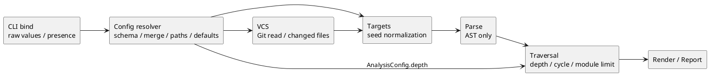

# iss-00044 Diff Default Traversal Depth — 設計（canonical 候補）

> **後続Issueとのauthority境界:** `iss-00045-diff-implicit-base-safety` が Git implicit-base resolver の現行 authority である。以下に残る `initial_commit_fallback` や VCS regression の記述は Issue #44 実装時点の historical characterization として保持し、#45 適用後の production contractとして解釈しない。#44 が現行として維持するのは generate/diff の設定レイヤー、CLI/config precedence、`generate=None`、`diff=1`、depthがVCS/seed/traversal以外へ波及しない境界である。

> 本書は candidate design であり、repository の canonical design、source、tests、README、SpecDock state を変更したものではない。対象 snapshot は branch `codex/iss-00044-chatgpt-first-planning`、commit `d04c6aa175d1f6261c7c4378435b5d54b4efef27` である。

## 1. 設計目標

1. トップレベル共通設定と `[generate]` / `[diff]` command override を一つの deterministic resolver で扱う。
2. 9 個の共通キーに同一の precedence / presence contract を適用する。
3. `relative_path_base` を path resolution より先に解決し、path origin を混同しない。
4. Diff 固有キーと共通キーを schema 上で衝突させない。
5. CLI bind、DTO、target normalization、VCS、traversal の既存責務を維持する。
6. `diff` 全未指定時だけ `depth=1` を resolver が注入し、`generate=None` を維持する。
7. current source が未実装である事実を、target design と分離する。

## 2. 非目標

- CLI grammar の全面再設計。
- `CommandOptions` / `AnalysisConfig` の public field 追加。
- `targets` や `base_ref` の config 化。
- traversal / VCS / parser / renderer の algorithm 変更。
- explicit unlimited sentinel、`--mode warn`、CLI ignore clear の追加。
- inactive command の path existence / containment validation。
- SpecDock assurance policy 自体の変更。

## 3. 現行構造と target delta

### 3.1 現行

```text
argv
  -> cli.bind
     CommandOptions(
       common raw values,
       GenerateOptions(targets) or DiffOptions(base_ref, current_state, include_untracked)
     )
  -> config.resolver
     top-level common only
     [diff] current_state/include_untracked only
     depth = CLI > top-level > None
  -> ExecutionContext + AnalysisConfig
  -> targets / VCS / parse / traversal / render / report
```

現行 `_TOP_LEVEL_KEYS` は共通キー + `"diff"`、`_DIFF_KEYS` は `current_state/include_untracked` だけである。`_merged_depth()` は command を受け取らず、`None` をそのまま返す。

### 3.2 target

```text
argv
  -> cli.bind                    # raw value + existing presence evidence
  -> config discovery/load
  -> full-file schema validation
  -> active command section selection
  -> effective relative_path_base selection
  -> field-by-field layered selection
       CLI > command > common > command default
  -> origin-aware path resolution
  -> containment / active path validation
  -> ExecutionContext + AnalysisConfig
  -> unchanged downstream seams
```

## 4. 責務境界

| seam | owner | target responsibility | 明示的な非責務 |
|---|---|---|---|
| `cli.bind` | `src/pyclassuml/cli/bind.py` | raw CLI value、command、targets/base、Diff bool/enum presence の bind | config discovery、path resolve、command default |
| config schema | `src/pyclassuml/config/resolver.py` 内 private helpers | top/common/command key set、type/domain validation、collision guard | filesystem existence、Git、target normalization |
| config resolver | `src/pyclassuml/config/resolver.py` | precedence、effective base、origin-aware path、root containment、depth default | Git base resolution、traversal |
| shared DTO | `src/pyclassuml/model/contracts.py` | immutable handoff `CommandRequest`, `ExecutionContext`, `AnalysisConfig` | config layering policy |
| explicit targets | targets seam | generate target normalize / scope / ignore | config merge、Git |
| VCS | `src/pyclassuml/vcs/diff_collect.py` | Git base/current-state/untracked/rename/read-only changed files | depth、config section merge、scope filter |
| traversal | `src/pyclassuml/analyze/traversal.py` | resolved `AnalysisConfig.depth` の hop enforcement、cycle、module limit | command default、config origin |
| report | report seam | output / diagnostics / exit projection | config selection |

## 5. target schema

### 5.1 key set

production 実装では key 集合を重複記述せず、次の関係を一箇所で定義する。

```python
_COMMON_CONFIG_KEYS = frozenset(
    {
        "project_root",
        "package_root",
        "scope_root",
        "output",
        "ignore",
        "depth",
        "mode",
        "target_python",
        "relative_path_base",
    }
)

_DIFF_ONLY_CONFIG_KEYS = frozenset(
    {
        "current_state",
        "include_untracked",
    }
)

_COMMAND_TABLE_KEYS = frozenset({"generate", "diff"})
_TOP_LEVEL_KEYS = _COMMON_CONFIG_KEYS | _COMMAND_TABLE_KEYS
_GENERATE_KEYS = _COMMON_CONFIG_KEYS
_DIFF_KEYS = _COMMON_CONFIG_KEYS | _DIFF_ONLY_CONFIG_KEYS
```

次の guard を code/test で固定する。

```python
assert _COMMON_CONFIG_KEYS.isdisjoint(_DIFF_ONLY_CONFIG_KEYS)
```

将来 collision が起きた場合、implicit precedence を作らず実装・test を失敗させる。

### 5.2 raw section model

public DTO は増やさず、resolver seam 内で raw mapping を section として扱う。

```python
top_common: Mapping[str, object]
generate_section: Mapping[str, object]
diff_section: Mapping[str, object]
active_section: Mapping[str, object]
```

必要なら private immutable wrapper を導入できるが、public `model` へ raw config DTO を追加しない。主眼は「layer と presence を明示すること」であり、ad-hoc truthiness merge を禁止することである。

### 5.3 full-file validation

`tomllib.load()` 後、active command を選ぶ前に次を検証する。

1. top-level unknown key
2. `generate` / `diff` が table であること
3. `[generate]` unknown key
4. `[diff]` unknown key
5. すべての section の共通値 type/domain
6. Diff 固有値 type/domain

filesystem existence と containment は active command の effective path だけに適用する。inactive command の path string は type/domain のみ検証する。

qualified message の例:

```text
generate.depth must be a non-negative integer
diff.relative_path_base must be config or cwd
unknown generate key: current_state
unknown diff key: base
```

## 6. value selection model

### 6.1 sentinel と origin

`dict.get()` だけでは `None` / empty / absent の区別を失うため、presence は `key in mapping` で判定する。

```python
_MISSING = object()

class _ValueOrigin(str, Enum):
    CLI = "cli"
    COMMAND = "command"
    COMMON = "common"
    DEFAULT = "default"

@dataclass(frozen=True)
class _SelectedValue:
    value: object
    origin: _ValueOrigin
```

`_SelectedValue` は private seam-local type とし、public DTO へ露出しない。path resolution と diagnostics のために origin を保持する。

### 6.2 generic selection

概念上の helper:

```python
def _select_value(
    *,
    cli_value: object,
    cli_provided: bool,
    command_section: Mapping[str, object],
    common_section: Mapping[str, object],
    key: str,
    default: object,
) -> _SelectedValue:
    if cli_provided:
        return _SelectedValue(cli_value, _ValueOrigin.CLI)
    if key in command_section:
        return _SelectedValue(command_section[key], _ValueOrigin.COMMAND)
    if key in common_section:
        return _SelectedValue(common_section[key], _ValueOrigin.COMMON)
    return _SelectedValue(default, _ValueOrigin.DEFAULT)
```

`None` を有効値として config から受ける key は現行 schema にない。command default の `depth=None` と `output=None` は default origin としてのみ現れる。

### 6.3 field-specific CLI presence

| field | CLI value | `cli_provided` |
|---|---|---|
| `project_root`, `package_root`, `scope_root`, `output` | `Path | None` | `value is not None` |
| `depth` | `int | None` | `value is not None`。`0` は true |
| `target_python` | `str | None` | `value is not None` |
| `ignore` | `tuple[str, ...]` | `bool(value)`。CLI grammar は empty 明示を持たない |
| `mode` | `AnalysisMode.STRICT` | `options.strict is True` |
| `relative_path_base` | なし | always false |
| `current_state` | enum | `current_state_cli_provided` |
| `include_untracked` | bool | `include_untracked_cli_provided` |

現行 `DiffOptions` の `*_cli_provided` を維持する。`include_untracked=False` を value の truthiness で判定してはならない。

### 6.4 list semantics

`ignore` は layer 単位の replacement。

```text
CLI one-or-more ignore
  > command ignore (empty list を含む)
  > top-level ignore
  > ()
```

append/union/dedupe はしない。pattern の既存順序を保持する。

## 7. resolution algorithm

### 7.1 ordered flow

```text
1. process_cwd を absolute resolve
2. --cwd を process_cwd 基準で resolve -> execution_cwd
3. config path discovery
4. TOML load
5. full-file schema/type/domain validation
6. active command section を選択
7. effective relative_path_base を command > common > "config" で選択
8. config_base を決定
9. project_root を CLI > command > common > default で選択・resolve
10. package_root を同様に選択・resolve（default=project_root）
11. scope_root を同様に選択・resolve（default=package_root）
12. root existence / containment validation
13. output, ignore, depth, mode, target_python を選択・変換
14. Diff 固有値を CLI presence > [diff] > default で選択
15. ExecutionContext / AnalysisConfig を構築
```

### 7.2 command defaults

```python
def _default_depth(command: CommandName) -> int | None:
    if command is CommandName.DIFF:
        return 1
    if command is CommandName.GENERATE:
        return None
    raise AssertionError(f"unsupported command: {command}")
```

unknown future command を generate 相当の `None` に暗黙 fallback しない。

その他:

```text
project_root:
  config_path.parent if config_path is not None else execution_cwd
package_root:
  effective project_root
scope_root:
  effective package_root
output:
  None
ignore:
  ()
mode:
  warn
target_python:
  None
relative_path_base:
  config
current_state:
  working-tree
include_untracked:
  true
```

### 7.3 mode selection

`mode` は config 上の key 名、CLI は `--strict`。

```text
--strict provided
  -> AnalysisMode.STRICT
else [command].mode
  -> enum conversion
else top-level mode
  -> enum conversion
else
  -> AnalysisMode.WARN
```

CLI から `warn` を force する path は追加しない。

## 8. path resolution

### 8.1 effective base first

`relative_path_base` は、`project_root` などの config-origin path を解決する前に確定する。

```python
relative_path_base = _select_value(
    cli_provided=False,
    command_section=active_section,
    common_section=top_common,
    key="relative_path_base",
    default="config",
)
config_base = (
    execution_cwd
    if relative_path_base.value == "cwd"
    else config_path.parent
    if config_path is not None
    else execution_cwd
)
```

### 8.2 single effective base

active command では、トップレベル由来か command table 由来かにかかわらず、すべての config-origin path を同じ effective `config_base` で解決する。

```toml
project_root = "project"

[diff]
relative_path_base = "cwd"
```

この場合:

- `diff`: `execution_cwd/project`
- `generate`: config file parent `/project`

command override が inherited path の意味を変えることは意図的な契約であり、README と tests で明示する。

### 8.3 origin-aware resolve

```python
def _resolve_selected_path(
    selected: _SelectedValue,
    *,
    execution_cwd: Path,
    config_base: Path,
    default: Path | None,
    field_name: str,
) -> Path | None:
    if selected.origin is _ValueOrigin.CLI:
        base = execution_cwd
    elif selected.origin in {_ValueOrigin.COMMAND, _ValueOrigin.COMMON}:
        base = config_base
    else:
        base = None

    raw_path = default if selected.origin is _ValueOrigin.DEFAULT else Path(selected.value)
    if raw_path is None:
        return None
    return _resolve_path(
        raw_path,
        base,
        code="invalid_path_resolution",
        failure_reason=FailureReason.INVALID_CONFIG_OR_CONFIG_PATH,
        field_name=field_name,
    )
```

default root は解決済み `Path` を渡し、base を再適用しない。

### 8.4 discovery と effective project root の分離

`--project-root` は config discovery に使える。config 内の `project_root` は file load 後にしか見えないため discovery に使わない。

```text
--config
  > --project-root/.pyclassuml.toml
  > parent search from execution_cwd
```

command-specific `project_root` が異なる Git repository を指す場合、`diff` の `ExecutionContext.vcs_root` もその effective `project_root` になる。ただし、config file 自身の探索場所は変わらない。

### 8.5 ignore と targets

- config/CLI `ignore` は `project_root` relative glob。
- `relative_path_base` は ignore pattern へ適用しない。
- generate target の relative path は `execution_cwd` 基準。
- target scope validation は resolver 後の targets seam。

## 9. Diff 固有設定

### 9.1 selection

```text
current_state:
  CLI explicit > [diff].current_state > working-tree

include_untracked:
  CLI explicit > [diff].include_untracked > true
```

トップレベル common fallback は存在しない。

### 9.2 collision policy

- `_COMMON_CONFIG_KEYS ∩ _DIFF_ONLY_CONFIG_KEYS == ∅`
- `[generate].current_state` / `[generate].include_untracked`: invalid
- top-level `current_state` / `include_untracked`: invalid
- `[diff].base` / `[diff].base_ref`: invalid
- `[generate].targets`: invalid
- unknown nested table: invalid
- TOML duplicate assignment: `tomllib` parse failure

## 10. Generate targets と Diff `--base`

### 10.1 Generate

`GenerateOptions.targets` は CLI positional tuple を維持する。config resolver は targets を選択・補完しない。

```text
generate targets
  -> normalize_explicit_targets
  -> file / directory / glob expansion
  -> .py filter
  -> project-root-relative ignore
  -> scope containment
  -> zero-target failure
```

### 10.2 Diff

`DiffOptions.base_ref` は CLI-only。config resolver は value を変更しない。

```text
diff --base ref
  -> VCS verifies ref
  -> explicit_base
  -> invalid ref is fatal; no fallback

diff without --base
  -> HEAD verification
  -> default branch candidate merge-base
  -> initial commit fallback
```

`depth` は changed-file collection の前後いずれにも Git command parameter として渡さない。

## 11. traversal / parse / VCS boundary



不変:

- parse は target project module を import しない。
- traversal は `config.depth` だけを読み、command を知らない。
- seed hop は 0。
- module limit は `1000`。
- cycle は reachable set で停止。
- VCS は read-only。
- scope filtering は targets/traversal boundary。
- deterministic sort を維持。

## 12. diagnostics / failure design

### 12.1 schema failure

```text
invalid_config_toml
invalid_config
invalid_config_path
invalid_path_resolution
invalid_root_path
invalid_containment
```

既存 `FailureReason.INVALID_CONFIG_OR_CONFIG_PATH` / `INVALID_PATH_OR_CONTAINMENT` の使い分けを維持する。

### 12.2 field qualification

同じ key が複数 section に存在するため、message は origin section を含める。

```text
generate.project_root must be a string
diff.depth must be a non-negative integer
top-level relative_path_base must be config or cwd
```

public diagnostic code は増やさず、message の精度を上げる設計を優先する。新 code が必要な場合は report/exit policy との整合 review を要求する。

### 12.3 fail-fast ordering

- TOML/schema/type/domain failure: path resolve 前。
- active path resolve/existence/containment: downstream 前。
- VCS base failure: config success後、targets/parse 前。
- target zero/scope failure: VCS/explicit normalize 後、parse 前。

## 13. public contract と変更 surface

### 13.1 production change

必須候補:

- `src/pyclassuml/config/resolver.py`
  - key sets
  - section validation
  - layered selection
  - effective base
  - command default depth
  - qualified diagnostics

原則変更不要:

- `src/pyclassuml/cli/bind.py`
- `src/pyclassuml/model/contracts.py`
- `src/pyclassuml/analyze/traversal.py`
- `src/pyclassuml/vcs/diff_collect.py`

`bind.py` は help text を加える必要がある場合だけ変更候補とし、raw value/presence behavior は変更しない。

### 13.2 tests / docs

- `tests/config/test_context_resolve.py`
- `tests/cli/test_bind.py`
- `tests/app/test_diff.py`
- `tests/app/test_generate.py`
- `tests/analyze/test_traversal.py`
- `tests/parse/test_module_parse_and_index.py`
- `tests/vcs/test_diff_file_collect.py`
- `README.md`

## 14. design-level test matrix

| ID | layer | case | expected |
|---|---|---|---|
| `TC-001-A` | config | top-level 9 keys + generate | all common values selected |
| `TC-001-B` | config | top-level 9 keys + diff | all common values selected |
| `TC-001-C` | config | both command tables | active only |
| `TC-002-A` | config | CLI > command > common > default for scalar/path | exact precedence |
| `TC-002-B` | config | `depth=0` | preserved |
| `TC-002-C` | config | `ignore=[]` | clears common |
| `TC-004-A` | path | command base + inherited common path | effective base applies |
| `TC-004-B` | path | CLI path + config base | CLI remains cwd-relative |
| `TC-004-C` | path | root defaults | no double base |
| `TC-005-A` | schema | diff-only key in top/generate | failure |
| `TC-005-B` | schema | common key in diff | valid override |
| `TC-005-C` | schema | non-table/unknown/type/domain | failure |
| `TC-006-A` | CLI | unset/0/strict/false diff bool | presence correct |
| `TC-006-B` | boundary | `[generate].targets`, `[diff].base` | failure |
| `TC-007-A` | traversal | depth 0/1/None, cycle, candidates, limit | unchanged |
| `TC-007-B` | VCS | explicit/no-base/head/untracked/rename | unchanged |
| `TC-008-A` | app | default diff A→B→C | A/B |
| `TC-008-B` | app | diff command depth 2 | A/B/C |
| `TC-008-C` | app | default generate | A/B/C |
| `TC-009-A` | compatibility | old top-level-only config | unchanged except diff default when depth absent |
| `TC-010-A` | quality | focused + full + docs | pass/new failures none |

## 15. risks と緩和

| risk | impact | mitigation |
|---|---|---|
| truthiness merge | `0`, `[]`, `false` が消える | presence-based helper + parameterized tests |
| base の選択が path 解決後 | command-specific base が効かない | relative_path_base first |
| top/common/command key set drift | section ごとに許可範囲が不整合 | set composition + disjoint assertion |
| command base が inherited path を再解釈 | surprise | explicit contract/example/test |
| CLI strict の one-way 性 | warn を force できない | known constraint、scope外 |
| inactive section の invalid value | active command も fail | full-file schema validationを文書化 |
| config project_root と discovery の循環 | wrong config | discovery/effective context separation |
| diff depth policy が traversal/VCS へ漏れる | ownership erosion | resolver-only production diff |
| current Red tests と baseline failure の混同 | false completion | before/after exact nodeids + full-suite classification |

## 16. compatibility / rollback

### compatibility

- old top-level common config: valid
- old `[diff]` specific keys: valid
- new command common override: additive schema
- CLI/public DTO: unchanged
- only unconditional behavior change: no-depth `diff` frontier `None -> 1`
- empty path validation: out of scope; preserve existing resolver behavior
- no data migration / persistence migration

### rollback

resolver の schema/selection/default change、追加 tests、README change を一単位で戻す。traversal/VCS/DTO を変更しないため、data repair や Git repair は不要。

## 17. 未確定事項

技術的な target contract は本書で確定候補とする。次は既知の制約であり、本 Issue では解消しない。

- explicit unlimited diff sentinel
- CLI warn override
- CLI ignore clear
- HEAD blob rendering
- config include/profile

current SpecDock report が記録する assurance/profile と fresh reviewer gate の未解消事項は implementation admission の process issue であり、本 design が解消済みと主張しない。
