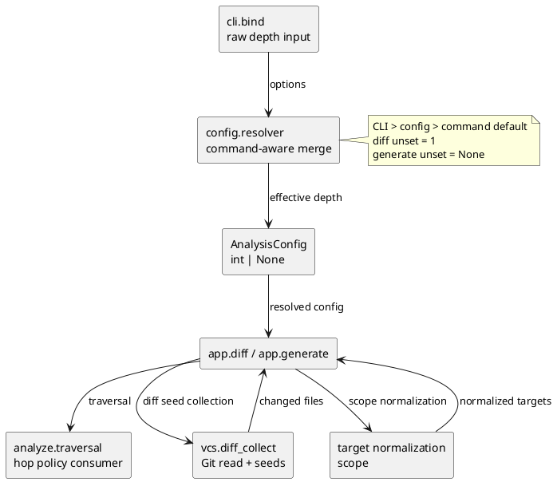

# iss-00044 Diff Default Traversal Depth — 設計

## 1. 設計目標と制約

変更点をconfig resolution seamの一箇所に限定し、`diff`だけの未指定defaultを `AnalysisConfig.depth=1` として下流へ渡す。既存のCLI入力型、共通DTO、traversal、VCS、target normalization、rendererの責務と公開契約を維持する。

設計上の不変条件は、CLI未指定と明示 `0`の区別、top-level configの共通適用、`generate`の `None` default、Git比較のread-only性、AST-only/no-import、決定性である。

### 1.1 Standard profileの適用例外と補償ゲート

PyClassUMLの`diff`未指定時のeffective outputは変わるため、利用者向けruntime behaviorの変更を否認しない。ただし、このIssueが変更するのはPyClassUML本体の既存CLI policyであり、SpecDock自身の公開CLI、workflow、active/validate/lifecycle、template、metadata、workspace scaffold、永続状態ではない。また、`diff` / `--depth`の入力面、型、設定schema、終了契約は維持する。

この境界により、current `authorized_profile=standard`はSpecDock運用契約の分類として維持し、Strict向けのmanaged templateや`.assurance.json`を手編集で自己適用しない。これはPyClassUMLの互換性リスクを免除する判断ではない。次の補償ゲートを設計上の必須条件とする。

- ChatGPT-Use advisoryはevidence-onlyで保存し、採用claimをsource/testsで再検証する。
- fresh `spec-reviewer` pass、resolver/app focused test、全体test、VCS/read-only/no-import inspection、README、fresh code/QA reviewを実装・完了条件に含める。
- SpecDockの公開CLI/workflow契約へ影響が広がる、またはrisk factを正規入力してStrictへ分類できるようになった場合は、実装前にStrictへ引き上げる。

## 2. 現行境界の確認

- `cli.bind` は `--depth`を非負整数としてparseし、未指定は `None`を保持する。
- `config.resolver._build_analysis_config` はCLI、TOML、defaultをeffective `AnalysisConfig`へ変換する唯一のpolicy seamである。
- `AnalysisConfig.depth: int | None` はtraversalへの契約で、`None`は上限なしを意味する。
- `analyze.traversal` はhop判定、cycle、module limit、reachable frontierを担うが、command名を知らない。
- `vcs.diff_collect` はbase解決とchanged-file収集だけを行い、depthを知らない。
- `target`/DTOはscopeと値の受け渡しを担い、command defaultを解釈しない。

## 3. 採用方針

### 3.1 resolverでcommand defaultを注入する

`_merged_depth`を、CLI値・config値・command defaultを順に評価するhelperへ最小変更する。名称を `_resolve_depth`へ変更して責務を明確にしてもよいが、不要な抽象化は追加しない。

```python
_DIFF_DEFAULT_DEPTH = 1


def _resolve_depth(
    command: CommandName,
    cli_value: object,
    config_value: object,
) -> int | None:
    if cli_value is not None:
        depth = cli_value
    elif config_value is not None:
        depth = config_value
    elif command is CommandName.DIFF:
        depth = _DIFF_DEFAULT_DEPTH
    else:
        depth = None

    if depth is not None and (
        isinstance(depth, bool) or not isinstance(depth, int) or depth < 0
    ):
        _invalid_config("depth must be a non-negative integer")
    return depth
```

呼び出し側は次のようにcommandを渡す。

```python
depth=_resolve_depth(
    options.command,
    options.depth,
    config.get("depth"),
),
```

`CommandName`に将来commandが増えた場合も、`generate`相当の暗黙fallbackを広げず、既存command契約を確認してから拡張する。今回の2 commandでは `DIFF -> 1`、既存 `GENERATE -> None`を固定する。

### 3.2 変更しない層

CLI parserへ `default=1`を追加しない。`AnalysisConfig.depth` dataclass defaultを `1`へ変えない。traversalへ `None -> 1`の解釈を追加しない。VCS collectorへdepth引数やGitコマンド分岐を追加しない。これによりcommand policyが入力bind、共通DTO、アルゴリズム、Git比較へ漏れない。

## 4. インターフェースとデータフロー

```text
argv / TOML
  -> cli.bind: CommandOptions.depth (None | non-negative int)
  -> config.resolver: CLI > config > command default
  -> AnalysisConfig.depth (diff: 1 when both unset; generate: None when both unset)
  -> app.diff / app.generate
  -> parse + analyze.traversal (hop semantics only)
  -> renderer

diff request
  -> vcs.diff_collect (base/current-state/include-untracked and changed seeds)
  -> target normalization (scope)
  -> shared parse/traversal path
```

depthはVCSのbase/current-state選択やchanged seedの収集には流れず、resolver後にappが共有analysis pathへ渡す `AnalysisConfig`の値としてのみ消費される。

## 5. モジュール依存図

この図は今回の変更で固定する責務境界と実装起点を示す。全call graphは対象外とする。



## 6. ファイル変更計画

```text
src/pyclassuml/config/resolver.py
  変更: command-aware depth resolutionだけ。責務: effective config。
tests/config/test_context_resolve.py
  変更: diff/generate default、config/CLI precedence、0の回帰テスト。
tests/cli/test_bind.py
  変更候補: unset None、explicit 0のbind boundaryを確認。
tests/app/test_diff.py
  変更候補: A -> B -> Cのdiff default integration。
tests/app/test_generate.py
  変更候補: transitive generate defaultの回帰確認。
README.md
  変更: depth semantics、defaults、precedence、Git modes、known limitations。
```

`src/pyclassuml/analyze/traversal.py`、`src/pyclassuml/vcs/diff_collect.py`、model DTO、`.agents/skills`は変更対象に含めない。既存の `.serena/project.yml`およびSpecDock managed update差分も変更しない。

## 7. 要件と設計の対応

- AC-001 -> `_resolve_depth`のcommand defaultとresolver focused test、app integration。
- AC-002 -> `generate`既存 `AnalysisConfig()` testとexplicit regression。
- AC-003 -> `is not None` precedence tests、CLI/configの0。
- AC-004 -> bind testsとparser inspection。parserにdefault policyを入れない。
- AC-005 -> 既存VCS tests/app diff testsを変更なしで実行し、diff collector差分なしを確認。
- AC-006 -> 既存validation、traversal cycle/module-limit、read-only/determinism tests。
- AC-007 -> README更新とdocs/spec review。

## 8. テスト戦略

### 8.1 resolver / bind

- diff・configなし -> `1`。
- generate・configなし -> `None`。
- diff config `0`/`3` -> config値。
- CLI `0`/`2` + config値 -> CLI値。
- generate config値 -> config値。
- bind未指定 -> `None`、bind `--depth 0` -> `0`。

### 8.2 app integration

A→B→Cの小さなfixtureを用意し、diff未指定はA/B、CLI `--depth 2`およびtop-level config `depth=2`はA/B/C、generate未指定はA/B/Cとなることをreachable inventoryまたは生成図で確認する。CLI経路は`tests/app/test_diff.py::test_diff_explicit_depth_two_reaches_transitive_dependency`、config経路は`tests/app/test_diff.py::test_diff_config_depth_two_reaches_transitive_dependency`で固定する。AとCの両方がchanged seedの場合、diff defaultでもCがseedとして残るケースを含める。

### 8.3 traversal / VCS regression

既存のdepth=0/1/None、cycle、module limit、syntax diagnostics、explicit base、merge-base、current-state、untracked、initial commit fallbackテストを実行する。新しいcommand default assertionはresolver/app境界に置き、traversal単体へcommand policyを持ち込まない。

## 9. 文書・利用者契約

READMEに、seed=0/direct import=1のhop semantics、`generate=None`/`diff=1`、`CLI > top-level config > command default`を追加する。top-level configの `depth` は両commandに適用されること、changed filesはseedであること、depthがGit base解決に影響しないこと、`current_state=head`とworking-tree parseの制約、明示的unlimited diff入力が未提供であることを記載する。

CLI helpにdepth説明を追加する場合は、利用者契約の補助にとどめ、未指定値を `None`から `1`へ変える実装を行わない。READMEだけで既存CLI文書の要件を満たせる場合はparser変更を増やさない。

## 10. リスク、互換性、ロールバック

主な互換性変化は、depth未指定のdiffが従来の無制限 `None`から `1`へ変わることだけである。explicit CLI/config値とgenerateは維持される。現行の入力では旧diff無制限を明示的に復元できないため、これは既知の制約としてリリース文書へ残す。

parse frontierとtraversal frontierを混同すると、深いmoduleのsyntax diagnosticやI/Oが変わるという誤解が生じる。設計・README・テストで両者を分ける。

ロールバックはresolverのcommand default変更、追加focused tests、README差分をまとめて戻すだけで完了する。traversal/VCS/DTOに変更を入れないため、別のmigrationやdata repairは不要である。

## 11. 未確定事項とレビュー境界

設計上の未確定事項はない。ChatGPT-Useの設計レビューはadvisoryとして一部採用し、detached HEAD上の未検証主張やunlimitedのプロダクト判断は採用せず、local source/testsへ戻して検証する。canonical adoptionと実装開始はfresh `spec-reviewer` pass後に行う。
