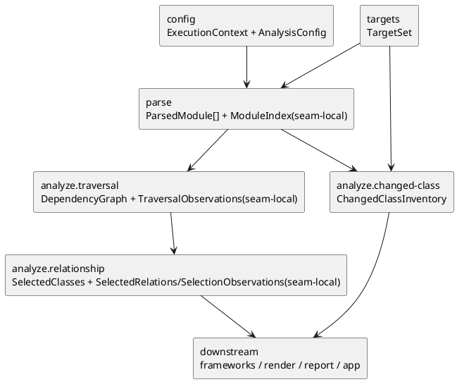

# epic-00003 Core Analysis — 設計（HOW）

## 全体像
- target boundary:
  - `parse.module-parse-and-index`
  - `analyze.traversal`
  - `analyze.relationship-and-selection`
  - `ChangedClassInventory`
- impacted area:
  - upstream: `targets.explicit-target-normalize`, `targets.diff-target-normalize`, `config.context-resolve`
  - downstream: `frameworks.sqlalchemy-enrich`, `frameworks.pydantic-enrich`, `render.uml-document`, `report.artifact-summary-exit-policy`, `app.*-wiring`
- existing relation:
  - initiative `design.md` が定義した whole-system pipeline のうち、`TargetSet` 以降 `RenderReadyModel` 手前までの解析核を epic 単位で束ね直す。

### UML（module / dependency）

## この 4 seams を 1 epic に束ねる理由
- `parse` と `analyze` は AST-only 制約の中で製品価値の中心を形成し、framework support や output policy と混ぜると owner が曖昧になる。
- `analyze.relationship-and-selection` と `ChangedClassInventory` を分けることで、「図に載せる class」と「変更ファイルに含まれる class 数」を別契約として固定できる。
- `frameworks` は relation / class selection の downstream 補強であり、core-analysis 完了前に best-effort support を定義すると frontier owner が崩れる。
- `app` を最後の stitcher に保つため、command 差分は upstream `TargetSet` に閉じ、core-analysis 内では command-neutral DTO / seam-local handoff だけを扱う。

## 契約

### seam contract table
| seam | owner | input | output | handoff type | downstream |
| --- | --- | --- | --- | --- | --- |
| `parse.module-parse-and-index` | `parse` | `TargetSet`, `ExecutionContext`, `AnalysisConfig` | `ParsedModule[]`, `ModuleIndex` | `ParsedModule[]` は shared DTO、`ModuleIndex` は seam-local | `analyze.traversal`, `analyze.relationship-and-selection`, `frameworks` |
| `analyze.traversal` | `analyze` | `ParsedModule[]`, `ModuleIndex`, `ExecutionContext`, `AnalysisConfig` | `DependencyGraph`, `TraversalObservations` | `DependencyGraph` は shared DTO、`TraversalObservations(seed_project_relative_paths, scope_stop_count, traversal_limit_reached, reachable_file_count)` は seam-local | `analyze.relationship-and-selection`, `report` |
| `analyze.relationship-and-selection` | `analyze` | `ParsedModule[]`, `ModuleIndex`, `DependencyGraph`, `TraversalObservations` | `SelectedClasses`, `SelectedRelations`, `SelectionObservations` | `SelectedClasses` は shared DTO、`SelectedRelations` と `SelectionObservations(extracted_class_count, extracted_relation_count, warning_diagnostics: Diagnostic[])` は seam-local | `frameworks`, `render`, `report` |
| `ChangedClassInventory` | `analyze` | changed file 集合, `ParsedModule[]`, `ModuleIndex` | `ChangedClassInventory` | shared DTO | `report`, `app.diff-wiring` |

### Data boundary
- shared DTO SoR:
  - `ParsedModule[]` の SoR は `parse`。
  - `DependencyGraph`, `SelectedClasses`, `ChangedClassInventory` の SoR は `analyze`。
- seam-local handoff:
  - `ModuleIndex` は module path / import candidate / class 定義 lookup に加えて `seed_project_relative_paths` を保持する parse 内部 handoff とし、initiative canonical DTO へは昇格させない。
  - `TraversalObservations` は `seed_project_relative_paths`, `scope_stop_count`, `traversal_limit_reached`, `reachable_file_count` を持つ report/selection 素材の中間表現とする。
  - `SelectedRelations` は `relation_type`, `source_class_id`, `target_class_id`, `evidence_kind` を持つ analyze -> frameworks/render の seam-local handoff とし、render-ready 生成前に framework enrich の入力へ渡す。
  - `SelectionObservations` は `extracted_class_count`, `extracted_relation_count`, `warning_diagnostics: Diagnostic[]` を持つ analyze -> report の seam-local handoff とする。
- consistency model:
  - shared DTO は deterministic order を持ち、同一入力で同一順序の collection を返す。
  - seam-local handoff は owner seam の内部構造として扱い、issue docs では downstream に必要な最小項目だけを固定する。

## 主要フロー
- Flow-A: parse to traversal
  1. `parse` が `TargetSet.seed_files` を起点に `.py` source を import 非実行 AST parse する。
  2. `parse` は `ParsedModule[]` と `ModuleIndex` を構築し、syntax diagnostics と dependency candidate ignore 結果を保持する。
  3. `analyze.traversal` は `package_root` / `scope_root` / depth を使って到達可能 module を確定し、seed provenance を保持した `TraversalObservations` とともに返す。
- Flow-B: relation, selection, changed inventory
  1. `analyze.relationship-and-selection` は reachable module 群から class relation を抽出する。
  2. `TraversalObservations.seed_project_relative_paths` に属する起点ファイル内 class を原則すべて選び、依存先ファイルは relation が検出された class を中心に `SelectedClasses` と `SelectedRelations` を作る。
  3. `ChangedClassInventory` は changed file 集合と `ModuleIndex.project_relative_file_to_module` lookup を使って parsed class 定義を突き合わせ、relation / selection 結果とは独立に changed class 数を確定する。

## dependency order
- completion order:
  1. `iss-00012-parse-module-parse-and-index`
  2. `iss-00013-analyze-traversal`
  3. `iss-00014-analyze-relationship-and-selection`
  4. `iss-00015-changed-class-inventory`
- rationale:
  - `parse` がないと traversal の候補集合が定まらない。
  - traversal がないと relation extraction は package / scope / depth 境界を誤る。
  - changed class inventory 自体は relation-based selection に依存しないが、M2 の説明順では「図に載せる meaning」と「summary に出す meaning」の対比が読みやすくなるよう最後に置く。

## 失敗設計
- fail-fast owner:
  - `analyze.traversal`: 探索上限到達
- recoverable / degradable owner:
  - `parse`: 構文エラー、解決不能 import candidate
  - `analyze.relationship-and-selection`: wildcard import 解決不能、関係推定不能
  - `ChangedClassInventory`: upstream handed-off changed file の join miss は追加 diagnostics を作らず parse-origin diagnostics を再利用し、class count には加算しない。inventory 固有 warning が必要な failure class は issue docs で明示された場合だけ扱う。
- rule:
  - strict/warn の最終 exit code 決定は `report` owner とし、この epic は diagnostics origin / recoverability / counter を保持するまでに留める。

## 観測性 / セキュリティ
- observability:
  - `parse` は syntax diagnostics と dependency candidate ignore 件数を保持する。
  - `analyze.traversal` は reachable file count と scope 外探索打ち切り件数を保持する。
  - `analyze.relationship-and-selection` は抽出 class / relation 数と warning diagnostics を `SelectionObservations` として保持する。
  - `ChangedClassInventory` は changed class 数と changed file count を保持する。
- security:
  - `parse` / `analyze` は対象コード import 実行を行わず、target repository を read-only に扱う。
  - `analyze` は Git を直接参照しない。

## テスト戦略
- Unit:
  - syntax degradation と ignore candidate exclusion。
  - depth / scope traversal matrix。
  - relation extraction と selection rules。
  - changed class inventory counting rule。
- Integration:
  - `TargetSet -> ParsedModule[] -> DependencyGraph -> SelectedClasses` と、`targets.diff-target-normalize + ParsedModule[] -> ChangedClassInventory` の handoff review。
  - `frameworks` / `report` が必要とする counter / diagnostics の carry review。
- Verification:
  - `fx-parse-syntax-error`
  - `fx-parse-ignored-dependency-candidate`
  - `fx-traversal-depth-matrix`
  - `fx-traversal-package-boundary`
  - `fx-traversal-scope-stop`
  - `fx-traversal-limit-reached`
  - `fx-analyze-relation-ambiguity`
  - `fx-analyze-relation-only-dependency`
  - `fx-analyze-changed-unreachable`
  - `fx-analyze-changed-file-without-class`

## non-goals
- framework-specific relation 補強。
- PlantUML diagram / text 生成。
- artifact write と stream routing。

## リスク / 注意点
- `SelectedRelations` を shared DTO へ早期昇格すると model が肥大化する。
- changed class inventory を relation / selected class 集合から直接算出すると、到達不可だが changed file に存在する class を見落とす。
- traversal が ignore や scope stop の件数を保持しないと report summary の source of truth が崩れる。
