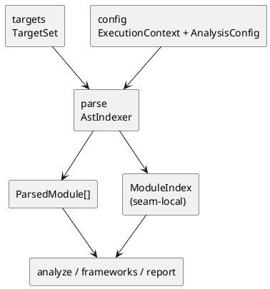

# iss-00012 Parse Module Parse And Index — 設計（HOW）

## seam position
- upstream / prerequisite:
  - `iss-00008-config-context-resolve`
  - `iss-00009-targets-explicit-target-normalize`
  - `iss-00011-targets-diff-target-normalize`
- downstream / dependent:
  - `iss-00013-analyze-traversal`
  - `iss-00014-analyze-relationship-and-selection`
  - `frameworks.sqlalchemy-enrich`
  - `frameworks.pydantic-enrich`
  - `report.artifact-summary-exit-policy`
- seam responsibility:
  - `TargetSet` を AST parse 済み module 集合へ変換し、後続 seam の lookup 材料を揃える唯一の owner。

### UML（module / dependency）

## インターフェース契約
- input:
  - `TargetSet(seed_files, observations)`
  - `ExecutionContext(project_root, package_root, scope_root)`
  - `AnalysisConfig(ignore, mode)`
- output:
  - seam-local result:
    - `ParseResult(parsed_modules, module_index, observations, diagnostics)`
  - shared DTO:
    - `ParsedModule[]`
  - seam-local handoff:
    - `ModuleIndex`
      - `module_path -> ParsedModule`
      - `project_relative_file_path -> module_path`
      - `class_id -> owning module`
      - `seed_project_relative_paths`
      - import candidate lookup table
    - `ParseObservations`
      - `ignored_dependency_candidate_count`
  - diagnostics:
    - syntax error
    - candidate ignore
- invariant:
  - import 実行を行わない。
  - 起点 file から始まる deterministic order を保つ。
  - `ModuleIndex` は `analyze` が raw filesystem を再探索しなくても frontier 判定できる最小 lookup と seed provenance を持つ。
  - parse は `TargetSet.seed_files` から始めて、ignore を通過した Python source candidate を再帰的に materialize し、downstream `analyze` が raw source reread や lazy parse を行わずに reachability を判定できる parse closure を作る。
  - syntax error module は degraded module として `ParsedModule[]` と `ModuleIndex` には含めず、`ParseResult.diagnostics` に `OriginSeam.PARSE` の error diagnostic として保持する。
  - syntax error が import candidate で発生した場合、parse 成功済み seed / dependency module は保持し、error module の lookup だけを除外する。
  - ignored dependency candidate count は `ParseResult.observations.ignored_dependency_candidate_count` に保持し、diagnostics には重複して数値 summary を作らない。
  - `ModuleIndex.import_candidate_paths` は package_root 外 / scope_root 外も含む discovered Python candidate lookup 材料を保持するが、frontier 採否は行わない。

## 主要フロー
1. `TargetSet.seed_files` を deterministic order で巡回する。
2. file ごとに AST parse を行い、module path、imports、class 定義、diagnostics を `ParsedModule` に格納する。
3. import candidate を列挙し、`project_root` 相対 ignore / default ignore を適用して parse universe 候補を絞る。
4. ignore を通過した candidate file が未 parse なら同じ手順で再帰的に AST parse し、その candidate から見つかった import candidate も同様に処理する。
5. 新規 candidate がなくなった時点で parse closure を確定し、`TargetSet.seed_files` を `project_root` relative path に正規化して `ModuleIndex.seed_project_relative_paths` に保持する。
6. syntax error module は parsed module lookup から除外し、diagnostics だけを `ParseResult` で downstream に渡す。
7. `ParsedModule[]`、`ModuleIndex`、`ParseObservations`、diagnostics を `ParseResult` として downstream に渡す。

## data / handoff
- shared DTO:
  - `ParsedModule[]` は initiative canonical DTO として `analyze` / `frameworks` / `report` が参照できる。
- seam-local:
  - `ModuleIndex` は class lookup、module path reverse lookup、candidate file 判定だけを担う parse 内部 handoff であり、initiative canonical docs へは昇格させない。
  - `ParseResult` と `ParseObservations` は parse -> app/analyze/report の seam-local handoff であり、shared DTO へは昇格させない。
  - `ParseObservations.ignored_dependency_candidate_count` は report summary の素材であり、analyze traversal は解釈しない。
- downstream consumption:
  - `analyze.traversal` は、parse closure 済み `ParsedModule[]` と `ModuleIndex` だけを使って frontier expansion を行う。syntax error module は frontier に入らない。
  - `analyze.relationship-and-selection` と `frameworks.*` は `ParsedModule[]` から import / class / annotation 情報を読む。
  - `report` は `ParseResult.diagnostics` の syntax diagnostics と `ParseResult.observations.ignored_dependency_candidate_count` だけを summary 素材として読む。

## テスト戦略
- Unit:
  - `ParsedModule` の構築。
  - syntax error 発生時の diagnostics carry。
  - candidate file への ignore 適用。
- Integration:
  - `TargetSet -> ParsedModule[] / ModuleIndex` handoff。
  - `ModuleIndex` を使った class / module lookup review。
- Verification:
  - `fx-parse-syntax-error`
  - `fx-parse-ignored-dependency-candidate`

## non-goals
- reachability frontier 決定。
- relation extraction。
- changed class inventory。

## リスク / 注意点
- `ModuleIndex` を shared DTO にすると `model` が肥大化する。
- syntax error 時に module 全体を無条件破棄すると、strict/warn の degradation 範囲が曖昧になる。
- ignore 適用を traversal 側に遅らせると parse owner の件数計測と責務境界が崩れる。
