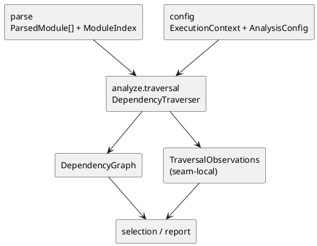

# iss-00013 Analyze Traversal — 設計（HOW）

## seam position
- upstream / prerequisite:
  - `iss-00012-parse-module-parse-and-index`
- downstream / dependent:
  - `iss-00014-analyze-relationship-and-selection`
  - `report.artifact-summary-exit-policy`
- seam responsibility:
  - parsed module 群から command-neutral な reachable frontier を確定する唯一の owner。

### UML（module / dependency）

## インターフェース契約
- input:
  - `ParsedModule[]`
  - `ModuleIndex`
  - `ExecutionContext(package_root, scope_root)`
  - `AnalysisConfig(mode, traversal depth)`
- output:
  - seam-local result:
    - `TraversalResult(graph, observations, diagnostics)`
  - shared DTO:
    - `DependencyGraph(reachable_files, edges)`
  - seam-local handoff:
    - `TraversalObservations`
      - `seed_project_relative_paths`
      - `package_stop_count`
      - `scope_stop_count`
      - `depth_stop_count`
      - `traversal_limit_reached`
      - `reachable_file_count`
  - diagnostics:
    - `traversal_limit_reached`
- invariant:
  - `DependencyGraph` は internal reachable files だけを持つ。
  - frontier 初期集合は `ModuleIndex.seed_project_relative_paths` に対応する parsed module から決定する。
  - `TraversalObservations` は report summary と strict failure 昇格の材料になる。
  - traversal は parse 済み情報だけを使い、raw filesystem を再探索しない。
  - hop semantics は seed module を `0`、seed module の direct import を `1` とし、`depth=0` では seed module のみ、`depth=1` では direct import までを reachable とする。
  - `AnalysisConfig.depth=None` は import-hop 上限なしを意味し、traversal safety limit に到達するまで reachable internal imports を辿る。
  - candidate の stop reason は `package_root` 外 -> `scope_root` 外 -> depth 超過の順に評価し、最初に成立した理由だけを authoritative に記録する。
  - `TraversalObservations` は authoritative stop reason ごとに `package_stop_count` / `scope_stop_count` / `depth_stop_count` を increment する。
  - traversal safety limit は seam-local constant `DEFAULT_TRAVERSAL_MODULE_LIMIT = 1000` とし、test では `traverse_dependencies(..., module_limit=<small int>)` で deterministic に上限到達を観測してよい。
  - module limit comparison は「新しい reachable module を追加する直前」に行い、追加後の `reachable_file_count` が `module_limit` を超える場合は、その candidate を graph に追加せず `traversal_limit_reached` error diagnostic を返す。
  - limit failure 時も partial graph / observations を `TraversalResult` で返し、`TraversalObservations.traversal_limit_reached=True` とする。final exit policy は `report` owner に残す。

## 主要フロー
1. `ModuleIndex.seed_project_relative_paths` に対応する parsed module を frontier の初期集合にする。
2. import candidate を module path 単位で引き当て、`package_root` 外 -> `scope_root` 外 -> depth 超過の順に採否を評価する。
3. reachable file と edge を `DependencyGraph` に追加する。
4. seed provenance、package/scope/depth stop、探索上限到達を `TraversalObservations` に記録する。
5. limit failure が発生した場合は `OriginSeam.ANALYZE` の fatal diagnostic を `TraversalResult.diagnostics` に追加する。
6. graph、observations、diagnostics を `TraversalResult` として downstream へ渡す。

## data / handoff
- shared DTO:
  - `DependencyGraph` は relation extraction の唯一の frontier source とする。
- seam-local:
  - `TraversalResult` は graph / observations / diagnostics を束ねる analyze.traversal の result wrapper であり、initiative canonical DTO へは昇格させない。
  - `TraversalObservations` は seed provenance と summary / diagnostics 素材を含む handoff であり、initiative canonical DTO へは昇格させない。
- downstream consumption:
  - `analyze.relationship-and-selection` は `DependencyGraph` と `TraversalObservations.seed_project_relative_paths` を使って relation 抽出対象 module と起点 file full-display rule を確定する。
  - `report` は `package_stop_count`、`scope_stop_count`、`depth_stop_count`、`reachable_file_count` を summary 素材として参照する。
  - `report` は `TraversalResult.diagnostics` の `traversal_limit_reached` を strict/warn exit policy の素材として参照する。

## テスト戦略
- Unit:
  - depth=0/1/None。
  - `package_root` 境界。
  - `scope_root` 境界。
  - traversal limit error。
- Integration:
  - `ParsedModule[] / ModuleIndex -> DependencyGraph` handoff。
  - `TraversalObservations` の counter carry。
- Verification:
  - `fx-traversal-depth-matrix`
  - `fx-traversal-package-boundary`
  - `fx-traversal-scope-stop`
  - `fx-traversal-limit-reached`
  - `fx-analyze-changed-unreachable`

## non-goals
- relation extraction と class selection。
- changed class inventory 算出。
- framework best-effort 補強。

## リスク / 注意点
- frontier 判断を relation extraction 側へ漏らすと owner が二重化する。
- traversal limit を report 側で判断すると analyze owner の失敗責務が崩れる。
- changed file semantics をここで扱い始めると `ChangedClassInventory` 独立 seam の意味が失われる。
