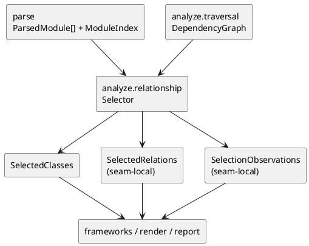

# iss-00014 Analyze Relationship And Selection — 設計（HOW）

## seam position
- upstream / prerequisite:
  - `iss-00013-analyze-traversal`
- downstream / dependent:
  - `frameworks.sqlalchemy-enrich`
  - `frameworks.pydantic-enrich`
  - `render.uml-document`
  - `report.artifact-summary-exit-policy`
- seam responsibility:
  - reachable graph から図に載せる class と relation の core contract を確定する唯一の owner。

### UML（module / dependency）

## インターフェース契約
- input:
  - `ParsedModule[]`
  - `ModuleIndex`
  - `DependencyGraph(reachable_files, edges)`
  - `TraversalObservations(seed_project_relative_paths, ...)`
- output:
  - seam-local result:
    - `SelectionResult(selected_classes, selected_relations, observations, diagnostics)`
  - shared DTO:
    - `SelectedClasses(class_ids)`
  - seam-local handoff:
    - `SelectedRelation`
      - `source_class_id`
      - `target_class_id`
      - `relation_type`
      - `evidence_kind`
    - `SelectedRelations(relations)`
    - `SelectionObservations`
      - `extracted_class_count`
      - `extracted_relation_count`
      - `warning_diagnostics`
- invariant:
  - `TraversalObservations.seed_project_relative_paths` に属する起点 file class は relation の有無に関わらず選択対象に残る。
  - dependency file class は accepted relation の source または target になった class だけを選択する。current DTO で target class を一意解決できない multi-class dependency file は ambiguity として扱い、dependency class selection を追加しない。
  - MVP の accepted relation は `DependencyGraph.edges` の source module / target module 間で、source module class と target module class がそれぞれ 1 件に一意解決できる場合だけ作る。
  - source module または target module の class が 0 件または複数件で一意解決できない場合は warning diagnostic を保持し、relation と dependency class selection は追加しない。
  - `ParsedModule.imports` と `ModuleIndex.import_candidate_paths` だけでは annotation / base class / member type / wildcard token / re-export の詳細は保持されないため、この issue では deep symbol relation や wildcard-specific warning を推測しない。
  - `SelectedRelation.relation_type` は MVP では `uses` に固定し、`evidence_kind` は `module_import` に固定する。
  - `SelectedRelations` は downstream `frameworks` が best-effort 補強できる最小情報だけを持つ。
  - `SelectionObservations` の counters は core-analysis pre-enrich count であり、framework / render 後の final diagram count ではない。final diagram summary へ載せる count は downstream `render` / `report` owner が必要に応じて置き換える。
  - `SelectionObservations` は `report` が core-analysis count を再集計せずに参照し、かつこの seam 由来 warning diagnostics を受け取るための authoritative handoff である。

## 主要フロー
1. `DependencyGraph.reachable_files` を順に読み、module ごとの class 定義を取得する。
2. `DependencyGraph.edges` と `ModuleIndex.import_candidate_paths` の parse 済み情報から module import relation 候補を抽出する。
3. `TraversalObservations.seed_project_relative_paths` に対応する起点 file class を `SelectedClasses` に追加する。
4. edge の source module class と target module class がそれぞれ 1 件に一意解決できる場合だけ、accepted relation の endpoint class を `SelectedClasses` に追加し、その relation を `SelectedRelations` に追加する。
5. endpoint ambiguity がある relation は `OriginSeam.ANALYZE` の warning diagnostics を残し、確証のない relation は handoff しない。

## data / handoff
- shared DTO:
  - `SelectedClasses` は render-ready model 構築前の authoritative class selection とする。
- seam-local:
  - `SelectedRelations` は `frameworks` と `render` が消費する relation inventory であり、initiative canonical DTO へは昇格させない。
  - `SelectionObservations` は relation / class counter と `Diagnostic[]` 形式の warning_diagnostics をまとめて carry する seam-local handoff であり、initiative canonical DTO へは昇格させない。
- downstream consumption:
  - `frameworks.*` は `SelectedClasses` と `SelectedRelations` を補強入力に使う。
  - `render` は `frameworks` 非依存でも relation inventory を基礎入力として消費できる。
  - `report` は `SelectionObservations.warning_diagnostics` と core-analysis pre-enrich counter を user-visible summary / warning count の素材として参照する。final diagram counter は render/report 側の handoff を優先する。

## テスト戦略
- Unit:
  - seed file full-display。
  - relation-only dependency selection。
  - module import endpoint ambiguity 時の diagnostic。
  - `SelectionObservations` への extracted class / relation counter 記録。
- Integration:
  - `DependencyGraph -> SelectedClasses / SelectedRelations` handoff。
  - `SelectedRelations` を使う downstream 前提 review。
  - `SelectionObservations` と warning diagnostics の report-facing carry review。
- Verification:
  - `fx-analyze-seed-full-display`
  - `fx-analyze-relation-only-dependency`
  - `fx-analyze-changed-unreachable`
  - `fx-analyze-relation-ambiguity`

## non-goals
- changed class count の決定。
- framework-specific relation 補強。
- PlantUML alias / grouping / labels の決定。

## リスク / 注意点
- dependency file 全 class を無条件で追加すると selection contract が崩れる。
- relation inventory を `render` 側で再構築すると core-analysis の owner が失われる。
- changed class semantics をここで混ぜると user-visible summary の meaning が不安定になる。
