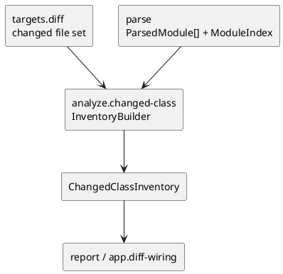

# iss-00015 Changed Class Inventory — 設計（HOW）

## seam position
- upstream / prerequisite:
  - changed file 集合の upstream handoff（`targets.diff-target-normalize` 経由）
  - `iss-00012-parse-module-parse-and-index`
- downstream / dependent:
  - `report.artifact-summary-exit-policy`
  - `app.diff-wiring`
- seam responsibility:
  - changed file 内 class 定義数の authoritative summary DTO を生成する唯一の owner。

### UML（module / dependency）

## インターフェース契約
- input:
  - changed file 集合
  - `ParsedModule[]`
  - `ModuleIndex`
- output:
  - shared DTO:
    - `ChangedClassInventory(class_count, changed_files)`
- invariant:
  - count は changed file 内 class 定義数を表す。
  - changed file 集合と `ParsedModule` の join key は `project_root` relative の normalized file path とし、`ModuleIndex.project_relative_file_to_module` を authoritative lookup に使う。
  - changed file が class を持たない場合は `changed_files` には含めても `class_count` は増えない。
  - changed file が syntax error のため `ParsedModule` join 不成立でも `changed_files` には残し、`class_count` は増やさず、追加の inventory diagnostics は作らない。

## 主要フロー
1. upstream から渡された changed file 集合を deterministic order で巡回する。
2. `ModuleIndex.project_relative_file_to_module` lookup を使って、changed file と対応する `ParsedModule` を引き当てる。
3. join 成立時だけ `ParsedModule.classes` を数え上げて `class_count` に加算し、join 不成立時は parse-origin diagnostics を再利用して `changed_files` のみ保持する。
4. selection 結果とは独立に inventory を確定し、`ChangedClassInventory` を downstream に渡す。

## data / handoff
- shared DTO:
  - `ChangedClassInventory` は initiative canonical DTO として `report` が summary に使う。
- seam-local note:
  - count の途中状態や file-level breakdown は `analyze` 内部の計算過程とし、canonical handoff には含めない。
- downstream consumption:
  - `report` は `ChangedClassInventory.class_count` を user-visible summary に使う。
  - `app.diff-wiring` は diff 実行時に original changed file context とともに transport する。

## テスト戦略
- Unit:
  - class 定義数の加算。
  - class を持たない changed file。
  - 同一 file 内複数 class。
- Integration:
  - changed file 集合と `ParsedModule[]` の join。
  - selection semantics と count semantics の分離 review。
- Verification:
  - `fx-analyze-changed-unreachable`
  - `fx-analyze-changed-file-without-class`
  - `fx-analyze-changed-syntax-error-join-miss`

## non-goals
- diff hunk 粒度 changed class 判定。
- summary 文面や stream routing の決定。
- UML 表示対象の追加 / 削除。

## リスク / 注意点
- relation / selection 結果に依存させると summary semantics が壊れる。
- changed file 集合の owner を `analyze` が奪うと `targets` / `app.diff-wiring` との境界が崩れる。
- file-level breakdown を canonical DTO に含めると model 最小集合を超える。
