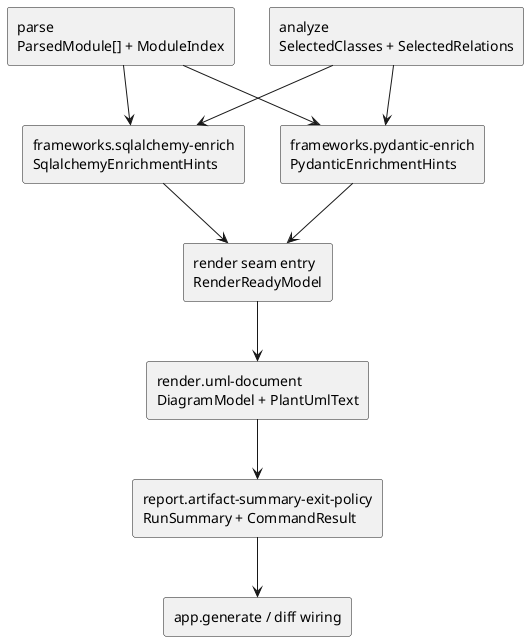
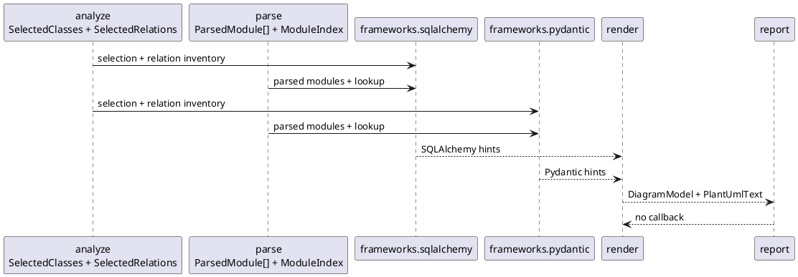

# epic-00004 Framework Render Report — 設計（HOW）

## 全体像
- target boundary:
  - `frameworks.sqlalchemy-enrich`
  - `frameworks.pydantic-enrich`
  - `render.uml-document`
  - `report.artifact-summary-exit-policy`
- impacted area:
  - upstream:
    - `parse.module-parse-and-index`
    - `analyze.relationship-and-selection`
    - `ChangedClassInventory`
    - `config.context-resolve`
    - `targets.explicit-target-normalize`
    - `targets.diff-target-normalize`
  - downstream:
    - `app.generate-wiring`
    - `app.diff-wiring`
- existing relation:
  - initiative `design.md` が whole-system boundary を定義し、initiative `plan.md` が baseline row を定義している。
  - この epic は `frameworks -> render -> report` を downstream chain として束ね、なぜ 4 issues を同一 M2 epic に置くかの依存理由だけを補う。

### UML（推奨: module / context）

## この 4 seams を 1 epic に束ねる理由
- `frameworks` を 2 issue に分けるのは、SQLAlchemy と Pydantic で evidence source が異なり、best-effort の warning 条件も別だからである。
- ただし両者はどちらも `analyze.relationship-and-selection` と `parse.module-parse-and-index` を upstream に持ち、共通 downstream が `render.uml-document` なので、epic は 1 本に束ねる方が dependency rationale が明快になる。
- `render.uml-document` を framework issues の downstream に置くのは、framework 補強が入っても入らなくても同じ deterministic renderer を使うためである。
- `report.artifact-summary-exit-policy` を同 epic に含めるのは、M2 で artifact / summary / exit semantics まで閉じないと、M3 の `app` が report policy を吸い込んでしまうからである。

## 契約

### seam contract table
| seam | owner | input | output | handoff type | downstream |
| --- | --- | --- | --- | --- | --- |
| `frameworks.sqlalchemy-enrich` | `frameworks` | `ParsedModule[]`, `ModuleIndex`, `SelectedClasses`, `SelectedRelations` | `SqlalchemyEnrichmentHints` | seam-local。render seam entry で `RenderReadyModel` に合成される hint source。report へは warning diagnostics / counters だけが渡る | `render.uml-document` |
| `frameworks.pydantic-enrich` | `frameworks` | `ParsedModule[]`, `ModuleIndex`, `SelectedClasses`, `SelectedRelations` | `PydanticEnrichmentHints` | seam-local。render seam entry で `RenderReadyModel` に合成される hint source。report へは warning diagnostics / counters だけが渡る | `render.uml-document` |
| `render.uml-document` | `render` | `ParsedModule[]`, `ModuleIndex`, `SelectedClasses`, `SelectedRelations`, `SqlalchemyEnrichmentHints`, `PydanticEnrichmentHints` | success path: `DiagramModel`, `PlantUmlText`; failure path: `RenderFailureSignal` | `render` が parse/analyze handoff から `members` と `grouping_keys` を引き当てつつ authoritative に `RenderReadyModel(classes, members, relations, class_decorations, grouping_keys, diagnostics)` を合成してから diagram shape と text を固定し、recoverable でも図を構成できない場合は `RenderFailureSignal(failure_reason, diagnostics, class_count, relation_count, partial_diagram_present)` を handoff する | `report.artifact-summary-exit-policy`, `app.*-wiring` |
| `report.artifact-summary-exit-policy` | `report` | success path: `PlantUmlText`, `DiagramModel`; failure path: `RenderFailureSignal`; plus `ExecutionContext`, upstream diagnostics / counters | `RunSummary`, `CommandResult` | shared DTO。artifact / stream / exit の最終 handoff。render success/failure のどちらもここで最終 outcome に変換する | `cli` via `app.*-wiring` |

### Data boundary
- SoR:
  - SQLAlchemy / Pydantic の framework-specific evidence の SoR は各 `frameworks.*` issue に閉じる。
  - `RenderReadyModel` の SoR は `render.uml-document` seam entry とし、`ParsedModule[]` / `ModuleIndex` / core selection / framework hint を重ねて authoritative render input を合成する。
  - `DiagramModel` と `PlantUmlText` の SoR は `render`。
  - `RenderFailureSignal` の SoR も `render` とし、diagram unbuildable の failure handoff schema を一意に決める。
  - `RunSummary` と `CommandResult` の SoR は `report`。
- consistency model:
  - `frameworks.*` が返す hint は seam-local とし、initiative canonical docs の shared DTO へむやみに昇格させない。
  - `render` は `RenderReadyModel` の内容だけを見て決定的に `DiagramModel` / `PlantUmlText` を作り、artifact path や summary counter を考慮しない。
  - `report` は upstream diagnostics / counters を消費するだけで、relation 補強や diagram 再構成を行わない。
  - `report` は `RenderFailureSignal` を受け取ったとき、missing `DiagramModel` / `PlantUmlText` を前提に summary と failure outcome を組み立てる。

## 主要フロー
- Flow-A:
  1. `frameworks.sqlalchemy-enrich` が `Mapped[T]` と `relationship("T")` から内部 class relation hint を抽出する。
  2. `frameworks.pydantic-enrich` が forward reference annotation から内部 class relation hint を抽出する。
  3. `render.uml-document` seam entry が両 hint を `SelectedClasses` / `SelectedRelations` に重ねて authoritative な `RenderReadyModel` を構成する。
- Flow-B:
  1. `render.uml-document` が `RenderReadyModel` を deterministic order で `DiagramModel` と `PlantUmlText` に変換し、recoverable でも図が組めない場合は `RenderFailureSignal` を返す。
  2. `report.artifact-summary-exit-policy` が upstream counters / diagnostics と render success/failure handoff を集約し、artifact naming、stream routing、exit decision を行う。
  3. `CommandResult` が `app.generate-wiring` / `app.diff-wiring` へ渡される。

### UML（任意: sequence / flow）

## 失敗設計
- failure mode:
  - `frameworks.sqlalchemy-enrich`:
    - `relationship("T")` が曖昧または解決不能な場合は warning を残し、relation を追加しない。
  - `frameworks.pydantic-enrich`:
    - forward reference が一意解決できない場合は warning を残し、relation を追加しない。
  - `render.uml-document`:
    - `RenderReadyModel` から diagram を組み立てられない場合は `diagram_unbuildable_after_recovery` の failure 材料を `report` へ渡す。
  - `report.artifact-summary-exit-policy`:
    - output write failure、auto naming 不能、summary synthesis 不能は hard failure とする。
- retry:
  - Git や外部 API を伴わないため retry policy は持たない。再実行の再現性は determinism で担保する。
- idempotency:
  - 同一入力・同一 output path 状態では同一 summary / 同一 text を返す。自動命名時のみ衝突回避 suffix により artifact path が変わりうる。
- partial failure:
  - framework 補強不能でも `RenderReadyModel` を保てる限り render / report は継続する。
  - render 不能または write 不能は `report` owner で non-zero に昇格する。

## 観測性 / セキュリティ
- observability:
  - `frameworks.*` は warning diagnostics と evidence kind を downstream へ渡す。
  - `render` は stable order / grouping / alias rule を review 可能な形で固定する。
  - `report` は artifact path、summary counters、failure reason、stdout/stderr routing を user-visible にする。
- role / auth:
  - 対象外。ローカル CLI prototype であり auth 境界は持たない。
- audit / pii:
  - PII を前提にしない。summary と diagnostics は解析対象の path / class 名 / failure reason 程度に留める。

## テスト戦略
- Unit:
  - SQLAlchemy relation hint 抽出。
  - Pydantic forward reference hint 抽出。
  - deterministic ordering / grouping / alias allocation。
  - summary / exit taxonomy と auto naming。
- Integration:
  - `SelectedClasses / SelectedRelations -> RenderReadyModel -> DiagramModel / PlantUmlText` handoff。
  - `PlantUmlText + upstream counters/diagnostics -> CommandResult` handoff。
- E2E:
  - command transcript と filesystem / stream observation を canonical evidence とする。
- E-AC mapping:
  - `E-AC-001` -> seam contract table と issue design handoff 節。
  - `E-AC-002` -> `fx-framework-sqlalchemy-basic`, `fx-framework-pydantic-forward-ref`, deterministic render review。
  - `E-AC-003` -> artifact naming / stdout-stderr routing / failure taxonomy review。

## 関連 ADR
- `20260416t121500z-adr-v5-ratification.md`:
   - initiative docs / v5 / epic docs の canonical split を優先する。

## 未確定事項
- なし:
  - framework / render / report の owner と dependency order は initiative canonical docs から十分に導出できる。
