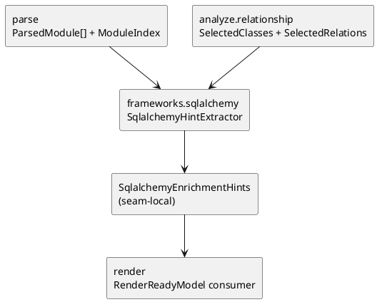

# iss-00016 Frameworks SQLAlchemy Enrich — 設計（HOW）

## seam position
- upstream / prerequisite:
  - `iss-00012-parse-module-parse-and-index`
  - `iss-00014-analyze-relationship-and-selection`
- downstream / dependent:
  - `iss-00018-render-uml-document`
- seam responsibility:
  - SQLAlchemy 固有の type / relation 表現を relation hint へ変換する唯一の owner。

### UML（必須: module / dependency）

## インターフェース契約
- input:
   - `ParsedModule[]`
   - `ModuleIndex`
   - `SelectedClasses(class_ids)`
   - `SelectedRelations(source_class_id, target_class_id, relation_type, evidence_kind)`
- output:
   - seam-local handoff:
     - `SqlalchemyEnrichmentHints`
       - `added_relations`
       - `decorated_class_ids`
       - `warning_diagnostics`
   - shared DTO への反映先:
     - `RenderReadyModel.relations`
     - `RenderReadyModel.class_decorations`
- invariant:
   - `SqlalchemyEnrichmentHints` は既存 relation inventory を破壊せず、追加 / decoration だけを表す。
   - relation 追加は内部 class へ一意接続できる場合に限る。
   - warning diagnostics は origin seam を `frameworks.sqlalchemy-enrich` として保持する。

## 主要フロー
1. `ParsedModule[]` から SQLAlchemy に該当する annotation / call site を拾う。
2. `Mapped[T]` の `T` を class lookup に照会し、内部 class relation なら hint を追加する。
3. `relationship("T")` は文字列名を `ModuleIndex` と `SelectedClasses` に照合し、一意解決できる場合だけ hint を追加する。
4. 補強結果を `SqlalchemyEnrichmentHints` と warning diagnostics にまとめて downstream へ渡す。

## 要件 → 設計マッピング
- AC-001 -> `Mapped[T]` からの relation hint 抽出フロー。
- AC-002 -> `relationship("T")` の一意解決ルール。
- EC-001 -> ambiguity は warning のみで no relation。
- constraint -> import 非実行、selection contract 非侵食、deterministic resolution。

## テスト戦略
- Unit:
  - `Mapped[T]` 解析と class lookup。
  - `relationship("T")` の一意解決 / 曖昧解決。
- Integration:
  - `SelectedRelations + ParsedModule[] -> SqlalchemyEnrichmentHints` handoff。
  - `SqlalchemyEnrichmentHints -> RenderReadyModel` 反映 review。
- E2E / manual:
  - `fx-framework-sqlalchemy-basic` を canonical verification とする。
- migration / rollback / feature flag if needed:
  - 不要。prototype の局所 seam であり dual-write は持たない。

## 要件 / 例外 -> verification mapping
- AC-001 -> `fx-framework-sqlalchemy-basic` の relation 追加 review。
- AC-002 -> string relation 一意解決 review。
- EC-001 -> ambiguity diagnostic review。
- EC-002 -> unresolved relation warning review。
- constraint -> import 非実行 / deterministic hint order review。

## リスク / 移行 / ロールバック（必要時）
- `Mapped[T]` と `relationship("T")` を同じ relation owner に寄せすぎると evidence kind が不透明になるため、hint には evidence source を保持する。
- SQLAlchemy runtime metadata を読みに行く設計へ寄ると AST-only guardrail を壊す。
- relation 追加と class selection を同時に行うと `analyze.relationship-and-selection` の owner が崩れるため、この issue は hint 追加に限定する。

## 未確定事項
- なし:
  - SQLAlchemy seam の upstream / downstream / handoff は initiative baseline row で確定済みである。
