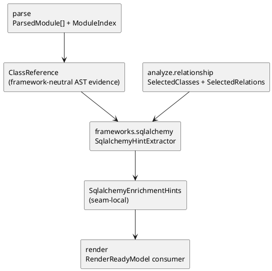

# iss-00016 Frameworks SQLAlchemy Enrich — 設計（HOW）

## seam position
- upstream / prerequisite:
  - `iss-00012-parse-module-parse-and-index`
  - `iss-00014-analyze-relationship-and-selection`
- downstream / dependent:
  - `iss-00018-render-uml-document`
- seam responsibility:
  - SQLAlchemy 固有の type / relation 表現を relation hint へ変換する唯一の owner。

### UML（必須: module / dependency）

## インターフェース契約
- input:
   - `ParsedModule[]`
     - `ParsedModule.class_references`
   - `ModuleIndex`
   - `SelectedClasses(class_ids)`
   - `SelectedRelations(source_class_id, target_class_id, relation_type, evidence_kind)`
- output:
   - seam-local handoff:
     - `SqlalchemyEnrichmentHints`
       - `added_relations`: `SelectedRelation` 相当の tuple。`relation_type=uses`、`evidence_kind=sqlalchemy_mapped | sqlalchemy_relationship_string`。
       - `warning_diagnostics`
   - downstream shared DTO への合成:
     - この issue では行わない。`render.uml-document` が `RenderReadyModel` 合成時に hint を消費する。
- invariant:
   - `SqlalchemyEnrichmentHints` は既存 relation inventory を破壊せず、追加 / decoration だけを表す。
   - relation 追加は `SelectedClasses` 内の内部 class へ一意接続できる場合に限る。
   - warning diagnostics は `origin_seam=frameworks`、`recoverability=degraded_output`、`failure_reason=None` として保持する。
   - parse/model seam の追加は framework-neutral AST evidence に限定し、SQLAlchemy 固有の解釈は `frameworks.sqlalchemy` が owner になる。

### parse/model evidence contract
- shared DTO:
  - `ClassReference`
    - `source_class_id: ClassId`
    - `target_name: str`
    - `reference_kind: EvidenceKind`
    - `reference_owner: str`
  - `ParsedModule.class_references: tuple[ClassReference, ...]`
- allowed evidence for this issue:
  - `reference_kind=annotation_subscript`, `reference_owner=<outer annotation/callee name>`, `target_name=<inner class-like name>`
    - class body の subscript annotation `x: Owner[T]` / `x: Owner[list[T]]` から、AST 上の owner name と class-like target name を抽出する。
  - `reference_kind=call_string_arg`, `reference_owner=<callee name>`, `target_name=<string argument>`
    - class body の call `callee("T")` から callee name と最初の文字列引数を抽出する。
- guardrails:
  - parse は `Mapped` / `relationship` を SQLAlchemy として解釈せず、owner/callee の文字列を generic evidence として保持するだけにする。
  - parse は relation 追加、class selection、warning diagnostics、framework 対象判定を行わない。
  - nested class の `source_class_id` は既存 `_extract_classes` と同じ qualname rule を使う。
  - function body 内の local class / local call は class reference evidence に含めない。

## 主要フロー
1. parse が class body から generic `ClassReference` を抽出し、`ParsedModule.class_references` に deterministic order で保持する。
2. `frameworks.sqlalchemy` が `reference_owner=Mapped` / `relationship` の evidence を SQLAlchemy 対象として解釈する。
3. `Mapped[T]` の `T` と `relationship("T")` の文字列を `SelectedClasses` に照合する。
4. resolver は `ModuleIndex.class_to_module` の all-internal class id を候補集合にし、short name または fully-qualified suffix で一致判定する。
5. all-internal candidate が 1 件かつその class id が `SelectedClasses` に含まれる場合だけ relation hint を追加する。
6. all-internal candidate が 0 件の場合は `sqlalchemy_relation_unresolved`、2 件以上の場合は `sqlalchemy_relation_ambiguous`、1 件だが selection 外の場合は `sqlalchemy_relation_selection_outside` warning を追加し、relation は追加しない。
7. selected 1 件と non-selected 1 件以上の mixed collision は all-internal candidate が 2 件以上なので ambiguity として扱う。
8. 補強結果を `SqlalchemyEnrichmentHints` と warning diagnostics にまとめて downstream へ渡す。

## 要件 → 設計マッピング
- AC-001 -> `ClassReference(annotation_subscript, Mapped, T)` からの relation hint 抽出フロー。
- AC-002 -> `ClassReference(call_string_arg, relationship, T)` の一意解決ルール。
- EC-001 -> ambiguity は warning のみで no relation。
- EC-003 -> selection outside は warning のみで no relation。
- EC-004 -> mixed selected/non-selected collision は ambiguity warning のみで no relation。
- constraint -> import 非実行、selection contract 非侵食、deterministic resolution。

## テスト戦略
- Unit:
  - `ParsedModule.class_references` の public model contract。
  - parse seam の generic `Owner[T]` / nested `Owner[list[T]]` / `callee("T")` evidence 抽出。
  - SQLAlchemy seam の `Mapped[T]` lookup と relation hint。
  - SQLAlchemy seam の `relationship("T")` 一意解決 / 曖昧解決 / 未解決 / selection 外。
  - 重複 relation の deterministic dedupe。
- Integration:
  - `SelectedRelations + ParsedModule[] -> SqlalchemyEnrichmentHints` handoff。
  - `SqlalchemyEnrichmentHints -> RenderReadyModel` 反映は downstream issue の消費契約として、この issue の verification には含めない。
- E2E / manual:
  - この issue では行わない。実 PlantUML 観測は downstream `iss-00018` の verification とする。
- migration / rollback / feature flag if needed:
  - 不要。prototype の局所 seam であり dual-write は持たない。

## 要件 / 例外 -> verification mapping
- AC-001 -> `Mapped[T]` fixture の relation 追加 review。
- AC-002 -> string relation 一意解決 review。
- EC-001 -> ambiguity diagnostic review。
- EC-002 -> unresolved relation warning review。
- EC-003 -> selection outside warning/no relation review。
- EC-004 -> mixed collision ambiguity warning/no relation review。
- constraint -> import 非実行 / deterministic hint order review。

## リスク / 移行 / ロールバック（必要時）
- parse/model の evidence が SQLAlchemy 固有 DTO になると seam owner が崩れるため、`ClassReference` は framework-neutral な AST evidence として定義する。
- `Mapped[T]` と `relationship("T")` を同じ relation owner に寄せすぎると evidence kind が不透明になるため、hint には evidence source を保持する。
- SQLAlchemy runtime metadata を読みに行く設計へ寄ると AST-only guardrail を壊す。
- relation 追加と class selection を同時に行うと `analyze.relationship-and-selection` の owner が崩れるため、この issue は hint 追加に限定する。

## 未確定事項
- なし:
  - 現行 `ParsedModule` の不足は framework-neutral `ClassReference` の追加で解消する。
