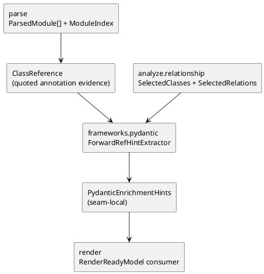

# iss-00017 Frameworks Pydantic Enrich — 設計（HOW）

## seam position
- upstream / prerequisite:
  - `iss-00012-parse-module-parse-and-index`
  - `iss-00014-analyze-relationship-and-selection`
  - `iss-00016-frameworks-sqlalchemy-enrich`
- downstream / dependent:
  - `iss-00018-render-uml-document`
- seam responsibility:
  - Pydantic quoted forward reference を relation hint へ変換する唯一の owner。
  - parse/model の quoted annotation evidence 追加は framework-neutral に保つ。

### UML（必須: module / dependency）

## インターフェース契約
- input:
  - `ParsedModule[]`
    - `ParsedModule.class_references`
  - `ModuleIndex`
  - `SelectedClasses(class_ids)`
  - `SelectedRelations(source_class_id, target_class_id, relation_type, evidence_kind)`
- output:
  - seam-local handoff:
    - `PydanticEnrichmentHints`
      - `added_relations`: `SelectedRelation` 相当の tuple。`relation_type=uses`、`evidence_kind=pydantic_forward_ref`。
      - `warning_diagnostics`
  - downstream shared DTO への合成:
    - この issue では行わない。`render.uml-document` が `RenderReadyModel` 合成時に hint を消費する。
- invariant:
  - relation 追加は source class id と resolved target class id の両方が `SelectedClasses` 内にある場合に限る。
  - target 解決は all-internal candidate が 1 件かつ `SelectedClasses` 内の internal class へ一意接続できる場合に限る。
  - `PydanticEnrichmentHints` は selection contract を変更しない。
  - warning diagnostics は `origin_seam=frameworks`、`recoverability=degraded_output`、`failure_reason=None` として保持する。
  - parse/model seam の追加は framework-neutral quoted annotation evidence に限定し、Pydantic 固有の解釈は `frameworks.pydantic` が owner になる。

### parse/model evidence contract
- existing shared DTO:
  - `ClassReference`
    - `source_class_id: ClassId`
    - `target_name: str`
    - `reference_kind: EvidenceKind`
    - `reference_owner: str`
- new generic evidence for this issue:
  - `reference_kind=class_base`, `reference_owner=base`, `target_name=<direct base name>`
    - class definition の direct base から抽出する。`CustomBase`、`BaseModel`、`pydantic.BaseModel` など direct base name を generic evidence として保持し、parse は Pydantic 解釈を行わない。
  - `reference_kind=annotation_string`, `reference_owner=annotation`, `target_name=T`
    - direct quoted annotation `field: "T"` から抽出する。
  - `reference_kind=annotation_string`, `reference_owner=<outer annotation owner>`, `target_name=T`
    - subscript annotation 内の quoted forward reference `list["T"]` / `Optional["T"]` / `Union["T", "U"]` から抽出する。
- guardrails:
  - parse は quoted string が Pydantic 由来かを import 実行で検証しない。
  - parse は relation 追加、class selection、warning diagnostics、framework 対象判定を行わない。
  - existing SQLAlchemy evidence `annotation_subscript` / `call_string_arg` の挙動を壊さない。
  - nested function / async function / nested class / lambda body 内の annotation は class reference evidence に含めない。

## 主要フロー
1. parse が class body から generic quoted annotation `ClassReference` を抽出し、`ParsedModule.class_references` に deterministic order で保持する。
2. `frameworks.pydantic` が generic `class_base` evidence のうち `target_name=BaseModel` または `target_name=pydantic.BaseModel` を持つ source class だけを Pydantic eligible とみなす。
3. `frameworks.pydantic` が eligible source class の `reference_kind=annotation_string` evidence だけを Pydantic forward reference 対象として解釈する。
4. `source_class_id` が `SelectedClasses` 外の場合は warning を出さずに evidence を無視し、selection frontier を広げない。
5. `target_name` を `ModuleIndex.class_to_module` の all-internal class id 候補集合に照合する。
6. short name、fully-qualified suffix、module-qualified string 相当が 1 件だけ一致し、かつ `SelectedClasses` に含まれる場合だけ relation hint を追加する。
7. all-internal candidate が 0 件の場合は `pydantic_forward_ref_unresolved`、2 件以上の場合は `pydantic_forward_ref_ambiguous`、1 件だが selection 外の場合は `pydantic_forward_ref_selection_outside` warning を追加し、relation は追加しない。
8. selected 1 件と non-selected 1 件以上の mixed collision は all-internal candidate が 2 件以上なので ambiguity として扱う。
9. Pydantic eligibility のない class の quoted annotation は warning なしで無視する。
10. 補強結果を `PydanticEnrichmentHints` と warning diagnostics にまとめて downstream へ渡す。

## 要件 → 設計マッピング
- AC-001 -> `ClassReference(class_base, base, BaseModel)` と `ClassReference(annotation_string, annotation, T)` からの relation hint 抽出フロー。
- AC-002 -> `ClassReference(class_base, base, BaseModel)` と `ClassReference(annotation_string, list | Optional | Union, T)` からの relation hint 抽出フロー。
- EC-001 -> ambiguity は warning のみで no relation。
- EC-002 -> unresolved は warning のみで no relation。
- EC-003 -> selection outside は warning のみで no relation。
- EC-004 -> mixed selected/non-selected collision は ambiguity warning のみで no relation。
- unselected source -> warning なしで no relation。
- non-Pydantic source -> warning なしで no relation。
- constraint -> import 非実行、selection 非侵食、deterministic resolution。

## テスト戦略
- Unit:
  - parse seam の direct quoted annotation `field: "T"` evidence 抽出。
  - parse seam の quoted subscript annotation `list["T"]` / `Optional["T"]` / `Union["T", "U"]` evidence 抽出。
  - parse seam の direct class base `BaseModel` / `pydantic.BaseModel` evidence 抽出。
  - nested function / async function / nested class / lambda body annotation exclusion。
  - Pydantic seam の non-Pydantic quoted annotation ignore。
  - Pydantic seam の direct quoted forward reference relation hint。
  - Pydantic seam の quoted subscript forward reference relation hint。
  - ambiguity / unresolved / selection outside / mixed collision warning code。
  - existing relation inventory と same extraction 内の relation triple dedupe。
- Integration:
  - `parse_target_set -> PydanticEnrichmentHints` handoff fixture。
  - `PydanticEnrichmentHints -> RenderReadyModel` 反映は downstream issue の消費契約として、この issue の verification には含めない。
- E2E / manual:
  - この issue では行わない。実 PlantUML 観測は downstream `iss-00018` の verification とする。
- migration / rollback / feature flag if needed:
  - 不要。prototype の局所 seam であり rollout 分岐を持たない。

## 要件 / 例外 -> verification mapping
- AC-001 -> direct quoted annotation relation hint review。
- AC-002 -> quoted subscript annotation relation hint review。
- EC-001 -> ambiguity diagnostic review。
- EC-002 -> unresolved warning review。
- EC-003 -> selection outside warning/no relation review。
- EC-004 -> mixed collision ambiguity warning/no relation review。
- constraint -> import 非実行 / deterministic hint order / triple dedupe review。

## リスク / 移行 / ロールバック（必要時）
- parse/model の evidence が Pydantic 固有 DTO になると seam owner が崩れるため、`ClassReference` は framework-neutral な quoted annotation evidence として拡張する。
- annotation 解釈を general Python typing support まで広げると seam が膨らむため、prototype では quoted forward reference の best-effort に限定する。
- relation 追加と class selection を同時に行うと `analyze.relationship-and-selection` の owner が崩れるため、この issue は hint 追加に限定する。

## 未確定事項
- なし:
  - 現行 `ClassReference` は再利用し、追加が必要なのは quoted annotation evidence kind のみである。
