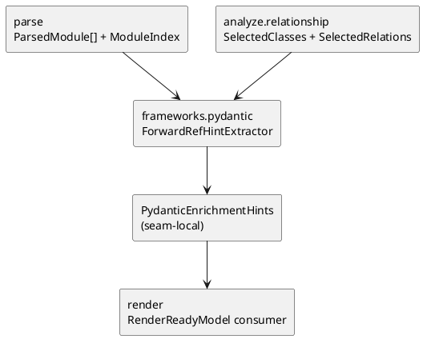

# iss-00017 Frameworks Pydantic Enrich — 設計（HOW）

## seam position
- upstream / prerequisite:
  - `iss-00012-parse-module-parse-and-index`
  - `iss-00014-analyze-relationship-and-selection`
- downstream / dependent:
  - `iss-00018-render-uml-document`
- seam responsibility:
  - Pydantic forward reference を relation hint へ変換する唯一の owner。

### UML（必須: module / dependency）

## インターフェース契約
- input:
   - `ParsedModule[]`
   - `ModuleIndex`
   - `SelectedClasses(class_ids)`
   - `SelectedRelations(source_class_id, target_class_id, relation_type, evidence_kind)`
- output:
   - seam-local handoff:
     - `PydanticEnrichmentHints`
       - `added_relations`
       - `warning_diagnostics`
   - shared DTO への反映先:
     - `RenderReadyModel.relations`
- invariant:
   - relation 追加は内部 class へ一意接続できる場合に限る。
   - `PydanticEnrichmentHints` は selection contract を変更しない。
   - warning diagnostics は origin seam を `frameworks.pydantic-enrich` として保持する。

## 主要フロー
1. `ParsedModule[]` から Pydantic model の annotation を読む。
2. quoted forward reference を `ModuleIndex` と `SelectedClasses` に照会する。
3. 一意解決できる場合だけ relation hint を追加する。
4. 補強結果を `PydanticEnrichmentHints` と warning diagnostics にまとめて downstream へ渡す。

## 要件 → 設計マッピング
- AC-001 -> quoted forward reference の一意解決フロー。
- AC-002 -> relation inventory にない reference を hint として補う flow。
- EC-001 -> ambiguity は warning のみで no relation。
- constraint -> import 非実行、selection 非侵食、deterministic resolution。

## テスト戦略
- Unit:
  - quoted forward reference の lookup。
  - 一意解決 / 曖昧解決 / 未解決の分岐。
- Integration:
  - `SelectedRelations + ParsedModule[] -> PydanticEnrichmentHints` handoff。
  - `PydanticEnrichmentHints -> RenderReadyModel` 反映 review。
- E2E / manual:
  - `fx-framework-pydantic-forward-ref` を canonical verification とする。
- migration / rollback / feature flag if needed:
  - 不要。prototype の局所 seam であり rollout 分岐を持たない。

## 要件 / 例外 -> verification mapping
- AC-001 -> `fx-framework-pydantic-forward-ref` の relation 追加 review。
- AC-002 -> hint handoff review。
- EC-001 -> ambiguity diagnostic review。
- EC-002 -> unresolved warning review。
- constraint -> import 非実行 / deterministic hint order review。

## リスク / 移行 / ロールバック（必要時）
- annotation 解釈を general Python typing support まで広げると seam が膨らむため、prototype では forward reference の best-effort に限定する。
- Pydantic hint と SQLAlchemy hint を 1 issue で混ぜると evidence source ごとの warning review が曖昧になる。
- relation 追加と class selection を同時に行うと `analyze.relationship-and-selection` の owner が崩れる。

## 未確定事項
- なし:
  - Pydantic seam の upstream / downstream / handoff は initiative baseline row で確定済みである。
