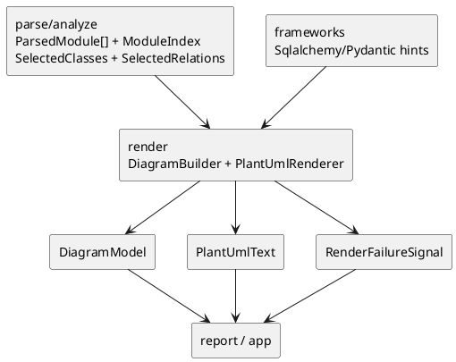

# iss-00018 Render UML Document — 設計（HOW）

## seam position
- upstream / prerequisite:
  - `iss-00012-parse-module-parse-and-index`
  - `iss-00014-analyze-relationship-and-selection`
  - `iss-00016-frameworks-sqlalchemy-enrich`
  - `iss-00017-frameworks-pydantic-enrich`
- downstream / dependent:
  - `iss-00019-report-artifact-summary-exit-policy`
  - `app.generate-wiring`
  - `app.diff-wiring`
- seam responsibility:
  - render-ready input を deterministic な diagram / text に変換する唯一の owner。

### UML（必須: module / dependency）

## インターフェース契約
- input:
   - `ParsedModule[]`
   - `ModuleIndex`
   - `SelectedClasses(class_ids)`
   - `SelectedRelations(source_class_id, target_class_id, relation_type, evidence_kind)`
   - `SqlalchemyEnrichmentHints`
   - `PydanticEnrichmentHints`
- output:
   - shared DTO:
     - `DiagramModel(containers, rendered_classes, rendered_relations, aliases)`
     - `PlantUmlText(text)`
     - `RenderFailureSignal(failure_reason, diagnostics, class_count, relation_count, partial_diagram_present)`
   - seam-local handoff:
     - `RenderReadyModel`
       - classes
       - members
       - relations
       - class_decorations
       - grouping_keys
       - diagnostics
     - `RenderOrderingPlan`
       - class order
       - relation order
       - alias allocation
       - group/container order
   - invariant:
   - `render` は `ParsedModule[]` / `ModuleIndex` / `SelectedClasses` / `SelectedRelations` と framework hints から authoritative な `RenderReadyModel` を合成する唯一の owner である。
   - 現行 `ParsedModule` は member 定義 DTO を持たないため、`RenderReadyModel.members` はこの issue では `()` を authoritative に保持し、member extraction / member rendering は先回り実装しない。
   - 現行 SQLAlchemy / Pydantic hints は relation と diagnostics のみを返すため、`RenderReadyModel.class_decorations` はこの issue では `()` を authoritative に保持する。
   - `RenderReadyModel.grouping_keys` は selected `ClassId` の module path 部分（`<module_path>:<qualname>` の `<module_path>`）を唯一の authoritative source として導出する。`ModuleIndex` は selected class existence / input consistency の補助 lookup としてだけ使い、grouping source にはしない。
   - success path の `DiagramModel` と `PlantUmlText` は同一 `RenderReadyModel` に対して決定的である。
   - `RenderOrderingPlan` は render 内部に閉じ、artifact path や summary counter を持たない。
   - framework warning は relation / decoration input としてのみ扱い、render 自身が警告を再分類しない。
   - render は success path では `DiagramModel` / `PlantUmlText` を、failure path では `RenderFailureSignal` を返し、両方を同時に authoritative output としない。
   - `DiagramModel.containers` は grouping key の stable list であり、class-to-container association は `ClassId` の module path 部分（`<module_path>:<qualname>` の `<module_path>`）から導出する。`DiagramModel` に parallel mapping は追加しない。
   - PlantUML serializer は `DiagramModel.rendered_classes` を class id 由来の container key で grouping し、`DiagramModel.containers` の順に package を出力する。
   - `RenderFailureSignal.class_count` / `relation_count` は `RenderReadyModel` 合成後、diagram build 前の authoritative count とする。
   - `RenderFailureSignal.partial_diagram_present` は `class_count > 0` のとき `true`、empty selected class failure では `false` とする。
   - `RenderReadyModel.diagnostics` と `RenderFailureSignal.diagnostics` は `ParsedModule[].diagnostics`、`SqlalchemyEnrichmentHints.warning_diagnostics`、`PydanticEnrichmentHints.warning_diagnostics` を deterministic に carry し、render 自身が原因を検出した場合は `origin_seam=render` の diagnostic を追加する。
   - selected `ClassId` が `ParsedModule[].classes` または `ModuleIndex.class_to_module` に存在しない場合は phantom class を描かず、`origin_seam=render` の `render_selected_class_missing` diagnostic を追加して failure path へ送る。

## 主要フロー
1. `SelectedClasses.class_ids` を `ModuleIndex` と `ParsedModule[]` で存在確認し、class id の module path 部分を grouping key として取得する。members は現行 DTO では `()` として保持する。存在しない selected class は render failure cause として diagnostics に残す。
2. `SelectedRelations` と framework hints を突き合わせて relation / decoration を確定し、`RenderReadyModel` を合成する。
3. `RenderOrderingPlan` で alias、container、class、relation の順序を確定する。
4. `RenderReadyModel` から `DiagramModel` を構築する。
5. 図を構築できる場合は `DiagramModel` を PlantUML text へシリアライズして `PlantUmlText` として返す。
6. recoverable diagnostics を踏まえても図を構築できない場合は、`RenderFailureSignal` を返して report へ失敗経路を handoff する。

## 要件 → 設計マッピング
- AC-001 -> `RenderReadyModel` composition + `RenderOrderingPlan` による stable order / class id 由来 grouping / labels / aliases。
- AC-002 -> framework 補強済み relation の `RenderReadyModel` 反映。現行 upstream に decoration hint がないため `class_decorations=()` を保持する。
- EC-001 -> deterministic alias allocation。
- AC-003 / EC-003 -> `RenderFailureSignal` による diagram unbuildable の failure handoff。
- constraint -> filesystem write / summary / exit policy を持たない。

## テスト戦略
- Unit:
  - class order / relation order / grouping order。
  - alias allocation。
  - PlantUML text serialization。
- Integration:
  - `SelectedClasses / SelectedRelations + framework hints -> RenderReadyModel -> DiagramModel -> PlantUmlText` handoff。
  - `SelectedClasses / SelectedRelations + framework hints -> RenderFailureSignal` handoff。
  - framework 補強済み input を含む render review。
- E2E / manual:
  - deterministic render snapshot review を canonical verification とする。
- migration / rollback / feature flag if needed:
  - 不要。render seam は pure transform であり rollout 分岐を持たない。

## 要件 / 例外 -> verification mapping
- AC-001 -> same-input same-output snapshot review。
- AC-002 -> framework hint reflected render review。
- EC-001 -> alias determinism review。
- EC-002 -> class-only render review。
- EC-003 -> failure handoff review。
- constraint -> no filesystem write / no summary review。

## リスク / 移行 / ロールバック（必要時）
- alias と grouping を `report` 側で決めると deterministic render owner が崩れる。
- diagram shape を framework-specific special case で分岐させすぎると renderer の一貫性が落ちる。
- empty diagram success と class-only success を混同すると initiative acceptance と衝突する。

## 未確定事項
- なし:
  - render seam の upstream / downstream / output DTO は initiative canonical docs で確定済みである。
