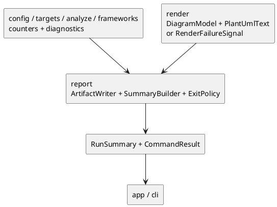

# iss-00019 Report Artifact Summary Exit Policy — 設計（HOW）

## seam position
- upstream / prerequisite:
  - `iss-00008-config-context-resolve`
  - `iss-00010-vcs-diff-file-collect`
  - `iss-00009-targets-explicit-target-normalize`
  - `iss-00011-targets-diff-target-normalize`
  - `iss-00012-parse-module-parse-and-index`
  - `iss-00013-analyze-traversal`
  - `iss-00014-analyze-relationship-and-selection`
  - `iss-00015-changed-class-inventory`
  - `iss-00016-frameworks-sqlalchemy-enrich`
  - `iss-00017-frameworks-pydantic-enrich`
  - `iss-00018-render-uml-document`
- downstream / dependent:
  - `app.generate-wiring`
  - `app.diff-wiring`
  - `cli.request-bind-and-exit-contract`
- seam responsibility:
  - artifact write、summary synthesis、stream routing、exit policy の唯一の owner。

### UML（必須: module / dependency）

## インターフェース契約
- input:
   - `PlantUmlText(text)?`
   - `DiagramModel(containers, rendered_classes, rendered_relations, aliases)?`
   - `RenderFailureSignal(failure_reason, diagnostics, class_count, relation_count, partial_diagram_present)?`
   - `ExecutionContext(execution_cwd, project_root, package_root, scope_root)`
   - `AnalysisConfig(mode, output, diff settings, target_python)`
   - VCS diff diagnostics
   - `TargetSet.observations`
   - `TraversalObservations`
   - `ChangedClassInventory`
   - framework / parse / analyze diagnostics
   - render failure handoff
- output:
   - shared DTO:
     - `RunSummary(counters, failure_reason)`
     - `CommandResult(artifact_path, summary, diagnostics, exit_code)`
   - seam-local handoff:
     - `ArtifactNamingDecision`
       - base name
       - resolved output path
       - collision suffix
     - `ExitPolicyDecision`
       - outcome kind
       - artifact_write
       - stream target
       - exit code
       - strict_promoted_failure_reasons
- invariant:
   - `.puml` artifact の write owner は `report` だけである。
   - `ArtifactNamingDecision` は `execution_cwd` を基準に path を解決し、`process_cwd` を参照しない。
   - `generate` path では upstream が zero `ChangedClassInventory(class_count=0, changed_files=[])` を supply し、`report` は DTO の optional 分岐を持たない。
   - render が `RenderFailureSignal.failure_reason=diagram_unbuildable_after_recovery` を handoff した場合、`report` は `DiagramModel` / `PlantUmlText` 不在でも summary と non-zero outcome を組み立てる。
   - strict promotion は upstream diagnostics の `failure_reason` が `strict_resolution_failure`, `strict_syntax_error`, `strict_wildcard_resolution_failure`, `strict_diff_scope_exclusion` のいずれかに一致するかで決定する。
   - warning classifier に使う `Diagnostic.recoverability` は producer-side に固定し、`targets.*` / `vcs.diff-file-collect` / `config.context-resolve` の operational warning は `noop`、`parse.module-parse-and-index` / `analyze.relationship-and-selection` / `frameworks.*` の omitted-or-ambiguous content warning は `degraded_output` を使う。
   - parse の syntax degradation は warn mode では `recoverability=degraded_output` かつ `failure_reason=null` の warning diagnostic、strict mode では `failure_reason=strict_syntax_error` を持つ failure diagnostic として解釈する。
   - render 起因の class / relation omission は success-path warning では扱わず、必ず `RenderFailureSignal` に昇格させる。
   - `warning_only_success` は failure diagnostic なし、かつ warning diagnostics の `recoverability` がすべて `noop` のときに選ぶ。
   - `degraded_success` は failure diagnostic なし、かつ warning diagnostics に `recoverability=degraded_output` が 1 件以上あるときに選ぶ。
   - success path の extracted class / relation counter は最終 `DiagramModel.rendered_classes` / `rendered_relations` を authoritative とする。
   - `RenderFailureSignal` が存在する non-success outcome では、summary の extracted class / relation counter は signal 内の `class_count` / `relation_count` を authoritative とする。
   - render / selection / changed inventory などの producer seam が未実行のまま hard failure になった場合、未供給 counter は `0` fallback で `RunSummary` を合成する。
   - `output_write_failure` のように render 成功後に起きる hard failure では、counter source は `0` fallback へ落とさず `DiagramModel.rendered_classes` / `rendered_relations` を使う。
   - `ExitPolicyDecision` は strict / warn、clean success / warning-only success / degraded success / strict promoted failure / degraded failure / hard failure を一元化し、他 seam の判断を上書きしない。

## 主要フロー
1. `AnalysisConfig.output` と `ExecutionContext.execution_cwd` から `ArtifactNamingDecision` を作る。
2. upstream diagnostics の `failure_reason`, `recoverability`, `RenderFailureSignal` を評価して `ExitPolicyDecision` を作る。
3. success path と render 成功後の `output_write_failure` hard failure では `DiagramModel.rendered_classes` / `rendered_relations` を、`RenderFailureSignal` を伴う non-success outcome では signal 内の `class_count` / `relation_count` を、producer seam 未実行の hard failure では `0` fallback を `RunSummary` の authoritative counter source に選ぶ。
4. success 系 outcome のときだけ `.puml` artifact を write する。
5. authoritative counter source と upstream diagnostics から `RunSummary` を作る。
6. `ExitPolicyDecision` で stream target と exit code を決め、`CommandResult` を組み立てる。

## outcome decision table
| outcome kind | artifact write | summary stream | exit code |
| --- | --- | --- | --- |
| `clean_success` | yes | stdout | `0` |
| `warning_only_success` | yes | stdout | `0` |
| `degraded_success` | yes | stdout | `0` |
| `strict_promoted_failure` | no | stderr | non-zero |
| `degraded_failure` | no | stderr | non-zero |
| `hard_failure` | no authoritative artifact | stderr | non-zero |

## outcome classifier rule
| classifier input | chosen outcome |
| --- | --- |
| failure diagnostic なし、warning diagnostic なし、`RenderFailureSignal` なし | `clean_success` |
| failure diagnostic なし、warning diagnostics あり、全件 `recoverability=noop`、`RenderFailureSignal` なし | `warning_only_success` |
| failure diagnostic なし、warning diagnostics に `recoverability=degraded_output` を 1 件以上含み、`RenderFailureSignal` なし | `degraded_success` |
| strict-promotable failure diagnostic あり | `strict_promoted_failure` |
| `RenderFailureSignal` あり、または strict promotion ではない failure diagnostic あり | `degraded_failure` |
| artifact write failure などで authoritative artifact を確定できない | `hard_failure` |

## warning producer mapping
| origin seam | warning class | required `recoverability` |
| --- | --- | --- |
| `targets.*`, `vcs.diff-file-collect`, `config.context-resolve` | artifact completeness を下げない operational warning | `noop` |
| `parse.module-parse-and-index` | warn mode の syntax degradation と、その他の継続可能な omitted-content warning | `degraded_output` |
| `analyze.relationship-and-selection` | relation ambiguity / omission warning | `degraded_output` |
| `frameworks.sqlalchemy-enrich`, `frameworks.pydantic-enrich` | unresolved / ambiguous framework enrich warning | `degraded_output` |

## 要件 → 設計マッピング
- AC-001 -> clean success / warning-only success / degraded success の artifact write + stdout summary と `DiagramModel` 起点 counter。
- AC-002 -> `ArtifactNamingDecision` の auto naming / `--output` resolve / suffix collision。
- AC-003 -> `ExitPolicyDecision` の strict promoted failure / degraded failure / hard failure と、`warning_only_success` / `degraded_success` の classifier rule。
- EC-001 -> no-op warning を summary に残したまま success 維持。
- constraint -> write owner / stream owner / exit owner の単一化。

## テスト戦略
- Unit:
  - auto naming と suffix collision。
  - summary counter synthesis。
  - exit taxonomy と stream routing。
- Integration:
  - `PlantUmlText + upstream counters/diagnostics -> RunSummary / CommandResult` handoff。
  - `RenderFailureSignal + upstream counters/diagnostics -> RunSummary / CommandResult` handoff。
  - `execution_cwd` 基準 path resolve review。
  - generate zero inventory / diff actual inventory review。
  - `RenderFailureSignal` + strict-promotable diagnostics review。
- E2E / manual:
  - command transcript と filesystem / stdout / stderr observation を canonical verification とする。
- migration / rollback / feature flag if needed:
  - 不要。report seam は単一 owner であり migration layer を持たない。

## 要件 / 例外 -> verification mapping
- AC-001 -> success path artifact + stdout summary review。
- AC-002 -> auto naming / suffix collision filesystem review。
- AC-003 -> failure taxonomy review。
- EC-001 -> warning-only success review。
- EC-002 -> `output_write_failure` review。
- EC-003 -> `diagram_unbuildable_after_recovery` review。
- constraint -> write owner / stream owner / exit owner review。

## リスク / 移行 / ロールバック（必要時）
- `report` が render や config semantics を再計算すると owner が崩れるため、入力 DTO と counter source の受け取りに徹する。
- success / failure の stream rule を `cli` 側へ押し戻すと initiative acceptance と衝突する。
- artifact write failure を warning 扱いすると filesystem 正本契約が壊れる。
- `hard_failure` 時に部分ファイルが残ることはありうるが、それを authoritative artifact として返さず、`CommandResult.artifact_path` には成功 artifact を載せない。

## 未確定事項
- なし:
  - report seam の upstream / downstream / DTO / failure taxonomy は initiative canonical docs で確定済みである。
