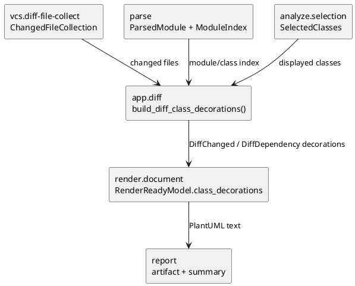

# iss-00033 Render Diff Class Colorization — 設計（HOW）

## 目的・制約
- 目的:
  - `pyclassuml diff` の class diagram で、Git 差分に含まれる changed class と、到達関係で表示される dependency-only class を PlantUML/SVG 上で色分けする。
  - 初期 baseline の 2 分類色分けを、既存 diff pipeline と render seam に自然に接続する。
- MUST:
  - diff command だけに colorization を適用する。
  - changed class / dependency-only class の 2 分類を deterministic に class box へ反映する。
  - `changed_class_count` summary、既存 relation notation、Protocol stereotype を壊さない。
- MUST NOT:
  - render 層から Git を読まない。
  - hunk 粒度や deleted class 表示をこの issue で扱わない。
  - generate command に diff-specific style を出さない。
- 非交渉制約:
  - AST-only、read-only、import 非実行、同一入力で同一 `.puml`。

## 既存実装 / 規約の理解
- 参照した実装:
  - `src/pyclassuml/app/diff.py`
    - `collect_diff_files -> normalize_diff_targets -> parse -> traverse -> select -> build_changed_class_inventory -> frameworks -> render -> report` の順で diff pipeline を組み立てる。
    - `vcs_collection.collection.entries[].current_project_relative_path` から changed file context を得ている。
  - `src/pyclassuml/analyze/changed.py`
    - `ChangedClassInventory` は changed file と parsed module class 数を summary 用に数える。図の style は扱わない。
  - `src/pyclassuml/render/document.py`
    - `compose_render_ready_model` が `RenderReadyModel.class_decorations` を合成し、`render_plantuml_text` が stereotype として出力する。
    - `Protocol` decoration が既に存在する。
  - `src/pyclassuml/model/contracts.py`
    - `RenderReadyModel.class_decorations` は `(class_id, decoration)` pair の tuple。
- 採用するパターン:
  - changed class 判定は `app.diff` で作る。理由は diff command の actual changed-file context を持っている owner が `app.diff` だから。
  - render は handoff された decoration だけを PlantUML style に変換する。Git には依存しない。
  - 既存 `class_decorations` を拡張利用し、`DiffChanged` / `DiffDependency` stereotype を追加する。
- 採用しないもの:
  - `ChangedClassInventory` を class id list まで拡張する案。
    - summary DTO の責務が広がるため採用しない。
  - `DiagramModel` に command-specific flag を入れる案。
    - render-ready model が decoration owner なので不要。
  - inline `#color` を class declaration に直接付ける案。
    - Protocol stereotype と組み合わせる場合、style declaration を stereotype に寄せた方が安定する。

## 採用方針 / トレードオフ
- 決定:
  - `render_uml_document(..., class_decorations=())` の optional keyword を追加する。
  - `app.diff` は selected class のうち changed file 内 class へ `DiffChanged`、それ以外へ `DiffDependency` を渡す。
  - `app.generate` は引数を渡さないため、diff-specific style は出ない。
  - render は `DiffChanged` / `DiffDependency` decoration がある場合だけ PlantUML `skinparam class` block を出力する。
- デフォルトテーマ:
  - `DiffChanged`: 背景 `#fff3b0`、枠線 `#d39e00`
  - `DiffDependency`: 背景 `#e8f4ff`、枠線 `#5b8def`
  - 理由: changed は注意を引く黄色系、dependency-only は補助的な青系として判別しやすく、既存 relation 色には干渉しない。
- トレードオフ:
  - stereotype 名は `.puml` に出る可能性があるが、PlantUML 標準の style target として安定する。
  - 追加 / 変更 / 削除の細分化はしない。今回の baseline は 2 分類である。

## 依存関係分析
- upstream:
  - `vcs.diff-file-collect`: changed files を Git から read-only に集める。
  - `targets.diff-target-normalize`: diff seed を scope/filter する。
  - `parse`: changed file と class id の join に必要な `ParsedModule` / `ModuleIndex` を作る。
  - `analyze.selection`: 実際に図に表示される `SelectedClasses` を決める。
- current issue owner:
  - `app.diff`: selected class と changed file context の join から diff class decorations を作る。
  - `render.document`: decoration stereotype と style declaration を PlantUML へ出力する。
- downstream:
  - `report`: summary / artifact write を現状どおり行う。色分け logic は持たない。
- 実装起点:
  - まず render の decoration/style contract を固定し、次に `app.diff` の handoff を追加する。

## Module Dependency Diagram
### UML（module dependency delta）


## インターフェース契約
- `render_uml_document`:
  - 追加 keyword:
    - `class_decorations: tuple[tuple[ClassId, str], ...] = ()`
  - 意味:
    - command/app layer から渡される追加 decoration。
    - `Protocol` decoration と merge される。
    - unknown class id は既存 selected class validation に従い、表示対象 class にだけ実質反映される。
- `compose_render_ready_model`:
  - 追加 keyword:
    - `class_decorations: tuple[tuple[ClassId, str], ...] = ()`
  - merge rule:
    - auto `Protocol` decoration と external decoration を `(class_id, decoration)` で dedupe し、deterministic sort する。
- `render_plantuml_text`:
  - `DiffChanged` / `DiffDependency` が存在する場合、`@startuml` 直後に default theme の `skinparam class` block を出す。
  - class declaration は既存 `_class_stereotype` により `<<Protocol>> <<DiffChanged>>` のように複数 stereotype を出せる。
- `app.diff` private helper:
  - `_diff_class_decorations(changed_files, parsed_modules, module_index, selected_classes) -> tuple[tuple[ClassId, str], ...]`
  - changed file に定義され、かつ `selected_classes.class_ids` に含まれる class: `DiffChanged`
  - `selected_classes.class_ids` に含まれるが `DiffChanged` ではない class: `DiffDependency`

## ディレクトリ / ファイル変更計画
```text
.
|-- src/
|   `-- pyclassuml/
|       |-- app/
|       |   `-- diff.py                 # Modify: diff class decoration handoff
|       |-- render/
|       |   `-- document.py             # Modify: style declaration and extra decoration merge
|       `-- model/
|           `-- contracts.py            # Modify only if validation/helper needs are insufficient
|-- tests/
|   |-- app/
|   |   `-- test_diff.py                # Modify: E2E diff colorization, generate unaffected via app tests if needed
|   `-- render/
|       `-- test_document.py            # Modify: style rendering, Protocol coexistence, deterministic output
`-- build/
    `-- manual-tests/
        `-- pyclassuml-manual-env/      # Manual: ignored env for diff .puml/.svg verification
```

## 要件 → 設計マッピング
- AC-001:
  - `app.diff` が changed file 内 selected class へ `DiffChanged` decoration を渡し、render が changed theme を出す。
- AC-002:
  - `app.diff` が selected だが changed file 内ではない class へ `DiffDependency` decoration を渡す。
- AC-003:
  - `app.generate` は追加 decoration を渡さない。render は decoration がない限り style block を出さない。
- AC-004:
  - render は class declaration の stereotype/style だけを追加し、relation line generation は変更しない。
- AC-005:
  - helper output、decoration merge、style block、class order を sort して deterministic にする。
- EC-001:
  - changed file に class がない場合、`module_index` / `ParsedModule.classes` join から `DiffChanged` は作られない。
- EC-002:
  - selected class に含まれない changed class は color declaration 対象にしない。
- EC-003:
  - parsed class join 失敗時は `DiffChanged` を捏造しない。
- EC-004:
  - changed-file context は既存 `vcs` / `targets.diff` の結果だけを見る。

## テスト戦略
- Unit / render:
  - `render_plantuml_text` が diff style block と `<<DiffChanged>>` / `<<DiffDependency>>` を出す。
  - `Protocol` と diff stereotype が同居する。
  - decoration がない generate-like input では style block が出ない。
- App / integration:
  - `pyclassuml diff` E2E で changed class と dependency-only class が別 stereotype になる。
  - `changed_class_count` は従来どおり維持される。
  - relation notation `*--` / `o--` / `-up-|>` / `..up|>` / `..>` は変わらない。
  - untracked on/off、head current-state は既存 semantics に従う。
- Manual:
  - `build/manual-tests/pyclassuml-manual-env` の git 差分を一時的に作り、`pyclassuml diff --base HEAD --current-state working-tree` で `.puml` と `.svg` を生成する。
  - `.puml` で `skinparam class`、`<<DiffChanged>>`、`<<DiffDependency>>`、既存 relation notation を確認する。
  - manual env の変更は restore し、repo root の `uv.lock` を残さない。

## リスク / ロールバック
- リスク:
  - `class_decorations` を style 用にも使うことで stereotype 表示が増える。
    - ただし PlantUML 標準の style target として有用であり、現在も Protocol stereotype を出しているため整合する。
  - changed class と selected class の join を誤ると dependency-only へ誤分類される。
    - `module_index.project_relative_file_to_module` と `ParsedModule.classes` を使い、既存 changed inventory と同じ join key を使う。
- ロールバック:
  - `app.diff` の extra decoration handoff と render の diff style block を戻せば、既存 diagram semantics に戻る。

## 未確定事項
- 該当なし。
