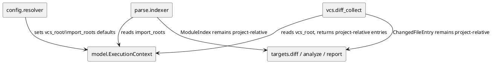

# iss-00034 monorepo import root mismatch drops typed relations — 設計（HOW）

## 目的・制約
- `project_root` に集約されていた Git root と import root の責務を `ExecutionContext` で分ける。
- CLI / config の公開 surface はこの issue では増やさず、既存 `project_root` / `package_root` / `scope_root` 指定から安全な default を導く。
- AST static analysis、read-only、deterministic output の product contract は変更しない。

## 既存実装 / 規約の理解
- `src/pyclassuml/config/resolver.py` が `ExecutionContext` を構築し、`package_root` は `project_root` 配下、`scope_root` は `package_root` 配下という containment を検証する。
- `src/pyclassuml/vcs/diff_collect.py` は Git command の `-C` と `--relative` に `context.project_root` を使い、`ChangedFileEntry.current_project_relative_path` を downstream contract として返す。
- `src/pyclassuml/parse/indexer.py` は import candidate を `_existing_python_candidates(project_root, parts)` で探索するため、monorepo では backend-local import を解決できない。
- `src/pyclassuml/targets/diff.py`、ignore、report は project-relative path を前提にしているため、VCS collection の出力 contract は維持する。

## 採用方針 / トレードオフ
- 採用:
  - `ExecutionContext` に `vcs_root: Path` と `import_roots: tuple[Path, ...]` を追加する。
  - 後方互換のため、省略時は `vcs_root = project_root`、`import_roots = (project_root,)` とする。
  - resolver では `package_root != project_root` のとき `import_roots = (package_root, project_root)` とする。monorepo backend-local import を優先しつつ、従来 layout も fallback で救う。
  - VCS collection は `context.vcs_root` で Git を読み、entries は project-relative に変換して返す。
  - parse indexer は `context.import_roots` を順に見て候補を dedupe する。
- 採用しない:
  - CLI/config schema への `--vcs-root` / `--import-root` 追加。
  - `pyproject.toml` からの自動 package metadata 解析。
  - 複数 Python project の自動 grouping。

## 依存関係分析
- 上流:
  - `model/contracts.py`: context field の追加と backward-compatible default。
  - `config/resolver.py`: context default の決定。
- 中流:
  - `vcs/diff_collect.py`: Git command root と output path conversion。
  - `parse/indexer.py`: import candidate root の切り替え。
- 下流:
  - `targets/diff.py`、analysis、report は project-relative contract が維持されるため変更しない。
- 実装順序:
  - context contract -> resolver default -> parse import resolution -> VCS path conversion -> regression tests。

## Module Dependency Diagram


## インターフェース契約
- `ExecutionContext`:
  - 追加 field: `vcs_root: Path | None = None`
  - 追加 field: `import_roots: tuple[Path, ...] = ()`
  - `__post_init__` で `None` / empty を後方互換 default に正規化する。
- `collect_diff_files`:
  - Git command は `context.vcs_root` を基準に実行する。
  - 返す `ChangedFileEntry.current_project_relative_path` は引き続き `context.project_root` 相対。
- `parse_target_set`:
  - import candidate 探索は `context.import_roots` を順に使う。
  - `module_path` / diagnostics / `ModuleIndex.import_candidate_paths` は引き続き `project_root` 相対。

## ディレクトリ / ファイル変更計画
```text
.
|-- src/
|   `-- pyclassuml/
|       |-- model/contracts.py          # ExecutionContext に vcs_root/import_roots を追加
|       |-- config/resolver.py          # package_root 優先 import_roots default を追加
|       |-- parse/indexer.py            # import candidate 探索を import_roots 基準へ変更
|       `-- vcs/diff_collect.py         # Git root と project-relative output を分離
|-- tests/
|   |-- config/test_context_resolve.py  # monorepo context default の回帰
|   |-- parse/test_module_parse_and_index.py # backend-local import 解決の回帰
|   `-- vcs/test_diff_file_collect.py   # vcs_root != project_root の回帰
`-- spec-dock/.../iss-00034-*/
    |-- requirement.md
    |-- design.md
    |-- plan.md
    `-- report.md
```

## 要件 → 設計マッピング
- AC-001 -> `ExecutionContext.import_roots` と `parse/indexer.py`。
- AC-002 -> `ExecutionContext.vcs_root` と `vcs/diff_collect.py`。
- AC-003 / EC-001 -> `ExecutionContext.__post_init__` と `config/resolver.py` default。
- EC-002 -> VCS regression tests。

## テスト戦略
- 単体:
  - parse test で `project_root=repo` / `package_root=backend` / `import_roots=(backend, repo)` の `from shared...` が backend 配下に解決されることを確認する。
  - config test で resolver が `package_root != project_root` の import root ordering を作ることを確認する。
  - VCS test で `vcs_root=repo` / `project_root=repo/packages/app` の diff が project-relative entries だけを返すことを確認する。
- 統合:
  - full pytest により既存 single-project layout の回帰を確認する。
- manual:
  - この issue では実ユーザーの private monorepo を直接 fixture 化しない。再現構造は unit test fixture に縮約する。

## リスク / 移行 / ロールバック
- `package_root != project_root` で `project_root` 側の import を期待していた既存利用者への影響は、`project_root` を fallback import root に含めることで低減する。
- VCS path conversion は Git output の相対基準に依存するため、tracked / untracked / nested project の既存テストを維持する。
- CLI/config surface を増やさないため、ユーザーの実行コマンド互換性に影響しない。

## 未確定事項
- なし。自動検出と複数 project 対応は follow-up 候補。
