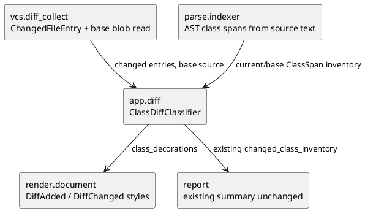

# iss-00035 Class Level Diff Colorization — 設計（HOW）

## 親 Diagram 参照
- Epic: `epic-00004-framework-render-report`
- 再利用する決定:
  - `iss-00033` の diff colorization は `app.diff` が class decoration を決め、`render` は decoration を PlantUML に投影する。
  - dependency-only class は `DiffDependency` を使わず、通常 class box のままにする。

## 目的・制約
- 目的:
  - diff rendering の class decoration を file-level added/modified から class-level added/modified へ精密化する。
- 必須 / 禁止:
  - base revision は Git blob として read-only に取得し、AST parse のみ行う。
  - target code import、workspace への base file 永続書き出し、class rename 類似度推定は禁止する。
- 前提:
  - current side の parse/traverse/select pipeline は既存 `parse_target_set` を使う。
  - base side は classification 用の class inventory だけが必要で、base dependency graph は作らない。

## 既存実装 / 規約の理解
- 参照した実装 / docs:
  - `src/pyclassuml/vcs/diff_collect.py`
  - `src/pyclassuml/parse/indexer.py`
  - `src/pyclassuml/app/diff.py`
  - `src/pyclassuml/render/document.py`
  - `tests/app/test_diff.py`
  - `tests/render/test_document.py`
  - `iss-00033-render-diff-class-colorization`
- 現状理解:
  - `ChangedFileEntry` は file-level `change_kind` と current-side `ChangedLineRange` を持つ。
  - current parse は `ParsedModule.class_spans` と `ClassSpan(class_id, start_line, end_line)` を生成する。
  - `_diff_class_decorations` は現在、added file 内 selected class と hunk/span overlap class をどちらも `DiffChanged` にしている。
- 採用するパターン:
  - `app.diff` に class-level classifier を置き、render は stereotype/style の pure sink とする。
  - base source は VCS seam から read-only blob として供給し、app.diff が current parsed modules と比較する。
- 採用しないもの:
  - base side の traversal / relation selection。
  - class rename / move の heuristic matching。
  - changed_class_count の意味変更。

## 採用方針 / トレードオフ
- 論点: class identity
  - 選択肢 A: `module_path:qualified_name`
  - 選択肢 B: AST fingerprint / similarity matching
  - 決定: MVP は A。file rename は VCS metadata で base path を current path に正規化し、class rename / move は Added として conservative に扱う。
- 論点: base source の取得
  - 選択肢 A: `git show <base_ref>:<path>` 相当で blob text を取得
  - 選択肢 B: temporary checkout / worktree
  - 決定: A。workspace を汚さず、非侵襲・read-only 原則を守る。
- 論点: Modified 判定
  - 選択肢 A: hunk/span overlap
  - 選択肢 B: AST fingerprint 差分
  - 決定: MVP は A。既存挙動と互換で、decorator deletion / nested class regression を継承できる。

## 依存関係分析
- module 依存:
  - `vcs.diff_collect` -> base blob read API を追加する upstream。
  - `parse.indexer` -> source text から `ParsedModule` 相当または class spans を作る helper を追加する upstream。
  - `app.diff` -> base/current class inventory と hunk ranges から `DiffAdded` / `DiffChanged` decoration を決める middle layer。
  - `render.document` -> `DiffAdded` / `DiffChanged` style を PlantUML へ出す downstream。
- 実装起点:
  - 先に VCS / parse の base class inventory 入力を固定する。
  - 次に app.diff classifier を TDD で実装する。
  - 最後に render style と E2E regression を固定する。

## Module Dependency Diagram


## インターフェース契約
- VCS boundary:
  - base revision の project-relative path から UTF-8 text を取得する seam-local helper を追加する。
  - safe-added 欠損と unsafe failure を区別する。
    - safe-added 欠損: `change_kind == "added"`、included untracked、または Git が rename previous path を持たない added path として報告する場合。後段は base class inventory なしとして `DiffAdded` 判定に使える。
    - unsafe failure: invalid base、Git command failure、unexpected missing blob for modified / renamed previous path、UTF-8 decode failure。後段は `DiffAdded` / `DiffChanged` を捏造せず diagnostics / failure policy に倒す。
- Parse boundary:
  - `source_text` と logical `module_path` から import 実行なしで `ParsedModule` を作る helper を追加する。
  - base source parse failure は unsafe failure とし、対象 file の class-level decoration を作らない。current parse failure は既存 parse diagnostics / failure behavior を維持する。
  - current `parse_target_set` は既存動作を維持する。
- App diff boundary:
  - `base_class_ids_by_current_path` と current `ParsedModule.class_spans` を比較し、selected class のみ decoration 候補にする。
  - precedence は `DiffAdded` > `DiffChanged`。base に存在しない class は hunk overlap の有無に関わらず `DiffAdded`。
- Render boundary:
  - `DiffAdded` がある場合は水色 style を出す。
  - `DiffChanged` がある場合は既存緑 style を出す。
  - 両方がある場合は同じ `skinparam class` block に両 style を deterministic order で出す。

## ディレクトリ / ファイル変更計画
```text
.
|-- src/
|   `-- pyclassuml/
|       |-- vcs/
|       |   `-- diff_collect.py      # 変更: base blob read helper
|       |-- parse/
|       |   `-- indexer.py           # 変更: source text parse helper
|       |-- app/
|       |   `-- diff.py              # 変更: class-level added/modified classifier
|       `-- render/
|           `-- document.py          # 変更: DiffAdded style
`-- tests/
    |-- vcs/
    |   `-- test_diff_file_collect.py # 変更: base blob read
    |-- parse/
    |   `-- test_module_parse_and_index.py # 変更: source text helper
    |-- app/
    |   `-- test_diff.py             # 変更: class-level added/modified E2E
    `-- render/
        `-- test_document.py         # 変更: DiffAdded style
```

## 要件 → 設計マッピング
- AC-001 -> app.diff classifier が base/current class inventory を比較し、modified file 内 new class を `DiffAdded` にする。
- AC-002 -> existing hunk/span overlap logic を `DiffChanged` 判定として維持する。
- AC-003 -> missing base blob / `change_kind == added` / untracked entry の current selected class を `DiffAdded` にする。
- AC-004 -> selected でも base に存在し hunk overlap しない class には decoration を渡さない。
- EC-001 -> `previous_project_relative_path` を current path へ正規化して base class identity を比較する。
- EC-002 -> class rename / move を推定せず current class を `DiffAdded` にする。
- EC-003 -> nested `qualified_name` を含む既存 `class_id` を使う。
- EC-004 -> unsafe read / parse failure / join miss で decoration を捏造しない。
- EC-005 -> safe-added 欠損のみ `DiffAdded` の前提にする。

## テスト戦略
- 単体:
  - VCS helper が base blob text を読み、missing blob を `None` として扱えること。
  - parse helper が source text から `ClassSpan` / decorators / nested class を current helper と同じ形で作ること。
  - `_diff_class_decorations` が `DiffAdded` / `DiffChanged` / no decoration を class 単位で返すこと。
- 統合:
  - `pyclassuml diff` E2E で existing file に追加した class が `DiffAdded`、既存 class 修正が `DiffChanged`、dependency-only が no decoration になること。
  - untracked included class と `current_state=head` の既存 semantics が崩れないこと。
- manual:
  - 既存 manual env 方針に沿い、必要なら `.puml` の `DiffAdded` / `DiffChanged` / `DiffDependency` absence を `rg` で確認する。

## リスク / 移行 / ロールバック
- リスク:
  - `module_path:qualified_name` は class rename / move を同一 class と認識しない。
  - base/current source snapshot と `ChangedLineRange` の current state がずれると誤分類する。
- 緩和:
  - current-state ごとの existing tests を維持し、working-tree / head の E2E を追加する。
  - 不確かな rename / move は Added に倒し、変更の見落としを避ける。
- ロールバック:
  - `DiffAdded` classifier / style 追加を revert すれば `iss-00033` の green-only 表示へ戻せる。

## 未確定事項
- なし。
