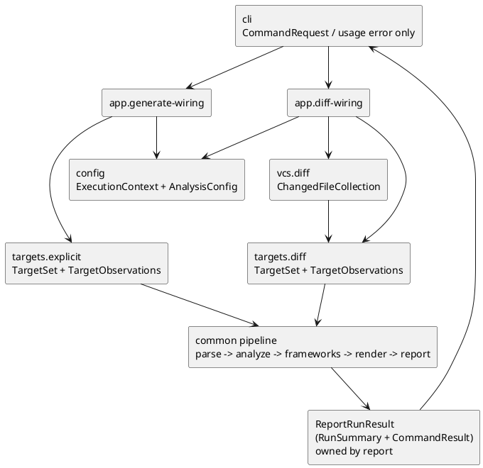
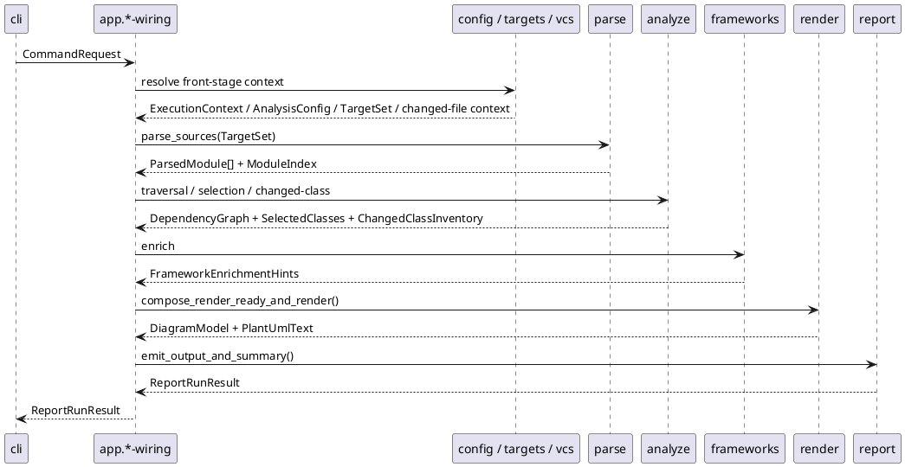

# epic-00005 E2E Command Wiring — 設計（HOW）

## 全体像
- target boundary:
  - `app.generate-wiring`
  - `app.diff-wiring`
- impacted area:
  - upstream:
    - `cli.request-bind-and-exit-contract`
    - `model.execution-contracts`
    - `config.context-resolve`
    - `targets.explicit-target-normalize`
    - `vcs.diff-file-collect`
    - `targets.diff-target-normalize`
    - `parse.module-parse-and-index`
    - `analyze.traversal`
    - `analyze.relationship-and-selection`
    - `ChangedClassInventory`
    - `frameworks.sqlalchemy-enrich`
    - `frameworks.pydantic-enrich`
    - `render.uml-document`
    - `report.artifact-summary-exit-policy`
  - downstream:
    - `cli`
- existing relation:
  - initiative `design.md` が `app` を thin orchestrator に固定している。
  - initiative `plan.md` は `app.generate-wiring` / `app.diff-wiring` を M3 exit seams とし、`report` 完了後に stitcher を閉じる順序を固定している。
  - この epic は M3 に必要な orchestration と transport path だけを補い、whole-system boundary や upstream seam contract は上書きしない。

### UML（推奨: module / context）

## この 2 seams を 1 epic に束ねる理由
- `app.generate-wiring` と `app.diff-wiring` はどちらも owner が `app` であり、差分は front-stage 入力の準備だけで、post-`TargetSet` pipeline は共通である。
- 2 issue を別 epic に分けると、`app` の guardrail より command 差分が前面に出てしまい、M3 の主目的である stitcher 限定設計が弱くなる。
- `generate` 側だけ先に閉じても、`diff` が current-state / untracked と changed-file context transport を独自実装し始めると owner split が崩れるため、同一 epic で common pipeline guardrail を固定する。

## 契約

### seam contract table
| seam | owner | input | output | handoff type | downstream |
| --- | --- | --- | --- | --- | --- |
| `app.generate-wiring` | `app` | `CommandRequest(command=generate)`, `ExecutionContext`, `AnalysisConfig`, `TargetSet(seed_files, observations)` | `ReportRunResult` | `report` owner の nested result payload は `ReportRunResult.command_result` に保持され、stdout/stderr material も `report` owner。`app` は stage invocation order と empty changed-file context transport のみを担い、stream emission しない | `cli` |
| `app.diff-wiring` | `app` | `CommandRequest(command=diff)`, `ExecutionContext`, `AnalysisConfig`, `ChangedFileCollection`, `TargetSet(seed_files, observations)` | `ReportRunResult` | raw `ChangedFileCollection` / original context は `analyze` に渡されて `ChangedClassInventory` を生成し、`report` には `TargetSet`、`ChangedClassInventory`、diagnostics、graph/model/render material、timestamp を handoff する。nested `CommandResult` と stdout/stderr material は `ReportRunResult` 配下の `report` owner で、`app` は stage invocation order と transport だけを担い、stream emission しない | `cli` |

### Data boundary
- SoR:
  - `CommandRequest` と usage error result の SoR は `cli`。
  - `ExecutionContext` と `AnalysisConfig` の SoR は `config`。
  - `TargetSet` と `TargetObservations` の SoR は `targets`。
  - `ChangedClassInventory` の SoR は `analyze`。
  - `PlantUmlText` の SoR は `render`、`RunSummary` と `CommandResult` の SoR は `report` であり、app seam output では `ReportRunResult` 配下に載る。
  - `app` の SoR は stage invocation order と app-local transport rule だけである。
- consistency model:
  - `app` は upstream DTO を mutate せず transport する。
  - `app` は `TargetSet.observations` を保持したまま `report` へ handoff し、summary counter source を再計算しない。
  - `generate` の changed-file context は empty set を analyze に渡し、zero inventory の producer を `analyze` に保つ。
  - `diff` の raw changed-file context は `vcs` / `targets` 起点の original context として `analyze` に渡され、`ChangedClassInventory` の生成に使う。`report` には `TargetSet`、`ChangedClassInventory`、diagnostics、graph/model/render material、timestamp を handoff し、nested `CommandResult` と stdout/stderr material は `ReportRunResult` 配下で保持される。

## 主要フロー
- Flow-A:
  1. `cli` が usage validation 済み `CommandRequest(command=generate)` を `app.generate-wiring` へ渡す。
  2. `app.generate-wiring` が `config.context-resolve` と `targets.explicit-target-normalize` を呼び、`TargetSet` を得る。
  3. `TargetSet` と empty changed-file context を共通 pipelineへ渡し、`parse -> analyze.traversal -> analyze.relationship-and-selection -> ChangedClassInventory -> frameworks -> render -> report` を順に実行する。
  4. `report` が返した `ReportRunResult` を `app` はそのまま `cli` へ返す。
     `CommandResult` は `ReportRunResult.command_result` として transport する。
- Flow-B:
  1. `cli` が usage validation 済み `CommandRequest(command=diff)` を `app.diff-wiring` へ渡す。
  2. `app.diff-wiring` が `config.context-resolve`、`vcs.diff-file-collect`、`targets.diff-target-normalize` を呼び、actual changed-file context と `TargetSet` を得る。
  3. actual changed-file context と `TargetSet` を共通 pipelineへ渡し、`generate` と同じ後段 order を実行する。
  4. `report` が返した `ReportRunResult` を `app` はそのまま `cli` へ返す。
     `CommandResult` は `ReportRunResult.command_result` として transport する。

### UML（任意: sequence / flow）

## 失敗設計
- failure mode:
  - usage error は `cli` が即時終了し、この epic の flow に入らない。
  - front-stage、parse、analyze、frameworks、render、report の failure は、それぞれの owner が diagnostics を出し、最終的な non-usage result は `ReportRunResult` として返る。
    その内部の `RunSummary` / `CommandResult` は `report` が生成する。
  - `app` は failure reason を再分類せず、stage correlation を transport するだけに留める。
- retry:
  - retry policy は持たない。再試行可否の判断は各 seam の deterministic contract に委ねる。
- idempotency:
  - 同一 request、同一 upstream outputs では `app` の stage order と transport 内容は決定的である。
- partial failure:
  - warning-only success や degraded success では `app` は downstream の `ReportRunResult` をそのまま返し、`CommandResult` は `ReportRunResult.command_result` として保持される。
  - zero-target、invalid `--base <ref>`、output write failure などの non-zero 結果でも `app` は summary を自前生成しない。

## 観測性 / セキュリティ
- observability:
  - command transcript で `generate` / `diff` の front-stage 差分と共通 pipeline order を追える。
  - `TargetSet.observations`、`ChangedClassInventory`、warning diagnostics が `report` summary の材料として届く transport path を説明できる。
  - usage error と non-usage result の producer split を docs から一意に読める。
- role / auth:
  - 対象外。ローカル CLI prototype であり auth 境界は持たない。
- audit / pii:
  - 対象外。保持するのは path / counter / failure reason 程度の CLI 実行情報のみ。

## テスト戦略
- Unit:
  - stage invocation order。
  - `TargetSet.observations` の pass-through。
  - `ReportRunResult` 非再構築返却と `ReportRunResult.command_result` の非改変 transport。
  - generate の empty changed-file context transport。
  - diff の actual changed-file context transport。
- Integration:
  - `cli -> app.generate-wiring -> report -> cli`
  - `cli -> app.diff-wiring -> report -> cli`
  - current-state / untracked 切替時も post-`TargetSet` pipeline が同一である review。
- E2E:
  - command transcript と filesystem / stdout / stderr observation を canonical evidence にする。
- E-AC mapping:
  - `E-AC-001` -> seam contract table と issue design invariant。
  - `E-AC-002` -> `iss-00020` の generate transcript review。
  - `E-AC-003` -> `iss-00021` の diff transcript review。
  - `E-AC-004` -> `iss-00006`, `iss-00019`, `iss-00020`, `iss-00021` の cross-check。

## 関連 ADR
- `20260416t121500z-adr-v5-ratification.md`:
  - initiative docs と architecture v5 の canonical split を優先する。

## 未確定事項
- なし:
  - M3 の stitcher guardrail と producer split は initiative canonical docs で確定済みである。
