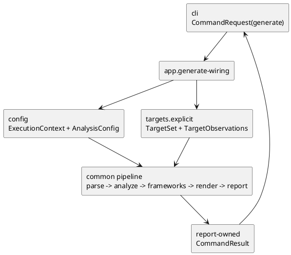

# iss-00020 App Generate Wiring — 設計（HOW）

## seam position
- upstream / prerequisite:
  - `iss-00006-cli-request-bind-and-exit-contract`
  - `iss-00007-model-execution-contracts`
  - `iss-00008-config-context-resolve`
  - `iss-00009-targets-explicit-target-normalize`
  - `iss-00012-parse-module-parse-and-index`
  - `iss-00013-analyze-traversal`
  - `iss-00014-analyze-relationship-and-selection`
  - `iss-00015-changed-class-inventory`
  - `iss-00016-frameworks-sqlalchemy-enrich`
  - `iss-00017-frameworks-pydantic-enrich`
  - `iss-00018-render-uml-document`
  - `iss-00019-report-artifact-summary-exit-policy`
- downstream / dependent:
  - `cli`
- seam responsibility:
  - `generate` 実行時の stage invocation order を固定する。
  - empty changed-file context と `TargetSet.observations` を欠落させず downstream へ運ぶ。
  - `report` 由来の `CommandResult` を `cli` へ返す。

### UML（module / dependency）

## インターフェース契約
- input:
  - `CommandRequest(process_cwd, cli_options.command=generate, cli_options.generate.targets, common options)`
  - `ExecutionContext(execution_cwd, project_root, package_root, scope_root)`
  - `AnalysisConfig(ignore, output, depth, mode, target_python, diff settings)`
  - `TargetSet(seed_files, observations)`
- output:
  - shared DTO:
    - `CommandResult(artifact_path, summary, diagnostics, exit_code)`
  - app-local transport:
    - `empty_changed_file_context`
      - `changed_files=[]`
    - `original_target_observations`
      - `TargetSet.observations`
- invariant:
  - usage error は `cli` で止まり、この seam に入らない。
  - `TargetSet` 生成後は generate 専用 branch を追加しない。
  - `ChangedClassInventory` は `analyze` が empty changed-file context から生成する。
  - `TargetSet.observations` は mutate せず `report` まで transport する。
  - `CommandResult` は `report` が生成したものをそのまま返し、`app` は summary / exit code を編集しない。

## 主要フロー
1. `CommandRequest(command=generate)` を受け、`config.context-resolve` を呼ぶ。
2. `ExecutionContext` / `AnalysisConfig` を受け、`targets.explicit-target-normalize` を呼ぶ。
3. `TargetSet` を受けたら empty changed-file context を app-local に固定する。
4. `parse.module-parse-and-index` を呼び、`ParsedModule[]` と `ModuleIndex` を得る。
5. `analyze.traversal`、`analyze.relationship-and-selection`、`ChangedClassInventory` を順に呼び、zero changed-class inventory を含む analyze outputs を得る。
6. `frameworks.sqlalchemy-enrich`、`frameworks.pydantic-enrich`、`render.uml-document`、`report.artifact-summary-exit-policy` を順に呼ぶ。
7. `report` へ渡すとき、`TargetSet.observations` と zero `ChangedClassInventory` を欠落させない。
8. 返ってきた `CommandResult` を `cli` に返す。

## data / handoff
- from `config`:
  - `ExecutionContext` と `AnalysisConfig` を front-stage / downstream 共通入力として使い、`AnalysisConfig.output` と `ExecutionContext.execution_cwd` を mutate せず `report` まで transport する。
- from `targets.explicit-target-normalize`:
  - `TargetSet.seed_files` は parse の唯一入力。
  - `TargetSet.observations` は summary counter source として `report` まで transport する。
- to `ChangedClassInventory`:
  - generate では empty changed-file context を渡し、`analyze` owner で `ChangedClassInventory(class_count=0, changed_files=[])` を生成させる。
- to `report`:
  - `TargetSet.observations`
  - `ChangedClassInventory`
  - upstream diagnostics
  - `DiagramModel`
  - `PlantUmlText`

## テスト戦略
- Unit:
  - stage invocation order。
  - empty changed-file context transport。
  - `TargetSet.observations` pass-through。
  - `CommandResult` 非改変返却。
- Integration:
  - `config -> targets.explicit -> parse -> analyze -> frameworks -> render -> report` の順序確認。
  - zero changed-class inventory が summary source として `report` に届くことの review。
- Verification:
  - generate transcript。
  - filesystem artifact と stdout summary observation。
  - auto naming / `--output` path resolution passthrough review。
  - failure transcript review。

## non-goals
- diff changed-file collection。
- summary 文面や failure taxonomy の決定。
- output path resolve の再実装。

## リスク / 注意点
- `ChangedClassInventory` を `app` が直接合成すると analyze owner が崩れる。
- `TargetSet.observations` を parse 側で失うと `report` の summary counter semantics が壊れる。
- `CommandResult` を `app` で再構築すると `report` owner と `cli` との契約が崩れる。
