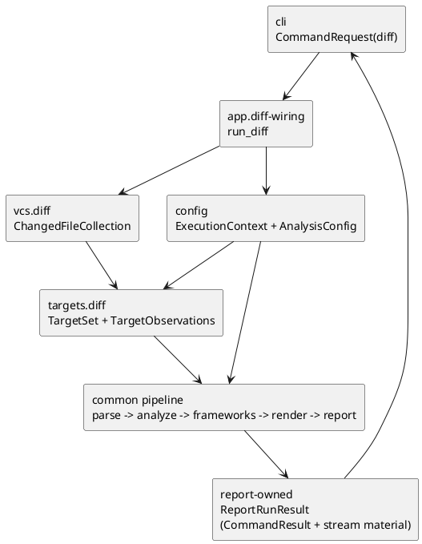

# iss-00021 App Diff Wiring — 設計（HOW）

## seam position
- upstream / prerequisite:
  - `iss-00006-cli-request-bind-and-exit-contract`
  - `iss-00007-model-execution-contracts`
  - `iss-00008-config-context-resolve`
  - `iss-00010-vcs-diff-file-collect`
  - `iss-00011-targets-diff-target-normalize`
  - `iss-00012-parse-module-parse-and-index`
  - `iss-00013-analyze-traversal`
  - `iss-00014-analyze-relationship-and-selection`
  - `iss-00015-changed-class-inventory`
  - `iss-00016-frameworks-sqlalchemy-enrich`
  - `iss-00017-frameworks-pydantic-enrich`
  - `iss-00018-render-uml-document`
  - `iss-00019-report-artifact-summary-exit-policy`
- downstream / dependent:
  - `cli`
- seam responsibility:
  - `diff` 実行時の front-stage context と common pipeline の接続順を固定する。
  - actual changed-file context、`TargetSet.observations`、upstream diagnostics を欠落させず downstream へ運ぶ。
  - `report` 由来の `ReportRunResult` を app seam output として返す。

### UML（module / dependency）

## インターフェース契約
- input:
  - `CommandRequest(process_cwd, cli_options.command=diff, cli_options.diff.base_ref/current_state/include_untracked, common options)`
  - `timestamp: datetime`
  - `ExecutionContext(execution_cwd, project_root, package_root, scope_root)`
  - `AnalysisConfig(ignore, output, depth, mode, target_python, diff_current_state, diff_include_untracked)`
  - `ChangedFileCollection`
  - `TargetSet(seed_files, observations)`
- output:
  - public app seam:
    - `ReportRunResult(command_result, outcome_kind, stdout_text, stderr_text)`
  - nested result payload:
    - `ReportRunResult.command_result`
      - `CommandResult(artifact_path, summary, diagnostics, exit_code)`
      - artifact path and diagnostics are observed through this nested payload, not as top-level `ReportRunResult` fields.
  - app-local transport:
    - project-root-relative changed file `Path` values derived from `ChangedFileCollection.entries`
    - `TargetSet.observations`
- invariant:
  - usage error は `cli` で止まり、この seam に入らない。
  - `vcs.diff-file-collect` と `targets.diff-target-normalize` が diff-specific front-stage owner であり、`app` はその意味論を再実装しない。
  - `TargetSet` 生成後は diff 専用 branch を追加しない。
  - `ChangedClassInventory` は actual changed-file context から `analyze` が生成する。
  - `TargetSet.observations` は mutate せず `report` まで transport する。
  - `ReportRunResult` は `report` が生成したものをそのまま返し、`app` は nested `CommandResult`、summary、exit code、stdout_text、stderr_text を編集しない。
  - `app` は実プロセスの stdout/stderr に直接 emit しない。

## 主要フロー
1. `CommandRequest(command=diff)` と `timestamp` を受け、command guard を行う。
2. `config.context-resolve` を呼ぶ。
3. config failure の場合は fallback `ExecutionContext(process_cwd)` と default `AnalysisConfig()` で `write_report` を呼び、`ReportRunResult` を返す。
4. `ExecutionContext` / `AnalysisConfig` を受け、`vcs.diff-file-collect` を呼ぶ。
5. `VcsDiffCollection.collection is None` の場合は VCS diagnostics を `write_report` へ渡し、target/common pipeline へ進まない。
6. `ChangedFileCollection` を `targets.diff-target-normalize` に渡し、`TargetSet` を得る。
7. target failure の場合は upstream diagnostics と target diagnostics を `write_report` へ渡し、common pipeline へ進まない。
8. `TargetSet` と actual changed-file context を app-local に保持する。
9. `parse.module-parse-and-index` を呼び、`ParsedModule[]` と `ModuleIndex` を得る。
10. `analyze.traversal`、`analyze.relationship-and-selection`、`ChangedClassInventory` を順に呼び、actual changed-file context に基づく inventory を得る。
11. `frameworks.sqlalchemy-enrich`、`frameworks.pydantic-enrich`、`render.uml-document`、`report.artifact-summary-exit-policy` を順に呼ぶ。
12. `report` へ渡すとき、`TargetSet.observations`、actual `ChangedClassInventory`、upstream diagnostics、deterministic `timestamp` を欠落させない。
13. 返ってきた `ReportRunResult` を `cli` に返す。

## data / handoff
- from `config`:
  - `ExecutionContext` と `AnalysisConfig` を front-stage / downstream 共通入力として使い、`AnalysisConfig.output` と `ExecutionContext.execution_cwd` を mutate せず `report` まで transport する。
  - config failure では fallback context と default config を report invocation 専用に作り、`app` で summary を作らない。
- from `vcs.diff-file-collect`:
  - actual changed-file context を authoritative source として保持する。
  - `current_state=head` + `include_untracked=true` の no-op warning も transport 対象に含める。
  - VCS fatal diagnostics の場合は `targets.diff` 以降へ進まず `write_report` へ渡す。
- from `targets.diff-target-normalize`:
  - `TargetSet.seed_files` は parse の唯一入力。
  - `TargetSet.observations.diff_scope_excluded_count` と ignore count は summary source として `report` まで transport する。
  - zero-target failure は fallback seed を作らず `write_report` へ渡す。
- to `ChangedClassInventory`:
  - `ChangedFileCollection.entries[].current_project_relative_path` を project-root-relative `Path` として `build_changed_class_inventory` へ渡し、`ModuleIndex.project_relative_file_to_module` と同じ key space で user-visible changed class 数を生成させる。
  - absolute path resolution は `vcs` / `targets.diff` の Git 読み取り・scope filtering・seed normalization までに閉じ、`ChangedClassInventory` handoff では使わない。
- to `report`:
  - `command=CommandName.DIFF`
  - `ExecutionContext`
  - `AnalysisConfig`
  - `timestamp`
  - upstream diagnostics
  - `TargetSet`
  - `ChangedClassInventory`
  - `DependencyGraph`
  - `scope_stop_count`
  - `DiagramModel`
  - `PlantUmlText` または `RenderFailureSignal`

## テスト戦略
- Unit:
  - non-diff `CommandRequest` の guard。
  - config failure / VCS failure / target failure で downstream stage を呼ばず `ReportRunResult` を返すこと。
  - actual changed-file context transport。
  - `TargetSet.observations` pass-through。
  - `ReportRunResult` 非改変返却。
  - app が実プロセス stdout/stderr emit を行わないこと。
- Integration:
  - `config -> vcs -> targets.diff -> parse -> analyze -> frameworks -> render -> report` の順序確認。
  - no-op warning と diff scope exclusion counter が `report` まで届くことの review。
  - explicit `--output` と auto naming の path resolution passthrough。
- Verification:
  - targeted pytest。
  - full pytest。
  - `./spec-dock/scripts/spec-dock validate`。
  - `git diff --check`。
  - uppercase path check。

## non-goals
- generate explicit target normalization。
- current-state / untracked の意味論決定そのもの。
- summary 文面や failure taxonomy の決定。
- process stream emission の CLI 接続。

## リスク / 注意点
- diff-specific branch を `TargetSet` 以降へ持ち込むと common pipeline 契約が崩れる。
- `ChangedFileCollection` や `TargetSet.observations` を transport し損ねると summary semantics が壊れる。
- no-op warning や scope exclusion を `app` で握りつぶすと `report` owner の exit policy と矛盾する。
- `CommandResult` を direct output と誤読すると `iss-00019` / `iss-00020` の `ReportRunResult` 境界と衝突する。
