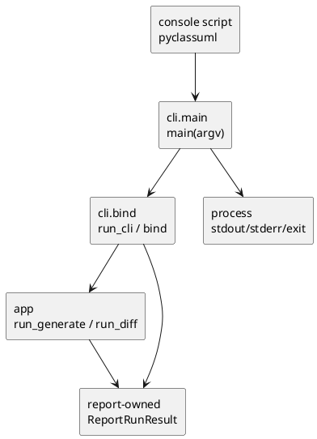

# iss-00022 CLI Entrypoint Dispatch Wiring — 設計（HOW）

## seam position
- upstream / prerequisite:
  - `iss-00006-cli-request-bind-and-exit-contract`
    - usage-error ownership と argv bind shape は維持するが、`include_untracked=false` syntactic default はこの issue が supersede する。
  - `iss-00008-config-context-resolve`
    - root/config merge mechanics は維持するが、`diff.include_untracked=false` default はこの issue が supersede する。
  - `iss-00019-report-artifact-summary-exit-policy`
  - `iss-00020-app-generate-wiring`
  - `iss-00021-app-diff-wiring`
- downstream / external:
  - process stdout
  - process stderr
  - process exit code
  - package console script
- seam responsibility:
  - `cli` が `CommandRequest` を app seam へ dispatch し、`ReportRunResult` を process-level observable result へ project する。

### UML（module / dependency）

## インターフェース契約
- `pyproject.toml`:
  - `[project.scripts]`
  - `pyclassuml = "pyclassuml.cli.main:main"`
- `cli.main.main(argv: Sequence[str] | None = None) -> int`:
  - `argv is None` のとき `sys.argv[1:]` を使う。
  - `process_cwd` は `Path.cwd()`。
  - `timestamp` は `datetime.now()`。
  - `run_cli(argv, process_cwd, handler)` を呼ぶ。
  - `CliRunResult.stdout_text` を stdout、`CliRunResult.stderr_text` を stderr へ write する。
  - `CliRunResult.exit_code` を返す。
- `cli.bind.run_cli`:
  - handler は `CommandRequest -> CommandResult | ReportRunResult` を許可する。
  - handler が `ReportRunResult` を返した場合:
    - `command_result = result.command_result`
    - `exit_code = result.command_result.exit_code`
    - `stdout_text = result.stdout_text`
    - `stderr_text = result.stderr_text`
  - handler が既存 `CommandResult` を返した場合:
    - 後方互換として従来通り `stdout_text=""`, `stderr_text=""`。
  - usage error は handler を呼ばず、既存 `cli_usage_error` `CommandResult` と argparse stderr text を返す。
- diff default:
  - CLI parser と config default は initiative requirement に合わせて `include_untracked=true` とする。
  - 明示的に untracked を除外する CLI option が必要なため、`--no-include-untracked` を追加する。
  - `--include-untracked` は明示 true として維持する。
  - この issue は completion audit repair として、`iss-00006` requirement / plan / report と `iss-00008` design の古い default `false` 記述を update する。
  - supersession の範囲は default value と opt-out flag に限定し、usage error ownership、root/config merge mechanics、VCS no-op warning policy は既存 owner のままにする。

## 主要フロー
1. console script `pyclassuml` が `cli.main.main()` を呼ぶ。
2. `main` が `run_cli(argv, Path.cwd(), handler)` を呼ぶ。
3. `run_cli` が argv を `CommandRequest` へ bind する。
4. usage error の場合は `cli_usage_error` result を返す。
5. `handler` が command に応じて `run_generate` または `run_diff` を timestamp 付きで呼ぶ。
6. `run_cli` が `ReportRunResult` を `CliRunResult` に変換する。
7. `main` が `stdout_text` / `stderr_text` を対応 stream へ write し、exit code を返す。

## data / handoff
- `cli` は `ReportRunResult.command_result` を再構築しない。
- `cli` は summary text を編集せず、末尾改行や stream 分離だけを process boundary として扱う。
- `.puml` artifact write は `report` 済みであり、CLI は artifact body を stream に流さない。
- `include_untracked` default は config merge 後の `AnalysisConfig.diff_include_untracked` に観測される。
- upstream-doc repair:
  - `iss-00006-cli-request-bind-and-exit-contract` docs: CLI parse default を `working-tree` / `true` とし、`--no-include-untracked` を明示 false として記録する。
  - `iss-00008-config-context-resolve` docs: config default を `diff.include_untracked = true` とし、CLI > config > default priority は維持する。

## テスト戦略
- Unit:
  - `run_cli` が `ReportRunResult` handler を受け取り stdout/stderr text と exit code を保持する。
  - `run_cli` の既存 `CommandResult` handler 互換を保つ。
  - parser default が `include_untracked=true`、`--no-include-untracked` が false になる。
- Integration:
  - `main(argv)` が stdout/stderr/exit code を process projection する。
- E2E:
  - `uv run pyclassuml --help`
  - `uv run pyclassuml generate ... --output ...`
  - `uv run pyclassuml diff --base ... --output ...` default untracked included
  - `uv run pyclassuml diff --base ... --current-state head --output ...` no-op warning
  - invalid base ref failure stderr
- Verification:
  - targeted pytest。
  - full pytest。
  - real `uv run pyclassuml` smoke。
  - `./spec-dock/scripts/spec-dock validate`。
  - `git diff --check`。
  - uppercase path check。

## リスク / 注意点
- `run_cli` の public dataclass shape を変える場合は既存 tests の constructor compatibility を壊さないよう、new field は default 付きで末尾に追加する。
- `include_untracked` default 変更は user-visible であるため、initiative requirement を根拠にし、`--no-include-untracked` で明示 false を提供する。
- process-level smoke は `uv run` が `uv.lock` や cache を生成するため、検証後に掃除する。

## 未確定事項
- なし。
