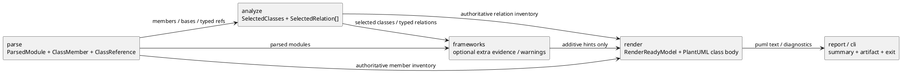
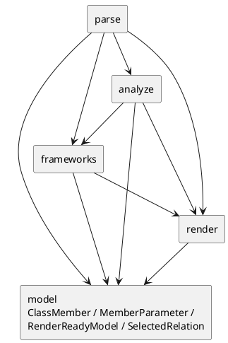
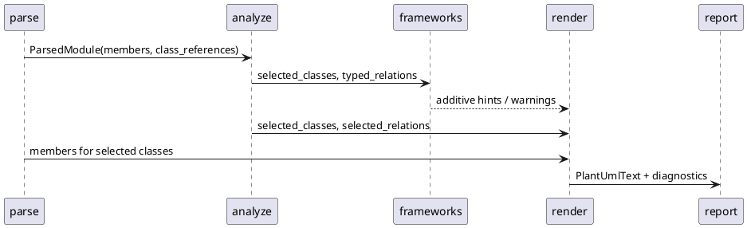

# epic-00023 Class Member Rendering — 設計（HOW）

## 全体像
- target boundary:
  - `model`, `parse`, `analyze`, `frameworks`, `render` の seam contract を member-aware / typed-relation-aware へ更新する。
- impacted area:
  - `ParsedModule.class_references` と `RenderReadyModel.members` を中心に、parse から render までの handoff shape を見直す。
- existing relation:
  - `iss-00014` の `uses` fixed relation contract を typed relation classification へ拡張する。
  - `iss-00018` の `RenderReadyModel.members=()` authoritative contract を、structured member collection へ置き換える。
- parent diagrams referenced:
  - initiative `design.md` の whole-system boundary と dependency rules。
  - `iss-00014`, `iss-00017`, `iss-00018` の既存 seam docs。

## Component / Module View
- Title:
  - Member-aware parse/analyze/render flow
- Question answered:
  - どの seam が members と typed relations の owner になるか
- Scope:
  - `parse -> analyze -> frameworks -> render -> report`
- Excluded details:
  - CLI option bind、artifact write、summary formatting
- Update trigger:
  - member DTO、relation vocabulary、framework owner 境界が変わるとき

### UML（推奨: component / module）

## Package Dependency
- Title:
  - Shared-contract dependency cleanup
- Question answered:
  - どの DTO を shared に上げ、どの DTO を seam-local に保つか
- Scope:
  - `src/pyclassuml/model`, `parse`, `analyze`, `frameworks`, `render`
- Excluded details:
  - test fixture shape、manual command line
- Update trigger:
  - DTO の import path または owner が変わるとき

### UML（推奨: package dependency / package dependency delta）

## Domain Model（DDD 必要時）
- ubiquitous language refs:
  - `ClassMember`, `MemberKind`, `MemberVisibility`, `SelectedRelation`, `relation_type`
- aggregate root:
  - N/A: this epic defines shared DTO vocabulary rather than business aggregate
- entity / value object:
  - `ClassMember` と `SelectedRelation` を immutable value object として扱う
- domain event / policy / specification:
  - `relation_type` vocabulary policy: `inherits`, `association`, `uses`
- invariants:
  - `RenderReadyModel.members` は selected class に属する member だけを保持する
  - `SelectedRelation.relation_type` は epic vocabulary 外を許可しない
- diagram metadata:
  - Title:
    - N/A
  - Question answered:
    - N/A
  - Scope:
    - N/A
  - Excluded details:
    - persistence schema / full implementation classes
  - Update trigger:
    - aggregate / entity / value object / event / invariant が変わるとき

### UML（任意: domain model / aggregate）
- N/A: source code DTO contract が正本であり、別 domain aggregate を導入しない

## 契約
### API（必要時）
- API-001:
  - Request:
    - `parse_target_set` が `ParsedModule.members` と `ClassReference` を返す
  - Response:
    - member-aware parse result
  - Errors:
    - syntax error module は existing diagnostic policy を維持する

### Event（必要時）
- EVT-001:
  - Producer:
    - N/A
  - Consumer:
    - N/A
  - Payload:
    - N/A

### Data boundary
- SoR:
  - member contract の source of truth は `iss-00024`。
  - typed relation owner は `iss-00026`。
  - render text contract の source of truth は `iss-00027`。
- consistency model:
  - parse は source-order deterministic、analyze は sort deterministic、render は serialization deterministic。

## データモデル
- model / table changes:
  - `ParsedModule` に structured member collection を持たせる。
  - `RenderReadyModel.members` を string tuple から structured collection へ更新する。
  - relation vocabulary を shared validation で制限する。
- invariants:
  - no convenience field:
    - render 用の preformatted line は model に保存しない。
  - stable ordering:
    - member の source order は parse で確定し、render で再発見しない。
- diagram metadata:
  - Title:
    - N/A
  - Question answered:
    - N/A
  - Scope:
    - N/A
  - Excluded details:
    - domain model の代替にはしない
  - Update trigger:
    - persistence model / migration impact が変わるとき

### UML（任意: data model）
- N/A: persistence model は存在しない

## 主要フロー
- Flow-A:
  1. `iss-00024` が `ClassMember` / relation vocabulary / compatibility rules を固定する。
  2. `iss-00025` が class body から members / bases / typed references を AST-only で抽出する。
  3. `iss-00026` が parsed evidence を `inherits` / `association` / `uses` に分類し、warning を handoff する。
- Flow-B:
  1. `iss-00027` が selected classes の members と typed relations を PlantUML class body / typed arrows に変換する。
  2. `iss-00028` が CLI generate / diff と manual environment で end-to-end を検証する。
- diagram metadata:
  - Title:
    - Member rendering execution flow
  - Question answered:
    - どの issue をどの順序で実装すれば、current output を member-aware output に移行できるか
  - Scope:
    - epic-00023 配下 issue の handoff
  - Excluded details:
    - exhaustive internal call graph
  - Update trigger:
    - participant / message / transaction boundary が変わるとき

### UML（推奨: main sequence）

## State / Activity（必要時）
- State:
  - N/A: long-lived state machine を導入しない
- Activity:
  - N/A: flow は issue sequencing で十分に表現できる
- diagram metadata:
  - Title:
    - N/A
  - Question answered:
    - N/A
  - Scope:
    - N/A
  - Excluded details:
    - implementation order
  - Update trigger:
    - lifecycle / workflow branch / terminal state が変わるとき

### UML（任意: state / activity）
- N/A: step sequencing は `plan.md` が正本

## 失敗設計
- failure mode:
  - unsupported annotation / unresolved target / ambiguous short name / selection-outside は warning degraded output とする。
  - syntax error module は existing parse error policy を維持する。
  - selected class missing や relation endpoint missing は render failure owner のまま維持する。
- retry:
  - なし。pure parse/analyze/render の deterministic rerun のみ。
- idempotency:
  - same input -> same output を維持する。
- partial failure:
  - invalid reference だけを warning として落とし、残りの diagram は継続する。

## 移行戦略
- migration strategy:
  - contract-first で issue 24 を先に固定し、その後 parse / analyze / render / E2E を順に更新する。
- dual write/read if needed:
  - 互換期間は `analyze` から旧 import surface を re-export し、tests を段階的に shared contract へ寄せる。
- rollback:
  - issue 単位で rollback 可能。epic 全体では old snapshots に戻せる。

## 観測性 / セキュリティ
- observability:
  - unresolved / ambiguous / selection-outside / unsupported annotation warning を existing diagnostic channel へ載せる。
- role / auth:
  - N/A
- audit / pii:
  - manual fixture はローカル開発用サンプルであり、PII 取り扱いはない。

## テスト戦略
- Unit:
  - model contract validation、member extraction、typed relation classification、PlantUML serialization。
- Integration:
  - parse -> analyze -> render handoff、framework hint との整合、CLI generate / diff。
- E2E:
  - `build/manual-tests/pyclassuml-manual-env/retail_domain` を使う manual acceptance。
- E-AC mapping:
  - E-AC-001 -> `iss-00025`, `iss-00026`, `iss-00027`, `iss-00028`
  - E-AC-002 -> `iss-00025`, `iss-00026`, `iss-00028`
  - E-AC-003 -> `iss-00026`, `iss-00027`, `iss-00028`
  - E-AC-004 -> `iss-00024`, `iss-00025`, `iss-00026`, `iss-00027`

## 関連 ADR
- なし:
  - この epic は既存 architecture を拡張する issue portfolio であり、新規 ADR を必須としない。

## 未確定事項
- なし:
  - composition は future extension として切り分ける。
