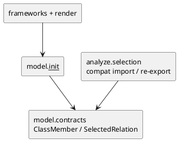

# iss-00024 Model Member Contracts — 設計（HOW）

## Parent Diagram References
- Epic diagrams:
  - epic-00023 `design.md` の member-aware flow / shared-contract dependency
- Initiative diagrams:
  - initiative `design.md` の top-level boundary
- reused decisions:
  - immutable DTO / tuple coercion / validation helper は existing `model.contracts` パターンを踏襲する

## 目的・制約
- 目的:
  - parse / analyze / render が class member を lossless に受け渡せる shared DTO を固定する。
- MUST / MUST NOT:
  - MUST:
    - `ClassMember`, `MemberParameter`, `MemberKind`, `MemberVisibility` を shared model に追加する。
    - relation contract を shared import surface から利用可能にする。
  - MUST NOT:
    - preformatted render text を DTO に持たせない。
    - parse / analyze / render logic をこの issue へ混ぜない。
- 非交渉制約:
  - backward compatibility を意識し、constructor の field 追加は default 付き末尾追加を優先する。
- 前提:
  - existing users は `pyclassuml.model` の public import surface を参照する。

## 既存実装 / 規約の理解
- 参照した実装 / docs:
  - `src/pyclassuml/model/contracts.py`
  - `src/pyclassuml/model/__init__.py`
  - `src/pyclassuml/analyze/selection.py`
  - `src/pyclassuml/render/document.py`
- 現状理解:
  - `RenderReadyModel.members` は string tuple だが current implementation は常に `()` を入れている。
  - `SelectedRelation` / `SelectedRelations` は `analyze.selection` 定義で、`frameworks` / `render` が cross-seam import している。
- 採用するパターン:
  - frozen dataclass + `__post_init__` validation + tuple coercion。
  - `model.__init__` から public re-export する既存パターン。
- 採用しないもの:
  - dict/list ベースの mutable payload。
  - render 専用 line string の shared contract 化。
- 影響範囲:
  - model public surface、analyze import surface、framework / render の relation DTO import。

## 採用方針 / トレードオフ
- 論点:
  - relation DTO を analyze-local のままにするか shared へ上げるか
- 選択肢:
  - A:
    - `SelectedRelation` を analyze-local のままにし、render / frameworks が cross-seam import を続ける
  - B:
    - `SelectedRelation` / `SelectedRelations` を shared model owner へ寄せ、analyze は re-export だけ残す
- 決定:
  - B を採用する。
  - 理由:
    - member rendering epic では relation が `analyze` だけでなく `frameworks` / `render` / tests の共有契約になるため、shared owner が必要。

## 依存関係分析
- module dependency:
  - `model.contracts` <- `parse`, `analyze`, `frameworks`, `render`
- class dependency（必要時）:
  - `ParsedModule.members -> ClassMember`
  - `RenderReadyModel.members -> ClassMember`
  - `SelectedRelations.relations -> SelectedRelation`
- function dependency（必要時）:
  - existing validation helpers を再利用して new DTO validation を追加する
- file dependency:
  - `src/pyclassuml/model/contracts.py`
  - `src/pyclassuml/model/__init__.py`
  - `src/pyclassuml/analyze/__init__.py`
  - `src/pyclassuml/analyze/selection.py`
  - `tests/model/test_contracts.py`
- upstream / prerequisite:
  - なし
- downstream / dependent:
  - iss-00025, iss-00026, iss-00027, iss-00028
- 実装起点:
  - 依存の少ないもの / 先に固定すべき interface / 先に通すべき test を書く
- sequencing implications:
  - DTO validation を最初に固定し、その後 import surface compatibility を揃える

## Module Dependency Diagram
- Title:
  - Shared member contract dependency
- Question answered:
  - どの module / class / file / function の依存方向を固定し、どこから実装を始めるか
- Scope:
  - model / analyze public surface
- Excluded details:
  - exhaustive call graph / 全 method / 全 import は描かない
- Update trigger:
  - 依存方向、責務境界、実装起点、変更対象 module が変わるとき
- Diagram:
  - 下の `plantuml` block を更新する

### UML（原則: module dependency / package dependency delta）


## Local Diagram Delta（必要時）
- changed boundary / responsibility / interaction:
  - `SelectedRelation` shared化により、render / frameworks が analyze module に依存しなくてよい構造へ寄せる。

## インターフェース契約
- API / function / protocol / data boundary:
  - `MemberKind`:
    - `field | method`
  - `MemberVisibility`:
    - `public | protected | private`
  - `MemberParameter`:
    - `name: str`
    - `annotation_text: str | None = None`
  - `ClassMember`:
    - `owner_class_id: ClassId`
    - `name: str`
    - `kind: MemberKind`
    - `visibility: MemberVisibility`
    - `annotation_text: str | None = None`
    - `parameters: tuple of MemberParameter = ()`
    - `return_annotation_text: str | None = None`
    - `modifiers: tuple of str = ()`
    - `source_order: int = 0`
  - `SelectedRelation`:
    - `source_class_id`
    - `target_class_id`
    - `relation_type`: one of `inherits`, `association`, `uses`
    - `evidence_kind`
  - `ParsedModule.members`:
    - `ClassMember tuple`
  - `RenderReadyModel.members`:
    - `ClassMember tuple`

## Sequence Delta（必要時）
- changed interaction:
  - downstream issues は `ClassMember` を parse から render まで同一 shape で運ぶ
- retry / transaction / external API / queue:
  - なし
- UML:
  - N/A: pure DTO issue

## Domain Model Delta（必要時）
- parent model refs:
  - `ParsedModule`, `RenderReadyModel`, `SelectedRelation`
- aggregate / entity / value object changes:
  - `ClassMember` と `MemberParameter` を value object として追加する
- domain event / policy / specification changes:
  - `relation_type` vocabulary policy を追加する
- invariant changes:
  - `source_order` は non-negative int
  - `parameters` / `modifiers` は tuple coercion
  - `modifiers` は empty tuple を許可する
- UML:
  - N/A: DTO 一覧で十分

## クラス / インターフェース詳細設計（必要時）
- Class / Interface:
  - `ClassMember`
- responsibility:
  - render に必要な field / method metadata を shared DTO として保持する
- collaboration:
  - `ParsedModule` と `RenderReadyModel` が同じ DTO を共有する
- UML:
  - N/A: field list がそのまま契約

## ディレクトリ / ファイル変更計画
```text
src/pyclassuml/model/contracts.py         # Modify: member DTO, relation validation, ParsedModule/RenderReadyModel fields
src/pyclassuml/model/__init__.py          # Modify: public re-export
src/pyclassuml/analyze/selection.py       # Modify: shared SelectedRelation import or compatibility alias
src/pyclassuml/analyze/__init__.py        # Modify: public surface alignment
tests/model/test_contracts.py             # Modify: DTO validation and compatibility tests
tests/analyze/test_selection.py           # Modify: import path compatibility if needed
tests/render/test_document.py             # Modify: import path compatibility if needed
```

## 要件 → 設計マッピング
- AC-001 -> `ClassMember` / `ParsedModule.members` / `RenderReadyModel.members`
- AC-002 -> shared `SelectedRelation` contract + relation vocabulary validation
- AC-003 -> `ClassMember` structured fields
- EC-001 -> nullable `annotation_text`
- EC-002 -> empty `parameters` / nullable `return_annotation_text`
- EC-003 -> tuple coercion
- constraint -> no convenience field / immutable DTO

## テスト戦略
- Unit:
  - DTO construction、invalid relation_type reject、tuple coercion、constructor compatibility
- Integration:
  - `pyclassuml.model` public import surface
  - `pyclassuml.analyze` compatibility re-export if kept
- E2E / manual:
  - なし。contract-only issue
- migration / rollback / feature flag if needed:
  - feature flag は不要。breaking import を避けるため compatibility re-export を使う

## 要件 / 例外 -> verification mapping
- AC-001 -> `tests/model/test_contracts.py`
- AC-002 -> relation DTO validation test
- AC-003 -> class member sample DTO test
- EC-001 -> field without annotation DTO test
- EC-002 -> method without return / params DTO test
- EC-003 -> tuple coercion test
- constraint -> no preformatted text field review

## リスク / 移行 / ロールバック（必要時）
- `SelectedRelation` を shared化すると import path の影響が広い。compatibility re-export を残して段階移行する。
- `ClassMember` に render convenience を入れると issue 27 で owner 境界が崩れるので禁止する。

## 未確定事項
- なし:
  - DTO shape はこの issue で固定し、下位 issue は追加 field なしで進める。
