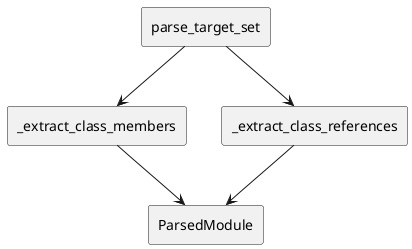

# iss-00025 Parse Class Members — 設計（HOW）

## Parent Diagram References
- Epic diagrams:
  - epic-00023 `design.md` の member-aware flow
- Initiative diagrams:
  - initiative `design.md` の `parse` seam boundary
- reused decisions:
  - `iss-00016` / `iss-00017` で導入済み `ClassReference` 抽出パターンを拡張する

## 目的・制約
- 目的:
  - `ParsedModule.members` と typed reference evidence を 1 回の AST walk で構築する。
- MUST / MUST NOT:
  - MUST:
    - class-level field、method signature、base refs、`__init__` direct instance field を抽出する。
  - MUST NOT:
    - import 実行、generic method body analysis、runtime type resolution。
- 非交渉制約:
  - parse は syntactic evidence の owner であり、relation_type は決めない。
- 前提:
  - `ClassMember` contract は issue 24 で確定済み。

## 既存実装 / 規約の理解
- 参照した実装 / docs:
  - `src/pyclassuml/parse/indexer.py`
  - `src/pyclassuml/model/contracts.py`
  - `tests/parse/test_module_parse_and_index.py`
- 現状理解:
  - `_extract_classes` は class id だけを返す。
  - `_extract_class_references` は class body の一部 reference だけを拾い、member DTO は作らない。
- 採用するパターン:
  - `ast.ClassDef` ごとに source order を維持した抽出。
  - annotation text は `ast.unparse` ベースの best-effort 正規化。
- 採用しないもの:
  - runtime import や `typing.get_type_hints`
  - generic assignment inference
- 影響範囲:
  - parse indexer、`ParsedModule` construction、parse tests、Pydantic tests

## 採用方針 / トレードオフ
- 論点:
  - `__init__` instance field をどこまで拾うか
- 選択肢:
  - A:
    - generic method body 全探索で `self.x` を推論する
  - B:
    - `__init__` direct `self.x` assignment のみに限定する
- 決定:
  - B を採用する。
  - 理由:
    - deterministic で AST-only のまま実装でき、false positive を抑えられる。

## 依存関係分析
- module dependency:
  - `parse.indexer` -> `model.contracts`
- class dependency（必要時）:
  - `ParsedModule` -> `ClassMember`, `ClassReference`
- function dependency（必要時）:
  - `_extract_classes`, `_extract_class_references` を member-aware helper に分割する
- file dependency:
  - `src/pyclassuml/parse/indexer.py`
  - `tests/parse/test_module_parse_and_index.py`
  - `tests/frameworks/test_pydantic.py`
- upstream / prerequisite:
  - iss-00024
- downstream / dependent:
  - iss-00026, iss-00027
- 実装起点:
  - 依存の少ないもの / 先に固定すべき interface / 先に通すべき test を書く
- sequencing implications:
  - field / method member 抽出を先に固定し、`__init__` instance field と degraded path を後段に置く

## Module Dependency Diagram
- Title:
  - Parse member extraction helpers
- Question answered:
  - どの module / class / file / function の依存方向を固定し、どこから実装を始めるか
- Scope:
  - `src/pyclassuml/parse/indexer.py`
- Excluded details:
  - exhaustive call graph / 全 method / 全 import は描かない
- Update trigger:
  - 依存方向、責務境界、実装起点、変更対象 module が変わるとき
- Diagram:
  - 下の `plantuml` block を更新する

### UML（原則: module dependency / package dependency delta）


## Local Diagram Delta（必要時）
- changed boundary / responsibility / interaction:
  - `ClassReference` は framework-only evidence ではなく、typed relation classification の core input まで責務を広げる。

## インターフェース契約
- API / function / protocol / data boundary:
  - `ParsedModule.members`:
    - class-local source order を保持する `ClassMember` tuple
  - member extraction:
    - class-level `AnnAssign` / `Assign`
    - `FunctionDef` / `AsyncFunctionDef`
    - `__init__` direct `self.<name>` assignment
  - typed reference evidence:
    - base class:
      - `ClassReference(target_name=<base_name>, reference_kind="class_base", reference_owner="base")`
    - field annotation:
      - `ClassReference(target_name=<annotation_target>, reference_kind="field_annotation", reference_owner="<field_name>")`
    - method parameter annotation:
      - `ClassReference(target_name=<annotation_target>, reference_kind="method_parameter_annotation", reference_owner="<method_name>.<parameter_name>")`
    - method return annotation:
      - `ClassReference(target_name=<annotation_target>, reference_kind="method_return_annotation", reference_owner="<method_name>")`
    - `__init__` parameter-derived instance field annotation:
      - `ClassReference(target_name=<parameter_annotation_target>, reference_kind="init_field_annotation", reference_owner="<field_name>")`
  - quoted annotation extraction:
    - `ClassMember.annotation_text` / `return_annotation_text` は source text を安定化した文字列を保持し、quoted annotation の quote は display text では保持してよい。
    - `ClassReference.target_name` は relation resolution 用なので、quoted forward ref の quote を外した class-like name にする。
    - container annotation は AST-only で再帰的に見る。`list["Item"]` は target `Item`、`Optional["Item"]` は target `Item`、`Union["A", "B"]` は targets `A`, `B` とする。
    - `Literal["value"]` は class-like target として扱わず reference を出さない。
  - Pydantic handling:
    - parse は Pydantic 専用 relation を作らない。
    - `BaseModel` / `pydantic.BaseModel` base reference は syntactic eligibility evidence として保持する。
    - field extraction は Pydantic class に限定せず、全 class-level annotation を generic field member として扱う。
  - degrade policy:
    - annotation text を作れない場合は member を残し、text / reference だけ落とす。
    - stable text 化の例外では `ParsedModule.diagnostics` に `annotation_text_unavailable` warning を追加する。

## Sequence Delta（必要時）
- changed interaction:
  - parse は class ごとに `members` と `class_references` を同時に構築する
- retry / transaction / external API / queue:
  - なし
- UML:
  - N/A: pure AST walk

## Domain Model Delta（必要時）
- parent model refs:
  - `ParsedModule`, `ClassMember`, `ClassReference`
- aggregate / entity / value object changes:
  - new aggregate は導入しない
- domain event / policy / specification changes:
  - `reference_kind` / `reference_owner` vocabulary を method / field / base の区別がつく形へ拡張する。
  - semantic vocabulary は `class_base/base`, `field_annotation/<field_name>`, `init_field_annotation/<field_name>`, `method_parameter_annotation/<method_name>.<parameter_name>`, `method_return_annotation/<method_name>` に固定する。
  - existing framework compatibility vocabulary（`annotation_string`, `annotation_subscript`, `call_string_arg`）は互換維持用として残せるが、issue 26 の typed relation owner は semantic vocabulary を優先する。
- invariant changes:
  - member は owner class 単位で source order stable
  - class references は source position stable。複数 target が同一 annotation から出る場合は source position の後に `target_name` lexical order で安定化する。
  - implicit receiver `self` / `cls` は parameter list から除外する
- UML:
  - N/A: helper flow で十分

## クラス / インターフェース詳細設計（必要時）
- Class / Interface:
  - `_extract_class_members`
- responsibility:
  - 1 class から member DTO を構築する
- collaboration:
  - `_annotation_text`, `_decorator_modifiers`, `_init_field_members` helper を使う
- UML:
  - N/A

## ディレクトリ / ファイル変更計画
```text
src/pyclassuml/parse/indexer.py           # Modify: member extraction and typed reference extraction
tests/parse/test_module_parse_and_index.py # Modify: member and degraded parse assertions
tests/frameworks/test_pydantic.py         # Modify: parse-to-pydantic handoff assumptions if evidence kind changes
```

## 要件 → 設計マッピング
- AC-001 -> `_extract_class_members` + source-order preservation
- AC-002 -> typed reference extraction vocabulary
- AC-003 -> `_init_field_members`
- AC-004 -> quoted annotation + BaseModel field evidence
- EC-001 -> degrade unsupported annotation text
- EC-002 -> untyped `Assign` field member
- EC-003 -> existing syntax error policy reuse
- EC-004 -> `__init__`-only body analysis
- constraint -> no runtime import / no generic body analysis

## テスト戦略
- Unit:
  - class field extraction
  - method signature extraction
  - visibility / modifier mapping
  - `__init__` direct instance field extraction
- Integration:
  - parse result to Pydantic handoff
  - degraded annotation handling
- E2E / manual:
  - なし。issue 28 が担当
- migration / rollback / feature flag if needed:
  - feature flag なし。parse output contract の一括更新

## 要件 / 例外 -> verification mapping
- AC-001 -> `tests/parse/test_module_parse_and_index.py`
- AC-002 -> parse reference vocabulary tests
- AC-003 -> `__init__` assignment fixture
- AC-004 -> `tests/frameworks/test_pydantic.py`
- EC-001 -> unsupported annotation fixture
- EC-002 -> untyped assign fixture
- EC-003 -> existing syntax error tests
- EC-004 -> nested body fixture
- constraint -> no import execution review

## リスク / 移行 / ロールバック（必要時）
- `ast.unparse` text が冗長になる可能性があるため、display concern ではなく parse canonical text として扱う。
- `__init__` inference を広げすぎると false positive が増えるので direct assignment に限定する。

## 未確定事項
- なし:
  - property は method kind + modifier で表現する。
