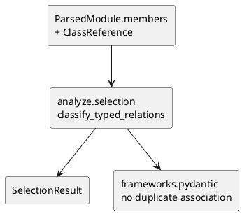

# iss-00026 Analyze Typed Relations — 設計（HOW）

## Parent Diagram References
- Epic diagrams:
  - epic-00023 `design.md` の parse -> analyze -> render flow
- Initiative diagrams:
  - initiative `design.md` の core analysis boundary
- reused decisions:
  - `iss-00014` の seed full-display / dependency endpoint selection
  - existing warning diagnostic sort pattern

## 目的・制約
- 目的:
  - typed evidence を authoritative relation inventory へ変換する。
- MUST / MUST NOT:
  - MUST:
    - `inherits`, `association`, `uses` の 3 語彙を実装する。
  - MUST NOT:
    - composition 判定や framework runtime 依存を入れない。
- 非交渉制約:
  - relation ordering と warning ordering は deterministic。
- 前提:
  - issue 24 / 25 が完了している。

## 既存実装 / 規約の理解
- 参照した実装 / docs:
  - `src/pyclassuml/analyze/selection.py`
  - `src/pyclassuml/frameworks/pydantic.py`
  - `tests/analyze/test_selection.py`
- 現状理解:
  - current selection は module import edge の一意 endpoint しか relation にしない。
  - frameworks.pydantic は forward ref を `uses` relation として追加する。
- 採用するパターン:
  - analyze owner が typed relation inventory を先に確定し、frameworks は補助 warning / supplemental relation に限定する。
- 採用しないもの:
  - render 側で relation_type を再分類すること
  - framework owner に base/field/member semantic を移すこと
- 影響範囲:
  - analyze selection、Pydantic framework dedupe、selection tests、Pydantic tests

## 採用方針 / トレードオフ
- 論点:
  - Pydantic forward ref relation を analyze owner に寄せるか framework owner のままにするか
- 選択肢:
  - A:
    - current `frameworks.pydantic` が relation を作り続ける
  - B:
    - issue 25 の parsed field evidence から analyze owner が `association` を作り、frameworks は duplicate を作らない
- 決定:
  - B を採用する。
  - 理由:
    - Pydantic field は class member semantic の一部であり、relation_type owner を analyze に集約した方が diagram semantics が一貫する。

## 依存関係分析
- module dependency:
  - `analyze.selection` -> `model`, `parse`
- class dependency（必要時）:
  - `SelectionResult` -> `SelectedRelations`
- function dependency（必要時）:
  - `select_classes_and_relations` に typed evidence 収集 / resolution helper を追加する
- file dependency:
  - `src/pyclassuml/analyze/selection.py`
  - `src/pyclassuml/frameworks/pydantic.py`
  - `tests/analyze/test_selection.py`
  - `tests/frameworks/test_pydantic.py`
- upstream / prerequisite:
  - iss-00024
  - iss-00025
- downstream / dependent:
  - iss-00027
  - iss-00028
- 実装起点:
  - 依存の少ないもの / 先に固定すべき interface / 先に通すべき test を書く
- sequencing implications:
  - relation resolution helper を先に作り、inherits / association / uses を順に追加する

## Module Dependency Diagram
- Title:
  - Typed relation classification flow
- Question answered:
  - どの module / class / file / function の依存方向を固定し、どこから実装を始めるか
- Scope:
  - analyze selection and framework dedupe
- Excluded details:
  - exhaustive call graph / 全 method / 全 import は描かない
- Update trigger:
  - 依存方向、責務境界、実装起点、変更対象 module が変わるとき
- Diagram:
  - 下の `plantuml` block を更新する

### UML（原則: module dependency / package dependency delta）


## Local Diagram Delta（必要時）
- changed boundary / responsibility / interaction:
  - `frameworks.pydantic` の current `uses`-based forward-ref relation は、この issue で parse/analyze owner の `association` へ寄せる。

## インターフェース契約
- API / function / protocol / data boundary:
  - input:
    - `ParsedModule.members`
    - `ParsedModule.class_references`
    - `ModuleIndex`
    - `DependencyGraph`
    - `TraversalObservations`
  - output:
    - `SelectedRelations(relations)`
    - `SelectionObservations.warning_diagnostics`
  - classification rule:
    - base class -> `inherits`
    - field / Pydantic field -> `association`
    - method parameter / return -> `uses`
    - module import edge fallback -> `uses`
  - dedupe rule:
    - same `(source_class_id, target_class_id, relation_type)` triple は 1 件にまとめる
  - priority rule:
    - relation は最終的に `(source_class_id, target_class_id)` ごとに 1 件へ正規化する。
    - 同一 endpoint に複数 relation_type がある場合は `inherits > association > uses` の順で優先する。
    - module import fallback の `uses` は、same endpoint に `inherits` / `association` / method annotation `uses` がない場合だけ残す。

## Sequence Delta（必要時）
- changed interaction:
  - selection は `iss-00014` 由来の selected set を先に確定する。
  - typed relation endpoint は selected set を拡張しない。
  - typed evidence が internal class へ一意解決できても target が selected set 外なら `selection_outside` warning を返し、relation を追加しない。
- retry / transaction / external API / queue:
  - なし
- UML:
  - N/A: pure transform

## Domain Model Delta（必要時）
- parent model refs:
  - `SelectedRelation`, `SelectionObservations`
- aggregate / entity / value object changes:
  - new aggregate なし
- domain event / policy / specification changes:
  - warning code policy:
    - unresolved
    - ambiguous
    - selection_outside
- invariant changes:
  - seed classes are always selected
  - dependency classes are added only by existing `iss-00014` module-import endpoint selection
  - typed references never expand traversal frontier or selected class set
- UML:
  - N/A

## クラス / インターフェース詳細設計（必要時）
- Class / Interface:
  - `select_classes_and_relations`
- responsibility:
  - typed relation を収集、分類、dedupe し、warning を返す
- collaboration:
  - resolution helper と module import fallback helper を使う
- UML:
  - N/A

## ディレクトリ / ファイル変更計画
```text
src/pyclassuml/analyze/selection.py       # Modify: typed relation classification
src/pyclassuml/frameworks/pydantic.py     # Modify: duplicate relation suppression / warning alignment if needed
tests/analyze/test_selection.py           # Modify: inherits / association / uses / warning assertions
tests/frameworks/test_pydantic.py         # Modify: association expectation for BaseModel field refs
```

## 要件 → 設計マッピング
- AC-001 -> base reference resolution -> `inherits`
- AC-002 -> field member / Pydantic field -> `association`
- AC-003 -> method annotation / module import fallback -> `uses`
- AC-004 -> warning diagnostic policy
- EC-001 -> unresolved warning
- EC-002 -> ambiguous warning
- EC-003 -> selection-outside warning
- EC-004 -> triple dedupe and semantic priority
- constraint -> no composition / no runtime import

## テスト戦略
- Unit:
  - base relation classification
  - field association classification
  - method uses classification
  - warning diagnostics and dedupe
- Integration:
  - parse -> analyze handoff
  - Pydantic field relation alignment
- E2E / manual:
  - issue 28 が担当
- migration / rollback / feature flag if needed:
  - feature flag なし。existing snapshots を更新する

## 要件 / 例外 -> verification mapping
- AC-001 -> `tests/analyze/test_selection.py`
- AC-002 -> analyze + Pydantic tests
- AC-003 -> method use / fallback tests
- AC-004 -> warning fixture tests
- EC-001 -> unresolved target test
- EC-002 -> ambiguous target test
- EC-003 -> selection-outside test
- EC-004 -> duplicate evidence test
- constraint -> no composition review

## リスク / 移行 / ロールバック（必要時）
- current framework tests が `uses` 前提なので、association への移行で snapshot 差分が広がる。
- semantic priority を曖昧にすると same endpoint の relation_type が揺れるため、analyze owner で固定する。

## 未確定事項
- なし:
  - relation vocabulary と owner はこの issue で固定する。
