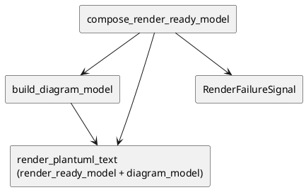

# iss-00027 Render Class Members — 設計（HOW）

## Parent Diagram References
- Epic diagrams:
  - epic-00023 `design.md` の render owner boundary
- Initiative diagrams:
  - initiative `design.md` の output-stage boundary
- reused decisions:
  - `iss-00018` の failure handoff と grouping / alias deterministic policy

## 目的・制約
- 目的:
  - member-rich `RenderReadyModel` を deterministic PlantUML class body へ変換する。
- MUST / MUST NOT:
  - MUST:
    - typed arrow mapping と member line formatting を固定する。
  - MUST NOT:
    - filesystem write / summary / exit policy を持ち込まない。
- 非交渉制約:
  - `RenderFailureSignal` policy は既存 owner のまま。
- 前提:
  - issue 24 / 25 / 26 完了済み。

## 既存実装 / 規約の理解
- 参照した実装 / docs:
  - `src/pyclassuml/render/document.py`
  - `src/pyclassuml/model/contracts.py`
  - `tests/render/test_document.py`
- 現状理解:
  - `compose_render_ready_model` は members を常に `()` で埋める。
  - `render_plantuml_text` は `DiagramModel` だけから class line と relation line を出す。
- 採用するパターン:
  - class / relation / alias order は current deterministic ordering を流用する。
  - member text は serializer helper で構築する。
- 採用しないもの:
  - `ClassMember` に preformatted line を持たせること
  - relation_type label のまま矢印横へ文字列を出すこと
- 影響範囲:
  - render document、render tests、model contract if `DiagramModel` signature adjustment is needed

## 採用方針 / トレードオフ
- 論点:
  - class body information を `DiagramModel` に入れるか、`RenderReadyModel` を serializer に渡し続けるか
- 選択肢:
  - A:
    - `DiagramModel` を拡張し、member body まで持たせる
  - B:
    - `DiagramModel` は class / relation / alias order だけを持ち、serializer は `RenderReadyModel.members` も読む
- 決定:
  - B を採用する。
  - 理由:
    - `DiagramModel` を view-specific に肥大化させず、issue 24 の no convenience field 方針を保てる。

## 依存関係分析
- module dependency:
  - `render.document` -> `model.contracts`
- class dependency（必要時）:
  - `RenderReadyModel.members`
  - `DiagramModel`
  - `RenderFailureSignal`
- function dependency（必要時）:
  - `compose_render_ready_model`
  - `build_diagram_model`
  - `render_plantuml_text`
- file dependency:
  - `src/pyclassuml/render/document.py`
  - `tests/render/test_document.py`
- upstream / prerequisite:
  - iss-00024
  - iss-00025
  - iss-00026
- downstream / dependent:
  - iss-00028
- 実装起点:
  - 依存の少ないもの / 先に固定すべき interface / 先に通すべき test を書く
- sequencing implications:
  - compose の member handoff を先に固定し、その後 serializer で body line と arrow mapping を追加する

## Module Dependency Diagram
- Title:
  - Member-aware render pipeline
- Question answered:
  - どの module / class / file / function の依存方向を固定し、どこから実装を始めるか
- Scope:
  - render document internals
- Excluded details:
  - exhaustive call graph / 全 method / 全 import は描かない
- Update trigger:
  - 依存方向、責務境界、実装起点、変更対象 module が変わるとき
- Diagram:
  - 下の `plantuml` block を更新する

### UML（原則: module dependency / package dependency delta）


## Local Diagram Delta（必要時）
- changed boundary / responsibility / interaction:
  - serializer は `DiagramModel` だけでなく `RenderReadyModel.members` を参照する。

## インターフェース契約
- API / function / protocol / data boundary:
  - `compose_render_ready_model` が `RenderReadyModel` を返す
    - selected classes に属する `ParsedModule.members` だけを取り込み、class id / source order で stable sort する
  - `build_diagram_model(render_ready_model) -> DiagramModel`
    - class / alias / relation / container order だけを決める
  - `render_plantuml_text(render_ready_model, diagram_model) -> PlantUmlText`
    - member line helper を使って class body を組み立てる
  - arrow mapping:
    - `inherits -> --|>`
    - `association -> -->`
    - `uses -> ..>`
  - modifier prefix order:
    - `{static}`, `{class}`, `{property}`, `{async}`

## Sequence Delta（必要時）
- changed interaction:
  - `render_uml_document` success path は `render_ready_model` と `diagram_model` の両方を serializer へ渡す
- retry / transaction / external API / queue:
  - なし
- UML:
  - N/A: pure transform

## Domain Model Delta（必要時）
- parent model refs:
  - `RenderReadyModel`, `DiagramModel`, `ClassMember`
- aggregate / entity / value object changes:
  - new aggregate なし
- domain event / policy / specification changes:
  - render line policy:
    - field with type -> `+ name: Type`
    - field without type -> `+ name`
    - method with return -> `+ name(args): Return`
    - method without return -> `+ name(args)`
- invariant changes:
  - member order is class-local source order
  - alias order is class id sort
  - relation order is typed relation sort
- UML:
  - N/A

## クラス / インターフェース詳細設計（必要時）
- Class / Interface:
  - `render_plantuml_text`
- responsibility:
  - package block、class block、member lines、typed arrows を deterministic に連結する
- collaboration:
  - `_member_line`, `_method_signature`, `_relation_arrow`, `_escape_plantuml`
- UML:
  - N/A

## ディレクトリ / ファイル変更計画
```text
src/pyclassuml/render/document.py         # Modify: member-aware compose and serializer
tests/render/test_document.py             # Modify: class body / arrow mapping / failure snapshots
```

## 要件 → 設計マッピング
- AC-001 -> member line helper + class body serializer
- AC-002 -> typed arrow mapping
- AC-003 -> empty / partial body handling
- AC-004 -> existing failure handoff reuse
- EC-001 -> field without type rendering rule
- EC-002 -> method without return rendering rule
- EC-003 -> empty body + relation-only rendering
- EC-004 -> modifier prefix order
- constraint -> no filesystem write / no reclassification

## テスト戦略
- Unit:
  - field line rendering
  - method line rendering
  - modifier ordering
  - arrow mapping
- Integration:
  - member-aware `compose_render_ready_model`
  - success / failure `render_uml_document`
- E2E / manual:
  - issue 28 が担当
- migration / rollback / feature flag if needed:
  - feature flag なし。render snapshot 更新で切り替える

## 要件 / 例外 -> verification mapping
- AC-001 -> `tests/render/test_document.py`
- AC-002 -> arrow mapping snapshot
- AC-003 -> empty / class-only / relation-only snapshots
- AC-004 -> failure path tests
- EC-001 -> field without type fixture
- EC-002 -> method without return fixture
- EC-003 -> relation-only fixture
- EC-004 -> modifier ordering fixture
- constraint -> no summary / no write review

## リスク / 移行 / ロールバック（必要時）
- body serialization で ordering source を増やすと deterministic output が崩れやすい。class id / source_order 以外の sort key を持ち込まない。
- relation label を消す change で snapshot 差分が広がるが、semantic arrow mapping の方が diagram readability は高い。

## 未確定事項
- なし:
  - raw relation_type label は表示しない。
