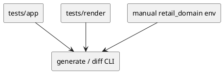

# iss-00028 Member Rendering E2E — 設計（HOW）

## Parent Diagram References
- Epic diagrams:
  - epic-00023 `design.md` の final flow
- Initiative diagrams:
  - initiative `design.md` の app/report/cli boundary
- reused decisions:
  - CLI integration test は existing `tests/app` を使う
  - manual env は Git 管理外 acceptance sandbox として使う

## 目的・制約
- 目的:
  - seam-level implementation を user-visible acceptance へ閉じる。
- MUST / MUST NOT:
  - MUST:
    - tracked integration test と manual acceptance の 2 層を用意する。
  - MUST NOT:
    - manual env に tracked fixture 依存を持ち込まない。
- 非交渉制約:
  - manual acceptance でも AST-only / non-invasive を維持する。
- 前提:
  - issue 24-27 が通っている。

## 既存実装 / 規約の理解
- 参照した実装 / docs:
  - `tests/app/test_generate.py`
  - `tests/app/test_diff.py`
  - `build/manual-tests/pyclassuml-manual-env/retail_domain`
- 現状理解:
  - app integration test は存在するが、member-aware output 固有の assertions は未定義。
  - manual env には domain / api / application / infra の複雑 fixture がある。
- 採用するパターン:
  - tracked tests で deterministic assertion、manual env で acceptance readability check
- 採用しないもの:
  - manual env 全体の snapshot を repo 管理すること
- 影響範囲:
  - tests/app、必要なら tests/render、manual test runbook / report

## 採用方針 / トレードオフ
- 論点:
  - complex fixture を tracked test に入れるか manual acceptance に留めるか
- 選択肢:
  - A:
    - `retail_domain` 全体を tracked fixture にコピーする
  - B:
    - tracked tests は最小再現だけにし、`retail_domain` は manual env で使う
- 決定:
  - B を採用する。
  - 理由:
    - repo の恒久テストを軽く保ちつつ、実利用に近い acceptance を確保できる。

## 依存関係分析
- module dependency:
  - `tests/app` -> `app`, `render`, `report`
- class dependency（必要時）:
  - `ReportRunResult` / CLI observable output
- function dependency（必要時）:
  - `run_generate`, `run_diff`, `render_uml_document`
- file dependency:
  - `tests/app/test_generate.py`
  - `tests/app/test_diff.py`
  - `tests/render/test_document.py`
  - `build/manual-tests/pyclassuml-manual-env/retail_domain/*`
- upstream / prerequisite:
  - iss-00024
  - iss-00025
  - iss-00026
  - iss-00027
- downstream / dependent:
  - epic closure only
- 実装起点:
  - 依存の少ないもの / 先に固定すべき interface / 先に通すべき test を書く
- sequencing implications:
  - tracked integration を先に通し、manual env は最後の acceptance gate に置く

## Module Dependency Diagram
- Title:
  - Integration and manual acceptance layers
- Question answered:
  - どの module / class / file / function の依存方向を固定し、どこから実装を始めるか
- Scope:
  - tests/app + manual env
- Excluded details:
  - exhaustive call graph / 全 method / 全 import は描かない
- Update trigger:
  - 依存方向、責務境界、実装起点、変更対象 module が変わるとき
- Diagram:
  - 下の `plantuml` block を更新する

### UML（原則: module dependency / package dependency delta）


## Local Diagram Delta（必要時）
- changed boundary / responsibility / interaction:
  - manual env は tracked tests の代替ではなく、追加の acceptance layer として扱う。

## インターフェース契約
- API / function / protocol / data boundary:
  - tracked integration:
    - existing `tests/app/test_generate.py`, `tests/app/test_diff.py` に member-aware assertions を追加する
  - manual acceptance:
    - `generate`:
      - `build/manual-tests/pyclassuml-manual-env/retail_domain` から `.puml` を生成する
    - `diff`:
      - manual env Git repo に対して diff path を実行する
  - acceptance observations:
    - class body
    - method signatures
    - field association
    - inherits relation
    - warnings

## Sequence Delta（必要時）
- changed interaction:
  - CLI test が `.puml` text と summary / warnings を確認し、その後 manual env で readability を確認する
- retry / transaction / external API / queue:
  - なし
- UML:
  - N/A: test orchestration issue

## Domain Model Delta（必要時）
- parent model refs:
  - N/A
- aggregate / entity / value object changes:
  - N/A: test / acceptance issue
- domain event / policy / specification changes:
  - acceptance policy:
    - tracked deterministic assertion
    - manual complex-fixture readability assertion
- invariant changes:
  - manual env を tracked source of truth にしない
- UML:
  - N/A

## クラス / インターフェース詳細設計（必要時）
- Class / Interface:
  - N/A
- responsibility:
  - N/A
- collaboration:
  - N/A
- UML:
  - N/A: test orchestration issue

## ディレクトリ / ファイル変更計画
```text
tests/app/test_generate.py               # Modify: member-aware generate assertions
tests/app/test_diff.py                   # Modify: member-aware diff assertions
tests/render/test_document.py            # Modify if CLI golden needs render helper fixtures
build/manual-tests/pyclassuml-manual-env/retail_domain/*  # Read-only acceptance input
```

## 要件 → 設計マッピング
- AC-001 -> tracked generate integration
- AC-002 -> tracked diff integration
- AC-003 -> manual retail_domain acceptance
- AC-004 -> tracked + manual warning observation
- EC-001 -> tracked/manual separation policy
- EC-002 -> unresolved warning acceptance
- EC-003 -> protocol / exception / nested coverage
- constraint -> no manual env mutation

## テスト戦略
- Unit:
  - N/A: upstream issues が担当
- Integration:
  - `tests/app/test_generate.py`
  - `tests/app/test_diff.py`
- E2E / manual:
  - `build/manual-tests/pyclassuml-manual-env/retail_domain` で generate / diff manual run
- migration / rollback / feature flag if needed:
  - feature flag なし。acceptance assertion を追加するだけ

## 要件 / 例外 -> verification mapping
- AC-001 -> generate integration test
- AC-002 -> diff integration test
- AC-003 -> manual generate / diff evidence
- AC-004 -> warning assertion + manual warning observation
- EC-001 -> tracked/manual split review
- EC-002 -> unresolved forward-ref manual evidence
- EC-003 -> protocol / exception / nested fixtures
- constraint -> no manual env mutation review

## リスク / 移行 / ロールバック（必要時）
- manual env はローカル state に依存するため、tracked tests だけで完了したと誤解しないよう acceptance 手順を明文化する。
- `.puml` snapshot を過度に固定すると将来の harmless formatting 変更に弱くなるため、CLI integration は要点 assertion を優先する。

## 未確定事項
- なし:
  - `retail_domain` は final acceptance の正本 fixture とする。
