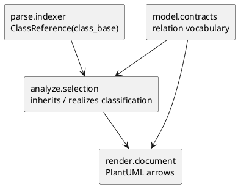

# epic-00029 Inheritance Arrow And Protocol Realization — 設計（HOW）

## 全体像
- `parse` は base class evidence を保持する。
- `analyze` は base target が Protocol class かどうかを selected class inventory から判定し、通常継承 `inherits` と Protocol realization `realizes` を分ける。
- `render` は `inherits` を `-up-|>`、`realizes` を `..up|>` として出力する。

## Component / Module View

## 採用方針
- relation type は `realizes` を追加する。
- Protocol class 自体は `class "X" <<Protocol>> as cNNN` として表現する。
- Protocol 判定は、選択済み class が直接 `Protocol` / `typing.Protocol` / `typing_extensions.Protocol` を base に持つ場合に限定する。
- `ABC` / `@abstractmethod` は今回の MVP では通常継承のままとする。

## トレードオフ
- `realizes` を新語彙にする:
  - 長所: render で再分類せず、analyze owner の意味論を保てる。
  - 短所: model / tests / report contracts の更新が必要。
- `inherits` + metadata にする案:
  - 不採用。現在の relation は triple contract で metadata がなく、render 側再分類が必要になる。

## テスト戦略
- Unit:
  - model relation validation に `realizes` を追加。
  - analyze で `Protocol` target への base relation が `realizes` になることを確認。
  - render で `inherits -> -up-|>` / `realizes -> ..up|>` を確認。
- Integration:
  - generate E2E で通常継承、Protocol class decoration、Protocol realization、既存 association / uses の共存を確認。
- Manual:
  - 既存 complex manual env の `retail_domain` を再生成し、Protocol repository と通常例外継承の見え方を確認する。

## 関連 ADR
- N/A: この epic は既存 relation vocabulary の小拡張であり、長期不可逆判断は `ABC` 対応時に別途検討する。
